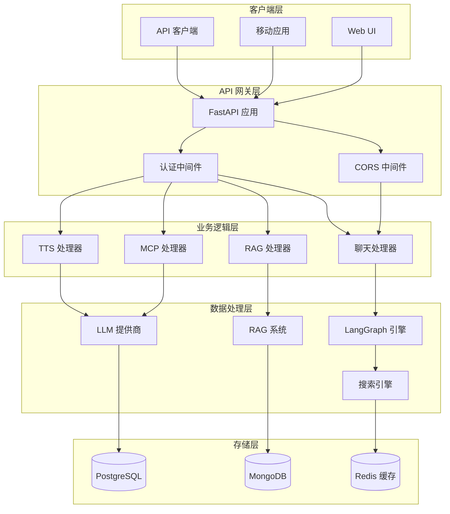
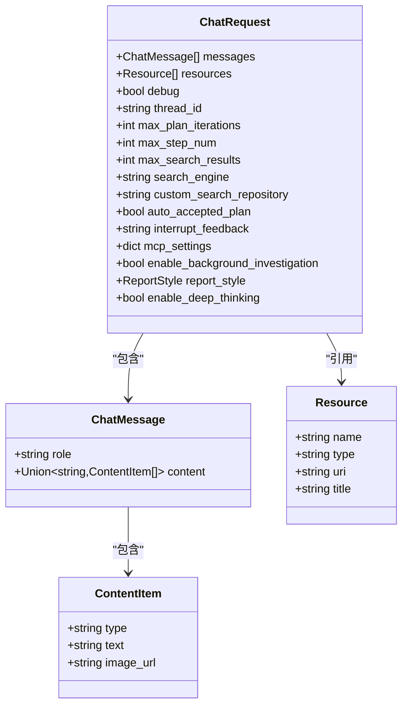
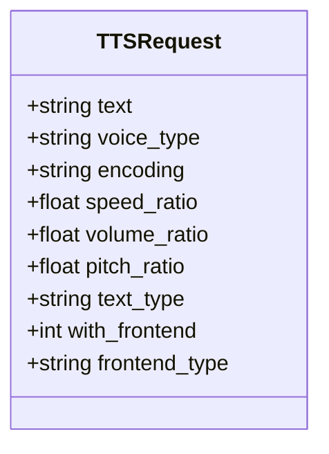
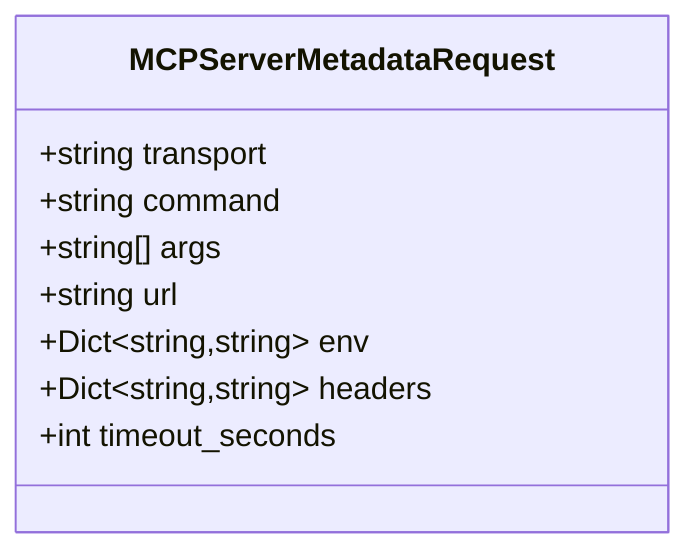

# DeerFlow API 端点参考

<cite>
**本文档中引用的文件**
- [app.py](file://src/server/app.py)
- [chat_request.py](file://src/server/chat_request.py)
- [mcp_request.py](file://src/server/mcp_request.py)
- [rag_request.py](file://src/server/rag_request.py)
- [config_request.py](file://src/server/config_request.py)
- [mcp_utils.py](file://src/server/mcp_utils.py)
- [test_chat_request.py](file://tests/unit/server/test_chat_request.py)
- [README.md](file://README.md)
</cite>

## 目录
1. [简介](#简介)
2. [项目架构概览](#项目架构概览)
3. [核心 API 端点](#核心-api-端点)
4. [数据模型详解](#数据模型详解)
5. [请求头要求](#请求头要求)
6. [状态码说明](#状态码说明)
7. [使用示例](#使用示例)
8. [错误处理](#错误处理)
9. [最佳实践](#最佳实践)

## 简介

DeerFlow 是一个基于深度研究框架的 API 服务，提供了丰富的 RESTful 端点用于处理聊天对话、多模态内容生成、知识检索等功能。该 API 基于 FastAPI 构建，支持流式响应和多种数据格式。

### 主要功能特性

- **智能聊天对话**：支持多轮对话和上下文管理
- **多模态内容生成**：文本、图像、音频等多种媒体类型
- **知识检索系统**：集成 RAG 和多种搜索引擎
- **MCP 协议支持**：支持模型上下文协议的服务集成
- **流式响应**：实时数据传输和用户交互

## 项目架构概览



**图表来源**
- [app.py](file://src/server/app.py#L1-L688)

## 核心 API 端点

### 聊天对话端点

#### POST /api/chat/stream

**描述**: 流式聊天对话端点，支持多轮对话和上下文管理

**请求参数**:
- **Content-Type**: `application/json`
- **Authorization**: Bearer token (可选)

**请求体 JSON Schema**:

```json
{
  "messages": [
    {
      "role": "string",
      "content": "string | array"
    }
  ],
  "resources": [
    {
      "name": "string",
      "type": "string",
      "uri": "string",
      "title": "string"
    }
  ],
  "debug": "boolean",
  "thread_id": "string",
  "max_plan_iterations": "integer",
  "max_step_num": "integer",
  "max_search_results": "integer",
  "search_engine": "string",
  "custom_search_repository": "string",
  "auto_accepted_plan": "boolean",
  "interrupt_feedback": "string",
  "mcp_settings": "object",
  "enable_background_investigation": "boolean",
  "report_style": "string",
  "enable_deep_thinking": "boolean"
}
```

**响应格式**: 流式响应，使用 Server-Sent Events (SSE)

**状态码**:
- `200`: 成功返回流式数据
- `400`: 请求参数无效
- `403`: MCP 功能被禁用
- `500`: 内部服务器错误

### 文本转语音端点

#### POST /api/tts

**描述**: 将文本转换为语音的 TTS 端点

**请求参数**:
- **Content-Type**: `application/json`

**请求体 JSON Schema**:

```json
{
  "text": "string",
  "voice_type": "string",
  "encoding": "string",
  "speed_ratio": "number",
  "volume_ratio": "number",
  "pitch_ratio": "number",
  "text_type": "string",
  "with_frontend": "integer",
  "frontend_type": "string"
}
```

**响应格式**: 音频文件 (MP3 格式)

**状态码**:
- `200`: 成功返回音频文件
- `400`: 必需的环境变量未设置
- `500`: TTS 服务内部错误

### 播客生成端点

#### POST /api/podcast/generate

**描述**: 基于报告内容生成播客音频

**请求参数**:
- **Content-Type**: `application/json`

**请求体 JSON Schema**:

```json
{
  "content": "string"
}
```

**响应格式**: MP3 音频文件

**状态码**:
- `200`: 成功返回播客音频
- `500`: 播客生成失败

### PPT 生成端点

#### POST /api/ppt/generate

**描述**: 基于报告内容生成 PowerPoint 演示文稿

**请求参数**:
- **Content-Type**: `application/json`

**请求体 JSON Schema**:

```json
{
  "content": "string"
}
```

**响应格式**: PPTX 文件

**状态码**:
- `200`: 成功返回 PPTX 文件
- `500`: PPT 生成失败

### 文本生成端点

#### POST /api/prose/generate

**描述**: 基于提示词生成各种类型的文本内容

**请求参数**:
- **Content-Type**: `application/json`

**请求体 JSON Schema**:

```json
{
  "prompt": "string",
  "option": "string",
  "command": "string"
}
```

**响应格式**: 流式文本响应

**状态码**:
- `200`: 成功返回生成的文本
- `500`: 文本生成失败

### 提示词增强端点

#### POST /api/prompt/enhance

**描述**: 增强和优化原始提示词

**请求参数**:
- **Content-Type**: `application/json`

**请求体 JSON Schema**:

```json
{
  "prompt": "string",
  "context": "string",
  "report_style": "string"
}
```

**响应格式**: JSON 对象，包含增强后的结果

**状态码**:
- `200`: 成功返回增强结果
- `500`: 提示词增强失败

### MCP 服务器元数据端点

#### POST /api/mcp/server/metadata

**描述**: 获取 MCP 服务器的可用工具和服务信息

**请求参数**:
- **Content-Type**: `application/json`

**请求体 JSON Schema**:

```json
{
  "transport": "string",
  "command": "string",
  "args": ["string"],
  "url": "string",
  "env": {
    "key": "string"
  },
  "headers": {
    "key": "string"
  },
  "timeout_seconds": "integer"
}
```

**响应格式**: 包含可用工具列表的 JSON 对象

**状态码**:
- `200`: 成功返回 MCP 元数据
- `400`: 参数无效或必需参数缺失
- `403`: MCP 功能被禁用
- `500`: MCP 服务器连接失败

### RAG 配置查询端点

#### GET /api/rag/config

**描述**: 查询当前 RAG 系统的配置信息

**请求参数**: 无

**响应格式**: JSON 对象，包含 RAG 提供商信息

**状态码**:
- `200`: 成功返回 RAG 配置

### RAG 资源查询端点

#### GET /api/rag/resources

**描述**: 查询 RAG 系统中的可用资源

**请求参数**:
- **query**: 搜索查询字符串 (可选)

**响应格式**: JSON 对象，包含资源列表

**状态码**:
- `200`: 成功返回资源列表

### 服务器配置查询端点

#### GET /api/config

**描述**: 查询服务器的整体配置信息

**请求参数**: 无

**响应格式**: JSON 对象，包含 RAG 配置、模型列表和自定义搜索仓库

**状态码**:
- `200`: 成功返回服务器配置

**节来源**
- [app.py](file://src/server/app.py#L1-L688)
- [config_request.py](file://src/server/config_request.py#L1-L28)

## 数据模型详解

### ChatRequest 模型

ChatRequest 是最常用的请求模型，包含了聊天对话所需的所有参数：



**图表来源**
- [chat_request.py](file://src/server/chat_request.py#L1-L116)

**字段说明**:

| 字段名 | 类型 | 默认值 | 描述 |
|--------|------|--------|------|
| messages | List[ChatMessage] | [] | 用户和助手之间的消息历史 |
| resources | List[Resource] | [] | 研究过程中使用的资源列表 |
| debug | bool | False | 是否启用调试日志 |
| thread_id | string | "__default__" | 会话标识符 |
| max_plan_iterations | int | 1 | 最大计划迭代次数 |
| max_step_num | int | 3 | 计划中的最大步骤数 |
| max_search_results | int | 3 | 最大搜索结果数量 |
| search_engine | string | "tavily" | 搜索引擎类型 |
| custom_search_repository | string | None | 自定义搜索引擎仓库ID |
| auto_accepted_plan | bool | False | 是否自动接受计划 |
| interrupt_feedback | string | None | 用户对计划的反馈 |
| mcp_settings | dict | None | MCP 设置 |
| enable_background_investigation | bool | True | 是否进行背景调查 |
| report_style | ReportStyle | ReportStyle.ACADEMIC | 报告风格 |
| enable_deep_thinking | bool | False | 是否启用深度思考 |

### TTSRequest 模型

TTSRequest 用于文本转语音功能：



**图表来源**
- [chat_request.py](file://src/server/chat_request.py#L50-L65)

**字段说明**:

| 字段名 | 类型 | 默认值 | 描述 |
|--------|------|--------|------|
| text | string | 必需 | 要转换为语音的文本 |
| voice_type | string | "BV700_V2_streaming" | 语音类型 |
| encoding | string | "mp3" | 音频编码格式 |
| speed_ratio | float | 1.0 | 语速比例 |
| volume_ratio | float | 1.0 | 音量比例 |
| pitch_ratio | float | 1.0 | 音高比例 |
| text_type | string | "plain" | 文本类型 (plain 或 ssml) |
| with_frontend | int | 1 | 是否使用前端处理 |
| frontend_type | string | "unitTson" | 前端类型 |

### MCP 请求模型

#### MCPServerMetadataRequest



**图表来源**
- [mcp_request.py](file://src/server/mcp_request.py#L8-L25)

**字段说明**:

| 字段名 | 类型 | 描述 |
|--------|------|------|
| transport | string | 连接类型 (stdio, sse, streamable_http) |
| command | string | 执行命令 (stdio 类型需要) |
| args | List[string] | 命令参数 (stdio 类型需要) |
| url | string | SSE/HTTP 服务器 URL |
| env | Dict[string,string] | 环境变量 (stdio 类型需要) |
| headers | Dict[string,string] | HTTP 头部 (sse/streamable_http 类型需要) |
| timeout_seconds | int | 超时时间 (秒) |

**节来源**
- [chat_request.py](file://src/server/chat_request.py#L1-L116)
- [mcp_request.py](file://src/server/mcp_request.py#L1-L65)

## 请求头要求

### Content-Type

所有 JSON 请求都需要设置正确的 Content-Type 头：

```http
Content-Type: application/json
```

### Authorization

对于需要身份验证的端点，使用 Bearer Token：

```http
Authorization: Bearer YOUR_ACCESS_TOKEN
```

### CORS 配置

API 支持跨域请求，允许的来源可以通过环境变量配置：

```bash
ALLOWED_ORIGINS=http://localhost:3000,https://yourdomain.com
```

## 状态码说明

### 成功状态码

- **200 OK**: 请求成功完成
- **201 Created**: 资源创建成功
- **204 No Content**: 请求成功但没有返回内容

### 客户端错误状态码

- **400 Bad Request**: 请求参数无效或缺少必要参数
- **401 Unauthorized**: 认证失败或令牌无效
- **403 Forbidden**: 权限不足或功能被禁用
- **404 Not Found**: 请求的资源不存在
- **422 Unprocessable Entity**: 请求格式正确但语义错误

### 服务器错误状态码

- **500 Internal Server Error**: 服务器内部错误
- **502 Bad Gateway**: 网关或代理服务器错误
- **503 Service Unavailable**: 服务不可用
- **504 Gateway Timeout**: 网关超时

**节来源**
- [app.py](file://src/server/app.py#L40-L50)

## 使用示例

### 基础聊天请求

```bash
curl -X POST "http://localhost:8000/api/chat/stream" \
  -H "Content-Type: application/json" \
  -H "Authorization: Bearer your-token-here" \
  -d '{
    "messages": [
      {
        "role": "user",
        "content": "什么是量子计算？"
      }
    ],
    "thread_id": "session-123",
    "max_plan_iterations": 2,
    "report_style": "ACADEMIC"
  }'
```

### 流式聊天响应示例

```json
event: message_chunk
data: {"thread_id": "session-123", "id": "msg-1", "role": "assistant", "content": "量子计算是一种利用量子力学原理进行信息处理的计算模式。"}

event: tool_calls
data: {
  "thread_id": "session-123",
  "id": "tool-call-1",
  "role": "assistant",
  "tool_calls": [
    {
      "name": "search_web",
      "arguments": "{\"query\": \"量子计算原理\", \"max_results\": 5}"
    }
  ]
}

event: tool_call_result
data: {
  "thread_id": "session-123",
  "id": "tool-result-1",
  "role": "assistant",
  "tool_call_id": "tool-call-1",
  "content": "搜索结果：量子比特、量子门、量子算法..."
}
```

### TTS 请求示例

```bash
curl -X POST "http://localhost:8000/api/tts" \
  -H "Content-Type: application/json" \
  -d '{
    "text": "量子计算是未来计算技术的重要发展方向。",
    "speed_ratio": 1.2,
    "volume_ratio": 1.0,
    "pitch_ratio": 1.0
  }' \
  --output speech.mp3
```

### MCP 服务器配置示例

```bash
curl -X POST "http://localhost:8000/api/mcp/server/metadata" \
  -H "Content-Type: application/json" \
  -d '{
    "transport": "stdio",
    "command": "/usr/local/bin/mcp-server",
    "args": ["--config", "/etc/mcp/config.json"],
    "timeout_seconds": 300
  }'
```

### TypeScript 接口定义

```typescript
interface ChatRequest {
  messages: Array<{
    role: 'user' | 'assistant';
    content: string | Array<{ type: string; text?: string; image_url?: string }>;
  }>;
  resources?: Array<{
    name: string;
    type: string;
    uri: string;
    title: string;
  }>;
  debug?: boolean;
  thread_id?: string;
  max_plan_iterations?: number;
  max_step_num?: number;
  max_search_results?: number;
  search_engine?: string;
  custom_search_repository?: string;
  auto_accepted_plan?: boolean;
  interrupt_feedback?: string;
  mcp_settings?: Record<string, any>;
  enable_background_investigation?: boolean;
  report_style?: 'ACADEMIC' | 'POPULAR_SCIENCE' | 'NEWS' | 'SOCIAL_MEDIA';
  enable_deep_thinking?: boolean;
}

interface TTSRequest {
  text: string;
  voice_type?: string;
  encoding?: string;
  speed_ratio?: number;
  volume_ratio?: number;
  pitch_ratio?: number;
  text_type?: string;
  with_frontend?: number;
  frontend_type?: string;
}

interface MCPServerMetadataRequest {
  transport: 'stdio' | 'sse' | 'streamable_http';
  command?: string;
  args?: string[];
  url?: string;
  env?: Record<string, string>;
  headers?: Record<string, string>;
  timeout_seconds?: number;
}
```

**节来源**
- [test_chat_request.py](file://tests/unit/server/test_chat_request.py#L1-L169)

## 错误处理

### 常见错误场景

#### 1. MCP 功能被禁用

```json
{
  "detail": "MCP server configuration is disabled. Set ENABLE_MCP_SERVER_CONFIGURATION=true to enable MCP features."
}
```

**解决方案**: 在环境变量中设置 `ENABLE_MCP_SERVER_CONFIGURATION=true`

#### 2. TTS 配置不完整

```json
{
  "detail": "VOLCENGINE_TTS_APPID is not set"
}
```

**解决方案**: 设置必要的环境变量：
- `VOLCENGINE_TTS_APPID`
- `VOLCENGINE_TTS_ACCESS_TOKEN`

#### 3. 请求参数验证失败

```json
{
  "detail": [
    {
      "loc": ["body", "text"],
      "msg": "field required",
      "type": "value_error.missing"
    }
  ]
}
```

**解决方案**: 确保所有必需字段都已提供

### 错误响应格式

所有错误响应都遵循以下格式：

```json
{
  "detail": "错误描述信息"
}
```

### 日志记录

API 会记录详细的错误日志，包括：

- 请求参数验证失败
- 第三方服务连接超时
- 内部业务逻辑异常
- 数据序列化错误

**节来源**
- [app.py](file://src/server/app.py#L70-L80)
- [mcp_utils.py](file://src/server/mcp_utils.py#L1-L123)

## 最佳实践

### 1. 请求设计原则

- **保持消息简洁**: 每条消息应包含明确的意图和上下文
- **合理设置参数**: 根据任务复杂度调整 `max_plan_iterations` 和 `max_step_num`
- **使用适当的线程ID**: 为不同的会话使用唯一的 thread_id
- **启用调试模式**: 在开发阶段启用 `debug` 参数获取详细日志

### 2. 错误处理策略

```python
import requests
from requests.exceptions import RequestException

def make_chat_request(messages, thread_id=None):
    try:
        response = requests.post(
            "http://localhost:8000/api/chat/stream",
            json={
                "messages": messages,
                "thread_id": thread_id or "default-session"
            },
            timeout=30
        )
        response.raise_for_status()
        return response
    except RequestException as e:
        print(f"API 请求失败: {e}")
        return None
```

### 3. 流式响应处理

```javascript
async function handleStreamingResponse(response) {
  const reader = response.body.getReader();
  const decoder = new TextDecoder();
  
  while (true) {
    const { done, value } = await reader.read();
    if (done) break;
    
    const chunk = decoder.decode(value);
    const lines = chunk.split('\n');
    
    for (const line of lines) {
      if (line.startsWith('event:')) {
        const eventType = line.substring(7).trim();
        console.log(`事件类型: ${eventType}`);
      } else if (line.startsWith('data:')) {
        try {
          const data = JSON.parse(line.substring(5));
          console.log('数据:', data);
        } catch (e) {
          console.log('解析数据失败:', e);
        }
      }
    }
  }
}
```

### 4. 性能优化建议

- **合理设置超时时间**: 根据任务复杂度调整 `timeout_seconds`
- **使用连接池**: 对于频繁的 API 调用，使用连接池减少建立连接的开销
- **缓存常用配置**: 缓存 MCP 服务器配置和模型列表
- **监控响应时间**: 实施监控机制跟踪 API 性能指标

### 5. 安全考虑

- **输入验证**: 对所有用户输入进行严格验证
- **速率限制**: 实施 API 调用频率限制
- **敏感信息保护**: 不要在日志中记录敏感信息
- **HTTPS 通信**: 生产环境中使用 HTTPS 加密通信

### 6. 监控和维护

- **健康检查端点**: 定期检查 API 服务状态
- **日志轮转**: 实施日志轮转策略防止磁盘空间耗尽
- **性能基准**: 建立 API 性能基准并定期评估
- **备份恢复**: 制定 API 数据备份和恢复计划

通过遵循这些最佳实践，可以确保 DeerFlow API 的稳定运行和高效使用，为用户提供优质的 AI 服务体验。