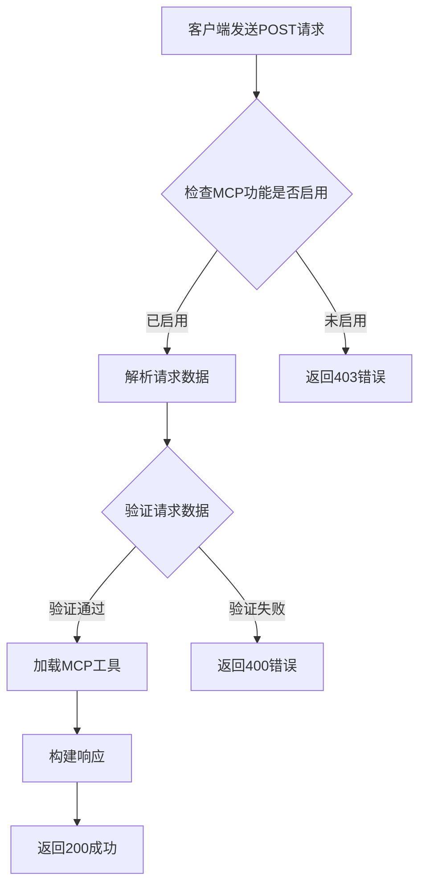

# MCP协议集成

<cite>
**本文档引用的文件**
- [mcp_request.py](file://src/server/mcp_request.py)
- [mcp_utils.py](file://src/server/mcp_utils.py)
- [app.py](file://src/server/app.py)
- [schema.ts](file://web/src/core/mcp/schema.ts)
- [types.ts](file://web/src/core/mcp/types.ts)
- [settings-store.ts](file://web/src/core/store/settings-store.ts)
- [test_mcp_request.py](file://tests/unit/server/test_mcp_request.py)
- [test_mcp_utils.py](file://tests/unit/server/test_mcp_utils.py)
- [test_app.py](file://tests/unit/server/test_app.py)
</cite>

## 目录
1. [引言](#引言)
2. [MCP请求路由与数据验证](#mcp请求路由与数据验证)
3. [MCP工具调用的序列化与反序列化](#mcp工具调用的序列化与反序列化)
4. [MCP工具注册与发现机制](#mcp工具注册与发现机制)
5. [MCP客户端集成示例](#mcp客户端集成示例)
6. [MCP错误处理与超时机制](#mcp错误处理与超时机制)
7. [MCP与本地工具系统的协调](#mcp与本地工具系统的协调)
8. [结论](#结论)

## 引言
DeerFlow系统通过Model Control Protocol (MCP) 实现了与外部工具服务器的集成，允许系统动态发现和调用远程工具。MCP支持多种传输协议，包括stdio、SSE（Server-Sent Events）和可流式HTTP，为多智能体工作流提供了灵活的工具集成能力。本文档详细阐述了DeerFlow对MCP的支持实现，包括请求处理、数据验证、工具发现、序列化机制以及与前端的集成方式。

## MCP请求路由与数据验证
DeerFlow通过FastAPI框架暴露`/api/mcp/server/metadata`端点来处理MCP服务器的元数据请求。该端点的路由逻辑由`app.py`中的`mcp_server_metadata`函数实现。

当客户端发送POST请求到此端点时，系统首先检查环境变量`ENABLE_MCP_SERVER_CONFIGURATION`是否为`true`。如果未启用，将返回403状态码，提示用户需要启用该功能。

**图源**
- [app.py](file://src/server/app.py#L602-L640)

请求的数据验证通过Pydantic模型`MCPServerMetadataRequest`在`mcp_request.py`中定义。该模型对请求体进行严格的类型和字段验证，确保所有必需字段都存在且符合预期格式。

- **transport**: 必需字段，表示MCP服务器的连接类型，可以是`stdio`、`sse`或`streamable_http`。
- **command**: 仅当`transport`为`stdio`时必需，表示要执行的命令。
- **args**: 可选字段，为`stdio`类型提供命令行参数。
