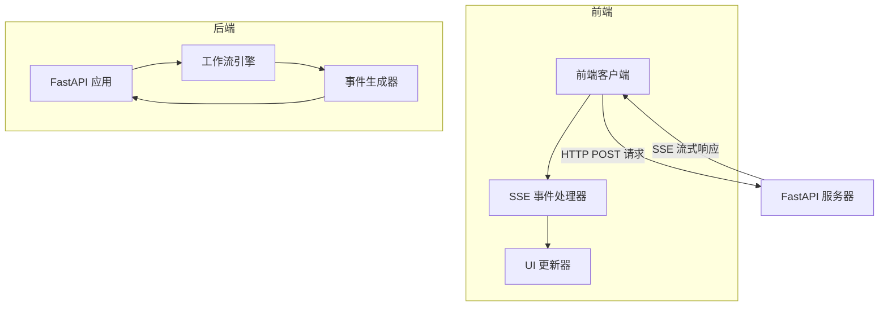
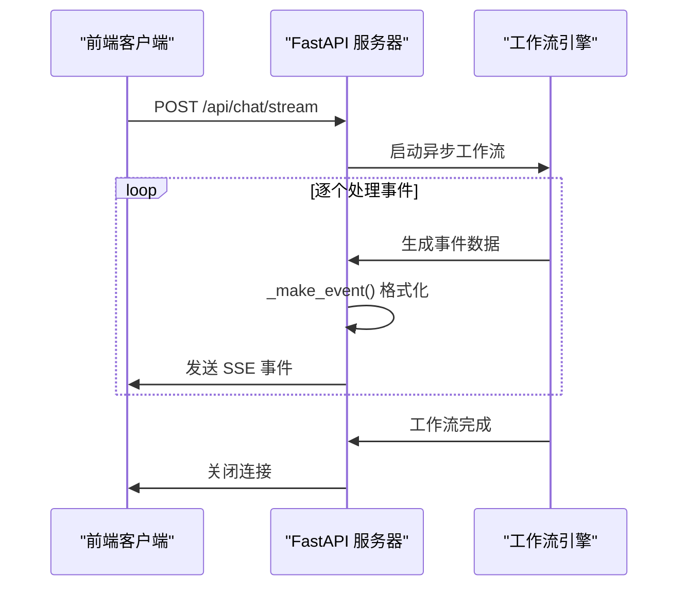
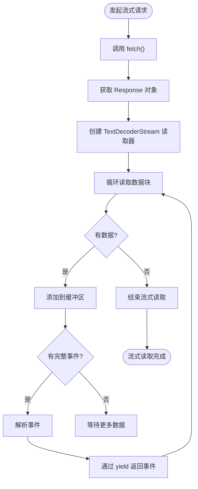
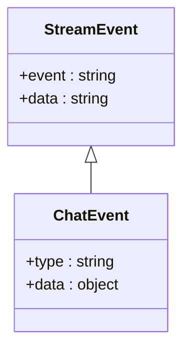

# 流式响应机制

<cite>
**本文档中引用的文件**  
- [fetch-stream.ts](file://web/src/core/sse/fetch-stream.ts)
- [StreamEvent.ts](file://web/src/core/sse/StreamEvent.ts)
- [app.py](file://src/server/app.py)
- [chat.ts](file://web/src/core/api/chat.ts)
- [chat.py](file://src/server/chat_request.py)
</cite>

## 目录
1. [简介](#简介)
2. [流式响应架构概述](#流式响应架构概述)
3. [后端实现机制](#后端实现机制)
4. [前端实现机制](#前端实现机制)
5. [事件类型与数据格式](#事件类型与数据格式)
6. [性能优化建议](#性能优化建议)
7. [客户端UI状态更新](#客户端ui状态更新)
8. [调试技巧](#调试技巧)
9. [结论](#结论)

## 简介
DeerFlow 采用基于 Server-Sent Events (SSE) 的流式响应机制，实现从服务器到客户端的实时消息推送。该机制允许后端在处理过程中逐步将数据推送到前端，提供即时反馈和更好的用户体验。系统通过 FastAPI 的 StreamingResponse 实现服务器端流式输出，并通过前端的 fetch-stream.ts 处理 SSE 事件流。

## 流式响应架构概述
DeerFlow 的流式响应架构采用典型的客户端-服务器模式，基于 HTTP 协议的 Server-Sent Events (SSE) 标准实现。该架构允许服务器在单个 HTTP 连接上持续向客户端推送多个事件，实现低延迟的实时通信。

**Diagram sources**
- [app.py](file://src/server/app.py#L100-L120)
- [fetch-stream.ts](file://web/src/core/sse/fetch-stream.ts#L1-L73)

## 后端实现机制
DeerFlow 的后端流式响应机制基于 FastAPI 框架的 StreamingResponse 类实现。服务器端通过异步生成器函数 `_astream_workflow_generator` 产生事件流，每个事件通过 `_make_event` 函数格式化为符合 SSE 规范的字符串。

**Diagram sources**
- [app.py](file://src/server/app.py#L100-L120)
- [app.py](file://src/server/app.py#L329-L366)

**Section sources**
- [app.py](file://src/server/app.py#L100-L120)
- [app.py](file://src/server/app.py#L329-L366)
- [app.py](file://src/server/app.py#L427-L450)

## 前端实现机制
前端通过 `fetch-stream.ts` 文件中的 `fetchStream` 函数处理 SSE 事件流。该函数使用 Fetch API 读取响应体，并通过 TextDecoderStream 将二进制数据解码为文本，然后按 SSE 协议规范解析事件。

**Diagram sources**
- [fetch-stream.ts](file://web/src/core/sse/fetch-stream.ts#L1-L73)
- [chat.ts](file://web/src/core/api/chat.ts#L11-L66)

**Section sources**
- [fetch-stream.ts](file://web/src/core/sse/fetch-stream.ts#L1-L73)
- [chat.ts](file://web/src/core/api/chat.ts#L11-L66)

## 事件类型与数据格式
DeerFlow 定义了多种事件类型，每种类型对应不同的数据格式和处理逻辑。事件通过 SSE 协议的 event 和 data 字段传输，其中 data 字段包含 JSON 格式的有效载荷。

### 事件类型定义

**Diagram sources**
- [StreamEvent.ts](file://web/src/core/sse/StreamEvent.ts#L1-L8)
- [chat