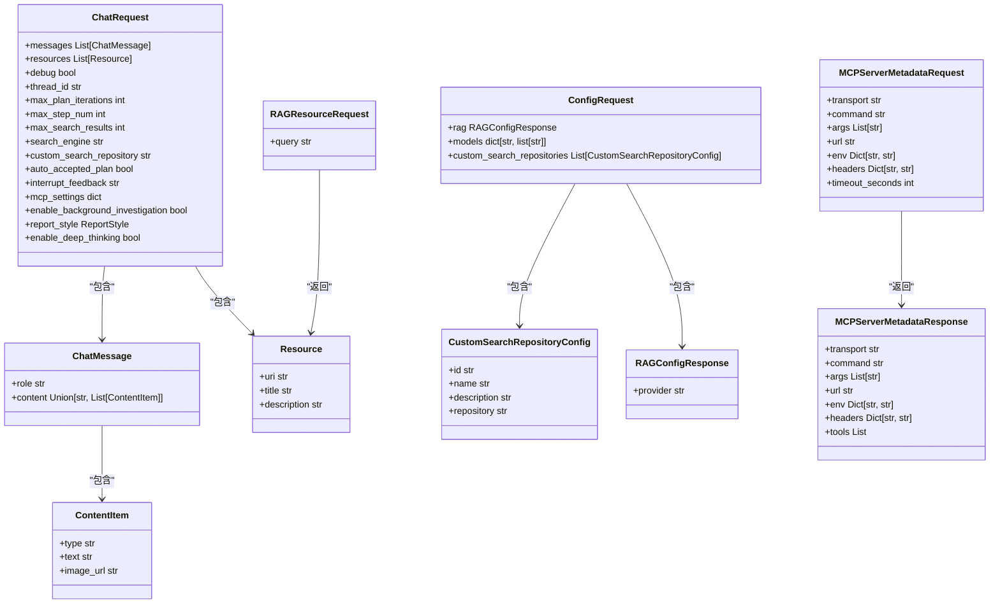
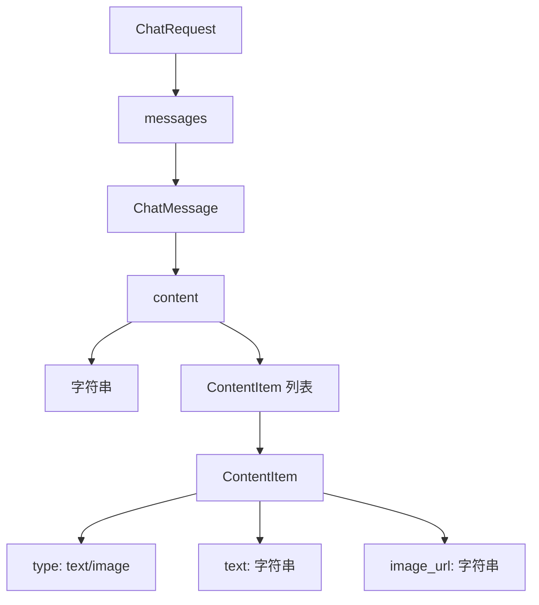

# 请求验证与数据模型

<cite>
**本文档引用的文件**   
- [chat_request.py](file://src/server/chat_request.py)
- [config_request.py](file://src/server/config_request.py)
- [rag_request.py](file://src/server/rag_request.py)
- [mcp_request.py](file://src/server/mcp_request.py)
- [app.py](file://src/server/app.py)
- [types.ts](file://web/src/core/api/types.ts)
- [report_style.py](file://src/config/report_style.py)
- [retriever.py](file://src/rag/retriever.py)
- [custom_search.py](file://src/tools/custom_search.py)
- [custom_search.py](file://src/config/custom_search.py)
- [test_chat_request.py](file://tests/unit/server/test_chat_request.py)
- [test_mcp_request.py](file://tests/unit/server/test_mcp_request.py)
</cite>

## 目录
1. [引言](#引言)
2. [核心请求模型](#核心请求模型)
3. [模型字段与验证规则详解](#模型字段与验证规则详解)
4. [嵌套模型结构与序列化](#嵌套模型结构与序列化)
5. [FastAPI中的请求验证与文档生成](#fastapi中的请求验证与文档生成)
6. [前后端类型定义一致性](#前后端类型定义一致性)
7. [常见验证错误排查指南](#常见验证错误排查指南)
8. [结论](#结论)

## 引言
DeerFlow 是一个基于 LangGraph 构建的智能研究代理系统，其后端采用 FastAPI 框架，前端采用 Next.js。本系统通过精心设计的 Pydantic 模型来实现强大的请求验证和数据序列化功能。这些模型不仅确保了 API 输入数据的完整性和正确性，还自动生成了 OpenAPI 规范，为前后端开发提供了清晰的契约。本文档将系统化地解析 DeerFlow 的请求验证体系和核心数据模型，重点关注 `ChatRequest`、`ConfigRequest` 和 `RagRequest` 等关键模型的定义、使用和验证机制。

## 核心请求模型
DeerFlow 的请求验证体系围绕一系列 Pydantic 模型构建，这些模型定义了 API 端点的输入和输出结构。主要的请求模型位于 `src/server` 目录下，包括 `chat_request.py`、`config_request.py`、`rag_request.py` 和 `mcp_request.py`。



**图示来源**
- [chat_request.py](file://src/server/chat_request.py#L1-L115)
- [config_request.py](file://src/server/config_request.py#L1-L27)
- [rag_request.py](file://src/server/rag_request.py#L1-L28)
- [mcp_request.py](file://src/server/mcp_request.py#L1-L64)

**本节来源**
- [chat_request.py](file://src/server/chat_request.py#L1-L115)
- [config_request.py](file://src/server/config_request.py#L1-L27)
- [rag_request.py](file://src/server/rag_request.py#L1-L28)
- [mcp_request.py](file://src/server/mcp_request.py#L1-L64)

## 模型字段与验证规则详解
### ChatRequest 模型
`ChatRequest` 是 DeerFlow 的核心请求模型，用于 `/api/chat/stream` 端点，定义了与智能代理进行对话所需的所有参数。

| 字段 | 数据类型 | 默认值 | 验证规则与说明 |
| :--- | :--- | :--- | :--- |
| `messages` | `Optional[List[ChatMessage]]` | `[]` | 对话历史记录，包含用户和助手的消息。类型为可选列表，允许为空。 |
| `resources` | `Optional[List[Resource]]` | `[]` | 用于研究的资源列表。类型为可选列表，允许为空。 |
| `debug` | `Optional[bool]` | `False` | 是否启用调试日志。布尔值，用于控制日志输出。 |
| `thread_id` | `Optional[str]` | `"__default__"` | 会话标识符。用于跟踪和恢复对话。 |
| `max_plan_iterations` | `Optional[int]` | `1` | 计划迭代的最大次数。整数，限制代理的规划循环。 |
| `max_step_num` | `Optional[int]` | `3` | 单个计划中的最大步骤数。整数，控制计划的复杂度。 |
| `max_search_results` | `Optional[int]` | `3` | 搜索结果的最大数量。整数，限制检索到的信息量。 |
| `search_engine` | `Optional[str]` | `"tavily"` | 使用的搜索引擎。字符串，支持 `tavily`, `duckduckgo`, `brave_search`, `arxiv`, `wikipedia`, `custom_search`。 |
| `custom_search_repository` | `Optional[str]` | `None` | 自定义搜索引擎的仓库ID。字符串，用于指定内部知识库。 |
| `auto_accepted_plan` | `Optional[bool]` | `False` | 是否自动接受计划。布尔值，决定是否需要用户确认。 |
| `interrupt_feedback` | `Optional[str]` | `None` | 用户对计划的中断反馈。字符串，用于在中断后提供指令。 |
| `mcp_settings` | `Optional[dict]` | `None` | MCP（Model Control Protocol）设置。字典，用于配置外部工具。 |
| `enable_background_investigation` | `Optional[bool]` | `True` | 是否在计划前进行背景调查。布尔值，影响研究流程。 |
| `report_style` | `Optional[ReportStyle]` | `ReportStyle.ACADEMIC` | 报告风格。枚举类型，决定最终报告的写作风格。 |
| `enable_deep_thinking` | `Optional[bool]` | `False` | 是否启用深度思考。布尔值，可能影响代理的推理模式。 |

**本节来源**
- [chat_request.py](file://src/server/chat_request.py#L1-L115)
- [test_chat_request.py](file://tests/unit/server/test_chat_request.py#L1-L168)

### ConfigRequest 模型
`ConfigRequest` 模型用于获取服务器的配置信息，其响应模型为 `ConfigResponse`。

| 字段 | 数据类型 | 默认值 | 验证规则与说明 |
| :--- | :--- | :--- | :--- |
| `rag` | `RAGConfigResponse` | - | RAG（检索增强生成）配置。包含 RAG 提供商信息。 |
| `models` | `dict[str, list[str]]` | - | 配置的模型列表。字典，键为模型提供商，值为该提供商下的模型列表。 |
| `custom_search_repositories` | `List[CustomSearchRepositoryConfig]` | `[]` | 可用的自定义搜索仓库列表。列表，包含仓库的 ID、名称、描述和内部名称。 |

**本节来源**
- [config_request.py](file://src/server/config_request.py#L1-L27)

### RagRequest 模型
`RagRequest` 模型处理与 RAG 相关的请求和响应。

| 字段 | 数据类型 | 默认值 | 验证规则与说明 |
| :--- | :--- | :--- | :--- |
| `query` | `str \| None` | `None` | 需要搜索的资源查询。字符串，可为空。 |
| `provider` | `str \| None` | `None` | RAG 提供商。字符串，可为空，默认为 `ragflow`。 |

**本节来源**
- [rag_request.py](file://src/server/rag_request.py#L1-L28)

### MCPRequest 模型
`MCPServerMetadataRequest` 模型用于获取 MCP 服务器的元数据。

| 字段 | 数据类型 | 默认值 | 验证规则与说明 |
| :--- | :--- | :--- | :--- |
| `transport` | `str` | - | MCP 服务器连接类型。必需字段，支持 `stdio`, `sse`, `streamable_http`。 |
| `command` | `Optional[str]` | `None` | 执行的命令（用于 stdio 类型）。字符串，可选。 |
| `args` | `Optional[List[str]]` | `None` | 命令参数（用于 stdio 类型）。字符串列表，可选。 |
| `url` | `Optional[str]` | `None` | SSE 服务器的 URL（用于 sse 类型）。字符串，可选。 |
| `env` | `Optional[Dict[str, str]]` | `None` | 环境变量（用于 stdio 类型）。字典，可选。 |
| `headers` | `Optional[Dict[str, str]]` | `None` | HTTP 头（用于 sse/streamable_http 类型）。字典，可选。 |
| `timeout_seconds` | `Optional[int]` | `None` | 操作的自定义超时时间（秒）。整数，可选。 |

**本节来源**
- [mcp_request.py](file://src/server/mcp_request.py#L1-L64)
- [test_mcp_request.py](file://tests/unit/server/test_mcp_request.py#L1-L74)

## 嵌套模型结构与序列化
DeerFlow 的请求模型采用了复杂的嵌套结构，以支持丰富的数据类型和灵活的 API 设计。

### 嵌套模型示例
`ChatRequest` 模型是嵌套结构的典型代表。它包含一个 `messages` 字段，该字段是一个 `ChatMessage` 对象的列表。而 `ChatMessage` 本身又包含一个 `content` 字段，该字段可以是字符串或 `ContentItem` 对象的列表。这种设计允许消息内容既可以是纯文本，也可以是图文混合的富媒体内容。



**图示来源**
- [chat_request.py](file://src/server/chat_request.py#L1-L115)

### 序列化与反序列化
在 FastAPI 中，当客户端发送一个 JSON 请求时，FastAPI 会自动将 JSON 数据反序列化为对应的 Pydantic 模型实例。这个过程会触发模型的验证逻辑。例如，当创建一个 `ChatRequest` 实例时，Pydantic 会验证 `messages` 字段是否为一个有效的 `ChatMessage` 对象列表，并递归地验证每个 `ChatMessage` 的 `content` 字段。

同样，当服务器需要返回一个响应时，Pydantic 模型会被序列化为 JSON。例如，`ConfigResponse` 模型会被转换为一个包含 `rag`、`models` 和 `custom_search_repositories` 字段的 JSON 对象。这种自动的序列化/反序列化机制极大地简化了数据处理流程。

**本节来源**
- [chat_request.py](file://src/server/chat_request.py#L1-L115)
- [app.py](file://src/server/app.py#L1-L687)

## FastAPI中的请求验证与文档生成
### 请求验证机制
FastAPI 利用 Pydantic 模型的强大功能，在运行时自动执行请求验证。当一个请求到达 `/api/chat/stream` 端点时，FastAPI 会执行以下步骤：

1.  **类型转换**：将 HTTP 请求体中的 JSON 数据转换为 Python 字典。
2.  **模型实例化**：尝试使用该字典作为参数创建一个 `ChatRequest` 模型实例。
3.  **验证执行**：在实例化过程中，Pydantic 会根据模型定义的字段类型、默认值和约束（如 `...` 表示必填）进行验证。
4.  **错误处理**：如果验证失败（例如，缺少必填字段或数据类型不匹配），Pydantic 会抛出一个 `ValidationError`。FastAPI 会捕获此异常，并自动返回一个包含详细错误信息的 422 Unprocessable Entity HTTP 响应。

例如，在 `test_chat_request.py` 中的测试用例 `test_content_item_validation_error` 验证了 `ContentItem` 模型的必填字段 `type`：
```python
with pytest.raises(ValidationError):
    ContentItem()  # missing required 'type'
```
这证明了验证机制的有效性。

### OpenAPI 文档自动生成
FastAPI 的另一个核心优势是能够根据 Pydantic 模型自动生成 OpenAPI（Swagger）文档。当开发者访问 `/docs` 端点时，可以看到一个交互式的 API 文档界面。该界面中的每个端点都清晰地列出了其请求体（Request Body）的结构，这正是由 `ChatRequest`、`MCPServerMetadataRequest` 等模型生成的。

例如，`/api/mcp/server/metadata` 端点的文档会显示 `MCPServerMetadataRequest` 模型的所有字段及其类型、是否必填和描述。这为前端开发者提供了精确的 API 使用指南，减少了沟通成本和集成错误。

**本节来源**
- [app.py](file://src/server/app.py#L1-L687)
- [test_chat_request.py](file://tests/unit/server/test_chat_request.py#L1-L168)

## 前后端类型定义一致性
为了确保前后端开发的无缝协作，DeerFlow 在前端（TypeScript）和后端（Python）之间保持了类型定义的高度一致性。

### 后端模型
后端使用 Pydantic 模型定义数据结构。例如，`ChatRequest` 模型定义了 `thread_id` 字段为字符串类型。

### 前端模型
前端在 `web/src/core/api/types.ts` 文件中定义了相应的 TypeScript 接口。虽然前端没有直接定义 `ChatRequest`，但它定义了与后端流式响应相对应的事件类型，如 `MessageChunkEvent` 和 `ToolCallsEvent`。这些事件的 `data` 字段中包含了与后端 `ChatRequest` 中 `thread_id` 对应的 `thread_id`