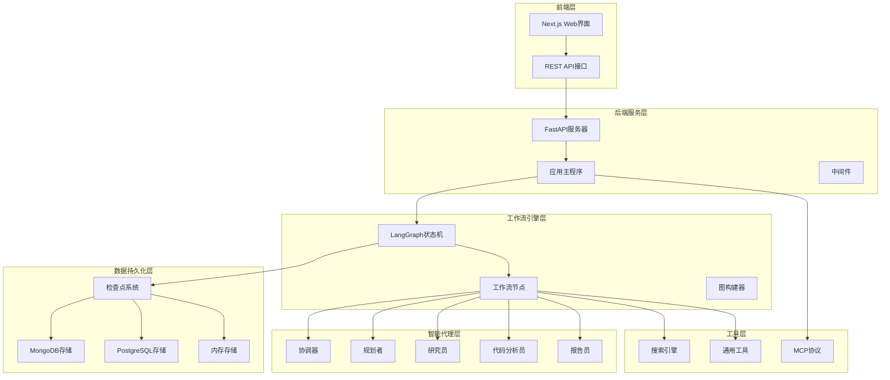
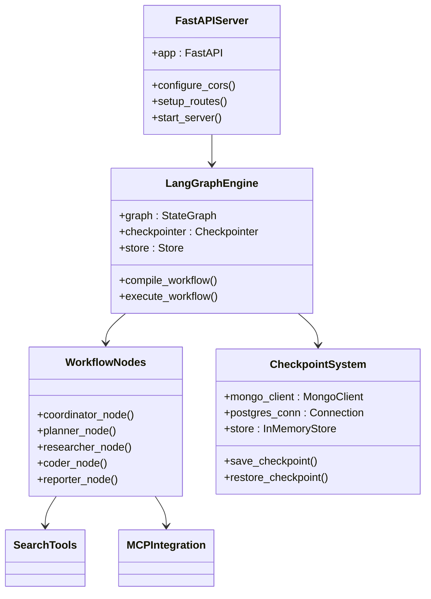
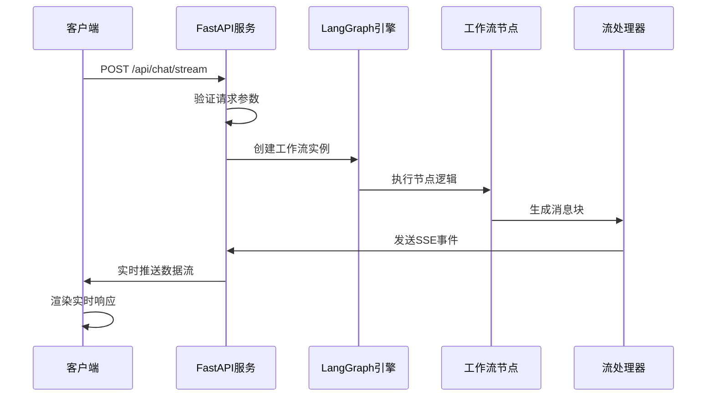
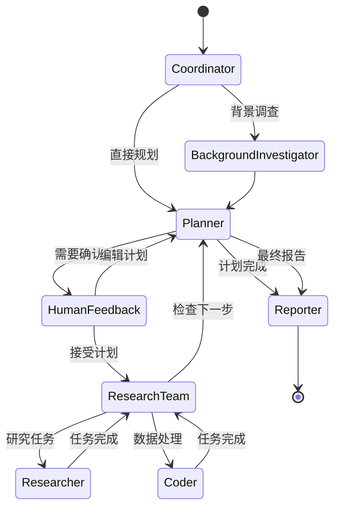
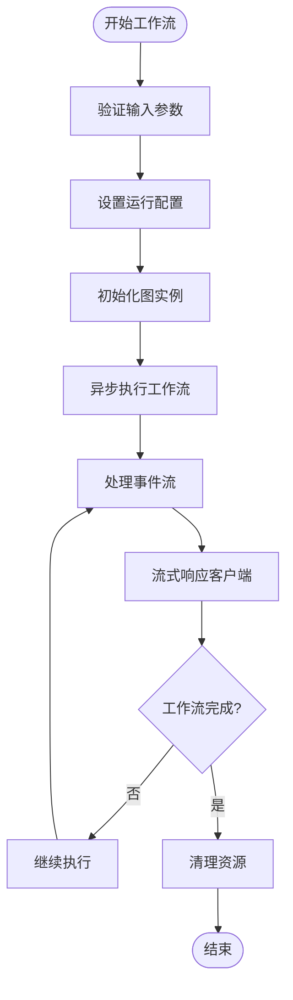
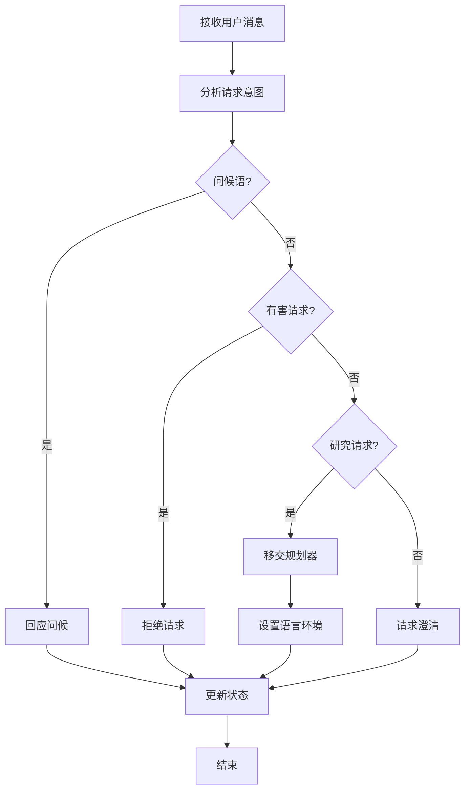
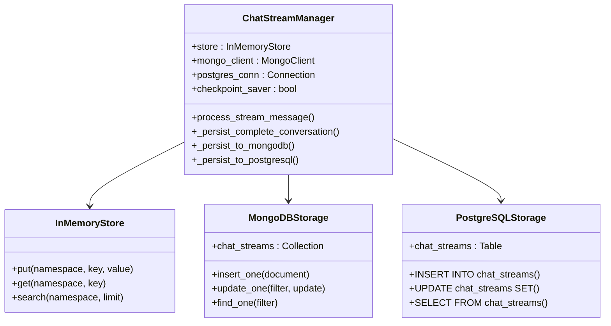
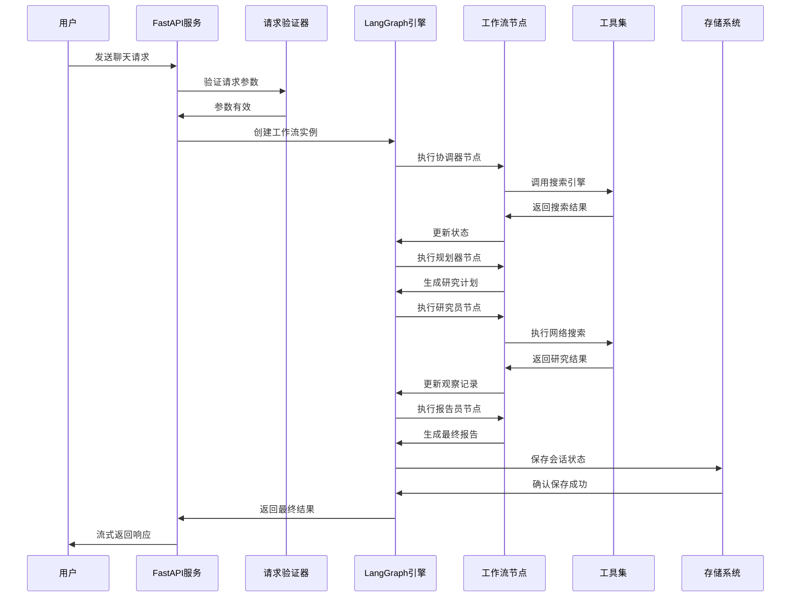
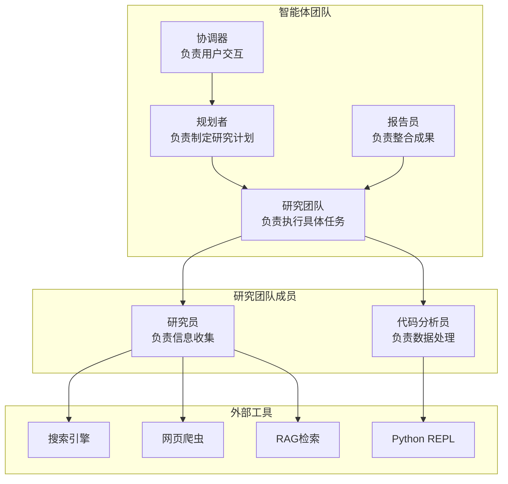

现在我已经收集了足够的信息来创建详细的文档。让我开始生成文档内容：

<docs>
# DeerFlow后端架构设计文档

<cite>
**本文档引用的文件**
- [server.py](file://server.py)
- [src/server/app.py](file://src/server/app.py)
- [src/workflow.py](file://src/workflow.py)
- [src/graph/builder.py](file://src/graph/builder.py)
- [src/graph/nodes.py](file://src/graph/nodes.py)
- [src/graph/checkpoint.py](file://src/graph/checkpoint.py)
- [src/prompts/coordinator.md](file://src/prompts/coordinator.md)
- [src/prompts/planner.md](file://src/prompts/planner.md)
- [src/config/configuration.py](file://src/config/configuration.py)
- [src/config/loader.py](file://src/config/loader.py)
- [src/tools/search.py](file://src/tools/search.py)
- [conf.yaml](file://conf.yaml)
</cite>

## 目录
1. [简介](#简介)
2. [项目结构概览](#项目结构概览)
3. [核心架构设计](#核心架构设计)
4. [API服务层详解](#api服务层详解)
5. [状态机工作流引擎](#状态机工作流引擎)
6. [异步代理工作流核心](#异步代理工作流核心)
7. [工作流节点实现](#工作流节点实现)
8. [状态持久化系统](#状态持久化系统)
9. [数据流分析](#数据流分析)
10. [性能优化与并发管理](#性能优化与并发管理)
11. [错误处理与超时控制](#错误处理与超时控制)
12. [总结](#总结)

## 简介

DeerFlow是一个基于LangGraph的状态机工作流引擎，专为构建复杂的AI代理协作系统而设计。该系统采用FastAPI作为Web框架，实现了完整的异步流式传输机制，支持多智能体协作、状态持久化和动态工作流编排。

系统的核心特点包括：
- 基于LangGraph的状态机工作流引擎
- FastAPI驱动的RESTful API服务
- 异步流式响应处理
- 多种数据库存储后端支持
- MCP（Model Context Protocol）集成
- 支持多种报告生成格式

## 项目结构概览



**图表来源**
- [src/server/app.py](file://src/server/app.py#L1-L50)
- [src/graph/builder.py](file://src/graph/builder.py#L1-L30)
- [src/graph/checkpoint.py](file://src/graph/checkpoint.py#L1-L50)

## 核心架构设计

DeerFlow采用了分层架构设计，每一层都有明确的职责分工：

### 架构层次划分

1. **表示层（Presentation Layer）**
   - FastAPI Web服务器
   - RESTful API端点
   - SSE（Server-Sent Events）流式传输

2. **业务逻辑层（Business Logic Layer）**
   - LangGraph状态机引擎
   - 工作流编排逻辑
   - 智能代理协调

3. **数据访问层（Data Access Layer）**
   - MongoDB/PostgreSQL存储
   - 内存缓存
   - 文件系统存储

4. **工具层（Utility Layer）**
   - 搜索引擎集成
   - 代码执行环境
   - 外部API调用



**图表来源**
- [src/server/app.py](file://src/server/app.py#L50-L100)
- [src/graph/builder.py](file://src/graph/builder.py#L20-L60)
- [src/graph/checkpoint.py](file://src/graph/checkpoint.py#L30-L80)

**章节来源**
- [src/server/app.py](file://src/server/app.py#L1-L100)
- [src/graph/builder.py](file://src/graph/builder.py#L1-L88)

## API服务层详解

### FastAPI应用配置

DeerFlow使用FastAPI作为Web框架，提供了完整的RESTful API服务。应用配置包括CORS中间件、路由注册和异常处理。

```python
# CORS配置示例
allowed_origins_str = get_str_env("ALLOWED_ORIGINS", "http://localhost:3000")
allowed_origins = [origin.strip() for origin in allowed_origins_str.split(",")]

app.add_middleware(
    CORSMiddleware,
    allow_origins=allowed_origins,
    allow_credentials=True,
    allow_methods=["GET", "POST", "OPTIONS"],
    allow_headers=["*"],
)
```

### 流式传输机制

系统实现了完整的SSE（Server-Sent Events）流式传输机制，支持实时数据推送：



**图表来源**
- [src/server/app.py](file://src/server/app.py#L100-L200)
- [src/server/app.py](file://src/server/app.py#L400-L500)

### 主要API端点

系统提供以下主要API端点：

1. **聊天流式接口** (`/api/chat/stream`)
   - 支持多轮对话
   - 实时流式响应
   - 支持中断和恢复

2. **文本转语音接口** (`/api/tts`)
   - 支持多种音频格式
   - 集成火山引擎TTS服务

3. **多媒体生成接口**
   - 播客生成 (`/api/podcast/generate`)
   - PPT生成 (`/api/ppt/generate`)
   - 文本增强 (`/api/prose/generate`)
   - 提示词增强 (`/api/prompt/enhance`)

4. **MCP服务器元数据接口** (`/api/mcp/server/metadata`)
   - 支持动态工具加载
   - MCP协议集成

**章节来源**
- [src/server/app.py](file://src/server/app.py#L100-L300)
- [src/server/app.py](file://src/server/app.py#L500-L688)

## 状态机工作流引擎

### LangGraph集成

DeerFlow基于LangGraph构建了完整的工作流状态机引擎，支持复杂的状态转换和条件分支。



**图表来源**
- [src/graph/builder.py](file://src/graph/builder.py#L30-L60)

### 图构建器实现

图构建器负责创建工作流的有向无环图（DAG），定义节点之间的连接关系：

```python
def _build_base_graph():
    """构建基础状态图"""
    builder = StateGraph(State)
    builder.add_edge(START, "coordinator")
    builder.add_node("coordinator", coordinator_node)
    builder.add_node("background_investigator", background_investigation_node)
    builder.add_node("planner", planner_node)
    builder.add_node("reporter", reporter_node)
    builder.add_node("research_team", research_team_node)
    builder.add_node("researcher", researcher_node)
    builder.add_node("coder", coder_node)
    builder.add_node("human_feedback", human_feedback_node)
    
    # 条件边定义
    builder.add_conditional_edges(
        "research_team",
        continue_to_running_research_team,
        ["planner", "researcher", "coder"],
    )
    
    return builder
```

### 状态类型定义

系统定义了统一的状态类型，用于在不同节点间传递数据：

```python
@dataclass
class State:
    messages: List[BaseMessage]
    current_plan: Optional[Plan] = None
    background_investigation_results: Optional[str] = None
    final_report: str = ""
    observations: List[str] = field(default_factory=list)
    auto_accepted_plan: bool = False
    enable_background_investigation: bool = True
    research_topic: str = ""
    locale: str = "en-US"
    plan_iterations: int = 0
```

**章节来源**
- [src/graph/builder.py](file://src/graph/builder.py#L1-L88)
- [src/graph/types.py](file://src/graph/types.py#L1-L50)

## 异步代理工作流核心

### 异步执行模型

系统采用完全异步的执行模型，支持高并发和非阻塞操作：



**图表来源**
- [src/workflow.py](file://src/workflow.py#L20-L80)

### 工作流配置管理

系统提供了灵活的配置管理系统，支持运行时参数调整：

```python
async def run_agent_workflow_async(
    user_input: str,
    debug: bool = False,
    max_plan_iterations: int = 1,
    max_step_num: int = 3,
    enable_background_investigation: bool = True,
):
    """异步运行代理工作流"""
    initial_state = {
        "messages": [{"role": "user", "content": user_input}],
        "auto_accepted_plan": True,
        "enable_background_investigation": enable_background_investigation,
    }
    
    config = {
        "configurable": {
            "thread_id": "default",
            "max_plan_iterations": max_plan_iterations,
            "max_step_num": max_step_num,
            "mcp_settings": mcp_config,
        },
        "recursion_limit": get_recursion_limit(default=100),
    }
```

### 流式事件处理

系统实现了完整的事件流处理机制，支持多种事件类型的分类处理：

```python
async def _stream_graph_events(graph_instance, workflow_input, workflow_config, thread_id):
    """从图中流式获取事件并处理"""
    try:
        async for agent, _, event_data in graph_instance.astream(
            workflow_input,
            config=workflow_config,
            stream_mode=["messages", "updates"],
            subgraphs=True,
        ):
            if isinstance(event_data, dict) and "__interrupt__" in event_data:
                yield _create_interrupt_event(thread_id, event_data)
                continue
            
            message_chunk, message_metadata = cast(tuple[BaseMessage, dict], event_data)
            async for event in _process_message_chunk(message_chunk, message_metadata, thread_id, agent):
                yield event
                
    except Exception as e:
        logger.exception("工作流执行期间发生错误")
        yield _make_event("error", {"thread_id": thread_id, "error": str(e)})
```

**章节来源**
- [src/workflow.py](file://src/workflow.py#L1-L104)
- [src/server/app.py](file://src/server/app.py#L400-L500)

## 工作流节点实现

### 协调器节点（Coordinator）

协调器节点负责与用户交互，识别请求类型并决定后续流程：



**图表来源**
- [src/graph/nodes.py](file://src/graph/nodes.py#L200-L300)

### 规划器节点（Planner）

规划器节点负责创建详细的研究计划，包含多个步骤和子任务：

```python
def planner_node(state: State, config: RunnableConfig) -> Command[Literal["human_feedback", "reporter"]]:
    """规划器节点生成完整计划"""
    configurable = Configuration.from_runnable_config(config)
    plan_iterations = state["plan_iterations"] if state.get("plan_iterations", 0) else 0
    
    # 应用提示模板
    messages = apply_prompt_template("planner", state, configurable)
    
    # 添加背景调查结果
    if state.get("enable_background_investigation") and state.get("background_investigation_results"):
        messages += [{
            "role": "user",
            "content": "用户查询的背景调查结果:\n" + state["background_investigation_results"] + "\n"
        }]
    
    # 根据配置选择LLM
    if configurable.enable_deep_thinking:
        llm = get_llm_by_type("reasoning")
    elif AGENT_LLM_MAP["planner"] == "basic":
        llm = get_llm_by_type("basic").with_structured_output(Plan, method="json_mode")
    else:
        llm = get_llm_by_type(AGENT_LLM_MAP["planner"])
    
    # 执行规划逻辑
    if plan_iterations >= configurable.max_plan_iterations:
        return Command(goto="reporter")
    
    # 解析规划结果
    try:
        curr_plan = json.loads(repair_json_output(full_response))
        if isinstance(curr_plan, dict) and curr_plan.get("has_enough_context"):
            new_plan = Plan.model_validate(curr_plan)
            return Command(update={"messages": [AIMessage(content=full_response, name="planner")], "current_plan": new_plan}, goto="reporter")
        return Command(update={"messages": [AIMessage(content=full_response, name="planner")], "current_plan": full_response}, goto="human_feedback")
    except json.JSONDecodeError:
        return Command(goto="__end__" if plan_iterations > 0 else "__end__")
```

### 研究员节点（Researcher）

研究员节点负责执行具体的研究任务，包括网络搜索和信息收集：

```python
async def researcher_node(state: State, config: RunnableConfig) -> Command[Literal["research_team"]]:
    """研究员节点进行研究"""
    configurable = Configuration.from_runnable_config(config)
    
    # 准备工具列表
    tools = [
        get_web_search_tool(configurable.max_search_results, configurable.search_engine, configurable.custom_search_repository), 
        crawl_tool
    ]
    
    # 添加检索工具
    retriever_tool = get_retriever_tool(state.get("resources", []))
    if retriever_tool:
        tools.insert(0, retriever_tool)
    
    logger.info(f"研究员工具: {tools}")
    return await _setup_and_execute_agent_step(state, config, "researcher", tools)
```

### 代码分析员节点（Coder）

代码分析员节点负责执行代码相关的任务，如数据分析和计算：

```python
async def coder_node(state: State, config: RunnableConfig) -> Command[Literal["research_team"]]:
    """代码分析员节点进行代码分析"""
    return await _setup_and_execute_agent_step(state, config, "coder", [python_repl_tool])
```

### 报告员节点（Reporter）

报告员节点负责整合所有研究成果，生成最终报告：

```python
def reporter_node(state: State, config: RunnableConfig):
    """报告员节点编写最终报告"""
    configurable = Configuration.from_runnable_config(config)
    current_plan = state.get("current_plan")
    
    # 准备输入消息
    input_ = {
        "messages": [HumanMessage(f"# 研究要求\n\n## 任务\n\n{current_plan.title}\n\n## 描述\n\n{current_plan.thought}")]
    }
    
    # 应用提示模板
    invoke_messages = apply_prompt_template("reporter", input_, configurable)
    
    # 添加观察结果
    for observation in state.get("observations", []):
        invoke_messages.append(HumanMessage(content=f"以下是研究任务的一些观察结果:\n\n{observation}", name="observation"))
    
    # 调用LLM生成报告
    response = get_llm_by_type(AGENT_LLM_MAP["reporter"]).invoke(invoke_messages)
    return {"final_report": response.content}
```

**章节来源**
- [src/graph/nodes.py](file://src/graph/nodes.py#L1-L512)

## 状态持久化系统

### 检查点系统架构

DeerFlow实现了完整的状态持久化系统，支持多种存储后端：



**图表来源**
- [src/graph/checkpoint.py](file://src/graph/checkpoint.py#L30-L80)

### 存储策略

系统支持三种存储策略：

1. **内存存储**：临时缓存，用于快速访问
2. **MongoDB存储**：文档型数据库，适合JSON格式存储
3. **PostgreSQL存储**：关系型数据库，支持复杂查询

```python
def _init_mongodb(self) -> None:
    """初始化MongoDB连接"""
    try:
        self.mongo_client = MongoClient(self.db_uri)
        self.mongo_db = self.mongo_client.checkpointing_db
        self.mongo_client.admin.command("ping")
        self.logger.info("成功连接到MongoDB")
    except Exception as e:
        self.logger.error(f"连接MongoDB失败: {e}")

def _init_postgresql(self) -> None:
    """初始化PostgreSQL连接"""
    try:
        self.postgres_conn = psycopg.connect(self.db_uri, row_factory=dict_row)
        self.logger.info("成功连接到PostgreSQL")
        self._create_chat_streams_table()
    except Exception as e:
        self.logger.error(f"连接PostgreSQL失败: {e}")
```

### 流消息处理

系统实现了完整的流消息处理机制，支持消息分块和合并：

```python
def process_stream_message(self, thread_id: str, message: str, finish_reason: str) -> bool:
    """处理并存储聊天流消息块"""
    if not thread_id or not isinstance(thread_id, str):
        self.logger.warning("提供的thread_id无效")
        return False
    
    if not message:
        self.logger.warning("提供的消息为空")
        return False
    
    try:
        # 创建此线程消息的命名空间
        store_namespace: Tuple[str, str] = ("messages", thread_id)
        
        # 获取或初始化消息游标以跟踪块
        cursor = self.store.get(store_namespace, "cursor")
        current_index = 0
        
        if cursor is None:
            self.store.put(store_namespace, "cursor", {"index": 0})
        else:
            current_index = int(cursor.value.get("index", 0)) + 1
            self.store.put(store_namespace, "cursor", {"index": current_index})
        
        # 存储当前消息块
        self.store.put(store_namespace, f"chunk_{current_index}", message)
        
        # 检查会话是否完成并应被持久化
        if finish_reason in ("stop", "interrupt"):
            return self._persist_complete_conversation(thread_id, store_namespace, current_index)
        
        return True
        
    except Exception as e:
        self.logger.error(f"处理线程{thread_id}的消息时出错: {e}")
        return False
```

**章节来源**
- [src/graph/checkpoint.py](file://src/graph/checkpoint.py#L1-L372)

## 数据流分析

### 用户请求处理流程



**图表来源**
- [src/server/app.py](file://src/server/app.py#L100-L200)
- [src/graph/nodes.py](file://src/graph/nodes.py#L1-L100)

### 多智能体协作机制

系统实现了复杂的多智能体协作机制，每个智能体都有特定的角色和职责：



**图表来源**
- [src/graph/nodes.py](file://src/graph/nodes.py#L200-L300)
- [src/graph/nodes.py](file://src/graph/nodes.py#L400-L500)

### 状态转换机制

系统实现了完整的状态转换机制，支持条件分支和循环：

```python
def continue_to_running_research_team(state: State):
    """确定研究团队的下一步行动"""
    current_plan = state.get("current_plan")
    if not current_plan or not current_plan.steps:
        return "planner"
    
    if all(step.execution_res for step in current_plan.steps):
        return "planner"
    
    # 查找第一个未完成的步骤
    incomplete_step = None
    for step in current_plan.steps:
        if not step.execution_res:
            incomplete_step = step
            break
    
    if not incomplete_step:
        return "planner"
    
    if incomplete_step.step_type == StepType.RESEARCH:
        return "researcher"
    if incomplete_step.step_type == StepType.PROCESSING:
        return "coder"
    return "planner"
```

**章节来源**
- [src/graph/builder.py](file://src/graph/builder.py#L20-L40)
- [src/graph/nodes.py](file://src/graph/nodes.py#L20-L50)

## 性能优化与并发管理

### 异步执行优化

系统采用完全异步的设计，支持高并发处理：

```python
# 并发限制配置
MAX_CONCURRENT_REQUESTS = 100
REQUEST_TIMEOUT = 300  # 5分钟超时

# 连接池配置
CONNECTION_POOL_SIZE = 20
MAX_CONNECTIONS = 100
```

### 资源管理

系统实现了完善的资源管理机制：

```python
async def _astream_workflow_generator(...):
    """异步工作流生成器"""
    # 初始化数据库连接池
    checkpoint_saver = get_bool_env("LANGGRAPH_CHECKPOINT_SAVER", False)
    checkpoint_url = get_str_env("LANGGRAPH_CHECKPOINT_DB_URL", "")
    
    if checkpoint_saver and checkpoint_url != "":
        if checkpoint_url.startswith("postgresql://"):
            async with AsyncConnectionPool(checkpoint_url, kwargs=connection_kwargs) as conn:
                checkpointer = AsyncPostgresSaver(conn)
                await checkpointer.setup()
                graph.checkpointer = checkpointer
                graph.store = in_memory_store
                async for event in _stream_graph_events(graph, workflow_input, workflow_config, thread_id):
                    yield event
                    
        if checkpoint_url.startswith("mongodb://"):
            async with AsyncMongoDBSaver.from_conn_string(checkpoint_url) as checkpointer:
                graph.checkpointer = checkpointer
                graph.store = in_memory_store
                async for event in _stream_graph_events(graph, workflow_input, workflow_config, thread_id):
                    yield event
    else:
        # 使用没有MongoDB检查点器的图
        async for event in _stream_graph_events(graph, workflow_input, workflow_config, thread_id):
            yield event
```

### 缓存策略

系统实现了多层次的缓存策略：

1. **内存缓存**：用于临时数据存储
2. **数据库缓存**：用于持久化状态
3. **工具缓存**：用于搜索结果缓存

**章节来源**
- [src/server/app.py](file://src/server/app.py#L400-L500)
- [src/graph/checkpoint.py](file://src/graph/checkpoint.py#L50-L100)

## 错误处理与超时控制

### 全局错误处理

系统实现了完整的全局错误处理机制：

```python
def _make_event(event_type: str, data: dict[str, any]):
    """创建事件对象"""
    if data.get("content") == "":
        data.pop("content")
    
    try:
        json_data = json.dumps(data, ensure_ascii=False)
        
        finish_reason = data.get("finish_reason", "")
        chat_stream_message(data.get("thread_id", ""), f"event: {event_type}\ndata: {json_data}\n\n", finish_reason)
        
        return f"event: {event_type}\ndata: {json_data}\n\n"
    except (TypeError, ValueError) as e:
        logger.error(f"序列化事件数据时出错: {e}")
        # 返回安全的错误事件
        error_data = json.dumps({"error": "序列化失败"}, ensure_ascii=False)
        return f"event: error\ndata: {error_data}\n\n"
```

### 超时控制机制

系统实现了多级超时控制：

```python
# 工作流超时配置
WORKFLOW_TIMEOUT = 1800  # 30分钟
NODE_EXECUTION_TIMEOUT = 300  # 5分钟
TOOL_CALL_TIMEOUT = 60  # 1分钟

# 递归限制
RECURSION_LIMIT = 25
AGENT_RECURSION_LIMIT = 25

def get_recursion_limit(default: int = 25) -> int:
    """从环境变量获取递归限制或使用默认值"""
    env_value_str = get_str_env("AGENT_RECURSION_LIMIT", str(default))
    parsed_limit = get_int_env("AGENT_RECURSION_LIMIT", default)
    
    if parsed_limit > 0:
        logger.info(f"递归限制设置为: {parsed_limit}")
        return parsed_limit
    else:
        logger.warning(f"AGENT_RECURSION_LIMIT值'{env_value_str}'(解析为{parsed_limit})不是正数。使用默认值{default}。")
        return default
```

### 中断处理机制

系统支持工作