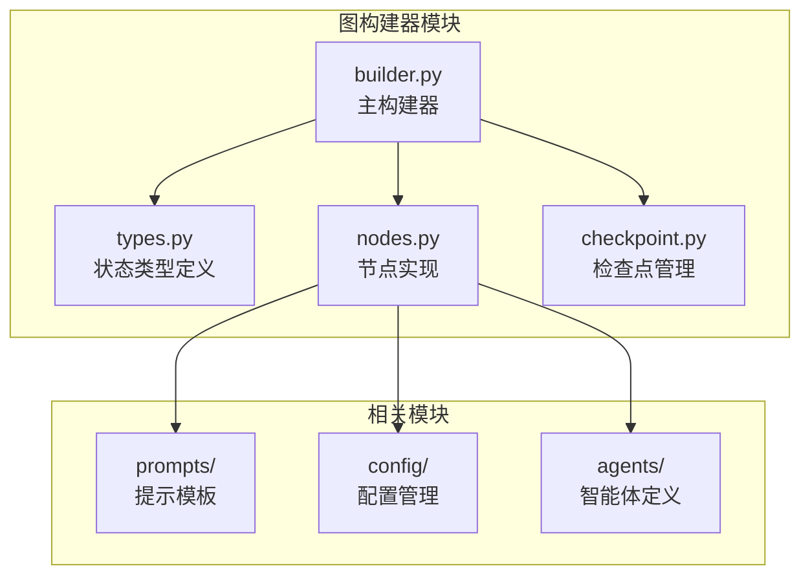
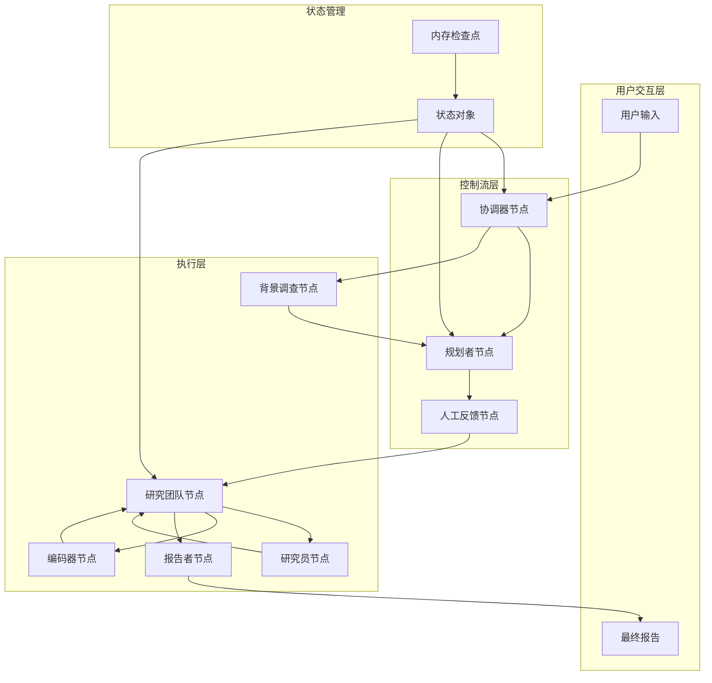
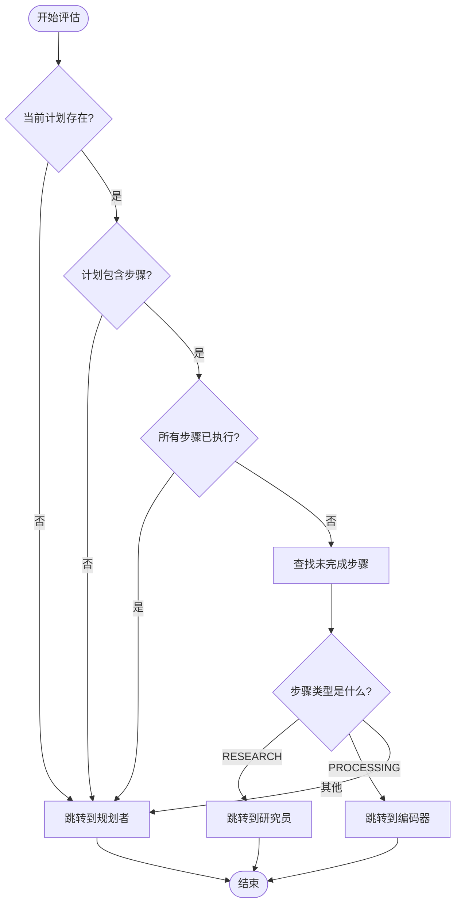
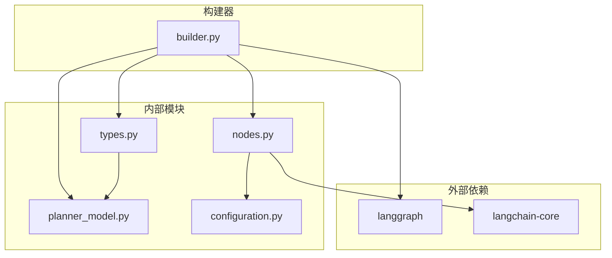

# 图构建器

<cite>
**本文档引用的文件**
- [builder.py](file://src/graph/builder.py)
- [types.py](file://src/graph/types.py)
- [nodes.py](file://src/graph/nodes.py)
- [planner_model.py](file://src/prompts/planner_model.py)
- [configuration.py](file://src/config/configuration.py)
- [test_builder.py](file://tests/unit/graph/test_builder.py)
</cite>

## 目录
1. [简介](#简介)
2. [项目结构](#项目结构)
3. [核心组件](#核心组件)
4. [架构概览](#架构概览)
5. [详细组件分析](#详细组件分析)
6. [依赖关系分析](#依赖关系分析)
7. [性能考虑](#性能考虑)
8. [故障排除指南](#故障排除指南)
9. [结论](#结论)

## 简介

图构建器是Deer-Flow系统的核心组件，负责使用LangGraph框架定义和组装多智能体工作流的各个节点。它通过动态创建不同类型的智能体节点（协调器、规划者、研究者等）并建立它们之间的连接关系，实现了复杂的研究任务自动化处理流程。

该系统采用状态图模式，支持条件边（conditional edges）和内存检查点功能，能够根据状态判断工作流的分支走向，并确保类型安全。图构建器提供了灵活的扩展机制，允许开发者轻松添加新的节点类型和转换规则。

## 项目结构

图构建器模块位于`src/graph/`目录下，包含以下关键文件：



**图表来源**
- [builder.py](file://src/graph/builder.py#L1-L88)
- [types.py](file://src/graph/types.py#L1-L25)

**章节来源**
- [builder.py](file://src/graph/builder.py#L1-L88)
- [types.py](file://src/graph/types.py#L1-L25)

## 核心组件

### 状态图构建器

图构建器的核心功能是基于LangGraph框架构建状态图，主要包含以下组件：

1. **基础图构建器**：`_build_base_graph()`函数负责创建基本的状态图结构
2. **条件边处理器**：`continue_to_running_research_team()`函数处理复杂的条件路由
3. **内存管理器**：支持持久化内存和检查点功能
4. **编译器**：将图结构编译为可执行的工作流

### 节点类型

系统支持多种类型的智能体节点：

- **协调器节点** (`coordinator_node`)：与用户沟通，接收研究主题
- **背景调查节点** (`background_investigation_node`)：进行初步搜索和调研
- **规划者节点** (`planner_node`)：制定详细的研究计划
- **报告者节点** (`reporter_node`)：生成最终研究报告
- **研究团队节点** (`research_team_node`)：协调多个研究步骤
- **研究员节点** (`researcher_node`)：执行具体的研究任务
- **编码器节点** (`coder_node`)：处理代码相关的分析任务
- **人工反馈节点** (`human_feedback_node`)：处理用户审查和反馈

**章节来源**
- [builder.py](file://src/graph/builder.py#L25-L88)
- [nodes.py](file://src/graph/nodes.py#L1-L512)

## 架构概览

图构建器采用分层架构设计，通过状态图模式实现智能体间的协作：



**图表来源**
- [builder.py](file://src/graph/builder.py#L35-L55)
- [nodes.py](file://src/graph/nodes.py#L150-L200)

## 详细组件分析

### 基础图构建器

`_build_base_graph()`函数是整个系统的核心，负责创建基础状态图：

```python
def _build_base_graph():
    """Build and return the base state graph with all nodes and edges."""
    builder = StateGraph(State)
    builder.add_edge(START, "coordinator")
    builder.add_node("coordinator", coordinator_node)
    builder.add_node("background_investigator", background_investigation_node)
    builder.add_node("planner", planner_node)
    builder.add_node("reporter", reporter_node)
    builder.add_node("research_team", research_team_node)
    builder.add_node("researcher", researcher_node)
    builder.add_node("coder", coder_node)
    builder.add_node("human_feedback", human_feedback_node)
    builder.add_edge("background_investigator", "planner")
    builder.add_conditional_edges(
        "research_team",
        continue_to_running_research_team,
        ["planner", "researcher", "coder"],
    )
    builder.add_edge("reporter", END)
    return builder
```

#### 核心方法详解

1. **add_node方法**：
   - 用于向图中添加新的节点
   - 每个节点对应一个特定的智能体功能
   - 节点名称作为图中的唯一标识符

2. **add_edge方法**：
   - 创建简单的单向连接
   - 支持特殊标记如`START`和`END`
   - 定义工作流的基本执行路径

3. **add_conditional_edges方法**：
   - 实现基于条件的动态路由
   - 根据状态判断下一个执行节点
   - 提供灵活的分支控制能力

### 条件边实现逻辑

`continue_to_running_research_team()`函数实现了复杂的条件路由逻辑：



**图表来源**
- [builder.py](file://src/graph/builder.py#L15-L30)

该函数的逻辑可以分解为以下几个步骤：

1. **计划验证**：检查当前计划是否存在且包含有效步骤
2. **执行状态检查**：遍历所有步骤，确定是否有未完成的任务
3. **类型判断**：根据步骤类型决定下一步执行哪个智能体
4. **默认处理**：如果无法确定下一步，则返回到规划者

### 状态类型定义

`State`类继承自`MessagesState`，扩展了运行时变量：

```python
class State(MessagesState):
    """State for the agent system, extends MessagesState with next field."""

    # Runtime Variables
    locale: str = "en-US"
    research_topic: str = ""
    observations: list[str] = []
    resources: list[Resource] = []
    plan_iterations: int = 0
    current_plan: Plan | str = None
    final_report: str = ""
    auto_accepted_plan: bool = False
    enable_background_investigation: bool = True
    background_investigation_results: str = None
```

这些状态变量确保了类型安全，并提供了完整的上下文信息：

- **locale**：用户语言环境，影响输出格式
- **research_topic**：研究主题，作为工作流的输入
- **observations**：观察结果列表，记录执行过程中的发现
- **resources**：可用资源列表，支持本地知识检索
- **plan_iterations**：计划迭代次数，控制循环深度
- **current_plan**：当前计划对象或字符串表示
- **final_report**：最终报告内容
- **auto_accepted_plan**：是否自动接受计划
- **enable_background_investigation**：是否启用背景调查
- **background_investigation_results**：背景调查结果

**章节来源**
- [builder.py](file://src/graph/builder.py#L15-L30)
- [types.py](file://src/graph/types.py#L8-L24)

### 内存管理功能

图构建器支持两种不同的编译模式：

1. **无记忆模式** (`build_graph()`)：
   ```python
   def build_graph():
       """Build and return the agent workflow graph without memory."""
       builder = _build_base_graph()
       return builder.compile()
   ```

2. **有记忆模式** (`build_graph_with_memory()`)：
   ```python
   def build_graph_with_memory():
       """Build and return the agent workflow graph with memory."""
       memory = MemorySaver()
       builder = _build_base_graph()
       return builder.compile(checkpointer=memory)
   ```

有记忆模式使用`MemorySaver`实现持久化存储，支持：
- 会话历史保存
- 中断恢复
- 状态持久化
- 多轮对话支持

**章节来源**
- [builder.py](file://src/graph/builder.py#L60-L88)

## 依赖关系分析

图构建器模块具有清晰的依赖层次结构：



**图表来源**
- [builder.py](file://src/graph/builder.py#L1-L10)
- [nodes.py](file://src/graph/nodes.py#L1-L30)

### 关键依赖关系

1. **LangGraph集成**：
   - `StateGraph`：核心图构建框架
   - `MemorySaver`：内存持久化工具
   - `START`/`END`：特殊标记常量

2. **状态类型依赖**：
   - `MessagesState`：消息状态基类
   - `Plan`：计划数据模型
   - `Resource`：资源数据模型

3. **节点实现依赖**：
   - 各种智能体节点函数
   - 工具和搜索功能
   - 配置管理系统

**章节来源**
- [builder.py](file://src/graph/builder.py#L1-L10)
- [types.py](file://src/graph/types.py#L1-L5)

## 性能考虑

### 内存优化策略

1. **选择性内存保存**：
   - 默认不启用持久化内存，减少存储开销
   - 仅在需要会话恢复时使用MemorySaver

2. **状态精简**：
   - 只保存必要的状态变量
   - 使用Pydantic模型确保数据有效性

3. **异步处理**：
   - 研究员和编码器节点支持异步执行
   - 提高并发处理能力

### 扩展性设计

1. **模块化架构**：
   - 新节点可以通过添加新函数轻松集成
   - 条件边逻辑独立于节点实现

2. **配置驱动**：
   - 通过配置文件控制行为
   - 支持运行时参数调整

3. **工具链集成**：
   - 支持MCP（Model Context Protocol）服务器
   - 可扩展的工具生态系统

## 故障排除指南

### 常见问题及解决方案

1. **节点执行失败**：
   - 检查节点函数签名是否正确
   - 验证状态对象是否包含必要字段
   - 确认依赖的工具和服务可用

2. **条件边路由错误**：
   - 调试`continue_to_running_research_team()`函数
   - 验证计划对象的完整性
   - 检查步骤类型的匹配逻辑

3. **内存相关问题**：
   - 确认MemorySaver配置正确
   - 检查数据库连接状态
   - 验证检查点序列化/反序列化

4. **类型安全问题**：
   - 使用Pydantic模型验证输入
   - 添加适当的类型注解
   - 实施运行时类型检查

**章节来源**
- [test_builder.py](file://tests/unit/graph/test_builder.py#L1-L134)

## 结论

图构建器是Deer-Flow系统的核心基础设施，通过LangGraph框架提供了强大而灵活的状态图构建能力。它成功地将复杂的多智能体协作流程抽象为清晰的图形结构，支持条件路由、内存管理和类型安全。

### 主要优势

1. **模块化设计**：清晰的职责分离，便于维护和扩展
2. **类型安全**：完整的Pydantic模型支持，减少运行时错误
3. **灵活性**：支持条件边和动态路由，适应复杂业务逻辑
4. **可扩展性**：易于添加新节点类型和转换规则
5. **性能优化**：异步处理和选择性内存管理

### 发展方向

1. **增强监控**：添加更详细的执行跟踪和指标收集
2. **优化调度**：改进条件边的决策算法
3. **扩展工具**：集成更多外部服务和工具
4. **可视化**：提供图形化的流程编辑界面
5. **测试覆盖**：完善单元测试和集成测试

图构建器为Deer-Flow系统提供了坚实的基础，使其能够高效地处理复杂的多智能体协作任务，是实现智能研究自动化的重要技术支撑。