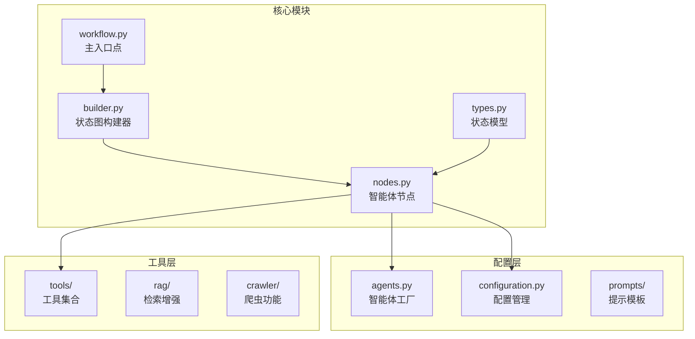
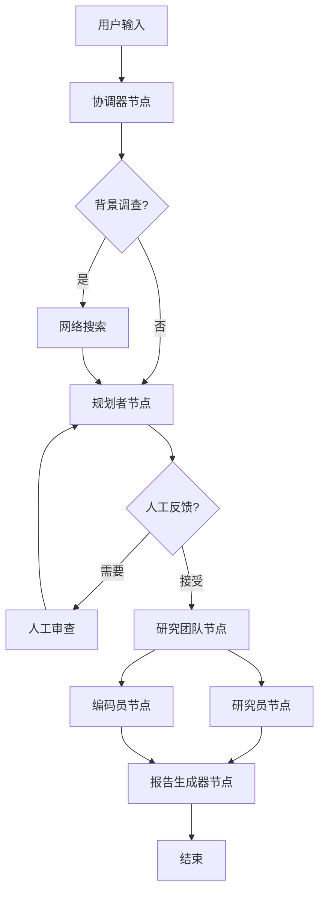
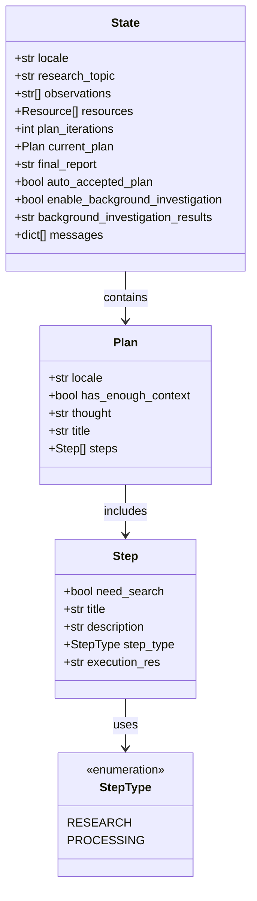
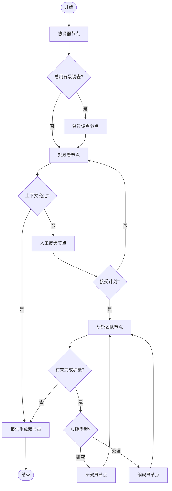

# DeerFlow 工作流引擎架构文档

<cite>
**本文档引用的文件**
- [workflow.py](file://src/workflow.py)
- [builder.py](file://src/graph/builder.py)
- [nodes.py](file://src/graph/nodes.py)
- [types.py](file://src/graph/types.py)
- [planner_model.py](file://src/prompts/planner_model.py)
- [agents.py](file://src/agents/agents.py)
- [configuration.py](file://src/config/configuration.py)
</cite>

## 目录
1. [简介](#简介)
2. [项目结构概览](#项目结构概览)
3. [核心组件分析](#核心组件分析)
4. [架构设计](#架构设计)
5. [详细组件分析](#详细组件分析)
6. [状态转换机制](#状态转换机制)
7. [自定义工作流开发指南](#自定义工作流开发指南)
8. [性能考虑](#性能考虑)
9. [故障排除指南](#故障排除指南)
10. [总结](#总结)

## 简介

DeerFlow 是一个基于 LangGraph 的智能工作流引擎，专为复杂的多智能体协作任务设计。该系统采用异步代理工作流架构，支持动态状态管理和条件分支执行，能够处理从简单查询到复杂研究项目的各种任务场景。

工作流引擎的核心特点：
- 基于 LangGraph 的状态图架构
- 异步代理执行模式
- 动态状态转换和条件分支
- 多智能体协作机制
- 可扩展的节点系统

## 项目结构概览



**图表来源**
- [workflow.py](file://src/workflow.py#L1-L104)
- [builder.py](file://src/graph/builder.py#L1-L88)
- [nodes.py](file://src/graph/nodes.py#L1-L512)
- [types.py](file://src/graph/types.py#L1-L25)

**章节来源**
- [workflow.py](file://src/workflow.py#L1-L104)
- [builder.py](file://src/graph/builder.py#L1-L88)

## 核心组件分析

### 主入口点 (workflow.py)

workflow.py 定义了整个工作流的异步执行入口，提供了统一的 API 接口：

```python
async def run_agent_workflow_async(
    user_input: str,
    debug: bool = False,
    max_plan_iterations: int = 1,
    max_step_num: int = 3,
    enable_background_investigation: bool = True,
):
```

主要功能：
- 用户输入验证和预处理
- 初始状态初始化
- 配置参数设置
- 流式输出处理
- 错误处理和日志记录

### 状态图构建器 (builder.py)

负责构建基于 LangGraph 的状态图，定义节点间的连接关系：

```python
def _build_base_graph():
    """Build and return the base state graph with all nodes and edges."""
    builder = StateGraph(State)
    builder.add_edge(START, "coordinator")
    builder.add_node("coordinator", coordinator_node)
    # ... 添加其他节点和边
```

关键特性：
- 条件边路由：根据状态动态选择执行路径
- 节点注册：将智能体函数注册为图节点
- 边定义：建立节点间的连接关系

**章节来源**
- [workflow.py](file://src/workflow.py#L20-L80)
- [builder.py](file://src/graph/builder.py#L25-L50)

## 架构设计

### 整体架构图



**图表来源**
- [builder.py](file://src/graph/builder.py#L30-L50)
- [nodes.py](file://src/graph/nodes.py#L200-L250)

### 状态模型设计



**图表来源**
- [types.py](file://src/graph/types.py#L8-L24)
- [planner_model.py](file://src/prompts/planner_model.py#L10-L30)

**章节来源**
- [types.py](file://src/graph/types.py#L1-L25)
- [planner_model.py](file://src/prompts/planner_model.py#L1-L59)

## 详细组件分析

### 协调器节点 (Coordinator Node)

协调器是工作流的入口点，负责与用户交互并确定后续执行路径：

```python
def coordinator_node(
    state: State, config: RunnableConfig
) -> Command[Literal["planner", "background_investigator", "__end__"]]:
```

主要职责：
- 解析用户输入
- 确定研究主题和语言环境
- 决定是否进行背景调查
- 触发相应的工具调用

### 规划者节点 (Planner Node)

规划者负责生成详细的研究计划：

```python
def planner_node(
    state: State, config: RunnableConfig
) -> Command[Literal["human_feedback", "reporter"]]:
```

执行流程：
1. 应用提示模板生成请求消息
2. 检查背景调查结果
3. 使用适当的 LLM 生成计划
4. 验证 JSON 输出格式
5. 决定是否需要人工反馈

### 研究团队节点 (Research Team Node)

研究团队节点协调研究员和编码员的工作：

```python
async def _execute_agent_step(
    state: State, agent, agent_name: str
) -> Command[Literal["research_team"]]:
```

核心功能：
- 查找未执行的步骤
- 准备执行上下文
- 调用相应智能体
- 更新执行结果

### 研究员节点 (Researcher Node)

研究员专门负责信息收集和研究任务：

```python
async def researcher_node(
    state: State, config: RunnableConfig
) -> Command[Literal["research_team"]]:
```

工具集成：
- 网络搜索工具
- 爬虫工具
- 本地资源检索工具

### 编码员节点 (Coder Node)

编码员专注于代码分析和编程任务：

```python
async def coder_node(
    state: State, config: RunnableConfig
) -> Command[Literal["research_team"]]:
```

工具配置：
- Python REPL 工具
- 支持动态 MCP 服务器集成

### 报告生成器节点 (Reporter Node)

报告生成器负责整合所有研究成果：

```python
def reporter_node(state: State, config: RunnableConfig):
```

输出特性：
- 结构化报告格式
- 引用和参考文献管理
- 多语言支持
- 自定义样式选项

**章节来源**
- [nodes.py](file://src/graph/nodes.py#L150-L250)
- [nodes.py](file://src/graph/nodes.py#L450-L512)

## 状态转换机制

### 条件路由逻辑



**图表来源**
- [builder.py](file://src/graph/builder.py#L15-L30)
- [nodes.py](file://src/graph/nodes.py#L15-L50)

### 状态更新机制

每个节点都返回 Command 对象来更新状态：

```python
return Command(
    update={
        "messages": [HumanMessage(content=response_content, name=agent_name)],
        "observations": observations + [response_content],
    },
    goto="research_team",
)
```

状态更新包含：
- 消息历史记录
- 执行观察结果
- 当前计划状态
- 迭代计数器

**章节来源**
- [nodes.py](file://src/graph/nodes.py#L400-L450)
- [builder.py](file://src/graph/builder.py#L15-L30)

## 自定义工作流开发指南

### 添加新节点

要添加新的智能体节点，需要遵循以下步骤：

1. **定义节点函数**：
```python
async def new_agent_node(
    state: State, config: RunnableConfig
) -> Command[Literal["next_node"]]:
    # 实现节点逻辑
    return Command(goto="next_node")
```

2. **在 builder.py 中注册**：
```python
builder.add_node("new_agent", new_agent_node)
builder.add_edge("previous_node", "new_agent")
```

3. **更新状态模型**（如需要）：
```python
class State(MessagesState):
    # 新的状态字段
    new_field: str = ""
```

### 修改执行逻辑

可以通过以下方式修改工作流行为：

1. **调整条件路由**：
```python
def custom_routing_function(state: State):
    # 自定义路由逻辑
    if condition_met:
        return "alternative_node"
    return "default_node"
```

2. **修改节点配置**：
```python
def create_agent_with_custom_tools(agent_type: str, tools: list):
    # 自定义工具配置
    return create_react_agent(
        model=get_llm_by_type(agent_type),
        tools=tools,
        prompt=custom_prompt_template,
    )
```

### 配置参数优化

工作流支持多种配置参数：

```python
config = {
    "configurable": {
        "thread_id": "default",
        "max_plan_iterations": 3,
        "max_step_num": 5,
        "mcp_settings": {
            "servers": {
                "custom_server": {
                    "transport": "stdio",
                    "command": "custom-tool",
                    "enabled_tools": ["custom_tool"],
                    "add_to_agents": ["researcher"]
                }
            }
        }
    },
    "recursion_limit": 100,
}
```

**章节来源**
- [builder.py](file://src/graph/builder.py#L30-L60)
- [configuration.py](file://src/config/configuration.py#L40-L70)

## 性能考虑

### 异步执行优化

工作流采用异步执行模式，具有以下优势：

1. **并发处理**：多个节点可以并行执行
2. **资源利用率**：有效利用计算资源
3. **响应性**：提高系统响应速度

### 内存管理

```python
# 使用 MemorySaver 进行持久化存储
memory = MemorySaver()
builder = _build_base_graph()
graph = builder.compile(checkpointer=memory)
```

内存优化策略：
- 状态压缩和清理
- 临时数据缓存
- 连接池管理

### 并发控制

递归限制和并发控制：
```python
def get_recursion_limit(default: int = 25) -> int:
    env_value_str = get_str_env("AGENT_RECURSION_LIMIT", str(default))
    parsed_limit = get_int_env("AGENT_RECURSION_LIMIT", default)
    return parsed_limit
```

## 故障排除指南

### 常见问题诊断

1. **节点执行失败**：
   - 检查 LLM 配置
   - 验证工具可用性
   - 确认状态完整性

2. **状态转换错误**：
   - 检查条件路由逻辑
   - 验证 Command 返回值
   - 确认节点名称正确性

3. **性能问题**：
   - 监控内存使用情况
   - 调整递归限制
   - 优化工具调用频率

### 调试工具

```python
def enable_debug_logging():
    """启用调试级别日志记录以获取更详细的执行信息。"""
    logging.getLogger("src").setLevel(logging.DEBUG)
```

日志记录最佳实践：
- 关键操作点添加日志
- 记录状态变化
- 捕获异常信息

**章节来源**
- [workflow.py](file://src/workflow.py#L15-L20)
- [configuration.py](file://src/config/configuration.py#L20-L40)

## 总结

DeerFlow 工作流引擎是一个功能强大且灵活的智能代理系统，基于 LangGraph 构建。其主要优势包括：

1. **模块化设计**：清晰的组件分离和职责划分
2. **可扩展性**：易于添加新节点和功能
3. **异步执行**：高效的并发处理能力
4. **状态管理**：完善的状态跟踪和转换机制
5. **配置灵活性**：丰富的配置选项和参数

该系统适用于各种复杂的多智能体协作场景，从简单的问答任务到复杂的研究项目都能有效处理。通过合理的配置和扩展，可以满足不同业务需求的技术要求。

未来发展方向：
- 更多智能体类型的扩展
- 更高级的条件路由逻辑
- 更强大的状态持久化机制
- 更好的监控和调试工具