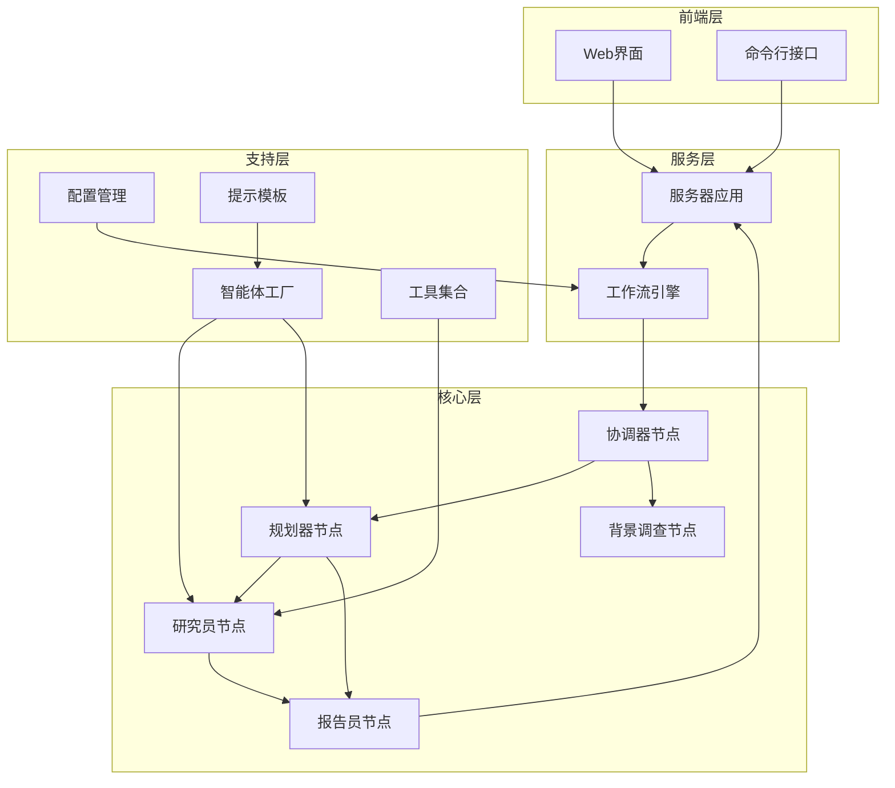
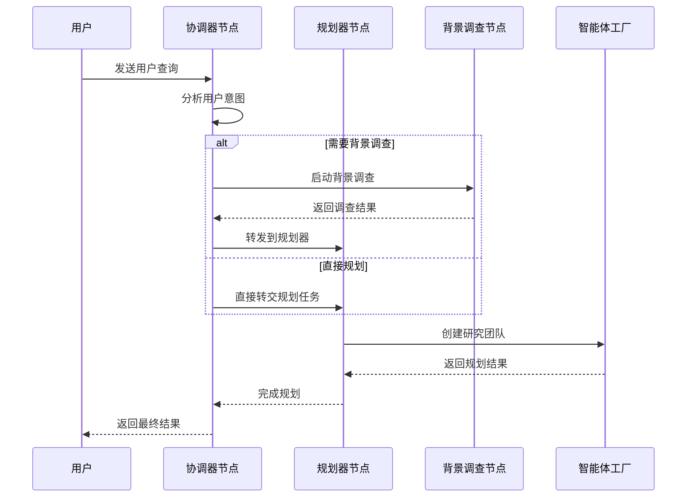
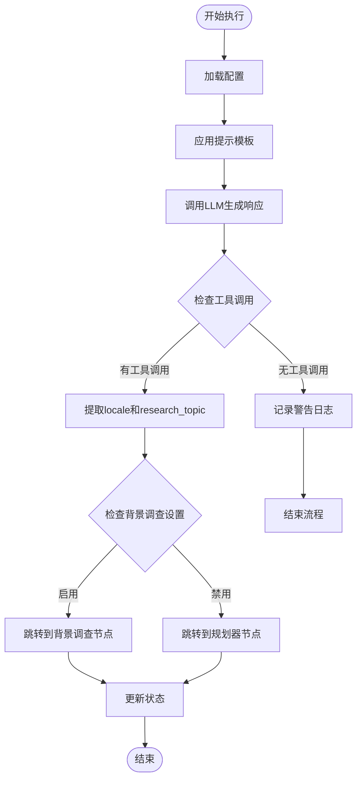
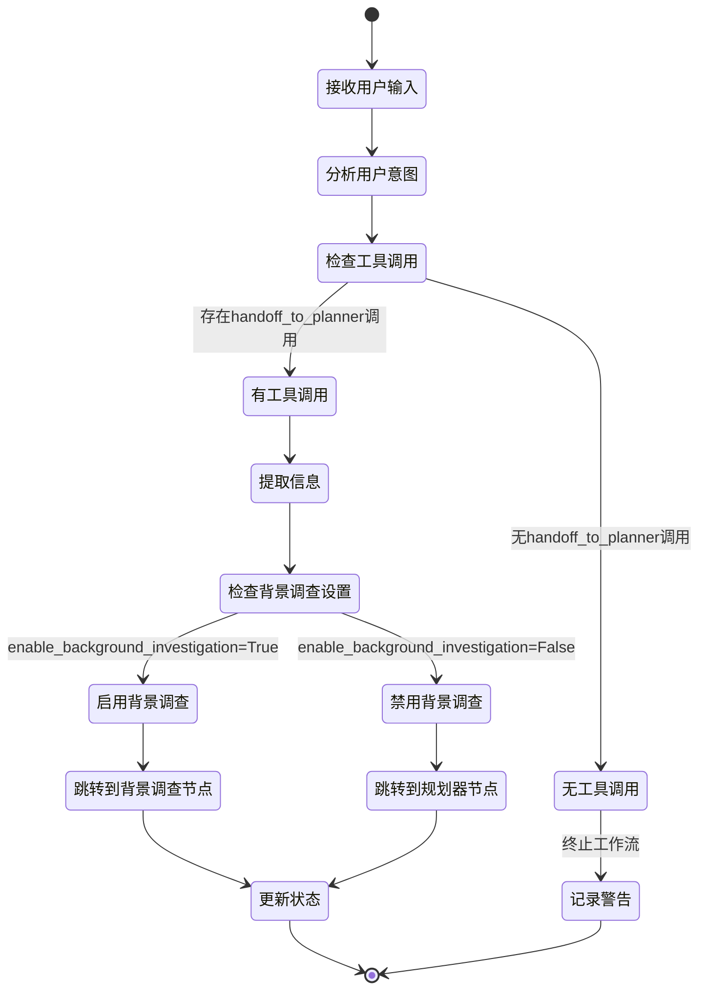

# 协调器节点详细分析文档

<cite>
**本文档引用的文件**
- [src/graph/nodes.py](file://src/graph/nodes.py)
- [src/agents/agents.py](file://src/agents/agents.py)
- [src/config/configuration.py](file://src/config/configuration.py)
- [src/graph/types.py](file://src/graph/types.py)
- [src/prompts/coordinator.md](file://src/prompts/coordinator.md)
- [src/prompts/planner_model.py](file://src/prompts/planner_model.py)
- [src/graph/builder.py](file://src/graph/builder.py)
- [tests/integration/test_nodes.py](file://tests/integration/test_nodes.py)
- [src/workflow.py](file://src/workflow.py)
</cite>

## 目录
1. [简介](#简介)
2. [项目结构概览](#项目结构概览)
3. [协调器节点核心功能](#协调器节点核心功能)
4. [架构设计与组件关系](#架构设计与组件关系)
5. [详细组件分析](#详细组件分析)
6. [状态管理机制](#状态管理机制)
7. [异常处理策略](#异常处理策略)
8. [性能考虑](#性能考虑)
9. [故障排除指南](#故障排除指南)
10. [结论](#结论)

## 简介

协调器节点（coordinator_node）是DeerFlow研究工作流系统的核心入口点，负责初始化研究任务、协调各智能体之间的交互，并管理整体工作流的状态转换。该节点作为整个系统的人机接口，能够根据用户输入调用背景调查工具，并决定是否需要启动规划流程。

协调器节点的设计遵循LangGraph框架的Command模式，通过工具调用机制实现与其他节点的解耦协作。它不仅处理简单的问候和闲聊，更重要的是能够识别研究请求并将这些请求转发给专门的规划器节点进行深入分析。

## 项目结构概览

协调器节点位于`src/graph/nodes.py`文件中，是DeerFlow研究工作流系统的重要组成部分。整个项目的结构体现了清晰的分层架构：



**图表来源**
- [src/graph/builder.py](file://src/graph/builder.py#L1-L88)
- [src/workflow.py](file://src/workflow.py#L1-L104)

**章节来源**
- [src/graph/builder.py](file://src/graph/builder.py#L1-L88)
- [src/workflow.py](file://src/workflow.py#L1-L104)

## 协调器节点核心功能

### 主要职责概述

协调器节点承担以下核心职责：

1. **用户交互管理**：处理用户的问候、闲聊和简单查询
2. **请求分类识别**：区分直接处理的请求和需要研究的任务
3. **工具调用执行**：通过handoff_to_planner工具将研究任务转交给规划器
4. **状态信息提取**：从LLM响应中提取locale和research_topic信息
5. **工作流路由决策**：根据条件决定下一步执行哪个节点

### 输入输出处理机制

协调器节点的输入是一个包含用户消息的状态对象，输出则是一个Command对象，指示下一步的执行路径和状态更新：

```python
def coordinator_node(
    state: State, config: RunnableConfig
) -> Command[Literal["planner", "background_investigator", "__end__"]]:
    """Coordinator node that communicate with customers."""
```

输入状态包含：
- `messages`: 用户消息列表
- `locale`: 用户语言环境
- `research_topic`: 研究主题
- `resources`: 可用资源列表
- `enable_background_investigation`: 是否启用背景调查

输出Command包含：
- `goto`: 下一步执行的节点名称
- `update`: 需要更新的状态字段

**章节来源**
- [src/graph/nodes.py](file://src/graph/nodes.py#L118-L170)

## 架构设计与组件关系

### 节点间协作关系

协调器节点在整个工作流中扮演着关键的协调角色，它与其他节点形成明确的依赖关系：



**图表来源**
- [src/graph/nodes.py](file://src/graph/nodes.py#L118-L170)
- [src/graph/builder.py](file://src/graph/builder.py#L35-L50)

### 工具集成机制

协调器节点通过工具调用机制实现与其他组件的解耦：

```python
@tool
def handoff_to_planner(
    research_topic: Annotated[str, "The topic of the research task to be handed off."],
    locale: Annotated[str, "The user's detected language locale (e.g., en-US, zh-CN)."],
):
    """Handoff to planner agent to do plan."""
    # This tool is not returning anything: we're just using it
    # as a way for LLM to signal that it needs to hand off to planner agent
    return
```

这种设计允许LLM在运行时动态决定是否需要转交任务，而不需要硬编码的控制流。

**章节来源**
- [src/graph/nodes.py](file://src/graph/nodes.py#L25-L35)

## 详细组件分析

### 协调器节点实现细节

协调器节点的核心实现展示了其智能的路由决策能力：



**图表来源**
- [src/graph/nodes.py](file://src/graph/nodes.py#L118-L170)

### 状态管理机制

协调器节点维护复杂的状态信息，包括：

1. **语言环境管理**：自动检测和维护用户语言偏好
2. **研究主题跟踪**：记录当前的研究主题和相关信息
3. **资源信息存储**：保存可用的参考资料和资源链接
4. **工作流状态标记**：跟踪是否启用了背景调查功能

```python
class State(MessagesState):
    """State for the agent system, extends MessagesState with next field."""

    # Runtime Variables
    locale: str = "en-US"
    research_topic: str = ""
    observations: list[str] = []
    resources: list[Resource] = []
    plan_iterations: int = 0
    current_plan: Plan | str = None
    final_report: str = ""
    auto_accepted_plan: bool = False
    enable_background_investigation: bool = True
    background_investigation_results: str = None
```

**章节来源**
- [src/graph/types.py](file://src/graph/types.py#L8-L24)

### 智能体创建与管理

协调器节点通过智能体工厂函数动态创建和管理其他智能体实例：

```python
def create_agent(agent_name: str, agent_type: str, tools: list, prompt_template: str):
    """Factory function to create agents with consistent configuration."""
    return create_react_agent(
        name=agent_name,
        model=get_llm_by_type(AGENT_LLM_MAP[agent_type]),
        tools=tools,
        prompt=lambda state: apply_prompt_template(prompt_template, state),
    )
```

这种工厂模式确保了所有智能体的一致性和可配置性。

**章节来源**
- [src/agents/agents.py](file://src/agents/agents.py#L11-L19)

## 状态管理机制

### 状态流转控制

协调器节点通过复杂的条件判断实现精确的状态流转控制：



**图表来源**
- [src/graph/nodes.py](file://src/graph/nodes.py#L118-L170)

### 配置管理系统

协调器节点依赖于强大的配置管理系统来适应不同的运行环境：

```python
@dataclass(kw_only=True)
class Configuration:
    """The configurable fields."""

    resources: list[Resource] = field(default_factory=list)
    max_plan_iterations: int = 1
    max_step_num: int = 3
    max_search_results: int = 3
    search_engine: str = "custom_search"
    custom_search_repository: Optional[str] = None
    mcp_settings: dict = None
    report_style: str = ReportStyle.ACADEMIC.value
    enable_deep_thinking: bool = False

    @classmethod
    def from_runnable_config(
        cls, config: Optional[RunnableConfig] = None
    ) -> "Configuration":
        """Create a Configuration instance from a RunnableConfig."""
        configurable = (
            config["configurable"] if config and "configurable" in config else {}
        )
        values: dict[str, Any] = {
            f.name: os.environ.get(f.name.upper(), configurable.get(f.name))
            for f in fields(cls)
            if f.init
        }
        return cls(**{k: v for k, v in values.items() if v})
```

**章节来源**
- [src/config/configuration.py](file://src/config/configuration.py#L35-L70)

## 异常处理策略

### 工具调用异常处理

协调器节点实现了健壮的异常处理机制来应对各种可能的错误情况：

```python
try:
    for tool_call in response.tool_calls:
        if tool_call.get("name", "") != "handoff_to_planner":
            continue
        if tool_call.get("args", {}).get("locale") and tool_call.get(
            "args", {}
        ).get("research_topic"):
            locale = tool_call.get("args", {}).get("locale")
            research_topic = tool_call.get("args", {}).get("research_topic")
            break
except Exception as e:
    logger.error(f"Error processing tool calls: {e}")
```

这种异常处理确保即使在工具调用格式不正确的情况下，系统也能继续正常运行。

### JSON解析错误处理

对于JSON解析错误，协调器节点采用分级处理策略：

```python
try:
    curr_plan = json.loads(repair_json_output(full_response))
except json.JSONDecodeError:
    logger.warning("Planner response is not a valid JSON")
    if plan_iterations > 0:
        return Command(goto="reporter")
    else:
        return Command(goto="__end__")
```

这种策略允许系统在第一次尝试失败时继续执行，但在多次失败后优雅地终止。

**章节来源**
- [src/graph/nodes.py](file://src/graph/nodes.py#L140-L170)
- [src/graph/nodes.py](file://src/graph/nodes.py#L75-L85)

## 性能考虑

### 并发处理优化

协调器节点支持异步操作以提高性能：

```python
async def _setup_and_execute_agent_step(
    state: State,
    config: RunnableConfig,
    agent_type: str,
    default_tools: list,
) -> Command[Literal["research_team"]]:
    """Helper function to set up an agent with appropriate tools and execute a step.

    This function handles the common logic for both researcher_node and coder_node:
    1. Configures MCP servers and tools based on agent type
    2. Creates an agent with the appropriate tools or uses the default agent
    3. Executes the agent on the current step
    """
```

### 内存管理策略

系统通过MemorySaver实现持久化内存管理，确保对话历史不会丢失：

```python
def build_graph_with_memory():
    """Build and return the agent workflow graph with memory."""
    # use persistent memory to save conversation history
    memory = MemorySaver()
    
    # build state graph
    builder = _build_base_graph()
    return builder.compile(checkpointer=memory)
```

**章节来源**
- [src/graph/nodes.py](file://src/graph/nodes.py#L350-L370)
- [src/graph/builder.py](file://src/graph/builder.py#L75-L82)

## 故障排除指南

### 常见问题诊断

1. **工具调用失败**
   - 检查LLM是否正确生成了handoff_to_planner工具调用
   - 验证工具参数格式是否正确
   - 查看日志中的错误信息

2. **状态更新异常**
   - 确认状态字段名是否正确
   - 检查数据类型是否匹配
   - 验证状态序列化/反序列化过程

3. **配置加载问题**
   - 检查环境变量设置
   - 验证配置文件格式
   - 确认配置优先级顺序

### 调试技巧

启用调试日志可以提供详细的执行信息：

```python
def enable_debug_logging():
    """Enable debug level logging for more detailed execution information."""
    logging.getLogger("src").setLevel(logging.DEBUG)
```

这可以帮助开发者理解每个步骤的执行过程和潜在问题。

**章节来源**
- [src/workflow.py](file://src/workflow.py#L18-L22)

## 结论

协调器节点作为DeerFlow研究工作流系统的入口点，展现了优秀的架构设计和实现质量。它不仅实现了复杂的用户交互逻辑，还提供了灵活的扩展能力和健壮的异常处理机制。

主要优势包括：

1. **模块化设计**：通过工具调用实现松耦合的组件协作
2. **智能路由**：基于用户意图的动态工作流决策
3. **状态管理**：完整的状态跟踪和持久化机制
4. **异常处理**：多层次的错误处理和恢复策略
5. **性能优化**：支持异步操作和内存管理

该节点为整个研究工作流奠定了坚实的基础，确保了系统的可靠性和可扩展性。通过合理的抽象和清晰的职责分离，它成功地平衡了功能性、可维护性和性能需求。