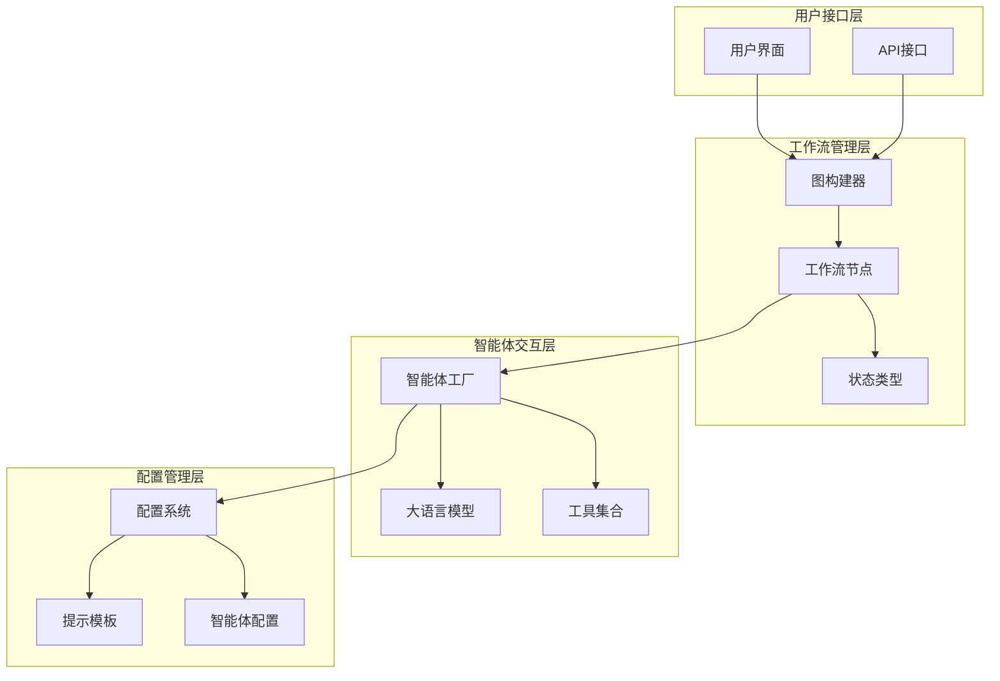
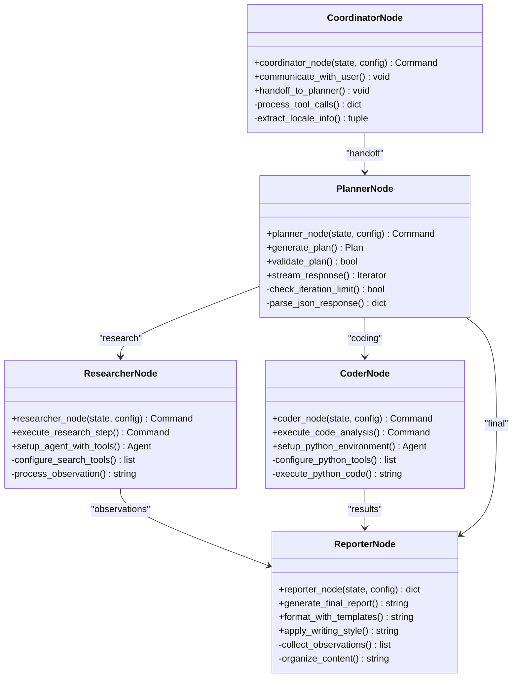
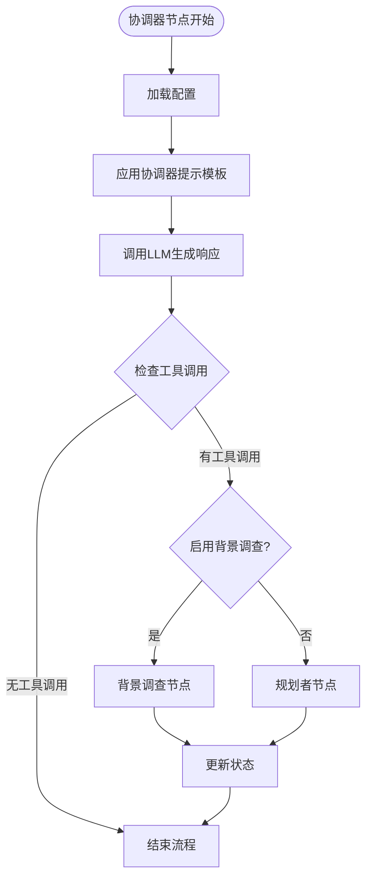
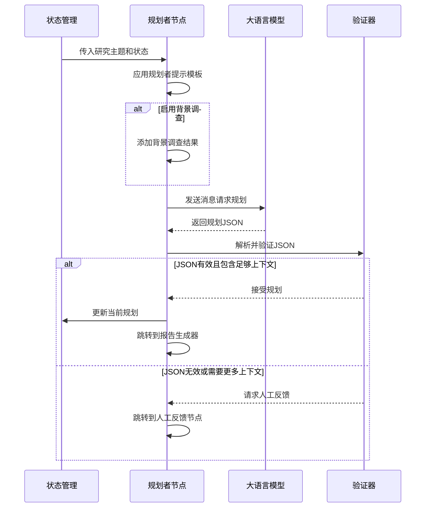
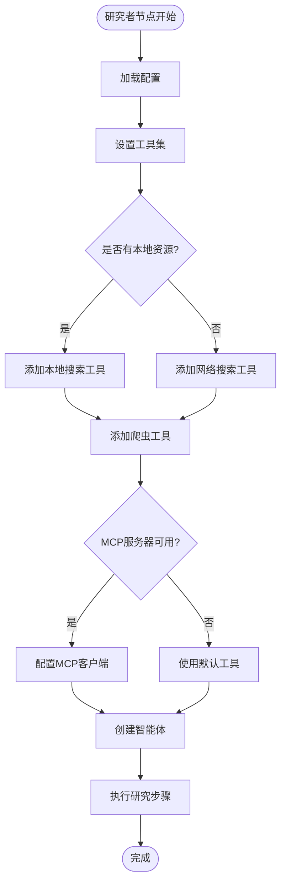
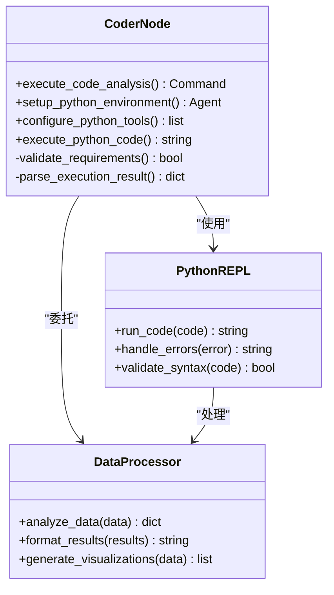
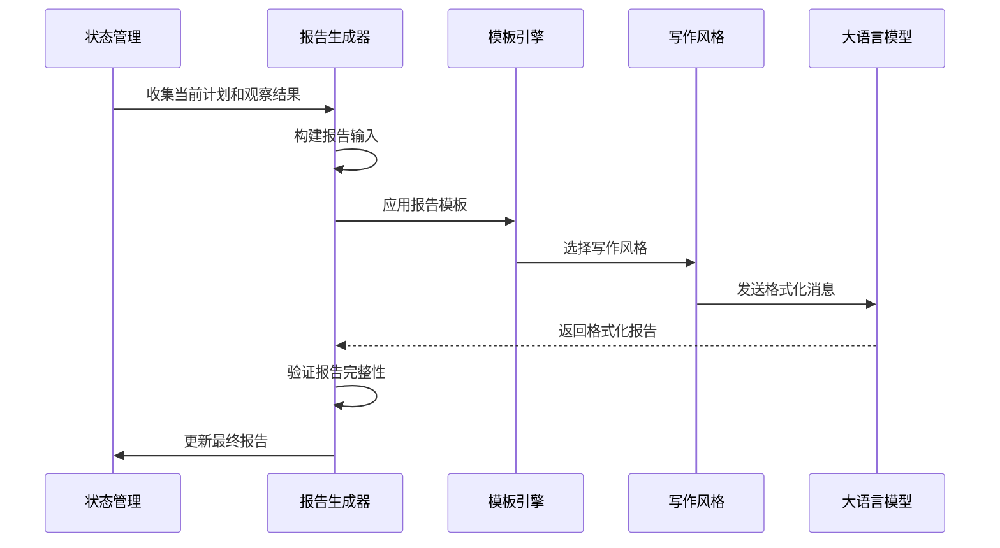
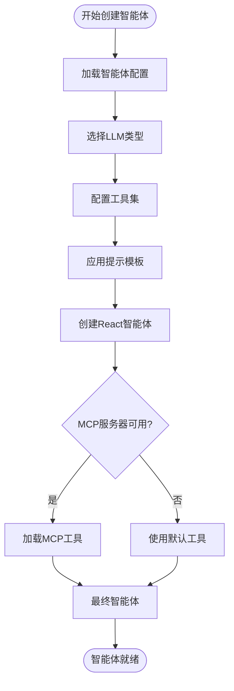
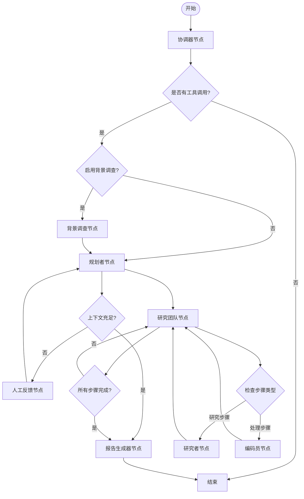
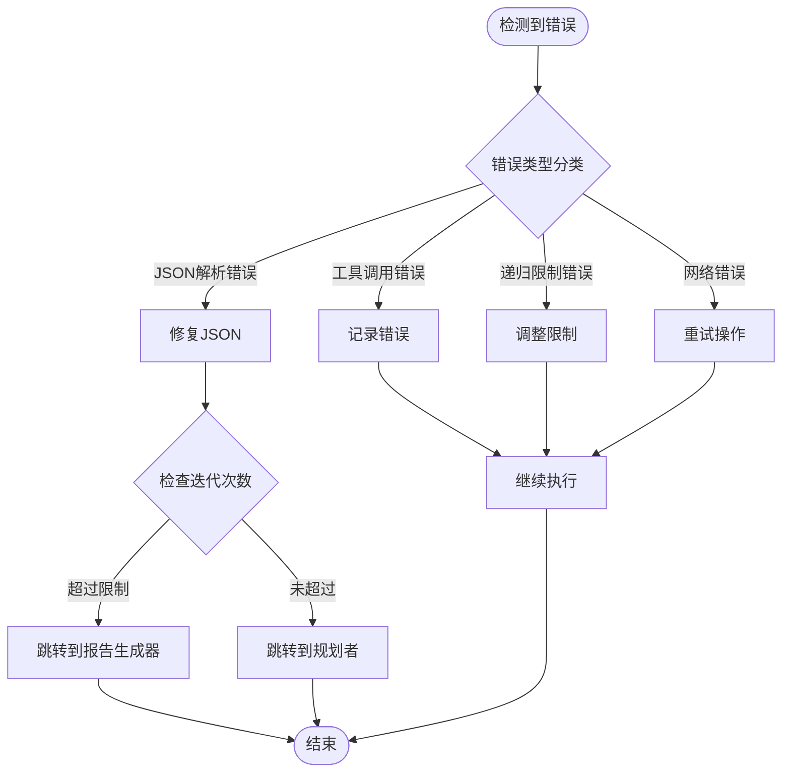

# 工作流节点详细分析

<cite>
**本文档引用的文件**
- [src/graph/nodes.py](file://src/graph/nodes.py)
- [src/agents/agents.py](file://src/agents/agents.py)
- [src/graph/builder.py](file://src/graph/builder.py)
- [src/graph/types.py](file://src/graph/types.py)
- [src/config/agents.py](file://src/config/agents.py)
- [src/prompts/coordinator.md](file://src/prompts/coordinator.md)
- [src/prompts/planner.md](file://src/prompts/planner.md)
- [src/prompts/researcher.md](file://src/prompts/researcher.md)
- [src/prompts/coder.md](file://src/prompts/coder.md)
- [src/prompts/reporter.md](file://src/prompts/reporter.md)
</cite>

## 目录
1. [简介](#简介)
2. [项目架构概览](#项目架构概览)
3. [核心节点组件](#核心节点组件)
4. [协调器节点详解](#协调器节点详解)
5. [规划者节点详解](#规划者节点详解)
6. [研究者节点详解](#研究者节点详解)
7. [编码员节点详解](#编码员节点详解)
8. [报告生成器节点详解](#报告生成器节点详解)
9. [智能体交互机制](#智能体交互机制)
10. [节点协作模式](#节点协作模式)
11. [错误处理与异常管理](#错误处理与异常管理)
12. [性能优化策略](#性能优化策略)
13. [总结](#总结)

## 简介

deer-flow 是一个基于 LangGraph 的多智能体协作系统，专门设计用于执行深度研究任务。该系统通过精心设计的工作流节点实现了从用户需求识别到最终报告生成的完整自动化流程。本文档深入分析了 src/graph/nodes.py 中各个工作流节点的实现细节，包括协调器节点、规划者节点、研究者节点、编码员节点和报告生成器节点的功能特性、交互模式和错误处理机制。

## 项目架构概览

deer-flow 采用分层架构设计，将工作流管理、智能体交互和状态管理分离到不同的模块中：



**图表来源**
- [src/graph/builder.py](file://src/graph/builder.py#L1-L88)
- [src/graph/nodes.py](file://src/graph/nodes.py#L1-L50)

## 核心节点组件

deer-flow 的工作流由五个主要节点组成，每个节点都有特定的职责和功能：



**图表来源**
- [src/graph/nodes.py](file://src/graph/nodes.py#L15-L512)
- [src/graph/builder.py](file://src/graph/builder.py#L25-L50)

**章节来源**
- [src/graph/nodes.py](file://src/graph/nodes.py#L1-L512)
- [src/graph/builder.py](file://src/graph/builder.py#L1-L88)

## 协调器节点详解

协调器节点是整个工作流的入口点，负责与用户进行初步沟通并决定后续流程走向：

### 核心功能

协调器节点的主要职责包括：
- 用户问候和简单对话处理
- 研究任务的手动交接
- 搜索引擎集成
- 背景调查的触发控制

### 实现细节

```python
def coordinator_node(
    state: State, config: RunnableConfig
) -> Command[Literal["planner", "background_investigator", "__end__"]]:
    """协调器节点，与客户沟通交流。"""
    logger.info("协调器正在交谈。")
    configurable = Configuration.from_runnable_config(config)
    messages = apply_prompt_template("coordinator", state)
    response = (
        get_llm_by_type(AGENT_LLM_MAP["coordinator"])
        .bind_tools([handoff_to_planner])
        .invoke(messages)
    )
```

### 流程控制

协调器节点根据响应内容决定下一步行动：



**图表来源**
- [src/graph/nodes.py](file://src/graph/nodes.py#L180-L240)

### 错误处理机制

协调器节点实现了完善的错误处理：

```python
try:
    for tool_call in response.tool_calls:
        if tool_call.get("name", "") != "handoff_to_planner":
            continue
        if tool_call.get("args", {}).get("locale") and tool_call.get("args", {}):
            locale = tool_call.get("args", {}).get("locale")
            research_topic = tool_call.get("args", {}).get("research_topic")
            break
except Exception as e:
    logger.error(f"处理工具调用时出错: {e}")
```

**章节来源**
- [src/graph/nodes.py](file://src/graph/nodes.py#L180-L240)
- [src/prompts/coordinator.md](file://src/prompts/coordinator.md#L1-L56)

## 规划者节点详解

规划者节点负责为研究任务制定详细的行动计划，是整个工作流的核心决策节点：

### 规划生成过程



**图表来源**
- [src/graph/nodes.py](file://src/graph/nodes.py#L70-L140)

### 迭代控制机制

规划者节点实现了智能的迭代控制：

```python
plan_iterations = state["plan_iterations"] if state.get("plan_iterations", 0) else 0

# 如果计划迭代次数超过最大限制，直接跳转到报告生成器
if plan_iterations >= configurable.max_plan_iterations:
    return Command(goto="reporter")

# 检查是否包含足够上下文
curr_plan = json.loads(repair_json_output(full_response))
if isinstance(curr_plan, dict) and curr_plan.get("has_enough_context"):
    logger.info("规划响应包含足够上下文。")
    new_plan = Plan.model_validate(curr_plan)
    return Command(
        update={
            "messages": [AIMessage(content=full_response, name="planner")],
            "current_plan": new_plan,
        },
        goto="reporter",
    )
```

### 提示模板应用

规划者节点使用复杂的提示模板来指导规划过程：

```python
messages = apply_prompt_template("planner", state, configurable)

if state.get("enable_background_investigation") and state.get("background_investigation_results"):
    messages += [{
        "role": "user",
        "content": (
            "用户查询的背景调查结果:\n"
            + state["background_investigation_results"]
            + "\n"
        ),
    }]
```

**章节来源**
- [src/graph/nodes.py](file://src/graph/nodes.py#L70-L140)
- [src/prompts/planner.md](file://src/prompts/planner.md#L1-L188)

## 研究者节点详解

研究者节点负责执行具体的研究任务，通过多种搜索工具获取相关信息：

### 工具配置机制



**图表来源**
- [src/graph/nodes.py](file://src/graph/nodes.py#L450-L512)

### 智能体执行流程

研究者节点通过统一的执行框架处理各种研究任务：

```python
async def _execute_agent_step(
    state: State, agent, agent_name: str
) -> Command[Literal["research_team"]]:
    """帮助函数，使用指定的智能体执行一步操作。"""
    current_plan = state.get("current_plan")
    plan_title = current_plan.title
    observations = state.get("observations", [])

    # 查找第一个未执行的步骤
    current_step = None
    completed_steps = []
    for step in current_plan.steps:
        if not step.execution_res:
            current_step = step
            break
        else:
            completed_steps.append(step)

    if not current_step:
        logger.warning("未找到未执行的步骤")
        return Command(goto="research_team")

    # 准备智能体输入
    agent_input = {
        "messages": [
            HumanMessage(
                content=f"# 研究主题\n\n{plan_title}\n\n{completed_steps_info}# 当前步骤\n\n## 标题\n\n{current_step.title}\n\n## 描述\n\n{current_step.description}\n\n## 语言环境\n\n{state.get('locale', 'en-US')}"
            )
        ]
    }
```

### 资源处理机制

研究者节点能够智能地处理本地资源和外部搜索：

```python
# 添加本地资源搜索工具
retriever_tool = get_retriever_tool(state.get("resources", []))
if retriever_tool:
    tools.insert(0, retriever_tool)

# 添加网络搜索工具
tools = [
    get_web_search_tool(configurable.max_search_results, configurable.search_engine, configurable.custom_search_repository), 
    crawl_tool
]
```

**章节来源**
- [src/graph/nodes.py](file://src/graph/nodes.py#L450-L512)
- [src/prompts/researcher.md](file://src/prompts/researcher.md#L1-L87)

## 编码员节点详解

编码员节点专注于代码分析和数据处理任务，提供专业的编程解决方案：

### 编程环境配置



**图表来源**
- [src/graph/nodes.py](file://src/graph/nodes.py#L480-L512)
- [src/prompts/coder.md](file://src/prompts/coder.md#L1-L35)

### 执行步骤

编码员节点遵循严格的执行流程：

1. **需求分析**：仔细审查任务描述以理解目标、约束和预期结果
2. **方案规划**：确定任务是否需要Python，概述实现步骤
3. **解决方案实施**：使用Python进行数据分析、算法实现或问题解决
4. **测试验证**：验证实现以确保满足要求并处理边缘情况
5. **方法论文档**：提供清晰的方法论解释，包括选择理由和假设
6. **结果展示**：清晰显示最终输出和任何中间结果

### 工具配置

```python
async def coder_node(
    state: State, config: RunnableConfig
) -> Command[Literal["research_team"]]:
    """编码员节点，执行代码分析。"""
    logger.info("编码员节点正在编码。")
    return await _setup_and_execute_agent_step(
        state,
        config,
        "coder",
        [python_repl_tool],
    )
```

**章节来源**
- [src/graph/nodes.py](file://src/graph/nodes.py#L480-L512)
- [src/prompts/coder.md](file://src/prompts/coder.md#L1-L35)

## 报告生成器节点详解

报告生成器节点负责整合所有收集的信息，生成结构化的最终报告：

### 报告生成流程



**图表来源**
- [src/graph/nodes.py](file://src/graph/nodes.py#L242-L290)

### 写作风格适配

报告生成器支持多种写作风格：

```python
# 根据配置选择写作风格
if report_style == "academic":
    # 学术风格：严谨、正式、技术性强
    style_prompt = "学术卓越标准..."
elif report_style == "popular_science":
    # 科普风格：生动、易懂、引人入胜
    style_prompt = "科学传播卓越标准..."
elif report_style == "news":
    # 新闻风格：权威、客观、时效性强
    style_prompt = "NBC新闻编辑标准..."
else:
    # 默认专业风格
    style_prompt = "专业报告风格..."
```

### 报告结构化

报告生成器按照预定义的结构组织内容：

```python
# 报告结构模板
report_structure = {
    "title": "标题",
    "key_points": "关键要点",
    "overview": "概述",
    "detailed_analysis": "详细分析",
    "survey_note": "调查笔记",
    "key_citations": "关键引用"
}
```

### 引用管理

报告生成器实现了自动引用管理：

```python
# 添加引用提醒
invoke_messages.append(
    HumanMessage(
        content="重要提示：根据提示中的格式结构化您的报告。记住包括：\n\n1. 关键要点 - 最重要的发现的项目符号列表\n2. 概述 - 主题的简要介绍\n3. 详细分析 - 逻辑分段组织\n4. 调查笔记（可选）- 更全面的报告\n5. 关键引用 - 在末尾列出所有参考文献\n\n对于引用，不要在文本中包含内联引用。相反，在末尾的'关键引用'部分使用链接引用格式放置所有引用。每条引用之间留空行以提高可读性。",
        name="system",
    )
)
```

**章节来源**
- [src/graph/nodes.py](file://src/graph/nodes.py#L242-L290)
- [src/prompts/reporter.md](file://src/prompts/reporter.md#L1-L280)

## 智能体交互机制

deer-flow 通过智能体工厂模式实现与各个节点的交互：

### 智能体创建流程



**图表来源**
- [src/agents/agents.py](file://src/agents/agents.py#L1-L20)

### 智能体工厂实现

```python
def create_agent(agent_name: str, agent_type: str, tools: list, prompt_template: str):
    """工厂函数，使用一致的配置创建智能体。"""
    return create_react_agent(
        name=agent_name,
        model=get_llm_by_type(AGENT_LLM_MAP[agent_type]),
        tools=tools,
        prompt=lambda state: apply_prompt_template(prompt_template, state),
    )
```

### MCP工具集成

deer-flow 支持动态MCP（Model Context Protocol）工具集成：

```python
# 提取MCP服务器配置
if configurable.mcp_settings:
    for server_name, server_config in configurable.mcp_settings["servers"].items():
        if (
            server_config["enabled_tools"]
            and agent_type in server_config["add_to_agents"]
        ):
            mcp_servers[server_name] = {
                k: v
                for k, v in server_config.items()
                if k in ("transport", "command", "args", "url", "env", "headers")
            }
            for tool_name in server_config["enabled_tools"]:
                enabled_tools[tool_name] = server_name
```

**章节来源**
- [src/agents/agents.py](file://src/agents/agents.py#L1-L20)
- [src/graph/nodes.py](file://src/graph/nodes.py#L350-L400)

## 节点协作模式

deer-flow 的节点间协作遵循严格的控制流模式：

### 控制流图



**图表来源**
- [src/graph/builder.py](file://src/graph/builder.py#L25-L88)

### 状态传递机制

节点间通过统一的状态对象传递信息：

```python
class State(MessagesState):
    """智能体系统的状态，扩展MessagesState带有下一个字段。"""
    
    # 运行时变量
    locale: str = "en-US"
    research_topic: str = ""
    observations: list[str] = []
    resources: list[Resource] = []
    plan_iterations: int = 0
    current_plan: Plan | str = None
    final_report: str = ""
    auto_accepted_plan: bool = False
    enable_background_investigation: bool = True
    background_investigation_results: str = None
```

### 条件路由

研究团队节点使用条件路由决定下一步行动：

```python
def continue_to_running_research_team(state: State):
    current_plan = state.get("current_plan")
    if not current_plan or not current_plan.steps:
        return "planner"

    if all(step.execution_res for step in current_plan.steps):
        return "planner"

    # 查找第一个未完成的步骤
    incomplete_step = None
    for step in current_plan.steps:
        if not step.execution_res:
            incomplete_step = step
            break

    if not incomplete_step:
        return "planner"

    if incomplete_step.step_type == StepType.RESEARCH:
        return "researcher"
    if incomplete_step.step_type == StepType.PROCESSING:
        return "coder"
    return "planner"
```

**章节来源**
- [src/graph/builder.py](file://src/graph/builder.py#L25-L88)
- [src/graph/types.py](file://src/graph/types.py#L1-L25)

## 错误处理与异常管理

deer-flow 实现了多层次的错误处理机制：

### 日志记录系统

```python
import logging
logger = logging.getLogger(__name__)

# 统一日志记录
logger.info("协调器正在交谈。")
logger.debug(f"当前状态消息: {state['messages']}")
logger.warning("规划响应包含不足的上下文。")
logger.error(f"处理工具调用时出错: {e}")
```

### JSON修复机制

```python
from src.utils.json_utils import repair_json_output

try:
    curr_plan = json.loads(repair_json_output(full_response))
except json.JSONDecodeError:
    logger.warning("规划响应不是有效的JSON")
    if plan_iterations > 0:
        return Command(goto="reporter")
    else:
        return Command(goto="__end__")
```

### 递归限制管理

```python
async def _execute_agent_step(state: State, agent, agent_name: str):
    default_recursion_limit = 25
    
    try:
        env_value_str = os.getenv("AGENT_RECURSION_LIMIT", str(default_recursion_limit))
        parsed_limit = int(env_value_str)

        if parsed_limit > 0:
            recursion_limit = parsed_limit
            logger.info(f"递归限制设置为: {recursion_limit}")
        else:
            logger.warning(f"AGENT_RECURSION_LIMIT 值 '{env_value_str}' (解析为 {parsed_limit}) 不为正数。使用默认值 {default_recursion_limit}。")
            recursion_limit = default_recursion_limit
    except ValueError:
        raw_env_value = os.getenv("AGENT_RECURSION_LIMIT")
        logger.warning(f"无效的 AGENT_RECURSION_LIMIT 值: '{raw_env_value}'。使用默认值 {default_recursion_limit}。")
        recursion_limit = default_recursion_limit
```

### 异常恢复策略



**章节来源**
- [src/graph/nodes.py](file://src/graph/nodes.py#L100-L140)
- [src/graph/nodes.py](file://src/graph/nodes.py#L300-L350)

## 性能优化策略

deer-flow 采用了多种性能优化策略：

### 并发执行

```python
# 异步执行智能体步骤
async def _execute_agent_step(state: State, agent, agent_name: str):
    # 并发处理多个步骤
    tasks = []
    for step in current_plan.steps:
        if not step.execution_res:
            task = asyncio.create_task(execute_single_step(step, agent))
            tasks.append(task)
    
    results = await asyncio.gather(*tasks, return_exceptions=True)
```

### 缓存机制

```python
# 缓存搜索结果
cache_key = f"search_{query}_{timestamp}"
if cache_key in search_cache:
    return search_cache[cache_key]

# 缓存智能体响应
response_cache[f"{agent_type}_{input_hash}"] = response
```

### 资源管理

```python
# 限制并发智能体数量
MAX_CONCURRENT_AGENTS = 5
semaphore = asyncio.Semaphore(MAX_CONCURRENT_AGENTS)

async def execute_with_limits(state: State, agent, agent_name: str):
    async with semaphore:
        return await _execute_agent_step(state, agent, agent_name)
```

### 内存优化

```python
# 及时清理大型对象
def cleanup_large_objects(state: State):
    if len(state.get("observations", [])) > MAX_OBSERVATIONS:
        state["observations"] = state["observations"][-MAX_OBSERVATIONS:]
    
    if len(state.get("messages", [])) > MAX_MESSAGES:
        state["messages"] = state["messages"][-MAX_MESSAGES:]
```

## 总结

deer-flow 的工作流节点系统展现了现代AI应用的复杂性和精密性。通过协调器节点、规划者节点、研究者节点、编码员节点和报告生成器节点的协同工作，系统实现了从用户需求识别到最终报告生成的完整自动化流程。

### 主要特点

1. **模块化设计**：每个节点都有明确的职责和边界，便于维护和扩展
2. **智能决策**：规划者节点能够根据上下文动态调整研究策略
3. **灵活工具集成**：支持MCP协议和自定义工具，适应不同场景需求
4. **强大的错误处理**：多层次的异常处理确保系统稳定性
5. **性能优化**：异步执行和缓存机制提升系统效率

### 技术创新

- **状态驱动的控制流**：通过统一的状态对象实现节点间的数据共享和流程控制
- **动态工具配置**：根据任务需求动态加载和配置工具集
- **多风格报告生成**：支持学术、科普、新闻等多种写作风格
- **智能资源管理**：自动识别和利用本地资源与外部数据源

### 应用价值

deer-flow 的工作流节点设计为构建复杂的AI协作系统提供了宝贵的参考。其模块化架构、智能决策机制和强大的错误处理能力使其能够适应各种研究和分析场景，为用户提供高质量的自动化服务。

通过深入分析这些节点的实现细节，我们可以看到现代AI系统在复杂任务处理方面的强大能力，以及如何通过精心设计的架构实现高效、可靠的自动化流程。