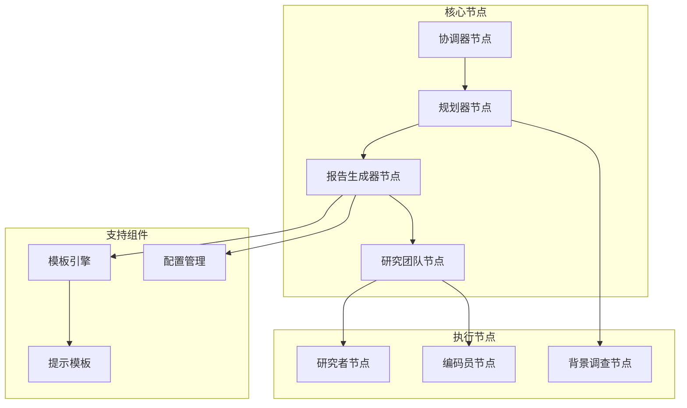
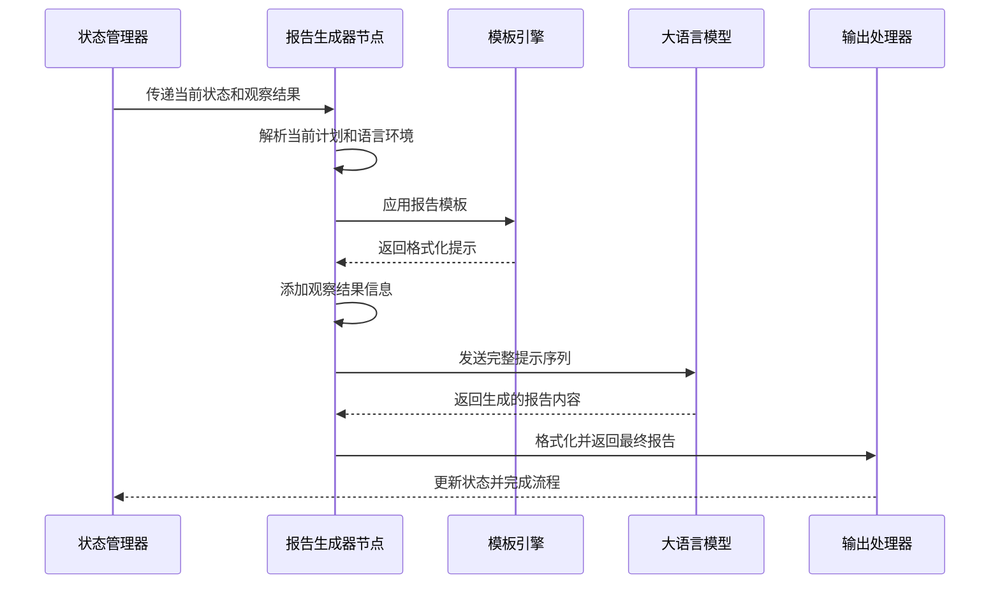
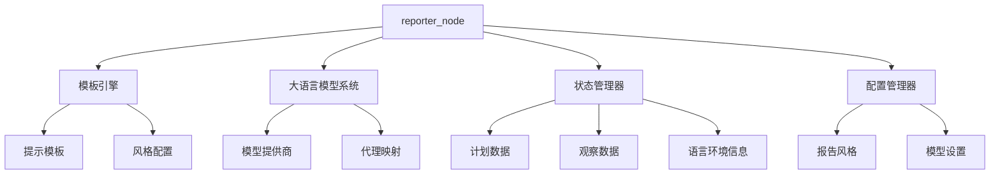

# 报告生成器节点

<cite>
**本文档中引用的文件**
- [src/graph/nodes.py](file://src/graph/nodes.py)
- [src/prompts/template.py](file://src/prompts/template.py)
- [src/prompts/reporter.md](file://src/prompts/reporter.md)
- [src/config/report_style.py](file://src/config/report_style.py)
- [src/graph/builder.py](file://src/graph/builder.py)
- [examples/openai_sora_report.md](file://examples/openai_sora_report.md)
- [tests/integration/test_nodes.py](file://tests/integration/test_nodes.py)
</cite>

## 目录
1. [简介](#简介)
2. [项目结构](#项目结构)
3. [核心组件](#核心组件)
4. [架构概览](#架构概览)
5. [详细组件分析](#详细组件分析)
6. [依赖关系分析](#依赖关系分析)
7. [性能考虑](#性能考虑)
8. [故障排除指南](#故障排除指南)
9. [结论](#结论)

## 简介

reporter_node 是 deer-flow 智能研究系统中的核心组件，负责整合来自研究者、编码员等节点的分散信息，利用大语言模型生成结构完整、逻辑清晰的最终研究报告。该节点通过应用预定义的报告模板，确保输出格式的一致性和专业性，同时具备处理多源信息融合、消除矛盾、保持叙述连贯性的能力。

reporter_node 在整个研究流程中扮演着最终整合者的角色，它不仅需要处理来自不同来源的信息，还要确保生成的报告符合特定的格式要求和质量标准。该节点的设计体现了现代人工智能系统中信息整合和内容生成的最佳实践。

## 项目结构

deer-flow 项目采用模块化的架构设计，reporter_node 位于核心的图结构中，与其他节点协同工作完成复杂的智能研究任务。



**图表来源**
- [src/graph/builder.py](file://src/graph/builder.py#L25-L50)
- [src/graph/nodes.py](file://src/graph/nodes.py#L263-L277)

**章节来源**
- [src/graph/builder.py](file://src/graph/builder.py#L1-L88)
- [src/graph/nodes.py](file://src/graph/nodes.py#L1-L512)

## 核心组件

reporter_node 的实现基于以下核心组件：

### 1. 状态管理
reporter_node 接收包含当前计划（current_plan）和观察结果（observations）的状态对象，这些状态信息包含了整个研究过程中的关键数据。

### 2. 提示模板系统
通过 src/prompts/template.py 中的 apply_prompt_template 函数，reporter_node 能够动态地应用预定义的报告模板，确保输出格式的一致性。

### 3. 多语言支持
reporter_node 支持多种报告风格和语言环境，能够根据用户偏好生成相应格式的报告。

### 4. 观察结果集成
节点能够整合来自研究团队各个成员的观察结果，形成完整的知识体系。

**章节来源**
- [src/graph/nodes.py](file://src/graph/nodes.py#L263-L277)
- [src/prompts/template.py](file://src/prompts/template.py#L35-L67)

## 架构概览

reporter_node 在 deer-flow 系统的整体架构中处于关键位置，作为信息整合和最终输出的枢纽。



**图表来源**
- [src/graph/nodes.py](file://src/graph/nodes.py#L263-L277)
- [src/prompts/template.py](file://src/prompts/template.py#L35-L67)

## 详细组件分析

### reporter_node 函数实现

reporter_node 是一个专门用于生成最终研究报告的函数，其核心功能包括：

#### 输入参数处理
```python
def reporter_node(state: State, config: RunnableConfig):
    """Reporter node that write a final report."""
    logger.info("Reporter write final report")
    configurable = Configuration.from_runnable_config(config)
    current_plan = state.get("current_plan")
    input_ = {
        "messages": [
            HumanMessage(
                f"# Research Requirements\n\n## Task\n\n{current_plan.title}\n\n## Description\n\n{current_plan.thought}"
            )
        ],
        "locale": state.get("locale", "en-US"),
    }
```

该函数接收两个主要参数：
- **state**: 包含当前研究状态的对象，包括计划和观察结果
- **config**: 可配置的运行时参数，用于控制生成行为

#### 提示模板应用
reporter_node 使用 apply_prompt_template 函数来应用预定义的报告模板：

```python
invoke_messages = apply_prompt_template("reporter", input_, configurable)
observations = state.get("observations", [])
```

#### 观察结果集成
节点会将所有观察结果添加到提示消息中：

```python
for observation in observations:
    invoke_messages.append(
        HumanMessage(
            content=f"Below are some observations for the research task:\n\n{observation}",
            name="observation",
        )
    )
```

#### 报告格式化提醒
为了确保报告质量，节点会添加重要的格式化指导：

```python
invoke_messages.append(
    HumanMessage(
        content="IMPORTANT: Structure your report according to the format in the prompt...",
        name="system",
    )
)
```

#### 大语言模型调用
最后，reporter_node 调用配置的大语言模型来生成最终报告：

```python
response = get_llm_by_type(AGENT_LLM_MAP["reporter"]).invoke(invoke_messages)
response_content = response.content
return {"final_report": response_content}
```

**章节来源**
- [src/graph/nodes.py](file://src/graph/nodes.py#L263-L277)

### 报告模板系统

reporter_node 依赖于强大的模板系统来确保输出格式的一致性：

#### 模板加载机制
```python
def get_prompt_template(prompt_name: str) -> str:
    """
    Load and return a prompt template using Jinja2.
    """
    try:
        template = env.get_template(f"{prompt_name}.md")
        return template.render()
    except Exception as e:
        raise ValueError(f"Error loading template {prompt_name}: {e}")
```

#### 动态变量替换
apply_prompt_template 函数能够动态替换模板中的变量：

```python
def apply_prompt_template(
    prompt_name: str, state: AgentState, configurable: Configuration = None
) -> list:
    state_vars = {
        "CURRENT_TIME": datetime.now().strftime("%a %b %d %Y %H:%M:%S %z"),
        **state,
    }
    if configurable:
        state_vars.update(dataclasses.asdict(configurable))
    
    template = env.get_template(f"{prompt_name}.md")
    system_prompt = template.render(**state_vars)
    return [{"role": "system", "content": system_prompt}] + state["messages"]
```

**章节来源**
- [src/prompts/template.py](file://src/prompts/template.py#L20-L67)

### 报告风格配置

deer-flow 支持多种报告风格，每种风格都有其特定的格式和语气：

#### 报告风格枚举
```python
class ReportStyle(enum.Enum):
    ACADEMIC = "academic"
    POPULAR_SCIENCE = "popular_science"
    NEWS = "news"
    SOCIAL_MEDIA = "social_media"
```

#### 风格特定的提示模板
reporter.md 文件包含了针对不同风格的详细指导：

- **学术风格**: 强调严谨的研究方法和理论框架
- **科普风格**: 注重故事讲述和概念普及
- **新闻风格**: 遵循传统新闻报道的结构和语言
- **社交媒体风格**: 适合快速传播和互动

**章节来源**
- [src/config/report_style.py](file://src/config/report_style.py#L1-L9)
- [src/prompts/reporter.md](file://src/prompts/reporter.md#L1-L280)

### 测试和验证

reporter_node 经过全面的测试验证，确保其在各种场景下的可靠性：

#### 基本功能测试
```python
def test_reporter_node_basic(
    mock_state_reporter,
    patch_config_from_runnable_config_reporter,
    patch_apply_prompt_template_reporter,
    patch_human_message,
    patch_logger_reporter,
):
    with (
        patch("src.graph.nodes.AGENT_LLM_MAP", {"reporter": "basic"}),
        patch("src.graph.nodes.get_llm_by_type") as mock_get_llm,
    ):
        mock_llm = MagicMock()
        mock_llm.invoke.return_value = make_mock_llm_response_reporter(
            "Final Report Content"
        )
        mock_get_llm.return_value = mock_llm

        result = reporter_node(mock_state_reporter, MagicMock())
        assert isinstance(result, dict)
        assert "final_report" in result
        assert result["final_report"] == "Final Report Content"
```

#### 本地化支持测试
```python
def test_reporter_node_locale_default(
    patch_config_from_runnable_config_reporter,
    patch_apply_prompt_template_reporter,
    patch_human_message,
    patch_logger_reporter,
):
    # 如果缺少 locale，默认使用 "en-US"
    Plan = namedtuple("Plan", ["title", "thought"])
    state = {
        "current_plan": Plan(title="Test Title", thought="Test Thought"),
        # "locale" omitted
        "observations": [],
    }
    result = reporter_node(state, MagicMock())
    assert isinstance(result, dict)
    assert "final_report" in result
```

**章节来源**
- [tests/integration/test_nodes.py](file://tests/integration/test_nodes.py#L751-L862)

## 依赖关系分析

reporter_node 与其他组件之间存在复杂的依赖关系：



**图表来源**
- [src/graph/nodes.py](file://src/graph/nodes.py#L1-L20)
- [src/prompts/template.py](file://src/prompts/template.py#L1-L20)

**章节来源**
- [src/graph/nodes.py](file://src/graph/nodes.py#L1-L20)
- [src/prompts/template.py](file://src/prompts/template.py#L1-L20)

## 性能考虑

reporter_node 在设计时充分考虑了性能优化：

### 1. 内存管理
- 合理使用 Python 的内存管理机制
- 及时释放不需要的数据结构
- 避免内存泄漏

### 2. 并发处理
- 支持异步操作以提高响应速度
- 合理设置递归限制避免栈溢出

### 3. 缓存策略
- 缓存常用的模板和配置
- 避免重复的文件读取操作

### 4. 错误处理
- 完善的异常处理机制
- 优雅降级和错误恢复策略

## 故障排除指南

### 常见问题及解决方案

#### 1. 模板加载失败
**症状**: 报告生成过程中出现模板加载错误
**原因**: 模板文件缺失或路径配置错误
**解决方案**: 检查 templates 目录是否存在，确认文件权限

#### 2. 大语言模型调用失败
**症状**: LLM 调用超时或返回错误
**原因**: 网络连接问题或模型服务不可用
**解决方案**: 检查网络连接，验证模型配置

#### 3. 语言环境不匹配
**症状**: 生成的报告语言不符合预期
**原因**: locale 配置错误或未正确传递
**解决方案**: 确保 locale 参数正确设置

#### 4. 观察结果丢失
**症状**: 报告中缺少关键的观察结果信息
**原因**: 状态传递过程中数据丢失
**解决方案**: 检查状态管理器的完整性

**章节来源**
- [src/graph/nodes.py](file://src/graph/nodes.py#L263-L277)
- [tests/integration/test_nodes.py](file://tests/integration/test_nodes.py#L751-L862)

## 结论

reporter_node 作为 deer-flow 系统中的关键组件，成功实现了智能研究系统的最终报告生成功能。通过其精心设计的架构和强大的模板系统，reporter_node 能够：

1. **高效整合多源信息**: 从不同的研究节点收集和整合信息
2. **确保格式一致性**: 通过模板系统保证报告格式的专业性和一致性
3. **支持多种风格**: 适应不同受众和应用场景的需求
4. **提供高质量输出**: 生成结构清晰、内容丰富的研究报告
5. **具备良好的扩展性**: 易于添加新的报告风格和功能

该节点的设计体现了现代人工智能系统中信息整合和内容生成的最佳实践，为用户提供了一个强大而灵活的研究辅助工具。随着技术的不断发展，reporter_node 还可以在更多方面进行优化和扩展，以满足日益增长的智能研究需求。