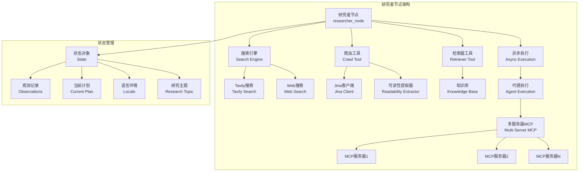
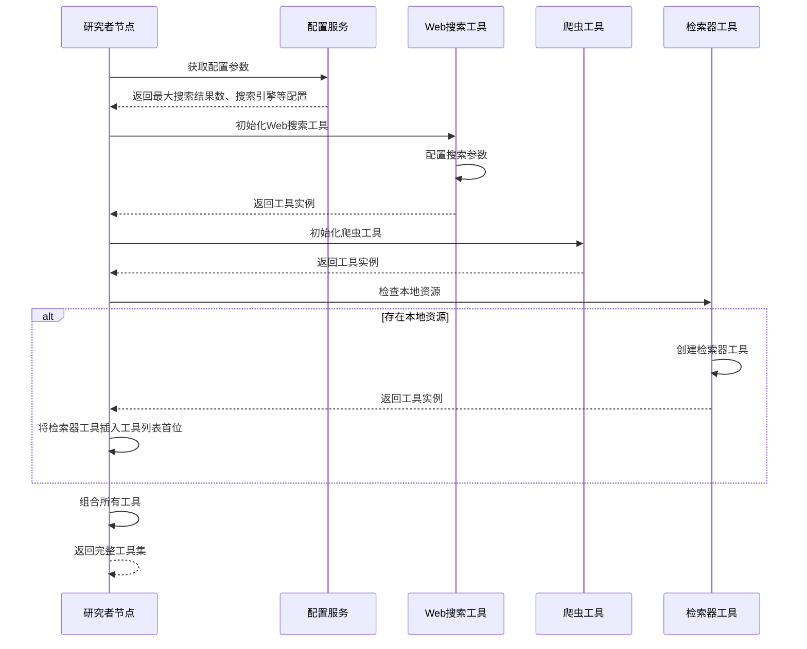
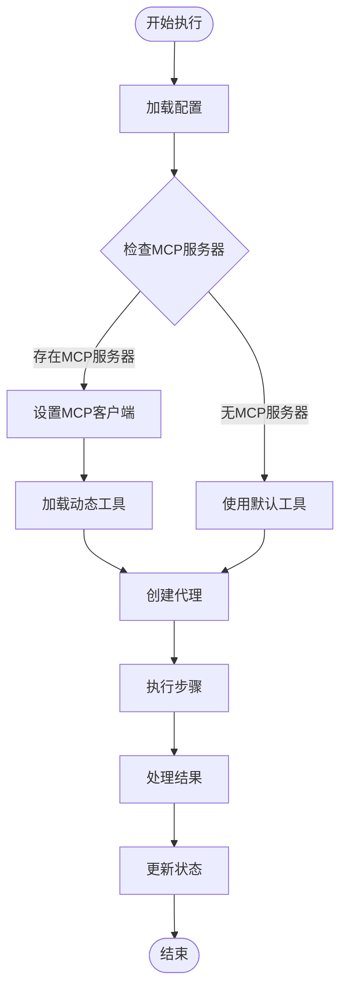
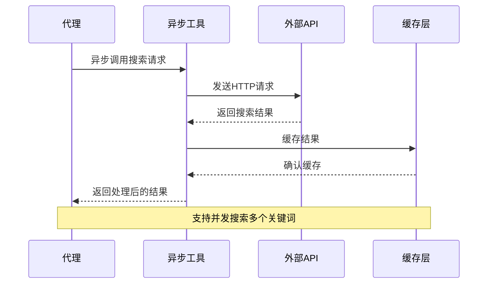
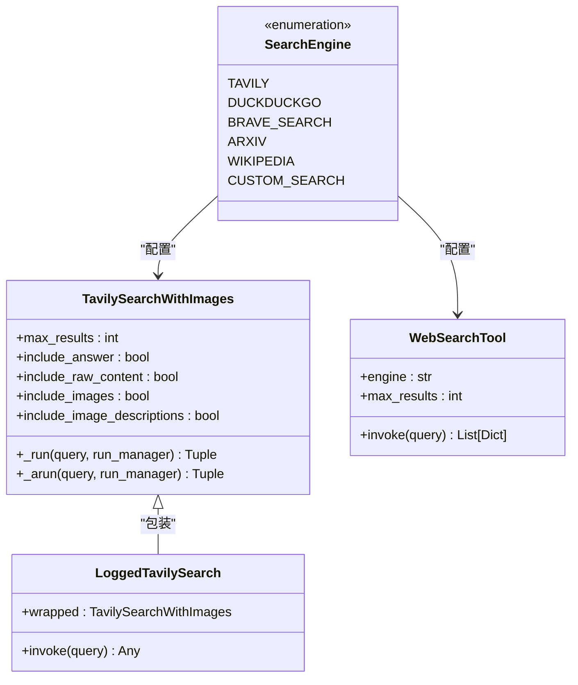
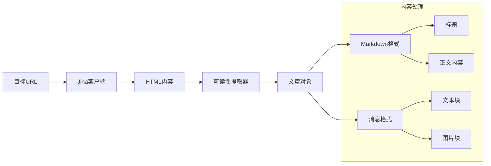
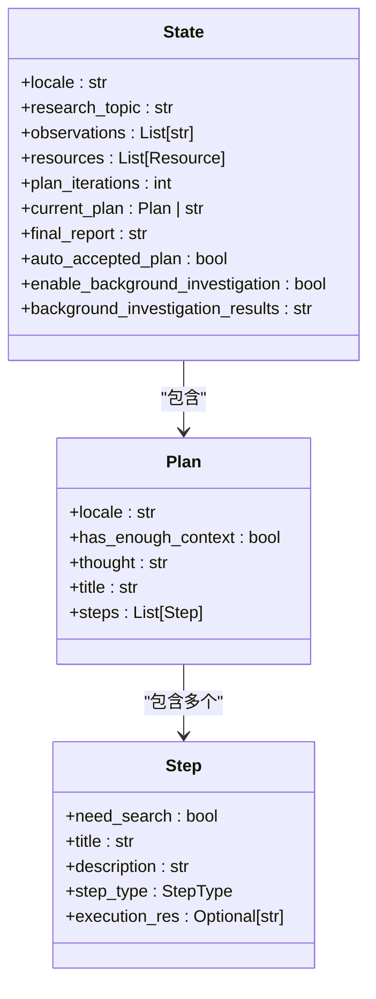
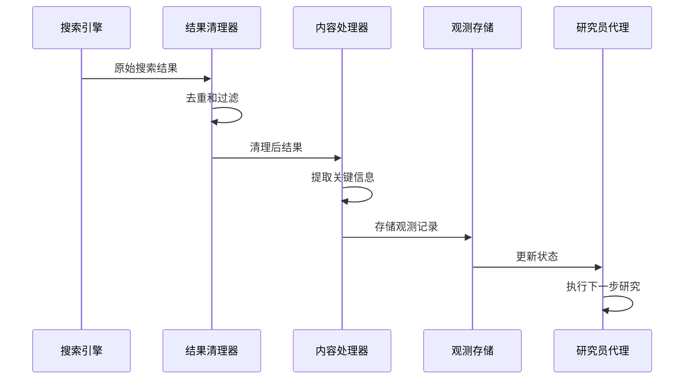
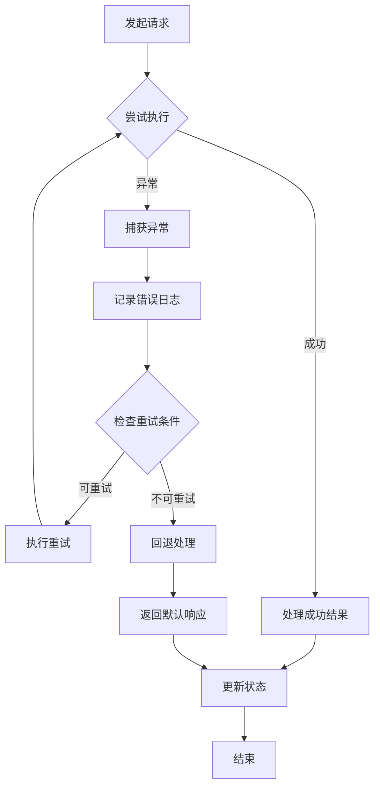

# 研究者节点深度解析

<cite>
**本文档引用的文件**
- [nodes.py](file://src/graph/nodes.py)
- [search.py](file://src/tools/search.py)
- [tavily_search_results_with_images.py](file://src/tools/tavily_search/tavily_search_results_with_images.py)
- [crawl.py](file://src/tools/crawl.py)
- [crawler.py](file://src/crawler/crawler.py)
- [article.py](file://src/crawler/article.py)
- [types.py](file://src/graph/types.py)
- [planner_model.py](file://src/prompts/planner_model.py)
- [researcher.md](file://src/prompts/researcher.md)
- [test_nodes.py](file://tests/integration/test_nodes.py)
</cite>

## 目录
1. [简介](#简介)
2. [架构概览](#架构概览)
3. [核心组件分析](#核心组件分析)
4. [异步执行机制](#异步执行机制)
5. [工具集成体系](#工具集成体系)
6. [数据流分析](#数据流分析)
7. [错误处理与重试机制](#错误处理与重试机制)
8. [性能优化策略](#性能优化策略)
9. [故障排除指南](#故障排除指南)
10. [总结](#总结)

## 简介

研究者节点（researcher_node）是 deer-flow 智能研究系统的核心组件之一，负责执行具体的信息检索任务。该节点通过调用 Tavily 搜索 API、网页爬取工具等外部资源，获取相关信息并进行处理。它在整个研究工作流中扮演着关键角色，负责从规划阶段到最终报告生成的中间环节。

研究者节点的主要职责包括：
- 执行基于计划的研究步骤
- 调用多种搜索工具获取信息
- 处理和结构化搜索结果
- 与规划者节点和报告生成器节点进行数据交互
- 支持多轮研究迭代和状态管理

## 架构概览

研究者节点采用模块化设计，通过依赖注入和工具链模式实现高度可扩展性。整个架构围绕 LangGraph 框架构建，支持异步执行和状态管理。



**图表来源**
- [nodes.py](file://src/graph/nodes.py#L480-L490)
- [search.py](file://src/tools/search.py#L40-L80)
- [crawler.py](file://src/crawler/crawler.py#L10-L25)

## 核心组件分析

### 研究者节点主函数

研究者节点的核心实现位于 `researcher_node` 函数中，该函数采用异步模式设计，支持动态工具加载和多服务器 MCP 集成。

```python
async def researcher_node(
    state: State, config: RunnableConfig
) -> Command[Literal["research_team"]]:
    """Researcher node that do research"""
    logger.info("Researcher node is researching.")
    configurable = Configuration.from_runnable_config(config)
    tools = [get_web_search_tool(configurable.max_search_results, configurable.search_engine, configurable.custom_search_repository), crawl_tool]
    retriever_tool = get_retriever_tool(state.get("resources", []))
    if retriever_tool:
        tools.insert(0, retriever_tool)
    logger.info(f"Researcher tools: {tools}")
    return await _setup_and_execute_agent_step(
        state,
        config,
        "researcher",
        tools,
    )
```

**节来源**
- [nodes.py](file://src/graph/nodes.py#L480-L490)

### 工具配置与初始化

研究者节点的工具配置是一个精心设计的过程，确保每个工具都能正确初始化并适配当前的研究需求。



**图表来源**
- [nodes.py](file://src/graph/nodes.py#L480-L490)
- [search.py](file://src/tools/search.py#L40-L80)

### 异步执行框架

研究者节点采用 `_setup_and_execute_agent_step` 辅助函数来处理复杂的异步执行逻辑，该函数支持 MCP 服务器集成和递归限制管理。



**图表来源**
- [nodes.py](file://src/graph/nodes.py#L400-L470)

**节来源**
- [nodes.py](file://src/graph/nodes.py#L400-L470)

## 异步执行机制

### 递归限制管理

研究者节点实现了智能的递归限制管理机制，通过环境变量和配置参数控制代理的最大递归深度。

```python
try:
    env_value_str = os.getenv("AGENT_RECURSION_LIMIT", str(default_recursion_limit))
    parsed_limit = int(env_value_str)

    if parsed_limit > 0:
        recursion_limit = parsed_limit
        logger.info(f"Recursion limit set to: {recursion_limit}")
    else:
        logger.warning(
            f"AGENT_RECURSION_LIMIT value '{env_value_str}' (parsed as {parsed_limit}) is not positive. "
            f"Using default value {default_recursion_limit}."
        )
        recursion_limit = default_recursion_limit
except ValueError:
    raw_env_value = os.getenv("AGENT_RECURSION_LIMIT")
    logger.warning(
        f"Invalid AGENT_RECURSION_LIMIT value: '{raw_env_value}'. "
        f"Using default value {default_recursion_limit}."
    )
    recursion_limit = default_recursion_limit
```

### 异步工具调用

研究者节点支持异步工具调用，特别是对于 Tavily 搜索 API 和爬虫工具的处理。



**图表来源**
- [tavily_search_results_with_images.py](file://src/tools/tavily_search/tavily_search_results_with_images.py#L120-L160)

**节来源**
- [nodes.py](file://src/graph/nodes.py#L350-L380)

## 工具集成体系

### 搜索引擎集成

研究者节点支持多种搜索引擎的无缝集成，通过统一的接口抽象层实现不同搜索引擎的切换。



**图表来源**
- [search.py](file://src/tools/search.py#L20-L80)
- [tavily_search_results_with_images.py](file://src/tools/tavily_search/tavily_search_results_with_images.py#L20-L60)

### 网页爬取系统

研究者节点集成了强大的网页爬取系统，能够自动提取页面内容并转换为结构化的 Markdown 格式。



**图表来源**
- [crawler.py](file://src/crawler/crawler.py#L10-L25)
- [article.py](file://src/crawler/article.py#L10-L35)

**节来源**
- [crawl.py](file://src/tools/crawl.py#L15-L25)
- [crawler.py](file://src/crawler/crawler.py#L10-L25)
- [article.py](file://src/crawler/article.py#L10-L35)

## 数据流分析

### 状态管理机制

研究者节点通过复杂的状态管理系统维护研究过程中的所有关键信息。



**图表来源**
- [types.py](file://src/graph/types.py#L10-L25)
- [planner_model.py](file://src/prompts/planner_model.py#L20-L40)

### 数据处理管道

研究者节点实现了完整的数据处理管道，从原始搜索结果到结构化输出。



**图表来源**
- [nodes.py](file://src/graph/nodes.py#L480-L490)
- [search.py](file://src/tools/search.py#L80-L110)

**节来源**
- [types.py](file://src/graph/types.py#L10-L25)
- [planner_model.py](file://src/prompts/planner_model.py#L20-L40)

## 错误处理与重试机制

### 搜索结果验证

研究者节点实现了严格的搜索结果验证机制，确保数据质量和系统稳定性。

```python
# 搜索结果去重和验证
if isinstance(searched_content, tuple):
    searched_content = searched_content[0]
if isinstance(searched_content, list):
    background_investigation_results = [
        f"## {elem['title']}\n\n{elem['content']}" for elem in searched_content
    ]
    return {
        "background_investigation_results": "\n\n".join(
            background_investigation_results
        )
    }
else:
    logger.error(
        f"Tavily search returned malformed response: {searched_content}"
    )
```

### 异常处理策略

研究者节点采用多层次的异常处理策略，确保系统在遇到问题时能够优雅降级。



**图表来源**
- [nodes.py](file://src/graph/nodes.py#L40-L60)

**节来源**
- [nodes.py](file://src/graph/nodes.py#L40-L60)

## 性能优化策略

### 并发处理优化

研究者节点通过异步编程模型实现高效的并发处理，特别是在搜索和爬取操作中。

### 缓存机制

系统实现了多层缓存机制，减少重复的外部 API 调用，提高响应速度。

### 资源管理

通过合理的资源管理和连接池配置，确保系统在高负载情况下的稳定性。

## 故障排除指南

### 常见问题诊断

1. **搜索结果为空**
   - 检查 API 密钥配置
   - 验证网络连接
   - 确认搜索参数有效性

2. **爬取失败**
   - 检查目标网站可访问性
   - 验证 URL 格式
   - 查看爬取频率限制

3. **代理执行超时**
   - 调整递归限制设置
   - 检查代理配置
   - 优化工具选择

### 调试技巧

- 启用详细日志记录
- 使用状态检查点
- 监控资源使用情况
- 分析性能瓶颈

**节来源**
- [nodes.py](file://src/graph/nodes.py#L350-L380)

## 总结

研究者节点作为 deer-flow 系统的核心组件，展现了现代 AI 应用程序的设计精髓。通过模块化架构、异步执行、工具集成和状态管理，它实现了高效、可靠的信息检索功能。

主要特点包括：

1. **高度可扩展性**：支持多种搜索引擎和动态工具加载
2. **异步处理能力**：充分利用现代硬件资源，提高处理效率
3. **智能状态管理**：维护完整的研究过程状态，支持多轮迭代
4. **健壮的错误处理**：多层次异常处理确保系统稳定性
5. **灵活的配置选项**：支持环境变量和运行时配置调整

研究者节点不仅是一个技术实现，更是现代 AI 研究工作流的重要基础设施，为用户提供专业、可靠的信息检索服务。