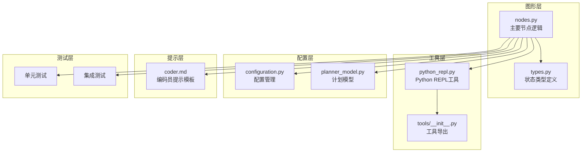
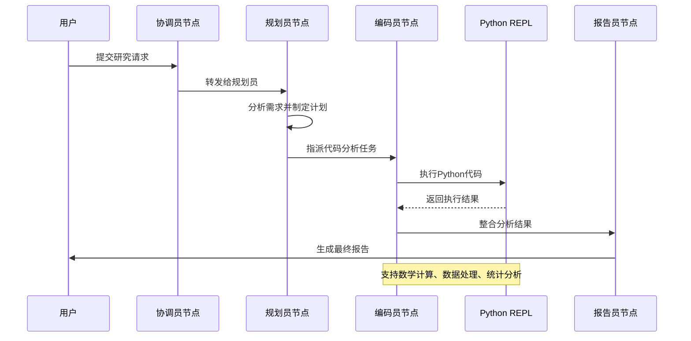
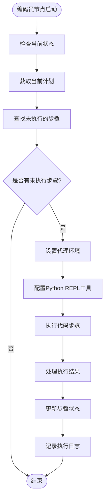
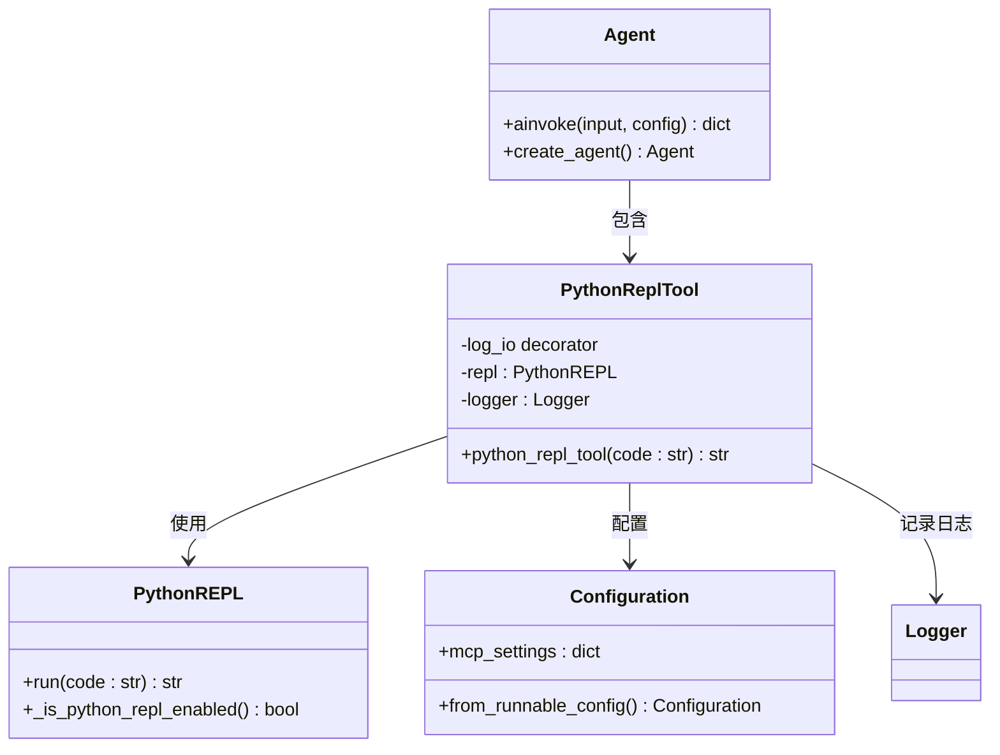
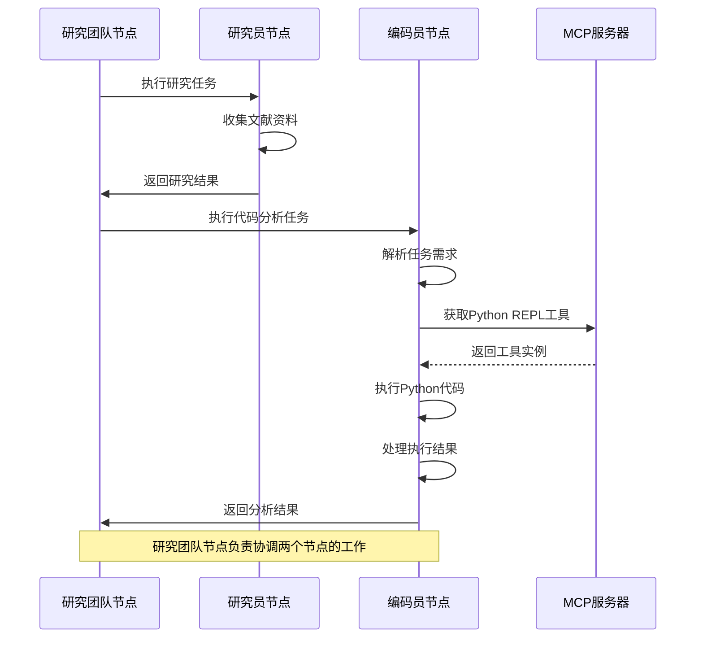
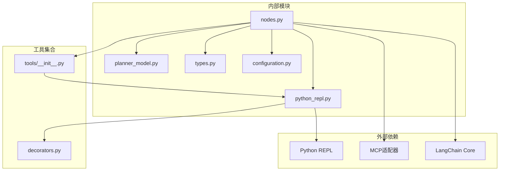

# 编码员节点

<cite>
**本文档引用的文件**
- [src/graph/nodes.py](file://src/graph/nodes.py)
- [src/tools/python_repl.py](file://src/tools/python_repl.py)
- [src/prompts/coder.md](file://src/prompts/coder.md)
- [src/config/configuration.py](file://src/config/configuration.py)
- [src/graph/types.py](file://src/graph/types.py)
- [src/prompts/planner_model.py](file://src/prompts/planner_model.py)
- [tests/integration/test_nodes.py](file://tests/integration/test_nodes.py)
</cite>

## 目录
1. [简介](#简介)
2. [项目结构](#项目结构)
3. [核心组件](#核心组件)
4. [架构概览](#架构概览)
5. [详细组件分析](#详细组件分析)
6. [依赖关系分析](#依赖关系分析)
7. [性能考虑](#性能考虑)
8. [故障排除指南](#故障排除指南)
9. [结论](#结论)

## 简介

编码员节点（Coder Node）是Deer Flow研究系统中的关键组件，专门负责执行代码分析和生成任务。该节点能够解析用户需求，生成可执行的Python代码来解决数学问题、进行数据处理、执行统计分析等任务。编码员节点通过安全的Python REPL环境执行代码，处理输入输出、异常和安全性问题，并将分析结论整合到整个研究流程中。

编码员节点的核心功能包括：
- 解析用户需求并生成相应的Python代码
- 安全地执行Python代码以完成数据分析任务
- 处理代码执行过程中的各种异常情况
- 将执行结果整合到研究流程中
- 与其他节点（如研究员节点、报告生成器节点）协作

## 项目结构

编码员节点在项目中的组织结构如下：



**图表来源**
- [src/graph/nodes.py](file://src/graph/nodes.py#L1-L512)
- [src/tools/python_repl.py](file://src/tools/python_repl.py#L1-L64)
- [src/graph/types.py](file://src/graph/types.py#L1-L25)

**章节来源**
- [src/graph/nodes.py](file://src/graph/nodes.py#L1-L512)
- [src/tools/python_repl.py](file://src/tools/python_repl.py#L1-L64)

## 核心组件

### 编码员节点函数

编码员节点的核心实现位于`coder_node`函数中，该函数负责协调整个代码执行流程：

```python
async def coder_node(
    state: State, config: RunnableConfig
) -> Command[Literal["research_team"]]:
    """Coder node that do code analysis."""
    logger.info("Coder node is coding.")
    return await _setup_and_execute_agent_step(
        state,
        config,
        "coder",
        [python_repl_tool],
    )
```

### Python REPL工具

Python REPL工具提供了安全的代码执行环境：

```python
@tool
@log_io
def python_repl_tool(
    code: Annotated[
        str, "The python code to execute to do further analysis or calculation."
    ],
):
    """Use this to execute python code and do data analysis or calculation."""
    
    if not _is_python_repl_enabled():
        error_msg = "Python REPL tool is disabled. Please enable it in environment configuration."
        return f"Tool disabled: {error_msg}"
    
    if not isinstance(code, str):
        error_msg = f"Invalid input: code must be a string, got {type(code)}"
        return f"Error executing code:\n```python\n{code}\n```\nError: {error_msg}"
    
    try:
        result = repl.run(code)
        if isinstance(result, str) and ("Error" in result or "Exception" in result):
            return f"Error executing code:\n```python\n{code}\n```\nError: {result}"
        return f"Successfully executed:\n```python\n{code}\n```\nStdout: {result}"
    except BaseException as e:
        return f"Error executing code:\n```python\n{code}\n```\nError: {repr(e)}"
```

**章节来源**
- [src/graph/nodes.py](file://src/graph/nodes.py#L500-L512)
- [src/tools/python_repl.py](file://src/tools/python_repl.py#L29-L63)

## 架构概览

编码员节点在整个研究系统中的架构位置和交互关系：



**图表来源**
- [src/graph/nodes.py](file://src/graph/nodes.py#L100-L150)
- [src/graph/nodes.py](file://src/graph/nodes.py#L500-L512)

## 详细组件分析

### 编码员节点工作流程

编码员节点的工作流程包含以下关键步骤：



**图表来源**
- [src/graph/nodes.py](file://src/graph/nodes.py#L500-L512)
- [src/graph/nodes.py](file://src/graph/nodes.py#L350-L450)

### Python REPL沙箱机制

Python REPL工具实现了安全的代码执行沙箱：



**图表来源**
- [src/tools/python_repl.py](file://src/tools/python_repl.py#L29-L63)
- [src/config/configuration.py](file://src/config/configuration.py#L40-L70)

### 代码执行安全机制

编码员节点实现了多层安全机制来确保代码执行的安全性：

1. **环境变量控制**：通过`ENABLE_PYTHON_REPL`环境变量控制是否启用Python REPL
2. **输入验证**：严格验证传入的代码参数类型
3. **异常处理**：捕获所有可能的异常并提供友好的错误信息
4. **结果验证**：检查执行结果是否包含错误信息

```python
def _is_python_repl_enabled() -> bool:
    """Check if Python REPL tool is enabled from configuration."""
    env_enabled = os.getenv("ENABLE_PYTHON_REPL", "false").lower()
    if env_enabled in ("true", "1", "yes", "on"):
        return True
    return False

@tool
@log_io
def python_repl_tool(code: str):
    if not _is_python_repl_enabled():
        return "Tool disabled: Python REPL tool is disabled."
    
    if not isinstance(code, str):
        return f"Error: code must be a string, got {type(code)}"
    
    try:
        result = repl.run(code)
        if isinstance(result, str) and ("Error" in result or "Exception" in result):
            return f"Error executing code:\n```python\n{code}\n```\nError: {result}"
        return f"Successfully executed:\n```python\n{code}\n```\nStdout: {result}"
    except BaseException as e:
        return f"Error executing code:\n```python\n{code}\n```\nError: {repr(e)}"
```

**章节来源**
- [src/tools/python_repl.py](file://src/tools/python_repl.py#L15-L63)

### 与研究者节点的协作

编码员节点与研究者节点协同工作，形成完整的研究团队：



**图表来源**
- [src/graph/nodes.py](file://src/graph/nodes.py#L450-L512)
- [src/graph/nodes.py](file://src/graph/nodes.py#L350-L450)

### 数据传递格式

编码员节点在不同阶段的数据传递遵循特定的格式：

#### 状态对象结构

```python
class State(MessagesState):
    locale: str = "en-US"
    research_topic: str = ""
    observations: list[str] = []
    resources: list[Resource] = []
    plan_iterations: int = 0
    current_plan: Plan | str = None
    final_report: str = ""
    auto_accepted_plan: bool = False
    enable_background_investigation: bool = True
    background_investigation_results: str = None
```

#### 计划模型结构

```python
class Plan(BaseModel):
    locale: str
    has_enough_context: bool
    thought: str
    title: str
    steps: List[Step] = Field(default_factory=list)

class Step(BaseModel):
    need_search: bool
    title: str
    description: str
    step_type: StepType
    execution_res: Optional[str] = None
```

**章节来源**
- [src/graph/types.py](file://src/graph/types.py#L8-L24)
- [src/prompts/planner_model.py](file://src/prompts/planner_model.py#L20-L58)

## 依赖关系分析

编码员节点的依赖关系图展示了其与其他组件的交互：



**图表来源**
- [src/graph/nodes.py](file://src/graph/nodes.py#L1-L30)
- [src/tools/python_repl.py](file://src/tools/python_repl.py#L1-L20)

**章节来源**
- [src/graph/nodes.py](file://src/graph/nodes.py#L1-L30)
- [src/tools/python_repl.py](file://src/tools/python_repl.py#L1-L20)

## 性能考虑

### 递归限制配置

编码员节点支持通过环境变量配置递归限制：

```python
def get_recursion_limit(default: int = 25) -> int:
    """Get the recursion limit from environment variable or use default."""
    env_value_str = get_str_env("AGENT_RECURSION_LIMIT", str(default))
    parsed_limit = get_int_env("AGENT_RECURSION_LIMIT", default)

    if parsed_limit > 0:
        logger.info(f"Recursion limit set to: {parsed_limit}")
        return parsed_limit
    else:
        logger.warning(f"Invalid recursion limit value: {env_value_str}")
        return default
```

### 并发执行优化

编码员节点采用异步执行模式，支持并发处理多个代码分析任务：

```python
async def _setup_and_execute_agent_step(
    state: State,
    config: RunnableConfig,
    agent_type: str,
    default_tools: list,
) -> Command[Literal["research_team"]]:
    """Helper function to set up an agent with appropriate tools and execute a step."""
    configurable = Configuration.from_runnable_config(config)
    # ... 异步执行逻辑 ...
```

## 故障排除指南

### 常见问题及解决方案

1. **Python REPL工具禁用**
   - 检查环境变量`ENABLE_PYTHON_REPL`是否设置为`true`
   - 确保Python REPL工具已正确导入

2. **代码执行失败**
   - 验证传入的代码字符串格式是否正确
   - 检查代码中是否存在语法错误或运行时异常
   - 查看日志文件获取详细的错误信息

3. **权限问题**
   - 确保Python REPL有适当的文件系统访问权限
   - 检查网络连接是否正常（如果需要）

4. **内存不足**
   - 调整递归限制设置
   - 优化代码以减少内存使用

**章节来源**
- [src/tools/python_repl.py](file://src/tools/python_repl.py#L15-L25)
- [src/config/configuration.py](file://src/config/configuration.py#L20-L40)

## 结论

编码员节点是Deer Flow研究系统中的重要组成部分，它通过安全的Python REPL环境为用户提供强大的代码分析能力。该节点具有以下特点：

1. **安全性优先**：通过多层安全机制确保代码执行的安全性
2. **灵活配置**：支持通过环境变量和配置文件进行灵活配置
3. **异步执行**：采用异步模式提高执行效率
4. **错误处理**：完善的异常处理机制保证系统的稳定性
5. **协作能力**：与其他节点良好协作，形成完整的研究流程

编码员节点为研究系统提供了强大的编程分析能力，使用户能够轻松地进行复杂的数学计算、数据分析和代码生成任务。通过合理的架构设计和安全机制，该节点能够在保证安全性的前提下提供高效的代码执行服务。