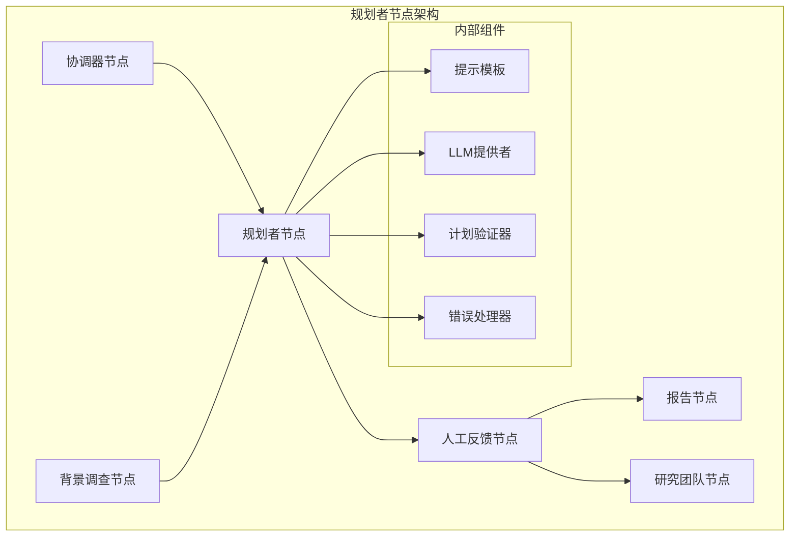
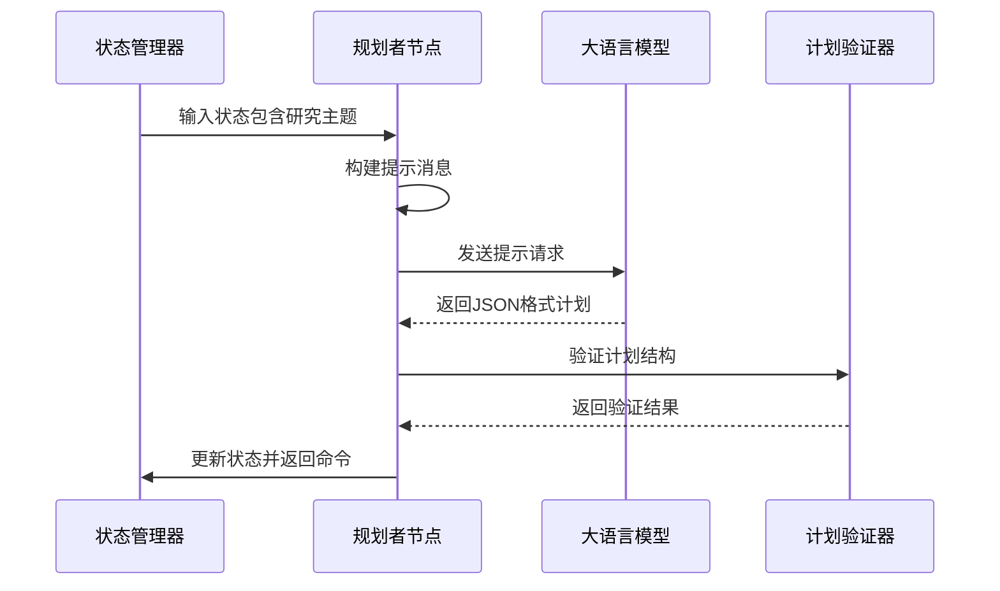
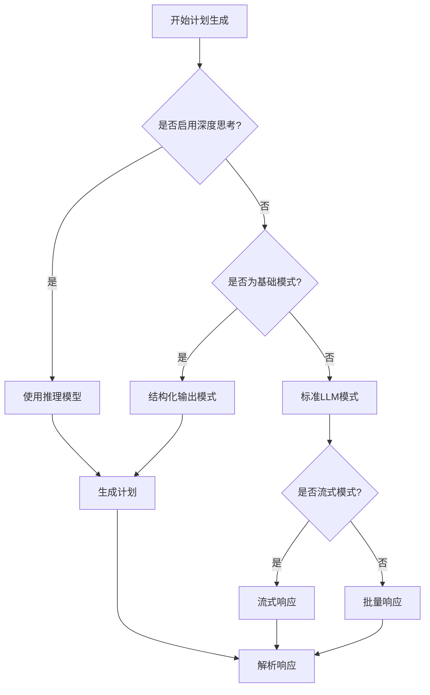
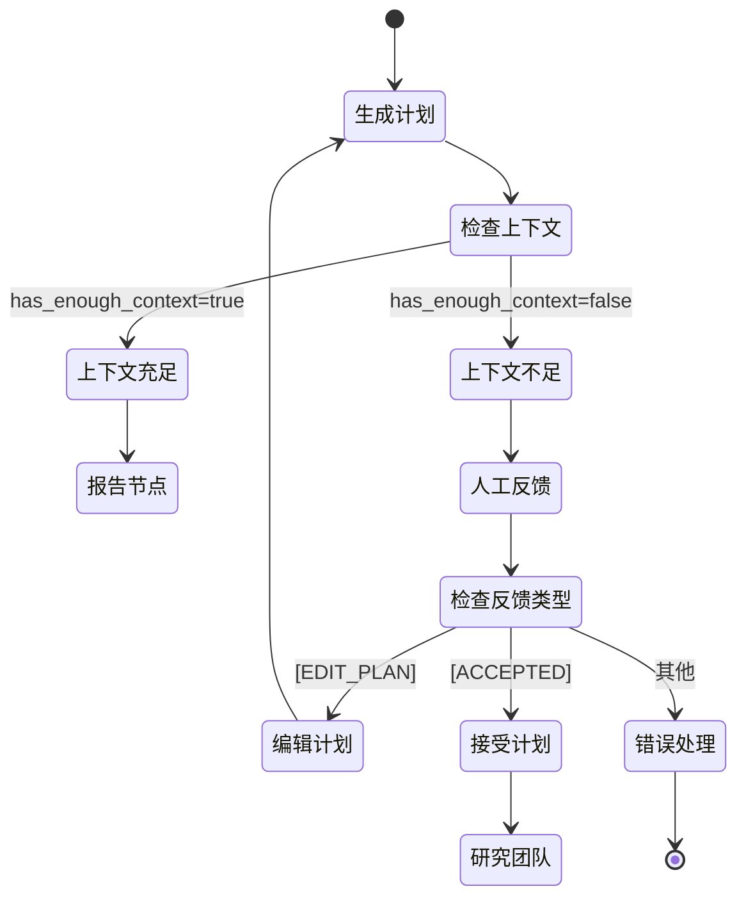
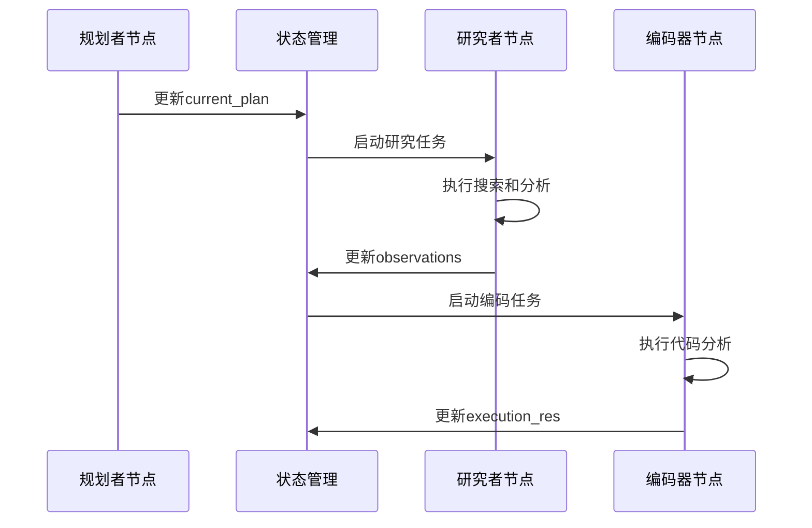

# 规划者节点

<cite>
**本文档引用的文件**
- [src/graph/nodes.py](file://src/graph/nodes.py)
- [src/prompts/planner.md](file://src/prompts/planner.md)
- [src/prompts/planner_model.py](file://src/prompts/planner_model.py)
- [src/config/configuration.py](file://src/config/configuration.py)
- [src/graph/types.py](file://src/graph/types.py)
- [src/tools/search.py](file://src/tools/search.py)
- [tests/integration/test_nodes.py](file://tests/integration/test_nodes.py)
</cite>

## 目录
1. [简介](#简介)
2. [核心架构](#核心架构)
3. [规划者节点详细分析](#规划者节点详细分析)
4. [提示工程与模型交互](#提示工程与模型交互)
5. [迭代优化机制](#迭代优化机制)
6. [错误处理与容错机制](#错误处理与容错机制)
7. [与其他节点的交互](#与其他节点的交互)
8. [性能考虑](#性能考虑)
9. [故障排除指南](#故障排除指南)
10. [结论](#结论)

## 简介

规划者节点（planner_node）是deer-flow研究系统的核心组件之一，负责接收协调器传递的研究任务需求，利用大语言模型生成结构化的研究计划。该节点能够将复杂的研究问题分解为可执行的研究步骤，确定每个步骤所需的数据类型，并将生成的计划传递给后续的执行节点。

规划者节点采用迭代优化策略，在生成初始计划后会根据用户反馈进行调整，确保最终的研究计划既全面又具体。它支持多种输出格式，包括JSON结构化数据和流式响应，能够适应不同的LLM配置和使用场景。

## 核心架构



**图表来源**
- [src/graph/nodes.py](file://src/graph/nodes.py#L84-L119)
- [src/graph/nodes.py](file://src/graph/nodes.py#L121-L150)

**章节来源**
- [src/graph/nodes.py](file://src/graph/nodes.py#L1-L50)
- [src/graph/types.py](file://src/graph/types.py#L1-L25)

## 规划者节点详细分析

### 节点功能概述

规划者节点的主要职责包括：

1. **任务解析**：从状态中提取研究主题和背景信息
2. **提示构建**：应用规划者提示模板生成对话消息
3. **LLM交互**：调用适当的LLM模型生成计划
4. **结果处理**：解析JSON响应并验证计划完整性
5. **决策路由**：根据计划状态决定下一步执行路径

### 输入输出格式



**图表来源**
- [src/graph/nodes.py](file://src/graph/nodes.py#L84-L119)
- [src/prompts/planner_model.py](file://src/prompts/planner_model.py#L1-L59)

### 关键实现细节

规划者节点的核心实现逻辑如下：

```python
def planner_node(
    state: State, config: RunnableConfig
) -> Command[Literal["human_feedback", "reporter"]]:
    """Planner node that generate the full plan."""
    logger.info("Planner generating full plan")
    configurable = Configuration.from_runnable_config(config)
    plan_iterations = state["plan_iterations"] if state.get("plan_iterations", 0) else 0
    messages = apply_prompt_template("planner", state, configurable)
```

**章节来源**
- [src/graph/nodes.py](file://src/graph/nodes.py#L84-L119)

## 提示工程与模型交互

### 提示模板设计

规划者节点使用专门设计的提示模板来指导LLM生成高质量的研究计划。模板包含以下关键要素：

1. **角色定位**：明确规划者的专业身份和职责
2. **标准要求**：定义信息质量和数量的标准
3. **分析框架**：提供系统性的分析维度
4. **输出格式**：规范JSON结构和字段要求

### 模型选择策略



**图表来源**
- [src/graph/nodes.py](file://src/graph/nodes.py#L95-L105)

### 提示模板内容分析

提示模板包含了详细的指导原则：

- **信息量标准**：要求全面覆盖话题的所有方面
- **深度要求**：需要详细的数据点和事实证据
- **数量要求**：收集充足的信息而非仅仅足够
- **分析框架**：涵盖历史、现状、未来、利益相关者等多个维度

**章节来源**
- [src/prompts/planner.md](file://src/prompts/planner.md#L1-L188)

## 迭代优化机制

### 迭代控制逻辑

规划者节点实现了完善的迭代优化机制：

```python
# 如果计划迭代次数超过最大限制，直接跳转到报告节点
if plan_iterations >= configurable.max_plan_iterations:
    return Command(goto="reporter")

# 处理JSON解析错误的迭代策略
try:
    curr_plan = json.loads(repair_json_output(full_response))
except json.JSONDecodeError:
    logger.warning("Planner response is not a valid JSON")
    if plan_iterations > 0:
        return Command(goto="reporter")
    else:
        return Command(goto="__end__")
```

### 用户反馈集成



**图表来源**
- [src/graph/nodes.py](file://src/graph/nodes.py#L121-L150)
- [src/graph/nodes.py](file://src/graph/nodes.py#L152-L200)

**章节来源**
- [src/graph/nodes.py](file://src/graph/nodes.py#L105-L120)
- [src/graph/nodes.py](file://src/graph/nodes.py#L152-L200)

## 错误处理与容错机制

### JSON解析错误处理

规划者节点实现了多层次的错误处理机制：

1. **首次迭代错误**：如果在第一次迭代中出现JSON解析错误，直接终止流程
2. **后续迭代错误**：如果在多次迭代中出现错误，转向报告节点
3. **响应修复**：使用`repair_json_output`函数尝试修复不完整的JSON响应

### 配置验证

```python
# 配置参数验证
if plan_iterations >= configurable.max_plan_iterations:
    return Command(goto="reporter")

# JSON解析异常处理
try:
    curr_plan = json.loads(repair_json_output(full_response))
except json.JSONDecodeError:
    logger.warning("Planner response is not a valid JSON")
    if plan_iterations > 0:
        return Command(goto="reporter")
    else:
        return Command(goto="__end__")
```

**章节来源**
- [src/graph/nodes.py](file://src/graph/nodes.py#L105-L120)
- [src/graph/nodes.py](file://src/graph/nodes.py#L121-L150)

## 与其他节点的交互

### 协调器节点交互

协调器节点通过工具调用向规划者节点发送任务：

```python
response = (
    get_llm_by_type(AGENT_LLM_MAP["coordinator"])
    .bind_tools([handoff_to_planner])
    .invoke(messages)
)

if len(response.tool_calls) > 0:
    goto = "planner"
    if state.get("enable_background_investigation"):
        goto = "background_investigator"
```

### 研究团队节点协作

规划者节点生成的计划会被传递给研究团队节点，后者负责执行具体的搜索和分析任务：



**图表来源**
- [src/graph/nodes.py](file://src/graph/nodes.py#L202-L250)
- [src/graph/nodes.py](file://src/graph/nodes.py#L450-L511)

**章节来源**
- [src/graph/nodes.py](file://src/graph/nodes.py#L152-L200)
- [src/graph/nodes.py](file://src/graph/nodes.py#L202-L250)

## 性能考虑

### LLM调用优化

规划者节点在LLM调用方面采用了多种优化策略：

1. **模型选择**：根据配置自动选择最适合的LLM模型
2. **输出格式**：在基础模式下使用结构化输出以提高准确性
3. **流式处理**：支持流式响应以提升用户体验
4. **资源管理**：合理控制内存使用和计算资源

### 配置参数影响

```python
# 关键配置参数及其影响
max_plan_iterations: int = 1  # 最大计划迭代次数
max_step_num: int = 3  # 计划中的最大步骤数
enable_deep_thinking: bool = False  # 是否启用深度思考模式
```

**章节来源**
- [src/config/configuration.py](file://src/config/configuration.py#L30-L45)

## 故障排除指南

### 常见问题诊断

1. **JSON解析失败**
   - 检查LLM输出格式是否符合预期
   - 验证提示模板配置是否正确
   - 确认模型输出稳定性

2. **计划迭代超限**
   - 调整`max_plan_iterations`配置
   - 检查计划生成的质量和完整性
   - 优化提示模板内容

3. **模型选择错误**
   - 验证`AGENT_LLM_MAP`配置
   - 检查模型可用性和连接状态
   - 确认模型权限设置

### 调试技巧

```python
# 启用详细日志记录
logger.debug(f"Current state messages: {state['messages']}")
logger.info(f"Planner response: {full_response}")

# 检查配置参数
configurable = Configuration.from_runnable_config(config)
logger.info(f"Max plan iterations: {configurable.max_plan_iterations}")
```

**章节来源**
- [src/graph/nodes.py](file://src/graph/nodes.py#L105-L120)
- [src/graph/nodes.py](file://src/graph/nodes.py#L121-L150)

## 结论

规划者节点作为deer-flow研究系统的核心组件，展现了优秀的架构设计和实现质量。它不仅能够有效地将复杂的用户需求转化为结构化的研究计划，还具备完善的迭代优化机制和错误处理能力。

通过合理的提示工程、灵活的模型适配和严格的错误处理，规划者节点确保了研究计划生成的准确性和可靠性。其与协调器节点、研究团队节点的协同工作，形成了一个高效、稳定的自动化研究流程。

未来的改进方向可以考虑：
- 增强计划的动态调整能力
- 优化多轮迭代的效率
- 扩展支持更多类型的LLM模型
- 改进错误恢复和用户反馈机制