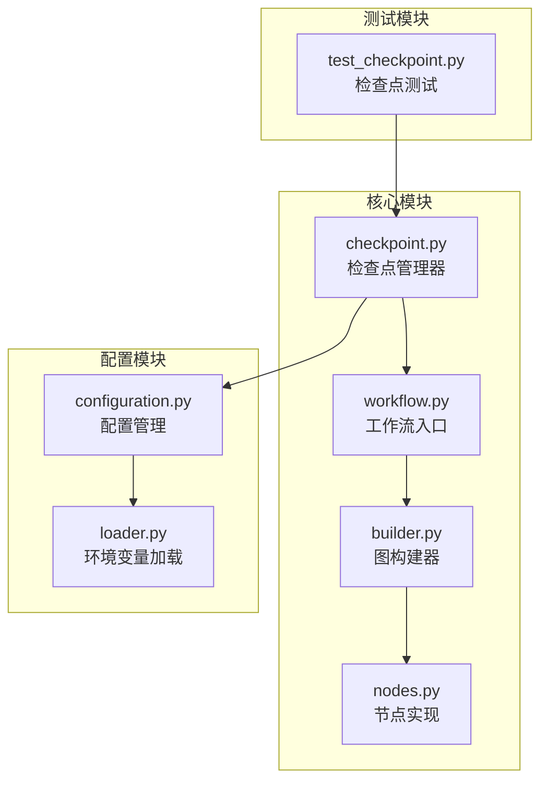
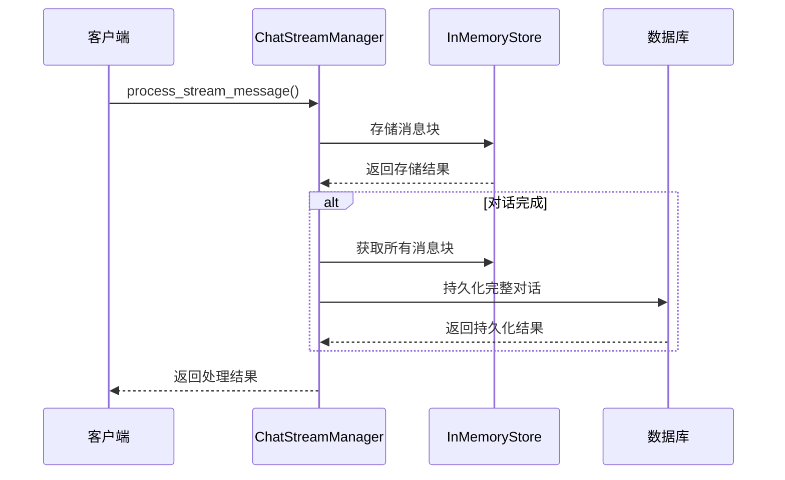
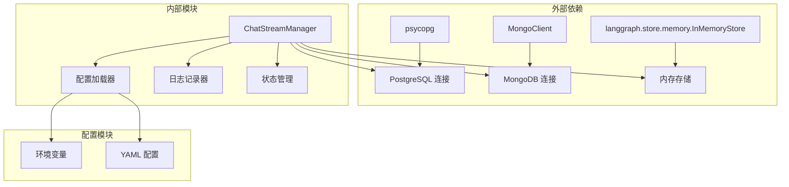

# DeerFlow 检查点机制深度解析

<cite>
**本文档引用的文件**
- [checkpoint.py](file://src/graph/checkpoint.py)
- [workflow.py](file://src/workflow.py)
- [builder.py](file://src/graph/builder.py)
- [types.py](file://src/graph/types.py)
- [nodes.py](file://src/graph/nodes.py)
- [configuration.py](file://src/config/configuration.py)
- [loader.py](file://src/config/loader.py)
- [test_checkpoint.py](file://tests/unit/checkpoint/test_checkpoint.py)
</cite>

## 目录
1. [简介](#简介)
2. [项目结构概览](#项目结构概览)
3. [核心组件分析](#核心组件分析)
4. [架构概览](#架构概览)
5. [详细组件分析](#详细组件分析)
6. [依赖关系分析](#依赖关系分析)
7. [性能考虑](#性能考虑)
8. [故障排除指南](#故障排除指南)
9. [结论](#结论)

## 简介

DeerFlow 是一个基于 LangGraph 构建的智能代理系统，其检查点机制是确保工作流状态持久化的关键组件。该机制通过将工作流状态序列化并存储到持久化介质中，支持任务中断后的恢复，并在分布式环境下保证状态一致性。

检查点机制的核心目标是在长时间运行的工作流中提供可靠的状态保存和恢复能力，特别是在以下场景中：
- 长时间运行的复杂工作流
- 分布式环境下的多节点协作
- 系统重启或故障恢复
- 用户交互式工作流的暂停和继续

## 项目结构概览

DeerFlow 的检查点机制主要分布在以下几个关键模块中：



**图表来源**
- [checkpoint.py](file://src/graph/checkpoint.py#L1-L372)
- [workflow.py](file://src/workflow.py#L1-L104)
- [builder.py](file://src/graph/builder.py#L1-L88)

**章节来源**
- [checkpoint.py](file://src/graph/checkpoint.py#L1-L372)
- [workflow.py](file://src/workflow.py#L1-L104)

## 核心组件分析

### ChatStreamManager 类

`ChatStreamManager` 是检查点机制的核心类，负责管理聊天流消息的持久化存储和内存缓存。

```python
class ChatStreamManager:
    """
    管理带有持久化存储和内存缓存的聊天流消息。
    
    该类处理使用临时数据的内存存储和 MongoDB 或 PostgreSQL 的持久化存储的消息存储和检索。
    它跟踪消息块并在对话完成时进行合并。
    """
```

该类的主要职责包括：
- **消息分块管理**：将长消息分割成多个块进行处理
- **内存缓存**：使用 `InMemoryStore` 进行临时数据存储
- **持久化存储**：支持 MongoDB 和 PostgreSQL 两种存储后端
- **连接管理**：自动初始化和关闭数据库连接

**章节来源**
- [checkpoint.py](file://src/graph/checkpoint.py#L15-L372)

## 架构概览

检查点机制的整体架构采用分层设计，确保高效的状态管理和持久化：



**图表来源**
- [checkpoint.py](file://src/graph/checkpoint.py#L108-L176)

## 详细组件分析

### 初始化和连接管理

`ChatStreamManager` 的初始化过程支持多种数据库连接方式：

```python
def __init__(self, checkpoint_saver: bool = False, db_uri: Optional[str] = None) -> None:
    """
    使用数据库连接初始化 ChatStreamManager。
    
    Args:
        db_uri: 数据库连接 URI。支持 MongoDB (mongodb://) 和 PostgreSQL (postgresql://)
               如果为 None，使用 LANGGRAPH_CHECKPOINT_DB_URL 环境变量或默认值
    """
```

系统支持两种数据库后端：

1. **MongoDB 支持**：
   ```python
   if self.db_uri.startswith("mongodb://"):
       self._init_mongodb()
   ```

2. **PostgreSQL 支持**：
   ```python
   elif self.db_uri.startswith("postgresql://") or self.db_uri.startswith("postgres://"):
       self._init_postgresql()
   ```

### 消息处理流程

消息处理是检查点机制的核心功能，采用分块处理和最终合并的策略：

```mermaid
flowchart TD
Start([开始处理消息]) --> ValidateParams["验证参数"]
ValidateParams --> ValidParams{"参数有效?"}
ValidParams --> |否| LogWarning["记录警告"]
ValidParams --> |是| GetCursor["获取游标"]
GetCursor --> IncrementIndex["递增索引"]
IncrementIndex --> StoreChunk["存储消息块"]
StoreChunk --> CheckFinish{"完成原因?"}
CheckFinish --> |"stop"/"interrupt"| PersistComplete["持久化完整对话"]
CheckFinish --> |其他| ReturnSuccess["返回成功"]
PersistComplete --> RetrieveChunks["从内存获取所有块"]
RetrieveChunks --> FilterMessages["过滤消息内容"]
FilterMessages --> ChoosePersistence["选择持久化方法"]
ChoosePersistence --> MongoDB{"MongoDB?"}
MongoDB --> |是| PersistMongo["持久化到 MongoDB"]
MongoDB --> |否| PersistPostgres["持久化到 PostgreSQL"]
PersistMongo --> LogResult["记录结果"]
PersistPostgres --> LogResult
LogResult --> ReturnSuccess
LogWarning --> ReturnFalse["返回失败"]
ReturnSuccess --> End([结束])
ReturnFalse --> End
```

**图表来源**
- [checkpoint.py](file://src/graph/checkpoint.py#L108-L176)

### 持久化策略

系统提供了两种持久化策略，分别针对不同的使用场景：

#### MongoDB 持久化

```python
def _persist_to_mongodb(self, thread_id: str, messages: List[str]) -> bool:
    """将对话持久化到 MongoDB。"""
    try:
        collection = self.mongo_db.chat_streams
        existing_document = collection.find_one({"thread_id": thread_id})
        
        if existing_document:
            # 更新现有对话
            update_result = collection.update_one(
                {"thread_id": thread_id},
                {"$set": {"messages": messages, "ts": current_timestamp}}
            )
        else:
            # 创建新对话文档
            new_document = {
                "thread_id": thread_id,
                "messages": messages,
                "ts": current_timestamp,
                "id": uuid.uuid4().hex
            }
            insert_result = collection.insert_one(new_document)
        
        return True
    except Exception as e:
        self.logger.error(f"Error persisting to MongoDB: {e}")
        return False
```

#### PostgreSQL 持久化

```python
def _persist_to_postgresql(self, thread_id: str, messages: List[str]) -> bool:
    """将对话持久化到 PostgreSQL。"""
    try:
        with self.postgres_conn.cursor() as cursor:
            cursor.execute("SELECT id FROM chat_streams WHERE thread_id = %s", (thread_id,))
            existing_record = cursor.fetchone()
            
            messages_json = json.dumps(messages)
            
            if existing_record:
                # 更新现有对话
                cursor.execute("""
                    UPDATE chat_streams 
                    SET messages = %s, ts = %s 
                    WHERE thread_id = %s
                """, (messages_json, current_timestamp, thread_id))
            else:
                # 创建新对话记录
                conversation_id = uuid.uuid4()
                cursor.execute("""
                    INSERT INTO chat_streams (id, thread_id, messages, ts) 
                    VALUES (%s, %s, %s, %s)
                """, (conversation_id, thread_id, messages_json, current_timestamp))
        
        return True
    except Exception as e:
        self.logger.error(f"Error persisting to PostgreSQL: {e}")
        return False
```

**章节来源**
- [checkpoint.py](file://src/graph/checkpoint.py#L209-L372)

### 工作流集成

检查点机制与工作流系统的紧密集成体现在以下几个方面：

#### 工作流配置

```python
def run_agent_workflow_async(
    user_input: str,
    debug: bool = False,
    max_plan_iterations: int = 1,
    max_step_num: int = 3,
    enable_background_investigation: bool = True,
):
    """异步运行代理工作流。"""
    
    initial_state = {
        "messages": [{"role": "user", "content": user_input}],
        "auto_accepted_plan": True,
        "enable_background_investigation": enable_background_investigation,
    }
    
    config = {
        "configurable": {
            "thread_id": "default",
            "max_plan_iterations": max_plan_iterations,
            "max_step_num": max_step_num,
        },
        "recursion_limit": get_recursion_limit(default=100),
    }
```

#### 图构建器集成

```python
def build_graph_with_memory():
    """构建带有内存的代理工作流图。"""
    memory = MemorySaver()
    builder = _build_base_graph()
    return builder.compile(checkpointer=memory)
```

**章节来源**
- [workflow.py](file://src/workflow.py#L25-L85)
- [builder.py](file://src/graph/builder.py#L58-L68)

## 依赖关系分析

检查点机制的依赖关系展现了清晰的分层架构：



**图表来源**
- [checkpoint.py](file://src/graph/checkpoint.py#L1-L15)
- [loader.py](file://src/config/loader.py#L1-L79)

**章节来源**
- [checkpoint.py](file://src/graph/checkpoint.py#L1-L15)
- [loader.py](file://src/config/loader.py#L1-L79)

## 性能考虑

### 存储后端选择

不同存储后端的性能特征：

1. **MongoDB 优势**：
   - 文档型存储适合 JSON 结构的数据
   - 自动索引支持高效的查询
   - 水平扩展能力强

2. **PostgreSQL 优势**：
   - 关系型数据库提供 ACID 事务
   - 更好的数据完整性保证
   - 复杂查询支持

### 压缩策略

对于大型对话，建议采用以下压缩策略：

```python
# 消息内容压缩
def compress_messages(messages: List[str]) -> str:
    """压缩消息列表为单个字符串。"""
    return "\n---\n".join(messages)

# 反压缩恢复
def decompress_messages(compressed: str) -> List[str]:
    """从压缩字符串恢复消息列表。"""
    return compressed.split("\n---\n")
```

### 恢复速度优化

1. **索引优化**：
   ```sql
   CREATE INDEX IF NOT EXISTS idx_chat_streams_thread_id ON chat_streams(thread_id);
   CREATE INDEX IF NOT EXISTS idx_chat_streams_ts ON chat_streams(ts);
   ```

2. **连接池管理**：
   - 实现连接池以减少连接开销
   - 设置合理的超时和重试机制

3. **批量操作**：
   - 批量插入和更新操作
   - 减少网络往返次数

## 故障排除指南

### 常见问题和解决方案

#### 1. 数据库连接失败

**症状**：无法连接到 MongoDB 或 PostgreSQL

**解决方案**：
```python
# 检查环境变量
print(os.getenv("LANGGRAPH_CHECKPOINT_DB_URL"))
print(os.getenv("LANGGRAPH_CHECKPOINT_SAVER"))

# 验证数据库服务状态
try:
    manager = ChatStreamManager(checkpoint_saver=True, db_uri=db_uri)
except Exception as e:
    print(f"Connection failed: {e}")
```

#### 2. 内存泄漏

**症状**：长时间运行后内存使用持续增长

**解决方案**：
```python
# 定期清理内存存储
def cleanup_memory_store(store: InMemoryStore, namespace: Tuple[str, str]):
    """清理指定命名空间的内存存储。"""
    items = store.search(namespace, limit=None)
    for item in items:
        store.delete(item.key)
```

#### 3. 持久化失败

**症状**：消息未能正确持久化

**解决方案**：
```python
# 实现重试机制
def retry_persistence(func, max_retries=3):
    """为持久化操作添加重试机制。"""
    for attempt in range(max_retries):
        try:
            return func()
        except Exception as e:
            if attempt == max_retries - 1:
                raise
            time.sleep(2 ** attempt)  # 指数退避
```

**章节来源**
- [test_checkpoint.py](file://tests/unit/checkpoint/test_checkpoint.py#L582-L664)

## 结论

DeerFlow 的检查点机制是一个设计精良的状态持久化系统，具有以下关键特性：

### 主要优势

1. **双存储后端支持**：同时支持 MongoDB 和 PostgreSQL，满足不同部署需求
2. **分块处理机制**：有效处理长消息流，避免内存溢出
3. **自动恢复能力**：系统重启后能够自动恢复工作流状态
4. **灵活的配置选项**：支持环境变量驱动的配置管理
5. **完善的错误处理**：提供详细的日志记录和异常处理

### 最佳实践建议

1. **生产环境部署**：
   - 使用 PostgreSQL 以获得更好的事务支持
   - 启用连接池和连接复用
   - 实施定期的备份和监控

2. **开发环境配置**：
   - 使用 MongoDB 便于快速原型开发
   - 启用调试日志以跟踪状态变化
   - 实施单元测试覆盖

3. **性能优化**：
   - 根据消息大小选择合适的存储后端
   - 实施消息压缩以减少存储空间
   - 优化数据库索引以提高查询性能

4. **监控和维护**：
   - 监控检查点创建和恢复的性能指标
   - 定期清理过期的检查点数据
   - 实施告警机制以及时发现异常

通过深入理解这些机制和最佳实践，开发者可以更好地利用 DeerFlow 的检查点功能，在复杂的分布式环境中构建可靠的智能代理系统。