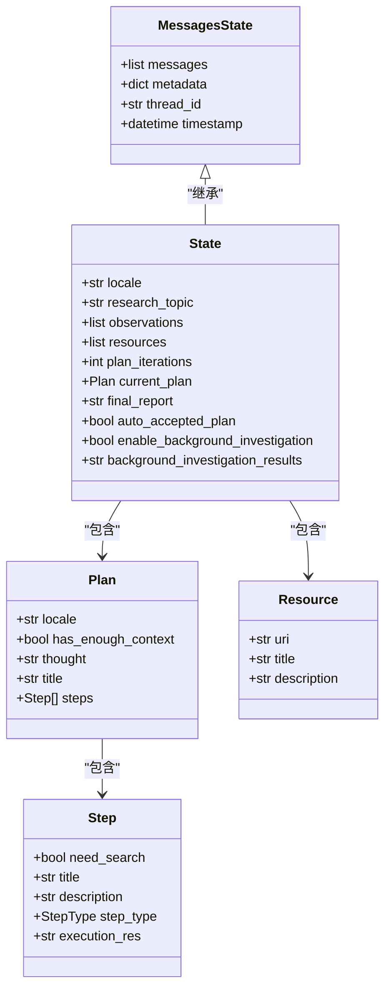
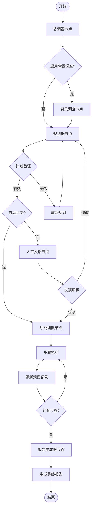
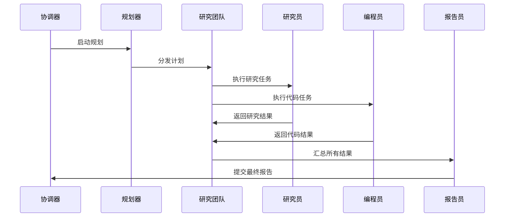

# 状态模型

<cite>
**本文档引用的文件**
- [src/graph/types.py](file://src/graph/types.py)
- [src/prompts/planner_model.py](file://src/prompts/planner_model.py)
- [src/rag/retriever.py](file://src/rag/retriever.py)
- [src/graph/nodes.py](file://src/graph/nodes.py)
- [tests/test_state.py](file://tests/test_state.py)
</cite>

## 目录
1. [简介](#简介)
2. [核心状态模型架构](#核心状态模型架构)
3. [AgentState 类详解](#agentstate-类详解)
4. [状态字段深度分析](#状态字段深度分析)
5. [状态流转机制](#状态流转机制)
6. [多智能体协作模式](#多智能体协作模式)
7. [最佳实践指南](#最佳实践指南)
8. [性能优化建议](#性能优化建议)
9. [故障排除指南](#故障排除指南)
10. [总结](#总结)

## 简介

DeerFlow 是一个基于 LangGraph 的多智能体协作系统，其核心状态模型为整个工作流程提供了统一的数据结构和状态管理机制。AgentState 类作为状态模型的基础，继承自 LangGraph 的 MessagesState，并扩展了多个运行时变量，支持复杂的多阶段研究、规划和报告生成工作流。

该状态模型设计精巧，能够有效支持以下功能：
- 多智能体之间的状态共享和数据传递
- 复杂的研究任务分解和执行
- 动态的计划调整和迭代
- 结构化的观察记录和知识积累
- 可扩展的状态字段和自定义扩展能力

## 核心状态模型架构



**图表来源**
- [src/graph/types.py](file://src/graph/types.py#L1-L25)
- [src/prompts/planner_model.py](file://src/prompts/planner_model.py#L1-L59)
- [src/rag/retriever.py](file://src/rag/retriever.py#L1-L82)

**章节来源**
- [src/graph/types.py](file://src/graph/types.py#L1-L25)
- [src/prompts/planner_model.py](file://src/prompts/planner_model.py#L1-L59)

## AgentState 类详解

AgentState 类是 DeerFlow 状态模型的核心，它继承自 LangGraph 的 MessagesState 并扩展了多个关键字段：

```python
class State(MessagesState):
    """Agent 系统的状态，扩展了 MessagesState 并添加了 next 字段。"""

    # 运行时变量
    locale: str = "en-US"
    research_topic: str = ""
    observations: list[str] = []
    resources: list[Resource] = []
    plan_iterations: int = 0
    current_plan: Plan | str = None
    final_report: str = ""
    auto_accepted_plan: bool = False
    enable_background_investigation: bool = True
    background_investigation_results: str = None
```

### 继承关系分析

AgentState 完全继承了 MessagesState 的所有功能，这意味着：

1. **消息历史管理**：自动维护完整的对话历史记录
2. **线程支持**：支持多线程并发处理
3. **元数据管理**：内置的元数据存储和检索机制
4. **时间戳跟踪**：自动的时间戳记录和版本控制

**章节来源**
- [src/graph/types.py](file://src/graph/types.py#L8-L25)

## 状态字段深度分析

### 基础消息字段

#### messages（消息列表）
- **数据类型**：`list[Message]`
- **业务含义**：完整的对话历史记录，包含用户输入、智能体响应和工具调用结果
- **状态转换**：每轮交互都会向列表中添加新的消息对象
- **使用场景**：用于上下文理解和历史追踪

#### metadata（元数据）
- **数据类型**：`dict`
- **业务含义**：存储额外的运行时元数据，如会话标识、配置参数等
- **状态转换**：动态更新，反映当前执行状态
- **使用场景**：配置管理、状态追踪

### 核心业务字段

#### locale（本地化设置）
- **数据类型**：`str`
- **默认值**：`"en-US"`
- **业务含义**：指定用户的语言环境，影响输出格式和提示模板
- **状态转换**：从用户输入或配置中初始化，可能在多语言环境中动态切换
- **使用场景**：多语言支持、本地化输出

#### research_topic（研究主题）
- **数据类型**：`str`
- **默认值**：`""`
- **业务含义**：当前研究任务的主题描述
- **状态转换**：由协调器节点初始化，后续节点基于此进行专业化的研究
- **使用场景**：主题识别、专业化分工

#### observations（观察记录）
- **数据类型**：`list[str]`
- **默认值**：`[]`
- **业务含义**：累积的研究发现和观察结果
- **状态转换**：每次研究完成后追加新的观察内容
- **使用场景**：知识积累、报告生成

#### resources（资源列表）
- **数据类型**：`list[Resource]`
- **默认值**：`[]`
- **业务含义**：可用的参考资料和知识库资源
- **状态转换**：由配置加载，可能在运行时动态更新
- **使用场景**：本地搜索、知识检索

### 计划管理字段

#### plan_iterations（计划迭代次数）
- **数据类型**：`int`
- **默认值**：`0`
- **业务含义**：当前计划的迭代执行次数
- **状态转换**：每次计划执行后递增，达到上限时终止循环
- **使用场景**：防止无限循环、控制执行成本

#### current_plan（当前计划）
- **数据类型**：`Plan | str`
- **默认值**：`None`
- **业务含义**：当前正在执行的研究计划，可以是 Plan 对象或 JSON 字符串
- **状态转换**：由规划器节点生成，可能包含逐步细化的过程
- **使用场景**：任务分解、步骤执行

#### final_report（最终报告）
- **数据类型**：`str`
- **默认值**：`""`
- **业务含义**：完成研究后的综合报告内容
- **状态转换**：由报告生成器节点填充，格式化为 Markdown 文档
- **使用场景**：成果展示、知识交付

### 控制流字段

#### auto_accepted_plan（自动接受计划）
- **数据类型**：`bool`
- **默认值**：`False`
- **业务含义**：是否跳过人工审核直接接受计划
- **状态转换**：根据用户偏好或配置动态设置
- **使用场景**：自动化流程、效率优化

#### enable_background_investigation（启用背景调查）
- **数据类型**：`bool`
- **默认值**：`True`
- **业务含义**：是否在规划前进行背景信息收集
- **状态转换**：由配置决定，可能影响整体流程
- **使用场景**：预处理阶段、上下文丰富

#### background_investigation_results（背景调查结果）
- **数据类型**：`str`
- **默认值**：`None`
- **业务含义**：背景调查收集到的信息摘要
- **状态转换**：由背景调查节点生成，传递给规划器
- **使用场景**：上下文增强、决策支持

**章节来源**
- [src/graph/types.py](file://src/graph/types.py#L8-L25)
- [src/prompts/planner_model.py](file://src/prompts/planner_model.py#L20-L59)

## 状态流转机制



**图表来源**
- [src/graph/nodes.py](file://src/graph/nodes.py#L50-L200)

### 状态转换规则

#### 初始化阶段
1. **协调器节点**接收用户输入，初始化 `research_topic` 和 `locale`
2. **背景调查节点**（可选）收集初始信息，填充 `background_investigation_results`
3. **规划器节点**生成初步计划，设置 `current_plan` 和 `plan_iterations`

#### 执行阶段
1. **人工反馈节点**检查是否需要人工审核
2. **研究团队节点**按计划逐步执行研究任务
3. **观察记录**累积每次执行的结果
4. **状态更新**通过命令模式返回给状态管理器

#### 收尾阶段
1. **报告生成器节点**汇总所有观察记录
2. **最终报告**格式化为结构化的 Markdown 文档
3. **状态清理**准备下一轮任务或持久化保存

**章节来源**
- [src/graph/nodes.py](file://src/graph/nodes.py#L50-L200)

## 多智能体协作模式

### 智能体角色分工



**图表来源**
- [src/graph/nodes.py](file://src/graph/nodes.py#L200-L400)

### 状态共享机制

#### 共享状态字段
- **messages**：所有智能体共享完整的对话历史
- **research_topic**：确保各智能体对任务目标的理解一致
- **observations**：累积的知识和发现
- **resources**：统一的参考资料池

#### 状态隔离策略
- **局部状态**：每个智能体维护自己的执行状态
- **状态合并**：通过明确的更新命令合并状态变更
- **冲突解决**：优先级机制和手动干预选项

### 协作模式特点

#### 异步协作
- 各智能体可以并行执行不同的任务
- 状态模型支持多线程并发访问
- 通过消息队列实现异步通信

#### 流水线协作
- 明确的任务分工和执行顺序
- 严格的依赖关系管理
- 自动化的进度追踪

#### 混合协作
- 结合同步和异步协作的优势
- 支持灵活的任务调度
- 动态的任务重组能力

**章节来源**
- [src/graph/nodes.py](file://src/graph/nodes.py#L200-L512)

## 最佳实践指南

### 状态扩展策略

#### 添加自定义字段
```python
class ExtendedState(State):
    """扩展状态类，添加自定义字段"""
    
    # 新增字段
    custom_field: str = ""
    progress_percentage: float = 0.0
    error_count: int = 0
    
    # 自定义方法
    def is_complete(self) -> bool:
        """检查任务是否完成"""
        return self.progress_percentage >= 100.0
    
    def add_error(self, error_message: str):
        """记录错误信息"""
        self.error_count += 1
        self.messages.append({
            "role": "error",
            "content": error_message
        })
```

#### 类型安全保证
```python
from typing import Optional, Union
from pydantic import BaseModel, Field

class SafeState(State):
    """类型安全的状态类"""
    
    # 使用 Optional 类型避免未初始化问题
    current_step: Optional[Step] = None
    estimated_completion_time: Optional[float] = None
    
    # 使用 Union 类型支持多种数据格式
    last_result: Union[str, dict, None] = None
    
    def update_current_step(self, step: Step):
        """安全地更新当前步骤"""
        if self.current_plan and step in self.current_plan.steps:
            self.current_step = step
        else:
            raise ValueError("Invalid step for current plan")
```

### 序列化和反序列化

#### JSON 序列化
```python
import json
from datetime import datetime

class SerializableState(State):
    """支持序列化的状态类"""
    
    def to_json(self) -> str:
        """转换为 JSON 字符串"""
        state_dict = self.dict()
        
        # 处理特殊类型的序列化
        for key, value in state_dict.items():
            if isinstance(value, datetime):
                state_dict[key] = value.isoformat()
            elif hasattr(value, 'model_dump'):
                state_dict[key] = value.model_dump()
        
        return json.dumps(state_dict, ensure_ascii=False, indent=2)
    
    @classmethod
    def from_json(cls, json_str: str) -> 'SerializableState':
        """从 JSON 字符串恢复状态"""
        state_dict = json.loads(json_str)
        
        # 处理特殊类型的反序列化
        for key, value in state_dict.items():
            if key == 'timestamp' and isinstance(value, str):
                state_dict[key] = datetime.fromisoformat(value)
            elif key == 'current_plan' and isinstance(value, dict):
                state_dict[key] = Plan(**value)
        
        return cls(**state_dict)
```

### 错误处理和恢复

#### 状态验证
```python
class ValidatedState(State):
    """带验证的状态类"""
    
    def validate(self) -> bool:
        """验证状态完整性"""
        # 检查必需字段
        if not self.research_topic:
            return False
        
        # 检查计划有效性
        if self.current_plan and not isinstance(self.current_plan, (Plan, str)):
            return False
        
        # 检查资源格式
        for resource in self.resources:
            if not resource.uri or not resource.title:
                return False
        
        return True
    
    def recover_from_error(self):
        """从错误状态恢复"""
        # 清理损坏的数据
        self.messages = [msg for msg in self.messages if msg.get('content')]
        
        # 重置计划状态
        if self.plan_iterations > 5:
            self.plan_iterations = 0
            self.current_plan = None
        
        # 重置错误计数
        self.error_count = 0
```

**章节来源**
- [tests/test_state.py](file://tests/test_state.py#L1-L134)

## 性能优化建议

### 内存管理

#### 状态大小控制
```python
class OptimizedState(State):
    """优化内存使用的状态类"""
    
    def __init__(self, *args, **kwargs):
        super().__init__(*args, **kwargs)
        self._max_messages = 100
        self._max_observations = 50
    
    def add_observation(self, observation: str):
        """添加观察记录并控制数量"""
        super().add_observation(observation)
        
        # 限制观察记录数量
        if len(self.observations) > self._max_observations:
            self.observations = self.observations[-self._max_observations:]
    
    def cleanup_messages(self):
        """清理旧的消息记录"""
        if len(self.messages) > self._max_messages:
            # 保留最近的重要消息
            important_msgs = [msg for msg in self.messages[-50:] 
                             if msg.get('role') in ['user', 'assistant']]
            self.messages = important_msgs
```

### 并发性能

#### 线程安全状态
```python
import threading
from typing import Dict, Any

class ThreadSafeState(State):
    """线程安全的状态类"""
    
    def __init__(self, *args, **kwargs):
        super().__init__(*args, **kwargs)
        self._lock = threading.RLock()
        self._version = 0
    
    def __getitem__(self, key: str) -> Any:
        with self._lock:
            return super().__getitem__(key)
    
    def __setitem__(self, key: str, value: Any):
        with self._lock:
            super().__setitem__(key, value)
            self._version += 1
    
    def get_version(self) -> int:
        """获取状态版本号"""
        with self._lock:
            return self._version
```

### 缓存策略

#### 状态缓存
```python
from functools import lru_cache
from typing import Tuple

class CachedState(State):
    """带缓存的状态类"""
    
    def __init__(self, *args, **kwargs):
        super().__init__(*args, **kwargs)
        self._cache: Dict[Tuple[str, ...], Any] = {}
    
    @lru_cache(maxsize=128)
    def get_cached_result(self, *keys: str) -> Any:
        """获取缓存结果"""
        return self._cache.get(tuple(keys))
    
    def set_cached_result(self, keys: Tuple[str, ...], result: Any):
        """设置缓存结果"""
        self._cache[keys] = result
    
    def clear_cache(self):
        """清空缓存"""
        self._cache.clear()
```

## 故障排除指南

### 常见问题诊断

#### 状态丢失问题
```python
class DiagnosticState(State):
    """诊断状态类"""
    
    def __init__(self, *args, **kwargs):
        super().__init__(*args, **kwargs)
        self._diagnostics = []
    
    def log_diagnostic(self, message: str):
        """记录诊断信息"""
        diagnostic = {
            'timestamp': datetime.now(),
            'message': message,
            'state_size': len(str(self)),
            'field_count': len(self.keys())
        }
        self._diagnostics.append(diagnostic)
    
    def diagnose_issues(self) -> list:
        """诊断潜在问题"""
        issues = []
        
        # 检查消息数量
        if len(self.messages) > 1000:
            issues.append("消息数量过多，可能导致性能问题")
        
        # 检查观察记录
        if len(self.observations) > 100:
            issues.append("观察记录过多，可能影响内存使用")
        
        # 检查计划迭代
        if self.plan_iterations > 10:
            issues.append("计划迭代次数过多，可能存在死循环")
        
        return issues
```

#### 调试工具
```python
def debug_state(state: State, level: str = "info") -> dict:
    """调试状态信息"""
    debug_info = {
        'basic_info': {
            'locale': state.locale,
            'research_topic': state.research_topic[:50] + '...' if len(state.research_topic) > 50 else state.research_topic,
            'plan_iterations': state.plan_iterations,
            'auto_accepted_plan': state.auto_accepted_plan
        },
        'content_info': {
            'messages_count': len(state.messages),
            'observations_count': len(state.observations),
            'resources_count': len(state.resources)
        },
        'status_info': {
            'has_current_plan': state.current_plan is not None,
            'has_final_report': bool(state.final_report),
            'background_investigation_enabled': state.enable_background_investigation
        }
    }
    
    if level == "debug":
        debug_info['raw_data'] = {
            'messages': state.messages,
            'observations': state.observations,
            'resources': [r.uri for r in state.resources]
        }
    
    return debug_info
```

### 性能监控

#### 状态性能指标
```python
import time
from collections import defaultdict

class MonitoredState(State):
    """监控状态类"""
    
    def __init__(self, *args, **kwargs):
        super().__init__(*args, **kwargs)
        self._operation_times = defaultdict(list)
        self._memory_usage = []
    
    def timed_operation(self, operation_name: str):
        """装饰器：记录操作耗时"""
        def decorator(func):
            def wrapper(*args, **kwargs):
                start_time = time.time()
                try:
                    result = func(*args, **kwargs)
                    return result
                finally:
                    end_time = time.time()
                    duration = end_time - start_time
                    self._operation_times[operation_name].append(duration)
                    
                    # 记录内存使用
                    import psutil
                    process = psutil.Process()
                    self._memory_usage.append(process.memory_info().rss)
            return wrapper
        return decorator
    
    def get_performance_metrics(self) -> dict:
        """获取性能指标"""
        metrics = {}
        for op_name, times in self._operation_times.items():
            metrics[op_name] = {
                'count': len(times),
                'avg_time': sum(times) / len(times),
                'min_time': min(times),
                'max_time': max(times)
            }
        return metrics
```

**章节来源**
- [src/graph/nodes.py](file://src/graph/nodes.py#L1-L50)

## 总结

DeerFlow 的状态模型是一个设计精良、功能完备的多智能体协作框架核心组件。通过深入分析 AgentState 类及其相关组件，我们可以看到：

### 核心优势

1. **继承性设计**：充分利用 LangGraph 的 MessagesState 基础功能，同时扩展业务特定字段
2. **类型安全**：通过 Pydantic 和类型注解确保数据完整性和一致性
3. **可扩展性**：支持自定义字段和方法，适应不同的业务需求
4. **并发友好**：支持多线程访问和异步操作
5. **序列化支持**：便于状态持久化和传输

### 实际应用场景

- **研究分析**：支持复杂的研究任务分解和执行
- **报告生成**：自动化生成结构化的研究报告
- **多语言支持**：灵活的语言环境适配
- **资源管理**：统一的参考资料管理和检索
- **流程控制**：精确的执行进度和状态追踪

### 发展方向

1. **性能优化**：进一步优化内存使用和并发性能
2. **扩展功能**：支持更多类型的智能体和协作模式
3. **监控增强**：完善的状态监控和诊断工具
4. **集成能力**：与其他系统的无缝集成接口

这个状态模型为 DeerFlow 提供了强大的基础设施支撑，使其能够高效地处理复杂的多智能体协作任务，是整个系统成功的关键基础。