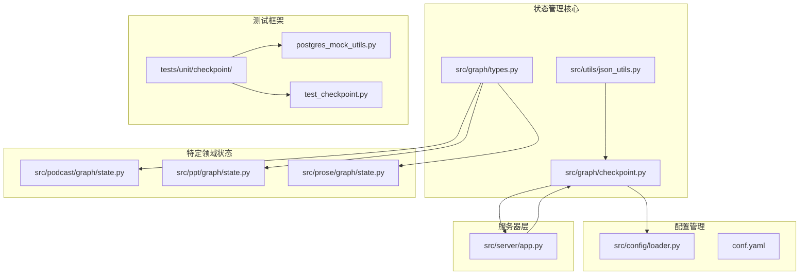
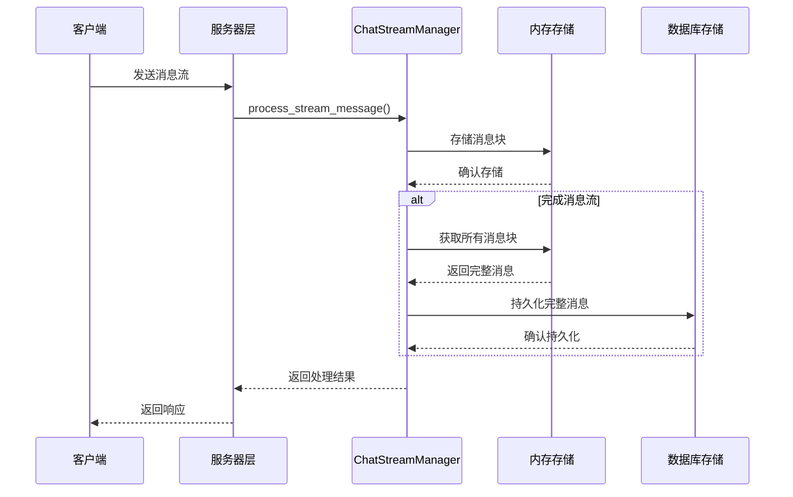
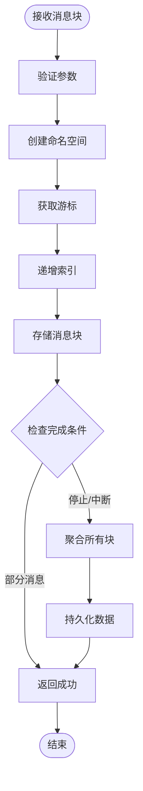
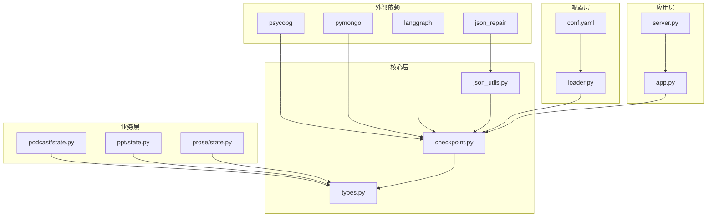

# 状态管理与持久化系统

<cite>
**本文档引用的文件**
- [checkpoint.py](file://src/graph/checkpoint.py)
- [types.py](file://src/graph/types.py)
- [json_utils.py](file://src/utils/json_utils.py)
- [loader.py](file://src/config/loader.py)
- [app.py](file://src/server/app.py)
- [postgres_mock_utils.py](file://tests/unit/checkpoint/postgres_mock_utils.py)
- [test_checkpoint.py](file://tests/unit/checkpoint/test_checkpoint.py)
- [state.py](file://src/podcast/graph/state.py)
- [state.py](file://src/ppt/graph/state.py)
- [state.py](file://src/prose/graph/state.py)
- [conf.yaml](file://conf.yaml)
</cite>

## 目录
1. [简介](#简介)
2. [项目结构概览](#项目结构概览)
3. [核心组件分析](#核心组件分析)
4. [架构概览](#架构概览)
5. [详细组件分析](#详细组件分析)
6. [依赖关系分析](#依赖关系分析)
7. [性能考虑](#性能考虑)
8. [故障排除指南](#故障排除指南)
9. [结论](#结论)

## 简介

DeerFlow 的工作流状态管理系统是一个高度可扩展的状态持久化解决方案，专门设计用于处理复杂的多智能体协作场景。该系统通过检查点机制实现了状态的序列化、持久化存储和恢复功能，支持多种存储后端（PostgreSQL 和 MongoDB），并提供了完整的状态一致性保证机制。

系统的核心设计理念是分离关注点：内存中的临时状态管理和持久化存储之间的协调。这种设计确保了高性能的实时交互，同时提供了可靠的数据持久化能力。

## 项目结构概览

DeerFlow 的状态管理系统采用模块化架构，主要组件分布在以下目录结构中：



**图表来源**
- [checkpoint.py](file://src/graph/checkpoint.py#L1-L372)
- [loader.py](file://src/config/loader.py#L1-L79)
- [app.py](file://src/server/app.py#L368-L406)

**章节来源**
- [checkpoint.py](file://src/graph/checkpoint.py#L1-L372)
- [types.py](file://src/graph/types.py#L1-L25)

## 核心组件分析

### ChatStreamManager 类

`ChatStreamManager` 是状态管理系统的核心类，负责处理聊天流消息的存储和检索。它提供了以下关键功能：

- **多数据库支持**：同时支持 PostgreSQL 和 MongoDB 两种存储后端
- **内存缓冲**：使用 `InMemoryStore` 进行临时数据缓存
- **流式处理**：支持实时消息流的分块处理和合并
- **线程隔离**：为不同会话线程提供独立的状态空间

### 状态类型定义

系统定义了多种状态类型来满足不同业务场景的需求：

```python
class State(MessagesState):
    """代理系统状态，扩展 MessagesState 包含 next 字段。"""
    
    # 运行时变量
    locale: str = "en-US"
    research_topic: str = ""
    observations: list[str] = []
    resources: list[Resource] = []
    plan_iterations: int = 0
    current_plan: Plan | str = None
    final_report: str = ""
    auto_accepted_plan: bool = False
    enable_background_investigation: bool = True
    background_investigation_results: str = None
```

**章节来源**
- [checkpoint.py](file://src/graph/checkpoint.py#L15-L100)
- [types.py](file://src/graph/types.py#L8-L24)

## 架构概览

DeerFlow 的状态管理系统采用了分层架构设计，确保了系统的可扩展性和维护性：



**图表来源**
- [checkpoint.py](file://src/graph/checkpoint.py#L130-L200)
- [app.py](file://src/server/app.py#L368-L406)

## 详细组件分析

### 检查点机制实现

#### 初始化和连接管理

`ChatStreamManager` 支持灵活的初始化配置，能够根据环境变量自动选择合适的数据库连接：

```python
def __init__(self, checkpoint_saver: bool = False, db_uri: Optional[str] = None) -> None:
    """初始化 ChatStreamManager 并建立数据库连接。"""
    self.logger = logging.getLogger(__name__)
    self.store = InMemoryStore()
    self.checkpoint_saver = checkpoint_saver
    self.db_uri = db_uri
    
    if self.checkpoint_saver:
        if self.db_uri.startswith("mongodb://"):
            self._init_mongodb()
        elif self.db_uri.startswith("postgresql://") or self.db_uri.startswith("postgres://"):
            self._init_postgresql()
```

#### 流式消息处理

系统采用分块处理机制来高效处理长文本消息：



**图表来源**
- [checkpoint.py](file://src/graph/checkpoint.py#L130-L180)

#### 多数据库持久化策略

系统提供了统一的接口来处理不同类型的数据库持久化：

```python
def _persist_complete_conversation(self, thread_id: str, store_namespace: Tuple[str, str], final_index: int) -> bool:
    """持久化完成的对话到数据库。"""
    try:
        # 从内存存储检索所有消息块
        memories = self.store.search(store_namespace, limit=final_index + 2)
        messages = [str(item.dict().get("value", "")) for item in memories if not isinstance(item.dict().get("value", ""), dict)]
        
        if not messages:
            return False
            
        # 根据可用连接选择持久化方法
        if self.mongo_db is not None:
            return self._persist_to_mongodb(thread_id, messages)
        elif self.postgres_conn is not None:
            return self._persist_to_postgresql(thread_id, messages)
            
    except Exception as e:
        self.logger.error(f"持久化对话失败: {e}")
        return False
```

**章节来源**
- [checkpoint.py](file://src/graph/checkpoint.py#L177-L220)

### JSON 序列化工具

`json_utils.py` 提供了强大的 JSON 处理功能，确保状态数据的正确序列化：

```python
def repair_json_output(content: str) -> str:
    """修复和规范化 JSON 输出。"""
    content = content.strip()
    
    try:
        # 尝试修复和解析 JSON
        repaired_content = json_repair.loads(content)
        if not isinstance(repaired_content, dict) and not isinstance(repaired_content, list):
            logger.warning("修复的内容不是有效的 JSON 对象或数组。")
            return content
        content = json.dumps(repaired_content, ensure_ascii=False)
    except Exception as e:
        logger.warning(f"JSON 修复失败: {e}")
    
    return content
```

**章节来源**
- [json_utils.py](file://src/utils/json_utils.py#L20-L45)

### 配置管理系统

系统使用集中式的配置管理来控制状态持久化的行为：

```python
def get_bool_env(name: str, default: bool = False) -> bool:
    """获取布尔型环境变量。"""
    val = os.getenv(name)
    if val is None:
        return default
    return str(val).strip().lower() in {"1", "true", "yes", "y", "on"}

def get_str_env(name: str, default: str = "") -> str:
    """获取字符串型环境变量。"""
    val = os.getenv(name)
    return default if val is None else str(val).strip()
```

**章节来源**
- [loader.py](file://src/config/loader.py#L10-L30)

### 特定领域状态模型

系统为不同的业务场景定义了专门的状态模型：

#### 播客生成状态
```python
class PodcastState(MessagesState):
    """播客生成的状态。"""
    
    # 输入
    input: str = ""
    
    # 输出
    output: Optional[bytes] = None
    
    # 资产
    script: Optional[Script] = None
    audio_chunks: list[bytes] = []
```

#### PPT 生成状态
```python
class PPTState(MessagesState):
    """PPT 生成的状态。"""
    
    # 输入
    input: str = ""
    
    # 输出
    generated_file_path: str = ""
    
    # 资产
    ppt_content: str = ""
    ppt_file_path: str = ""
```

**章节来源**
- [state.py](file://src/podcast/graph/state.py#L8-L22)
- [state.py](file://src/ppt/graph/state.py#L8-L19)

## 依赖关系分析

系统的依赖关系展现了清晰的分层架构：



**图表来源**
- [checkpoint.py](file://src/graph/checkpoint.py#L1-L20)
- [loader.py](file://src/config/loader.py#L1-L10)

**章节来源**
- [checkpoint.py](file://src/graph/checkpoint.py#L1-L372)
- [loader.py](file://src/config/loader.py#L1-L79)

## 性能考虑

### 状态压缩和优化

1. **内存管理**：使用 `InMemoryStore` 进行高效的临时数据缓存
2. **批量操作**：支持批量消息块的聚合处理
3. **连接池**：PostgreSQL 使用连接池来提高数据库访问效率
4. **索引优化**：数据库表包含适当的索引来加速查询

### 增量更新机制

系统实现了智能的增量更新策略：
- 只有在消息流完成时才进行持久化
- 支持现有记录的更新而非重复插入
- 使用 UUID 作为主键确保唯一性

### 缓存策略

- **内存缓存**：实时消息块存储在内存中
- **数据库缓存**：PostgreSQL 支持查询缓存
- **连接复用**：数据库连接可以被多次复用

## 故障排除指南

### 常见问题和解决方案

#### 数据库连接问题

```python
# 检查数据库连接状态
try:
    if self.mongo_db is not None:
        self.mongo_client.admin.command("ping")
    elif self.postgres_conn is not None:
        with self.postgres_conn.cursor() as cursor:
            cursor.execute("SELECT 1")
except Exception as e:
    self.logger.error(f"数据库连接失败: {e}")
```

#### 状态恢复失败

当系统需要从持久化存储恢复状态时，应检查：
1. 数据库连接是否正常
2. 表结构是否存在
3. 数据格式是否正确
4. 权限设置是否正确

#### 性能优化建议

1. **监控指标**：定期监控数据库连接数和响应时间
2. **日志分析**：分析错误日志以识别潜在问题
3. **资源清理**：及时关闭不再使用的数据库连接
4. **备份策略**：定期备份重要状态数据

**章节来源**
- [checkpoint.py](file://src/graph/checkpoint.py#L350-L372)
- [test_checkpoint.py](file://tests/unit/checkpoint/test_checkpoint.py#L1-L50)

## 结论

DeerFlow 的工作流状态管理系统是一个设计精良、功能完备的状态持久化解决方案。它通过以下特性确保了系统的可靠性、可扩展性和易维护性：

### 主要优势

1. **多数据库支持**：灵活的存储后端选择
2. **流式处理**：高效的实时消息处理能力
3. **线程隔离**：安全的并发状态管理
4. **配置驱动**：基于环境变量的灵活配置
5. **测试友好**：完善的单元测试覆盖

### 最佳实践建议

1. **合理配置**：根据实际需求选择合适的存储后端
2. **监控告警**：建立完善的监控和告警机制
3. **定期维护**：定期清理过期状态数据
4. **备份策略**：制定完善的数据备份计划
5. **性能调优**：根据实际负载调整系统参数

该系统为复杂的多智能体协作场景提供了坚实的基础，确保了状态的一致性和可靠性，同时保持了良好的性能表现。