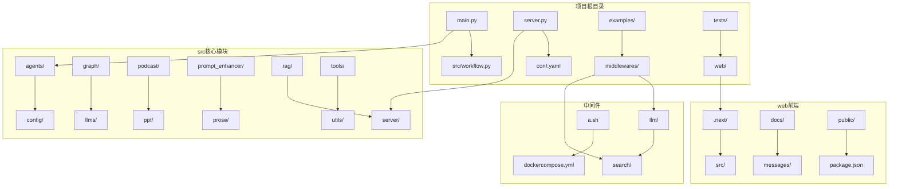
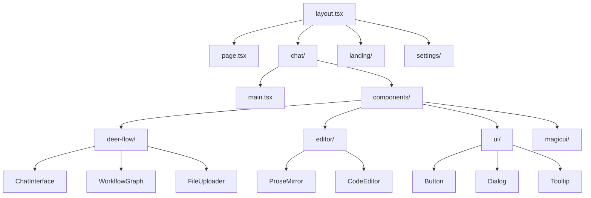
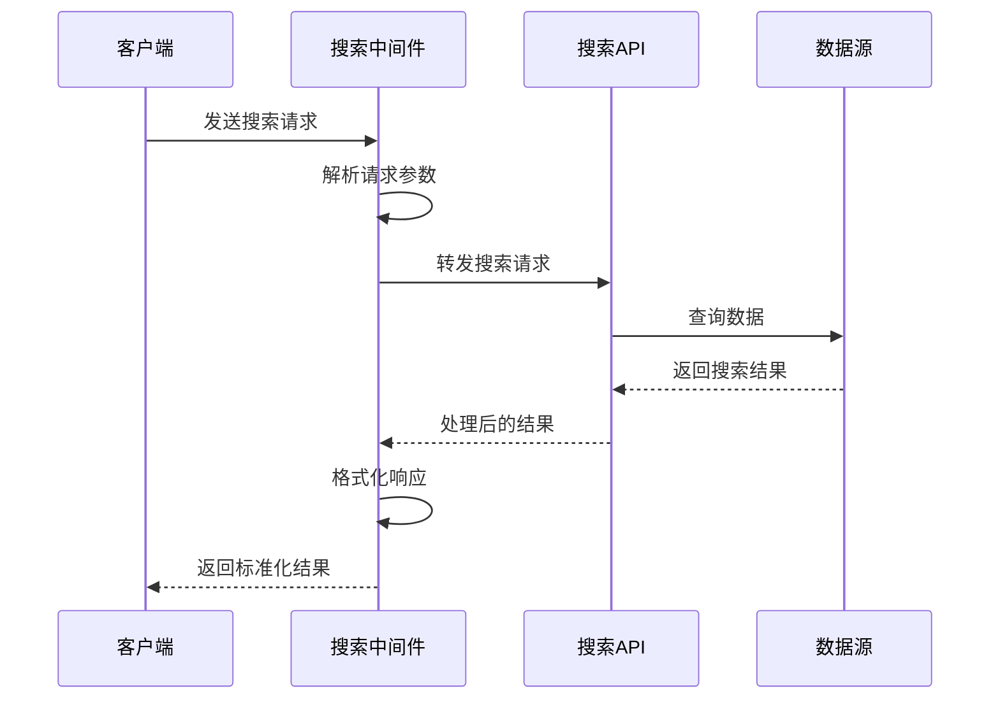
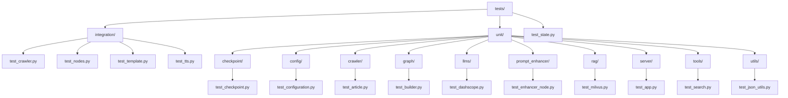
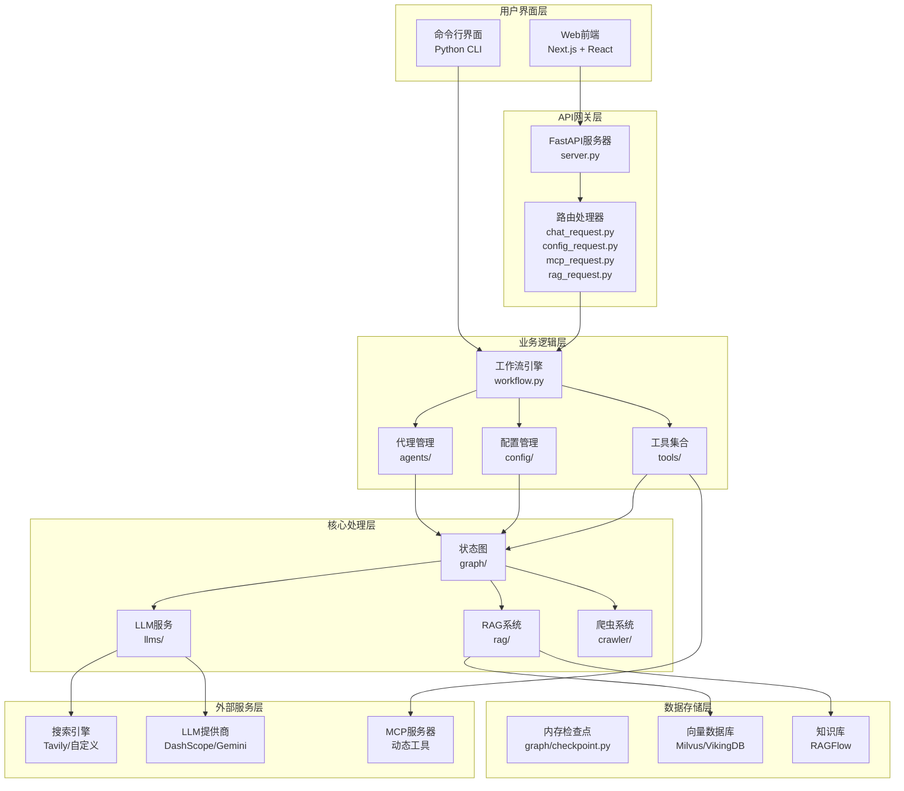
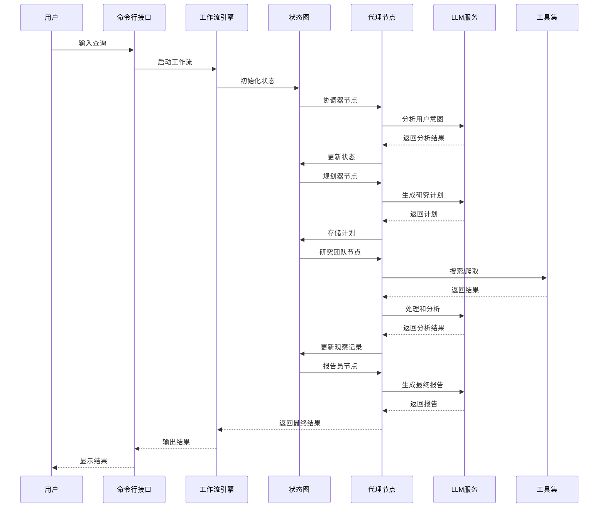
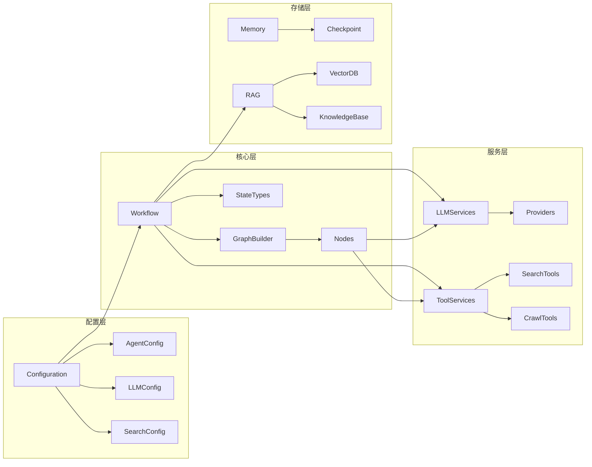

# DeerFlow项目目录结构详解

<cite>
**本文档引用的文件**
- [main.py](file://main.py)
- [src/workflow.py](file://src/workflow.py)
- [server.py](file://server.py)
- [conf.yaml](file://conf.yaml)
- [src/graph/builder.py](file://src/graph/builder.py)
- [src/graph/nodes.py](file://src/graph/nodes.py)
- [src/config/configuration.py](file://src/config/configuration.py)
- [web/package.json](file://web/package.json)
- [web/src/app/layout.tsx](file://web/src/app/layout.tsx)
- [middlewares/search/mock_search_api.py](file://middlewares/search/mock_search_api.py)
- [tests/test_state.py](file://tests/test_state.py)
</cite>

## 目录结构概览

DeerFlow是一个复杂的AI研究工具，采用分层架构设计，包含后端Python服务、前端React应用和多种中间件组件。项目整体结构清晰，功能模块化，便于维护和扩展。



**图表来源**
- [main.py](file://main.py#L1-L157)
- [server.py](file://server.py#L1-L93)
- [src/workflow.py](file://src/workflow.py#L1-L104)

## 核心目录功能详解

### src目录 - 核心业务逻辑

src目录是整个项目的核心，包含了所有主要的业务逻辑和功能模块：

#### agents - 代理管理
- **agents.py**: 定义智能代理的基本行为和交互模式
- **agents.py**: 实现代理的创建、管理和生命周期控制

#### config - 配置管理
- **configuration.py**: 主配置类，管理全局设置和运行时参数
- **agents.py**: 代理特定的配置选项
- **custom_search.py**: 自定义搜索引擎配置
- **loader.py**: 配置加载器，支持环境变量和文件配置
- **questions.py**: 内置问题模板和语言支持
- **report_style.py**: 报告样式配置
- **tools.py**: 工具配置管理

#### graph - 工作流图
- **builder.py**: 工作流图构建器，定义节点连接和执行路径
- **checkpoint.py**: 状态检查点管理，支持断点恢复
- **nodes.py**: 各种工作流节点的实现
- **types.py**: 工作流状态类型定义

#### llms - 大语言模型
- **providers/**: 各种LLM提供商的适配器
- **llm.py**: LLM统一接口和调用管理

#### podcast - 播客功能
- **graph/**: 播客生成的工作流图
- **types.py**: 播客相关类型定义

#### ppt - PPT生成功能
- **graph/**: PPT生成的工作流
- **ppt_composer_node.py**: PPT组合节点
- **ppt_generator_node.py**: PPT生成节点

#### prompt_enhancer - 提示增强
- **graph/**: 提示增强工作流
- **enhancer_node.py**: 提示增强节点
- **enhancer_node.py**: 状态管理

#### prose - 文本处理
- **graph/**: 文本处理工作流
- **prose_*_node.py**: 各种文本处理节点
- **state.py**: 文本处理状态

#### rag - 检索增强生成
- **builder.py**: RAG工作流构建
- **milvus.py**: Milvus向量数据库集成
- **ragflow.py**: RAGFlow集成
- **retriever.py**: 检索器实现
- **vikingdb_knowledge_base.py**: VikingDB知识库集成

#### server - API服务器
- **app.py**: FastAPI应用入口
- **chat_request.py**: 聊天请求处理
- **config_request.py**: 配置请求处理
- **mcp_request.py**: MCP请求处理
- **mcp_utils.py**: MCP工具集
- **rag_request.py**: RAG请求处理

#### tools - 工具集合
- **tavily_search/**: Tavily搜索引擎集成
- **crawl.py**: 网页爬虫工具
- **custom_search.py**: 自定义搜索工具
- **decorators.py**: 工具装饰器
- **python_repl.py**: Python REPL工具
- **retriever.py**: 检索工具
- **search.py**: 搜索工具
- **tts.py**: 文本转语音工具

#### utils - 工具函数
- **json_utils.py**: JSON处理工具

**章节来源**
- [src/graph/builder.py](file://src/graph/builder.py#L1-L88)
- [src/graph/nodes.py](file://src/graph/nodes.py#L1-L512)
- [src/config/configuration.py](file://src/config/configuration.py#L1-L71)

### web目录 - 前端应用

web目录包含完整的React前端应用，采用Next.js框架构建：

#### 目录结构
- **.next/**: Next.js编译产物和缓存
- **docs/**: 前端开发文档
- **messages/**: 国际化消息文件
- **public/**: 静态资源和演示数据
- **src/**: 前端源代码

#### 核心组件层次


**图表来源**
- [web/src/app/layout.tsx](file://web/src/app/layout.tsx#L1-L73)
- [web/package.json](file://web/package.json#L1-L117)

#### 页面路由
- **/chat**: 主聊天界面，支持实时对话和工作流执行
- **/landing**: 项目介绍和功能展示页面
- **/settings**: 用户设置和配置页面

#### 状态管理
前端使用Zustand进行状态管理：
- **store/**: Redux-like状态容器
- **api/**: 后端API调用封装
- **mcp/**: MCP协议客户端
- **sse/**: 服务器发送事件处理

**章节来源**
- [web/src/app/layout.tsx](file://web/src/app/layout.tsx#L1-L73)
- [web/package.json](file://web/package.json#L1-L117)

### middlewares目录 - 中间件组件

middlewares目录包含各种中间件服务，支持系统的扩展性和灵活性：

#### LLM中间件
- **test/**: LLM测试脚本
- **dockercompose.yml**: LLM服务容器编排

#### 搜索中间件
- **README.md**: 搜索中间件使用说明
- **mock_search_api.py**: 搜索API模拟服务
- **request.sh**: 请求测试脚本
- **request_local.sh**: 本地请求脚本
- **response.json**: 示例响应数据

#### 搜索中间件架构


**图表来源**
- [middlewares/search/mock_search_api.py](file://middlewares/search/mock_search_api.py#L1-L278)

**章节来源**
- [middlewares/search/mock_search_api.py](file://middlewares/search/mock_search_api.py#L1-L278)

### examples目录 - 示例文档

examples目录包含各种使用场景的示例文档，展示了系统的能力和应用场景：

#### 示例类型
- **AI_adoption_in_healthcare.md**: 医疗保健领域AI应用案例
- **bitcoin_price_fluctuation.md**: 比特币价格波动分析
- **how_to_use_claude_deep_research.md**: Claude深度研究使用指南
- **nanjing_tangbao.md**: 南京小笼包文化研究
- **openai_sora_report.md**: OpenAI Sora报告
- **what_is_agent_to_agent_protocol.md**: 代理间协议说明
- **what_is_llm.md**: 大语言模型概念解释
- **what_is_mcp.md**: MCP协议说明

这些示例文档不仅展示了系统的功能，还提供了实际应用的参考模板。

### tests目录 - 测试框架

tests目录包含完整的测试套件，确保系统质量和稳定性：

#### 测试结构


**图表来源**
- [tests/test_state.py](file://tests/test_state.py#L1-L134)

#### 测试策略
- **单元测试**: 针对单个模块和函数的测试
- **集成测试**: 测试模块间的协作
- **状态测试**: 测试工作流状态管理

**章节来源**
- [tests/test_state.py](file://tests/test_state.py#L1-L134)

## 关键文件位置和作用

### 主入口文件

#### main.py - 命令行入口
- **作用**: 项目的主要命令行入口点
- **功能**: 
  - 提供交互式和非交互式两种运行模式
  - 支持多语言界面切换
  - 参数解析和验证
  - 调用工作流执行引擎

#### server.py - API服务器入口
- **作用**: 后端API服务器的启动入口
- **功能**:
  - Uvicorn服务器配置和启动
  - 信号处理和优雅关闭
  - 命令行参数解析
  - 日志配置

#### workflow.py - 工作流定义
- **作用**: 定义和执行智能代理工作流
- **功能**:
  - 异步工作流执行
  - 状态管理和流式输出
  - 配置参数传递
  - 错误处理和日志记录

### 配置文件

#### conf.yaml - 主配置文件
- **作用**: 系统核心配置管理
- **功能**:
  - LLM模型配置（基础模型和推理模型）
  - 搜索引擎配置
  - 自定义搜索仓库配置
  - 其他系统设置

**章节来源**
- [main.py](file://main.py#L1-L157)
- [server.py](file://server.py#L1-L93)
- [src/workflow.py](file://src/workflow.py#L1-L104)
- [conf.yaml](file://conf.yaml#L1-L69)

## 系统架构图



**图表来源**
- [main.py](file://main.py#L1-L157)
- [server.py](file://server.py#L1-L93)
- [src/workflow.py](file://src/workflow.py#L1-L104)
- [src/graph/builder.py](file://src/graph/builder.py#L1-L88)

## 数据流和组件依赖

### 工作流数据流



**图表来源**
- [src/graph/nodes.py](file://src/graph/nodes.py#L1-L512)
- [src/graph/builder.py](file://src/graph/builder.py#L1-L88)

### 组件依赖关系



**图表来源**
- [src/config/configuration.py](file://src/config/configuration.py#L1-L71)
- [src/graph/types.py](file://src/graph/types.py)
- [src/graph/nodes.py](file://src/graph/nodes.py#L1-L512)

## 开发者导航指南

### 快速开始

1. **环境准备**:
   ```bash
   # 安装依赖
   pip install -r requirements.txt
   
   # 设置环境变量
   export AGENT_RECURSION_LIMIT=25
   ```

2. **启动开发服务器**:
   ```bash
   # 后端服务器
   python server.py --port 8000
   
   # 前端开发
   cd web
   npm run dev
   ```

3. **运行测试**:
   ```bash
   # 单元测试
   pytest tests/unit/
   
   # 集成测试
   pytest tests/integration/
   ```

### 关键开发路径

#### 添加新代理类型
1. 在`src/agents/`中创建代理类
2. 在`src/config/agents.py`中注册代理配置
3. 在`src/graph/nodes.py`中添加对应节点
4. 在`src/prompts/`中添加提示模板

#### 添加新工具
1. 在`src/tools/`中创建工具类
2. 在`src/tools/decorators.py`中添加装饰器
3. 在`src/config/tools.py`中注册工具配置
4. 在相应代理中使用工具

#### 添加新的工作流类型
1. 在`src/<feature>/graph/`中创建工作流图
2. 在`src/<feature>/graph/builder.py`中定义构建器
3. 在`src/<feature>/graph/state.py`中定义状态
4. 在`src/prompts/<feature>/`中添加提示模板

### 调试和监控

#### 日志配置
- **级别**: INFO/DEBUG
- **格式**: 时间戳-模块名-级别-消息
- **目标**: 控制台和文件

#### 性能监控
- **递归限制**: 通过环境变量控制
- **内存检查点**: 支持状态持久化
- **异步处理**: 支持并发执行

**章节来源**
- [src/config/configuration.py](file://src/config/configuration.py#L1-L71)
- [src/graph/nodes.py](file://src/graph/nodes.py#L1-L512)

## 总结

DeerFlow项目采用了清晰的分层架构设计，各模块职责明确，耦合度低，便于维护和扩展。通过合理的目录结构组织，开发者可以快速定位所需功能，理解系统架构，并进行有效的开发和测试。

项目的核心优势在于：
- **模块化设计**: 每个功能模块独立，便于单独开发和测试
- **工作流驱动**: 基于状态图的工作流引擎，支持复杂的业务逻辑
- **插件化架构**: 支持动态加载工具和服务
- **多语言支持**: 前后端均支持国际化
- **完善的测试**: 全面的测试覆盖，确保系统质量

这种架构设计使得DeerFlow能够灵活应对各种研究场景，同时保持良好的可维护性和可扩展性。