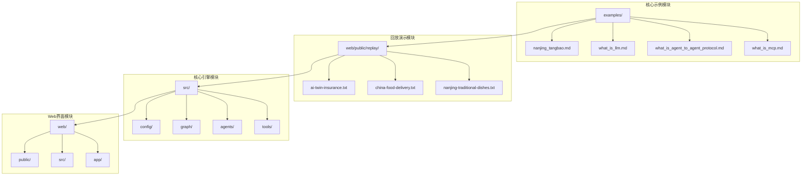
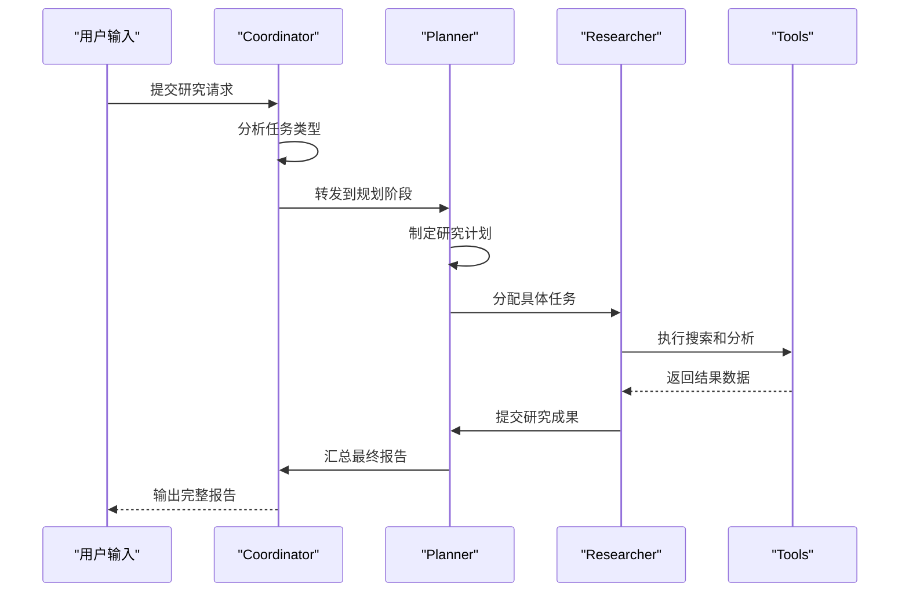
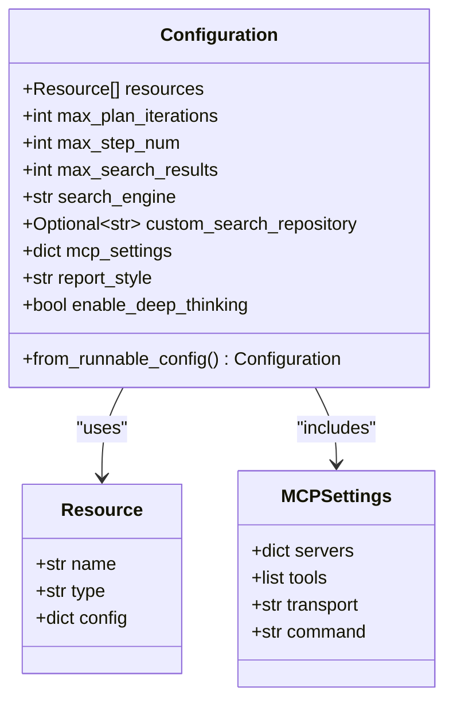

# DeerFlow 基础示例文档

<cite>
**本文档引用的文件**
- [nanjing_tangbao.md](file://examples/nanjing_tangbao.md)
- [what_is_llm.md](file://examples/what_is_llm.md)
- [what_is_agent_to_agent_protocol.md](file://examples/what_is_agent_to_agent_protocol.md)
- [what_is_mcp.md](file://examples/what_is_mcp.md)
- [ai-twin-insurance.txt](file://web/public/replay/ai-twin-insurance.txt)
- [china-food-delivery.txt](file://web/public/replay/china-food-delivery.txt)
- [nanjing-traditional-dishes.txt](file://web/public/replay/nanjing-traditional-dishes.txt)
- [configuration.py](file://src/config/configuration.py)
- [nodes.py](file://src/graph/nodes.py)
</cite>

## 目录
1. [简介](#简介)
2. [项目结构概览](#项目结构概览)
3. [核心基础示例分析](#核心基础示例分析)
4. [多智能体协作研究流程](#多智能体协作研究流程)
5. [基础回放文件详解](#基础回放文件详解)
6. [系统配置与架构](#系统配置与架构)
7. [执行步骤与预期输出](#执行步骤与预期输出)
8. [学习要点与最佳实践](#学习要点与最佳实践)
9. [故障排除指南](#故障排除指南)
10. [总结](#总结)

## 简介

DeerFlow 是一个基于多智能体协作的研究系统，旨在通过人工智能技术实现复杂的任务分解、信息收集和综合分析。本文档系统化整理了 DeerFlow 的基础示例，展示了系统的基本使用方法和核心功能，帮助初学者快速上手并理解多智能体协作研究的基本流程。

系统的核心理念是通过协调者（Coordinator）、规划者（Planner）、研究员（Researcher）等不同角色的智能体协作，完成从简单查询到复杂研究报告的全流程任务。每个基础示例都体现了这种多智能体协作的研究模式，为用户提供清晰的学习路径和实际应用参考。

## 项目结构概览

DeerFlow 采用模块化的架构设计，主要包含以下核心组件：



**图表来源**
- [examples/nanjing_tangbao.md](file://examples/nanjing_tangbao.md#L1-L73)
- [web/public/replay/ai-twin-insurance.txt](file://web/public/replay/ai-twin-insurance.txt#L1-L50)
- [src/config/configuration.py](file://src/config/configuration.py#L1-L71)

## 核心基础示例分析

### 南京小笼包文化研究示例

南京小笼包示例是一个典型的文化研究案例，展示了系统如何处理特定主题的深度研究任务。

#### 示例特点
- **主题明确**：专注于南京传统美食文化
- **结构完整**：包含历史背景、制作工艺、文化意义等多个维度
- **数据丰富**：整合了多个权威来源的信息
- **格式规范**：采用标准的研究报告格式

#### 关键要素
1. **历史与文化背景**：追溯南京小笼包的历史渊源
2. **制作工艺细节**：详细描述传统制作方法
3. **现代创新**：展示现代化改良版本
4. **社会影响**：分析对当地经济和文化的贡献

### 大型语言模型（LLM）技术报告

LLM 技术报告提供了对人工智能核心技术的全面分析，是技术研究的典型范例。

#### 报告结构
- **执行摘要**：概述 LLM 的基本概念和重要性
- **技术架构**：详细解释 Transformer 架构和训练方法
- **应用场景**：列举各种实际应用领域
- **性能评估**：提供标准化的评估指标
- **局限性分析**：客观评价存在的问题和挑战
- **伦理考量**：讨论相关的道德和社会影响

### 多智能体协议研究

Agent-to-Agent 协议和 MCP（Model Context Protocol）示例展示了系统在处理新兴技术标准方面的研究能力。

#### 协议特性
- **标准化通信**：建立统一的智能体间通信标准
- **跨平台兼容**：支持不同框架和系统的智能体互操作
- **扩展性强**：具备良好的可扩展性和社区驱动特性
- **实际应用**：展示在真实场景中的部署和效果

**章节来源**
- [examples/nanjing_tangbao.md](file://examples/nanjing_tangbao.md#L1-L73)
- [examples/what_is_llm.md](file://examples/what_is_llm.md#L1-L107)
- [examples/what_is_agent_to_agent_protocol.md](file://examples/what_is_agent_to_agent_protocol.md#L1-L54)
- [examples/what_is_mcp.md](file://examples/what_is_mcp.md#L1-L51)

## 多智能体协作研究流程

DeerFlow 的多智能体协作遵循严格的流程化管理，确保研究质量和效率。



**图表来源**
- [web/public/replay/ai-twin-insurance.txt](file://web/public/replay/ai-twin-insurance.txt#L1-L100)
- [web/public/replay/china-food-delivery.txt](file://web/public/replay/china-food-delivery.txt#L1-L100)

### 协作机制详解

#### 协调者（Coordinator）
负责接收用户请求，评估任务复杂度，并决定是否需要转交给规划者。协调者确保任务分配的合理性和流程的顺畅性。

#### 规划者（Planner）
制定详细的研究计划，包括：
- 确定研究目标和范围
- 设计研究步骤和时间线
- 分配资源和工具
- 预测潜在问题和解决方案

#### 研究员（Researcher）
执行具体的搜索和分析任务，利用各种工具获取高质量的数据和信息。

### 流程优势

1. **专业化分工**：每个智能体专注于自己的专业领域
2. **流程标准化**：确保研究过程的一致性和可重复性
3. **质量控制**：通过多层审核保证输出质量
4. **效率提升**：并行处理和任务分解提高整体效率

**章节来源**
- [web/public/replay/ai-twin-insurance.txt](file://web/public/replay/ai-twin-insurance.txt#L1-L500)
- [web/public/replay/china-food-delivery.txt](file://web/public/replay/china-food-delivery.txt#L1-L500)

## 基础回放文件详解

回放文件是 DeerFlow 系统的重要组成部分，它们记录了完整的交互过程，为功能演示和调试提供了宝贵的参考资料。

### 回放文件类型

#### AI 双胞胎保险研究回放
记录了关于"是否应该为 AI 双胞胎投保"这一复杂议题的完整研究过程。

**主要内容**：
- 任务分析和目标设定
- 研究计划制定
- 数据收集和分析
- 结论形成和报告撰写

**技术特点**：
- 支持多轮对话和上下文保持
- 实时工具调用和结果展示
- 详细的思考过程记录

#### 中国外卖市场分析回放
展示了对中国外卖市场竞争格局的深入分析。

**分析维度**：
- 历史发展轨迹
- 当前市场格局
- 竞争策略对比
- 未来发展趋势

#### 南京传统美食回放
记录了对南京特色美食的全面研究过程。

**研究重点**：
- 地方特色和文化价值
- 制作工艺和技术创新
- 市场影响和经济价值
- 保护和传承策略

### 回放文件的用途

1. **功能演示**：展示系统的核心能力和工作流程
2. **调试分析**：帮助开发者理解和优化系统行为
3. **培训教育**：作为教学材料帮助用户学习系统使用
4. **质量验证**：验证系统输出的准确性和一致性

### 文件格式特征

回放文件采用事件流格式，每条记录包含：
- 时间戳和会话标识
- 智能体身份和角色
- 交互内容和状态变化
- 工具调用和结果反馈

**章节来源**
- [web/public/replay/ai-twin-insurance.txt](file://web/public/replay/ai-twin-insurance.txt#L1-L1000)
- [web/public/replay/china-food-delivery.txt](file://web/public/replay/china-food-delivery.txt#L1-L1000)
- [web/public/replay/nanjing-traditional-dishes.txt](file://web/public/replay/nanjing-traditional-dishes.txt#L1-L500)

## 系统配置与架构

### 配置管理系统

DeerFlow 采用灵活的配置系统，支持多种参数的动态调整。



**图表来源**
- [src/config/configuration.py](file://src/config/configuration.py#L30-L71)

### 核心配置参数

#### 资源配置
- `resources`: 定义可用的研究资源和数据源
- 支持多种类型的资源：数据库、API、文件系统等

#### 计划配置
- `max_plan_iterations`: 最大计划迭代次数
- `max_step_num`: 每个计划的最大步骤数
- 控制研究深度和计算成本

#### 搜索配置
- `search_engine`: 默认搜索引擎选择
- `max_search_results`: 每次搜索的最大结果数
- `custom_search_repository`: 自定义搜索仓库配置

#### MCP 设置
- `mcp_settings`: Model Context Protocol 配置
- 支持动态加载工具和服务
- 实现智能体间的标准化通信

### 架构设计原则

1. **模块化设计**：各组件职责明确，便于维护和扩展
2. **插件化架构**：支持第三方工具和服务的集成
3. **配置驱动**：通过配置文件控制系统行为
4. **可扩展性**：支持新功能和新智能体的添加

**章节来源**
- [src/config/configuration.py](file://src/config/configuration.py#L1-L71)
- [src/graph/nodes.py](file://src/graph/nodes.py#L434-L460)

## 执行步骤与预期输出

### 基础示例执行流程

#### 步骤 1：准备环境
```bash
# 启动系统环境
make install
make start

# 或使用 Docker
docker-compose up
```

#### 步骤 2：加载示例
```python
# 加载基础示例
from deerflow.examples import load_example
example = load_example("nanjing_tangbao")

# 或直接运行预设任务
from deerflow.tasks import run_task
result = run_task("南京小笼包文化研究")
```

#### 步骤 3：配置参数
```python
# 设置研究参数
config = {
    "max_plan_iterations": 2,
    "max_step_num": 5,
    "report_style": "academic",
    "enable_deep_thinking": True
}
```

#### 步骤 4：执行研究
```python
# 开始研究任务
researcher = DeerFlowResearcher(config=config)
results = researcher.execute(example)
```

### 预期输出格式

#### 文档输出
- **结构化文本**：符合学术或商业标准的报告格式
- **多媒体内容**：图片、图表、引用列表等
- **元数据信息**：作者、日期、版本号等

#### 数据输出
- **原始数据**：搜索结果、分析数据等
- **中间结果**：研究过程中的临时输出
- **最终报告**：完整的研究成果文档

### 性能指标

#### 输出质量
- **准确性**：信息正确性和事实核实
- **完整性**：覆盖所有相关方面和细节
- **一致性**：格式和风格的统一性

#### 处理效率
- **响应时间**：从请求到输出的平均时间
- **资源消耗**：CPU、内存、网络等资源使用
- **并发能力**：同时处理多个任务的能力

## 学习要点与最佳实践

### 初学者入门建议

#### 1. 从简单示例开始
- 先尝试南京小笼包这样的文化研究示例
- 逐步过渡到更复杂的 LLM 技术报告
- 理解多智能体协作的基本原理

#### 2. 掌握配置技巧
- 理解各个配置参数的作用和影响
- 根据任务需求调整参数设置
- 学会使用环境变量进行配置管理

#### 3. 熟悉回放文件
- 仔细阅读回放文件中的交互过程
- 学习如何解读事件流格式
- 利用回放文件进行调试和优化

### 高级用户进阶技巧

#### 1. 自定义智能体
```python
# 创建自定义研究员智能体
class CustomResearcher(Agent):
    def __init__(self, tools=None):
        super().__init__()
        self.tools = tools or []
    
    async def research(self, query):
        # 实现自定义研究逻辑
        pass
```

#### 2. 扩展工具集
- 添加新的搜索工具
- 集成外部 API 服务
- 开发专用的数据处理工具

#### 3. 优化研究流程
- 调整智能体间的协作策略
- 优化资源分配和任务调度
- 实现缓存和增量更新机制

### 最佳实践总结

1. **明确研究目标**：在开始前确定清晰的研究目标和范围
2. **合理配置参数**：根据任务复杂度调整系统参数
3. **充分利用工具**：善用各种内置和自定义工具
4. **注重质量控制**：定期检查输出质量和准确性
5. **持续优化改进**：根据使用经验不断优化系统配置

## 故障排除指南

### 常见问题及解决方案

#### 1. 系统启动失败
**症状**：无法正常启动 DeerFlow 服务
**原因**：依赖项缺失或配置错误
**解决方案**：
```bash
# 检查依赖安装
pip install -r requirements.txt

# 验证配置文件
python -m deerflow.validate_config

# 查看启动日志
tail -f logs/deerflow.log
```

#### 2. 搜索结果不准确
**症状**：返回的结果与查询无关或质量低下
**原因**：搜索配置不当或工具失效
**解决方案**：
```python
# 调整搜索参数
config = {
    "search_engine": "bing",  # 更换搜索引擎
    "max_search_results": 5,  # 增加结果数量
    "custom_search_repository": "new_repo"  # 使用新的搜索仓库
}
```

#### 3. 智能体协作异常
**症状**：多智能体协作过程中出现错误
**原因**：消息传递或状态同步问题
**解决方案**：
- 检查网络连接稳定性
- 验证智能体配置正确性
- 查看详细的错误日志

#### 4. 性能问题
**症状**：系统响应缓慢或资源占用过高
**原因**：配置参数不合理或系统负载过高
**解决方案**：
```python
# 优化系统配置
config = {
    "max_plan_iterations": 1,  # 减少迭代次数
    "enable_deep_thinking": False,  # 禁用深度思考
    "recursion_limit": 10  # 限制递归深度
}
```

### 调试技巧

#### 1. 启用详细日志
```python
import logging
logging.basicConfig(level=logging.DEBUG)
```

#### 2. 使用回放文件分析
```python
# 重放特定场景
from deerflow.utils import replay_session
replay_session("ai-twin-insurance.txt")
```

#### 3. 监控系统状态
```python
# 检查系统健康状态
from deerflow.monitoring import HealthChecker
checker = HealthChecker()
status = checker.get_status()
print(status)
```

## 总结

DeerFlow 的基础示例系统为我们提供了一个完整的多智能体协作研究平台。通过分析核心示例文件和回放记录，我们可以看到系统在以下几个方面的优势：

### 核心价值

1. **标准化流程**：通过协调者、规划者、研究员的协作模式，实现了研究流程的标准化和自动化
2. **多样化应用**：从文化研究到技术分析，从市场调研到学术论文，系统能够适应多种应用场景
3. **高质量输出**：通过严格的流程控制和质量检查，确保输出内容的准确性和专业性
4. **易于扩展**：模块化的设计使得系统可以轻松添加新的功能和智能体

### 学习路径

对于初学者来说，建议按照以下顺序学习：
1. 从简单的文化研究示例开始，理解基本概念
2. 学习技术报告的编写方法，掌握专业技能
3. 研究多智能体协议，了解前沿技术
4. 实践回放文件的分析和调试
5. 尝试自定义配置和扩展功能

### 发展前景

随着人工智能技术的不断发展，DeerFlow 这样的多智能体协作系统将在更多领域发挥重要作用。通过持续的优化和扩展，系统有望在科学研究、商业分析、教育培训等方面创造更大的价值。

通过本文档的详细介绍，相信读者已经对 DeerFlow 的基础示例有了全面的理解。希望这些内容能够帮助您更好地使用系统，探索人工智能在研究领域的无限可能。