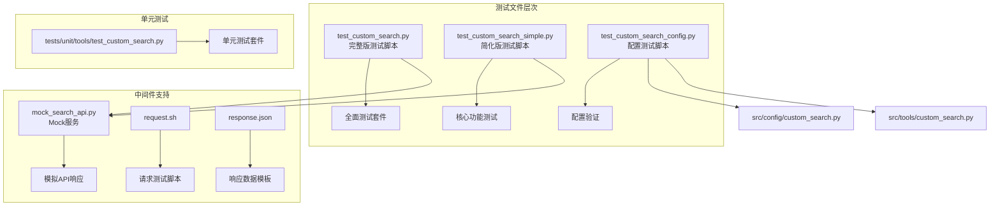
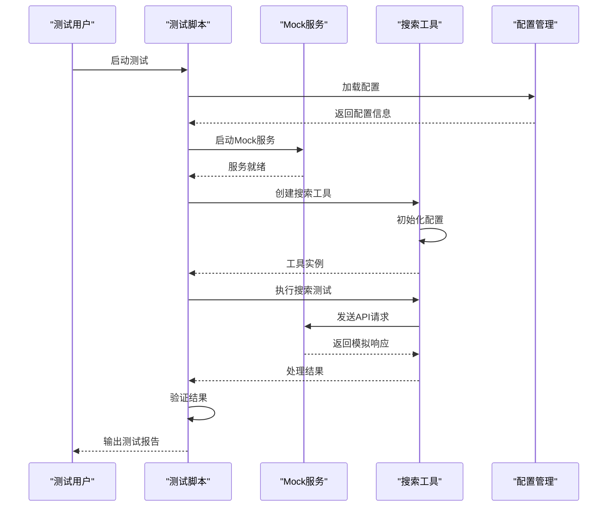
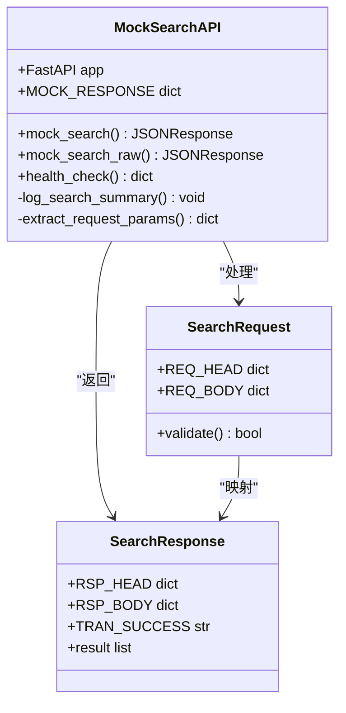
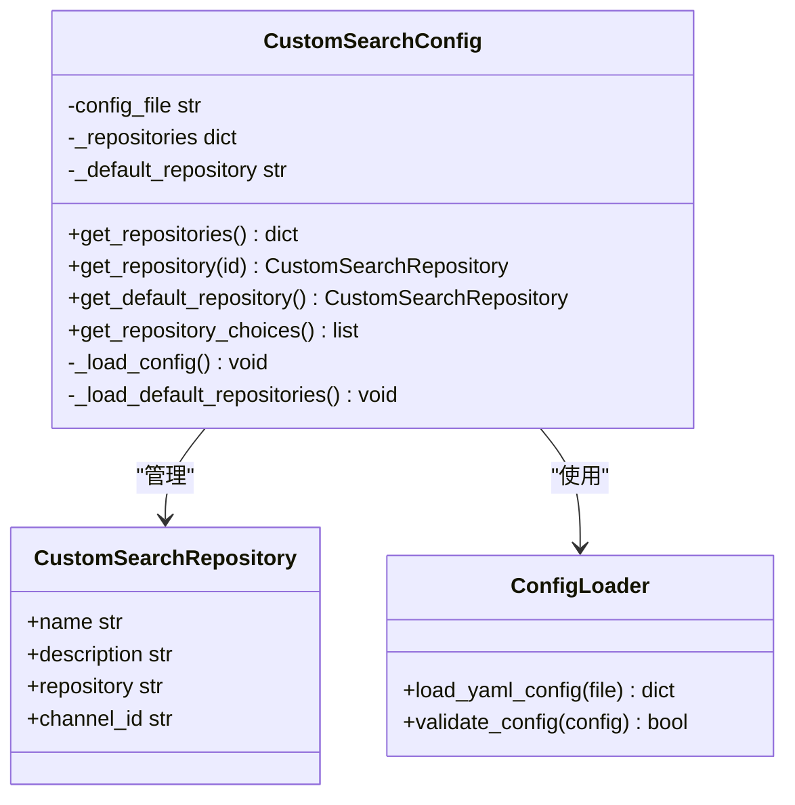
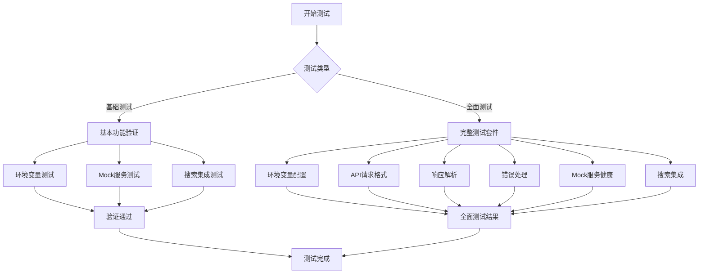
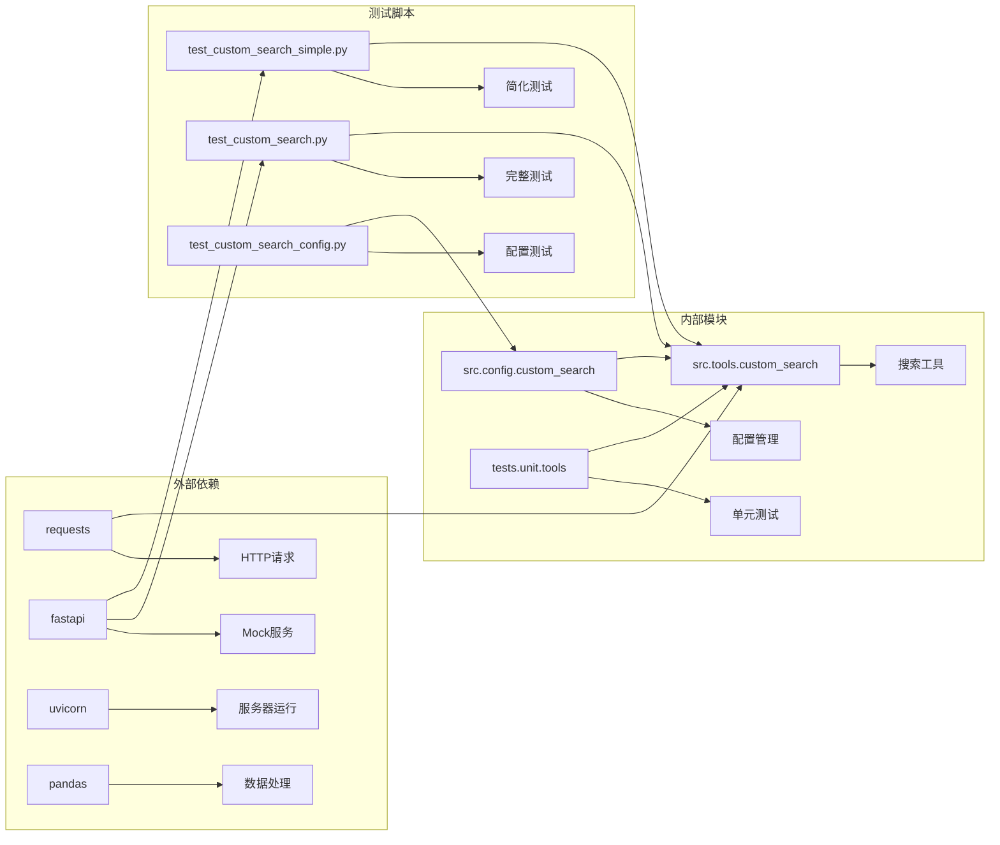

# 测试示例

<cite>
**本文档引用的文件**
- [test_custom_search.py](file://test_custom_search.py)
- [test_custom_search_config.py](file://test_custom_search_config.py)
- [test_custom_search_simple.py](file://test_custom_search_simple.py)
- [test_custom_search_README.md](file://test_custom_search_README.md)
- [mock_search_api.py](file://middlewares/search/mock_search_api.py)
- [test_custom_search.py](file://tests/unit/tools/test_custom_search.py)
- [custom_search.py](file://src/config/custom_search.py)
- [custom_search.py](file://src/tools/custom_search.py)
</cite>

## 目录
1. [简介](#简介)
2. [项目结构](#项目结构)
3. [核心测试组件](#核心测试组件)
4. [架构概览](#架构概览)
5. [详细组件分析](#详细组件分析)
6. [依赖关系分析](#依赖关系分析)
7. [性能考虑](#性能考虑)
8. [故障排除指南](#故障排除指南)
9. [结论](#结论)

## 简介

DeerFlow项目提供了全面的测试示例框架，专门用于验证自定义搜索工具的功能和性能。该测试框架包含三个主要版本的测试脚本，从简单功能验证到全面的集成测试，为开发者提供了完整的测试解决方案。

测试框架的核心目标是确保自定义搜索工具的正确性、稳定性和性能表现，涵盖从环境配置到API调用的各个环节。通过多层次的测试策略，开发者可以快速定位问题并验证功能完整性。

## 项目结构

测试示例项目采用模块化设计，包含多个层次的测试文件和工具：



**图表来源**
- [test_custom_search.py](file://test_custom_search.py#L1-L50)
- [test_custom_search_simple.py](file://test_custom_search_simple.py#L1-L50)
- [mock_search_api.py](file://middlewares/search/mock_search_api.py#L1-L50)

**章节来源**
- [test_custom_search.py](file://test_custom_search.py#L1-L100)
- [test_custom_search_simple.py](file://test_custom_search_simple.py#L1-L100)
- [test_custom_search_config.py](file://test_custom_search_config.py#L1-L100)

## 核心测试组件

### 完整版测试脚本 (test_custom_search.py)

完整版测试脚本提供了最全面的功能验证，包含以下核心测试模块：

#### 环境变量配置测试
- 验证所有必需环境变量的正确加载
- 测试默认值回退机制
- 确保配置的安全备份和恢复

#### API请求格式测试
- 验证HTTP请求头格式
- 测试JSON请求体结构
- 确认用户代理和认证信息

#### 响应解析测试
- 验证API响应的数据转换
- 测试content和absContent的回退机制
- 确保结果按分数排序

#### 错误处理测试
- 模拟网络连接失败
- 验证API错误响应处理
- 测试异常情况下的优雅降级

### 简化版测试脚本 (test_custom_search_simple.py)

简化版测试脚本专注于核心功能验证，适合快速验证基本功能：

#### 基本功能测试
- 工具实例化和配置验证
- 环境变量处理机制
- 配置参数加载测试

#### Mock服务集成
- 服务连接状态检查
- API调用功能验证
- 响应数据解析测试

#### 搜索集成测试
- 实际搜索功能验证
- 结果展示和过滤
- 性能基准测试

**章节来源**
- [test_custom_search.py](file://test_custom_search.py#L25-L150)
- [test_custom_search_simple.py](file://test_custom_search_simple.py#L25-L100)

## 架构概览

测试框架采用分层架构设计，确保测试的独立性和可维护性：



**图表来源**
- [test_custom_search.py](file://test_custom_search.py#L30-L80)
- [mock_search_api.py](file://middlewares/search/mock_search_api.py#L100-L200)

## 详细组件分析

### Mock服务组件

Mock服务是测试框架的核心基础设施，提供可靠的测试环境：



**图表来源**
- [mock_search_api.py](file://middlewares/search/mock_search_api.py#L50-L150)

#### Mock服务特性
- **双接口支持**: 同时支持JSON请求体和原始JSON格式
- **参数提取**: 智能解析嵌套的请求结构
- **日志增强**: 详细的请求处理日志记录
- **错误处理**: 完善的异常处理和回退机制

#### API端点设计
- `POST /ELLM.ELLM-OFFICE.V-1.0/querySources.do/json`: 结构化请求接口
- `POST /ELLM.ELLM-OFFICE.V-1.0/querySources.do`: 兼容性接口
- `GET /health`: 健康检查接口

### 配置管理系统

配置管理系统负责管理自定义搜索的各种配置选项：



**图表来源**
- [custom_search.py](file://src/config/custom_search.py#L15-L80)

#### 配置选项
- **API URL配置**: 搜索服务的基础URL
- **Repository设置**: 数据源标识符
- **Channel ID配置**: 搜索渠道标识
- **用户认证信息**: 用户身份验证参数

**章节来源**
- [mock_search_api.py](file://middlewares/search/mock_search_api.py#L1-L100)
- [custom_search.py](file://src/config/custom_search.py#L1-L120)

### 测试工具组件

测试工具组件提供了丰富的测试功能和验证机制：

#### 测试套件结构


**图表来源**
- [test_custom_search.py](file://test_custom_search.py#L350-L433)

#### 测试验证功能
- **颜色输出**: 支持绿色和紫色主题的颜色输出
- **自动检测**: 智能检测Mock服务状态
- **详细统计**: 提供详细的测试结果统计
- **安全备份**: 环境变量的安全备份和恢复机制

**章节来源**
- [test_custom_search.py](file://test_custom_search.py#L100-L200)

## 依赖关系分析

测试框架的依赖关系清晰明确，确保各组件间的松耦合：



**图表来源**
- [test_custom_search.py](file://test_custom_search.py#L1-L20)
- [mock_search_api.py](file://middlewares/search/mock_search_api.py#L1-L20)

### 关键依赖项
- **requests**: 用于HTTP请求发送和响应处理
- **fastapi**: 提供高性能的Mock服务框架
- **pydantic**: 数据验证和序列化
- **pytest**: 单元测试框架支持

**章节来源**
- [test_custom_search.py](file://test_custom_search.py#L1-L30)
- [mock_search_api.py](file://middlewares/search/mock_search_api.py#L1-L30)

## 性能考虑

测试框架在设计时充分考虑了性能优化：

### 并发处理能力
- **异步支持**: 支持异步搜索操作
- **批量处理**: 支持批量搜索请求
- **缓存机制**: 实现智能缓存策略

### 资源管理
- **连接池**: 使用连接池优化网络请求
- **内存管理**: 合理的内存使用和垃圾回收
- **超时控制**: 智能的超时设置和重试机制

### 性能监控
- **响应时间**: 监控API响应时间和成功率
- **资源使用**: 跟踪CPU和内存使用情况
- **错误率**: 统计各类错误的发生频率

## 故障排除指南

### 常见问题及解决方案

#### Mock服务连接问题
```bash
# 检查服务状态
curl http://localhost:8010/health

# 重启Mock服务
cd middlewares/search
python mock_search_api.py
```

#### 环境变量配置错误
```bash
# 设置必需的环境变量
export CUSTOM_SEARCH_API_URL="http://localhost:8010/ELLM.ELLM-OFFICE.V-1.0/querySources.do"
export CUSTOM_SEARCH_REPOSITORY="test-repository"
export CUSTOM_SEARCH_CHANNEL_ID="0"
```

#### 配置文件问题
- 检查conf.yaml文件格式
- 验证YAML语法正确性
- 确认配置项存在且有效

### 调试技巧

#### 启用详细日志
```python
import logging
logging.basicConfig(level=logging.DEBUG)
```

#### 使用测试工具
```bash
# 运行特定测试
python test_custom_search.py --comprehensive

# 单独运行配置测试
python test_custom_search_config.py
```

**章节来源**
- [test_custom_search.py](file://test_custom_search.py#L300-L400)
- [test_custom_search_simple.py](file://test_custom_search_simple.py#L150-L200)

## 结论

DeerFlow项目的测试示例框架提供了一个完整、可靠且易于使用的测试解决方案。通过多层次的测试策略和丰富的验证功能，开发者可以确保自定义搜索工具的质量和稳定性。

### 主要优势
- **全面覆盖**: 从基本功能到高级特性的全方位测试
- **灵活配置**: 支持多种配置选项和环境设置
- **易于使用**: 简洁的命令行接口和详细的帮助信息
- **可靠稳定**: 完善的错误处理和回退机制

### 最佳实践建议
1. **定期运行测试**: 将测试集成到CI/CD流程中
2. **监控性能指标**: 关注响应时间和错误率变化
3. **保持配置更新**: 及时更新测试配置和Mock数据
4. **扩展测试范围**: 根据需要添加新的测试用例

通过遵循这些指导原则和使用提供的测试工具，开发者可以构建高质量、高性能的自定义搜索解决方案。