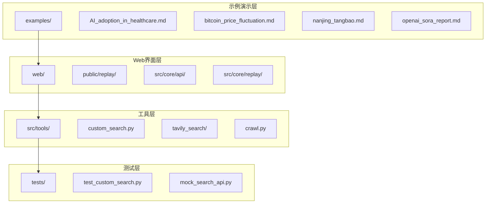
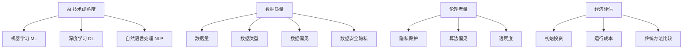
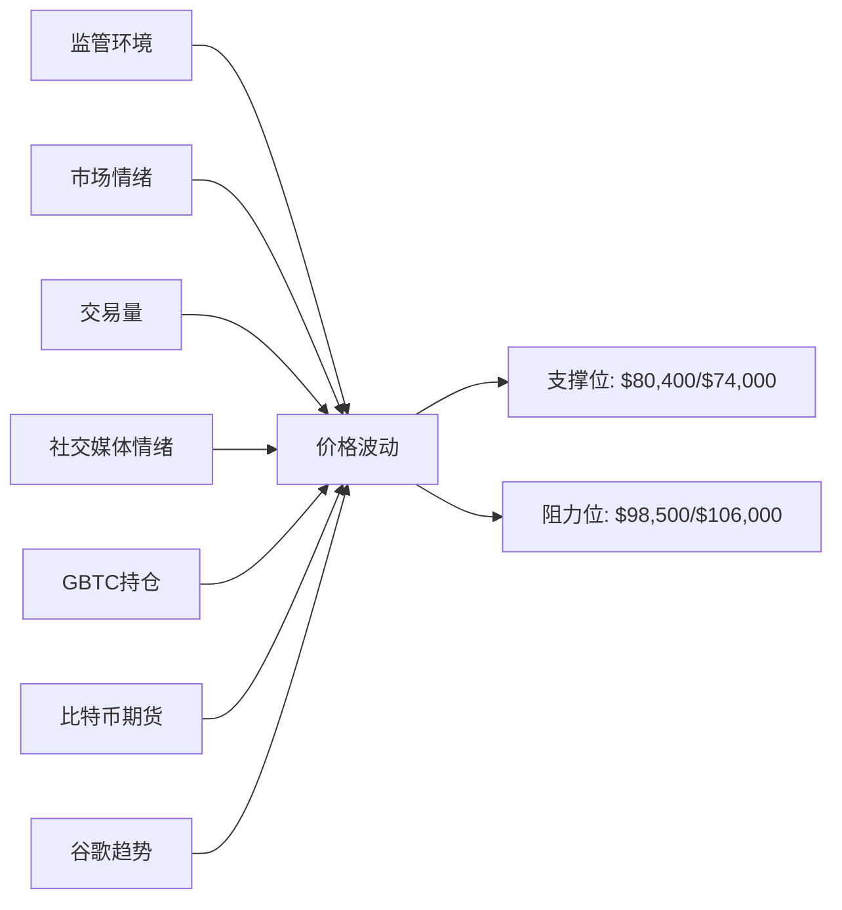
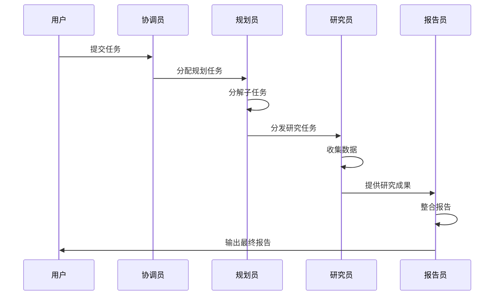
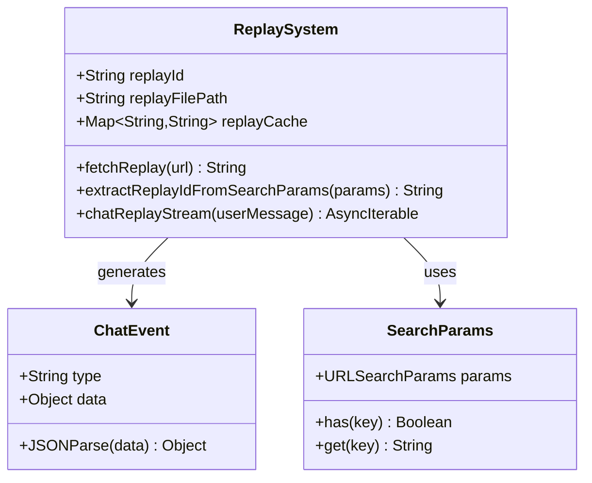
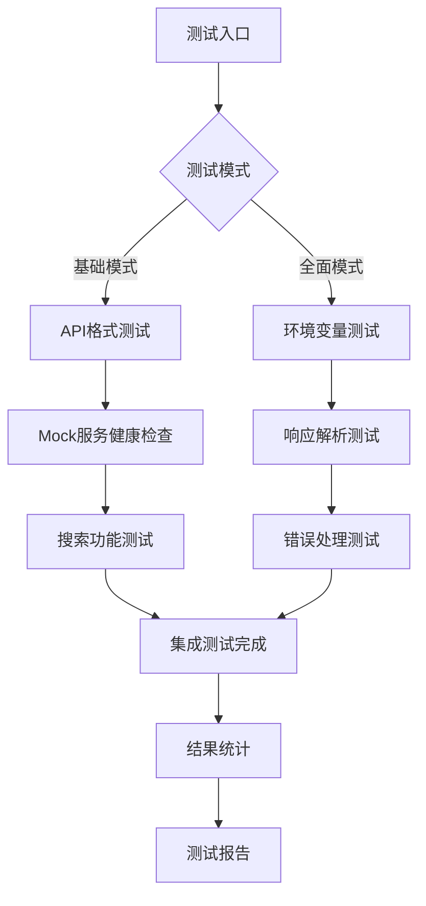
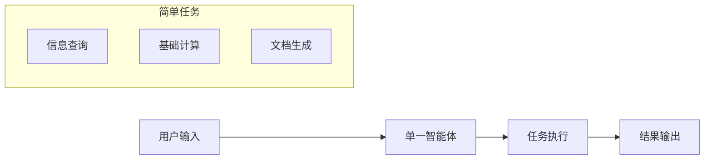
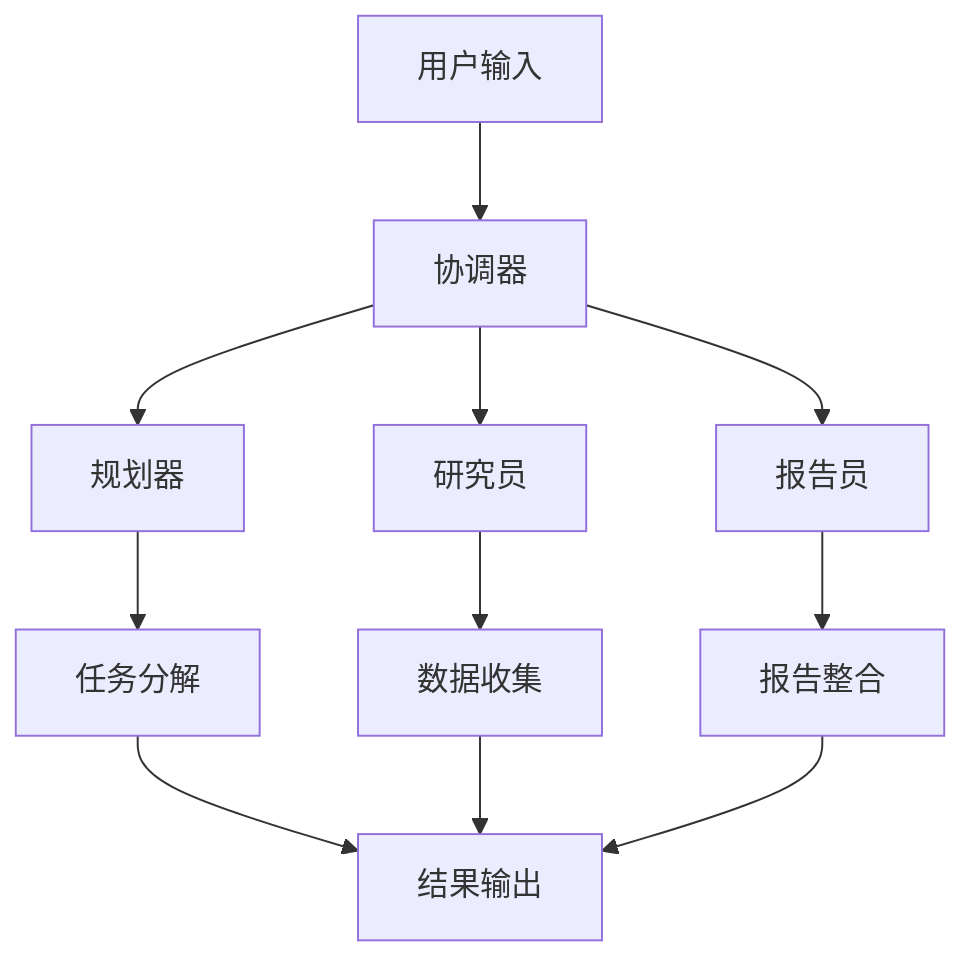
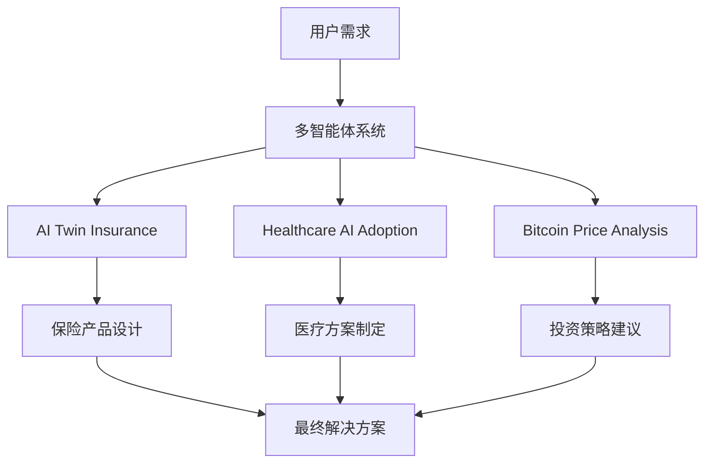

# DeerFlow 示例演示文档

<cite>
**本文档引用的文件**
- [examples/AI_adoption_in_healthcare.md](file://examples/AI_adoption_in_healthcare.md)
- [examples/bitcoin_price_fluctuation.md](file://examples/bitcoin_price_fluctuation.md)
- [web/public/replay/ai-twin-insurance.txt](file://web/public/replay/ai-twin-insurance.txt)
- [test_custom_search.py](file://test_custom_search.py)
- [middlewares/search/mock_search_api.py](file://middlewares/search/mock_search_api.py)
- [web/src/core/api/chat.ts](file://web/src/core/api/chat.ts)
- [web/src/core/replay/get-replay-id.ts](file://web/src/core/replay/get-replay-id.ts)
- [web/src/core/replay/hooks.ts](file://web/src/core/replay/hooks.ts)
</cite>

## 目录
1. [简介](#简介)
2. [项目结构概览](#项目结构概览)
3. [AI 在医疗保健中的采用案例](#ai-在医疗保健中的采用案例)
4. [比特币价格波动分析案例](#比特币价格波动分析案例)
5. [多智能体协作研究演示](#多智能体协作研究演示)
6. [回放文件系统详解](#回放文件系统详解)
7. [系统集成测试方法](#系统集成测试方法)
8. [从简单到复杂的示例梯度](#从简单到复杂的示例梯度)
9. [最佳实践指南](#最佳实践指南)
10. [故障排除指南](#故障排除指南)

## 简介

DeerFlow 是一个先进的多智能体协作平台，旨在展示人工智能在复杂任务中的应用能力。本文档通过详细的示例和演示，系统性地展示了 DeerFlow 如何体现多智能体协作研究的特点，并为用户提供从基础到高级的功能掌握方法。

## 项目结构概览

DeerFlow 项目采用模块化架构，主要包含以下核心组件：



**图表来源**
- [examples/AI_adoption_in_healthcare.md](file://examples/AI_adoption_in_healthcare.md#L1-L110)
- [web/public/replay/ai-twin-insurance.txt](file://web/public/replay/ai-twin-insurance.txt#L1-L50)

## AI 在医疗保健中的采用案例

### 案例概述

AI adoption in healthcare 案例展示了人工智能技术在医疗保健领域的广泛应用和影响因素分析。该案例体现了 DeerFlow 平台在处理复杂、多维度问题时的能力。

### 关键技术要素



**图表来源**
- [examples/AI_adoption_in_healthcare.md](file://examples/AI_adoption_in_healthcare.md#L19-L74)

### 实施步骤详解

1. **技术验证阶段**
   - 使用多样化数据集进行全面测试
   - 避免过拟合，确保算法准确性
   - 验证 AI 算法的可靠性和性能

2. **数据质量管理**
   - 大规模数据集训练需求
   - 结构化和非结构化数据处理
   - 数据偏见识别和缓解策略

3. **伦理和法律框架**
   - 患者数据隐私保护
   - 算法决策透明度
   - 临床验证要求

**章节来源**
- [examples/AI_adoption_in_healthcare.md](file://examples/AI_adoption_in_healthcare.md#L1-L110)

## 比特币价格波动分析案例

### 市场分析框架

比特币价格波动案例展示了金融市场的动态分析能力，通过多维度数据源整合实现准确的价格预测。

### 影响因素分析



**图表来源**
- [examples/bitcoin_price_fluctuation.md](file://examples/bitcoin_price_fluctuation.md#L15-L33)

### 技术指标应用

- **支撑和阻力水平**: 关键技术分析指标
- **Crypto Fear and Greed Index**: 市场情绪指标
- **交易量分析**: 市场活跃度衡量
- **社交媒体分析**: 实时市场感知

**章节来源**
- [examples/bitcoin_price_fluctuation.md](file://examples/bitcoin_price_fluctuation.md#L1-L45)

## 多智能体协作研究演示

### AI Twin 保险案例分析

AI twin insurance 案例通过详细的回放文件展示了多智能体协作的完整流程，体现了 DeerFlow 平台在复杂任务分解和执行中的优势。

### 协作流程可视化



**图表来源**
- [web/public/replay/ai-twin-insurance.txt](file://web/public/replay/ai-twin-insurance.txt#L1-L100)

### 智能体角色分工

1. **协调员 (Coordinator)**: 任务分配和进度管理
2. **规划员 (Planner)**: 任务分解和时间规划
3. **研究员 (Researcher)**: 信息收集和数据分析
4. **报告员 (Reporter)**: 结果整合和报告撰写

**章节来源**
- [web/public/replay/ai-twin-insurance.txt](file://web/public/replay/ai-twin-insurance.txt#L1-L800)

## 回放文件系统详解

### 文件结构和用途

DeerFlow 的回放文件系统是平台的核心功能之一，通过事件流记录和重现用户交互过程。

### 回放文件格式

回放文件采用 SSE (Server-Sent Events) 格式，每行包含事件类型和数据：

```
event: message_chunk
data: {"thread_id": "...", "content": "..."}

event: tool_calls
data: {"agent": "planner", "tool_calls": [...]}
```

### 回放系统架构



**图表来源**
- [web/src/core/api/chat.ts](file://web/src/core/api/chat.ts#L68-L164)
- [web/src/core/replay/get-replay-id.ts](file://web/src/core/replay/get-replay-id.ts#L1-L9)

### 回放功能特性

1. **实时播放**: 支持实时消息流播放
2. **缓存机制**: 高效的回放文件缓存
3. **错误处理**: 完善的异常处理和恢复
4. **调试支持**: 便于开发和测试的回放功能

**章节来源**
- [web/src/core/api/chat.ts](file://web/src/core/api/chat.ts#L106-L196)

## 系统集成测试方法

### 自定义搜索工具测试

DeerFlow 提供了完整的集成测试框架，确保各组件间的协同工作。

### 测试架构设计



**图表来源**
- [test_custom_search.py](file://test_custom_search.py#L27-L69)

### 测试用例覆盖

1. **环境变量配置测试**
   - API URL 验证
   - Repository 设置检查
   - 用户认证信息验证

2. **API 请求格式测试**
   - 请求头构建
   - 请求体格式验证
   - 参数序列化测试

3. **响应解析测试**
   - JSON 解析验证
   - 数据转换测试
   - 错误回退机制

4. **集成测试**
   - Mock 服务连接
   - 端到端功能验证
   - 性能基准测试

**章节来源**
- [test_custom_search.py](file://test_custom_search.py#L27-L432)

## 从简单到复杂的示例梯度

### 基础示例：单智能体任务



### 中级示例：多智能体协作



### 高级示例：复杂业务场景



### 学习路径建议

1. **第一阶段**: 掌握基础 API 调用
2. **第二阶段**: 理解多智能体协作原理
3. **第三阶段**: 实现自定义智能体
4. **第四阶段**: 优化系统性能和稳定性

## 最佳实践指南

### 开发最佳实践

1. **模块化设计**
   - 保持组件职责单一
   - 使用清晰的接口定义
   - 实现良好的错误处理

2. **测试驱动开发**
   - 编写全面的单元测试
   - 使用 Mock 服务进行集成测试
   - 实施持续集成流程

3. **性能优化**
   - 实现响应式缓存机制
   - 优化网络请求频率
   - 使用异步处理提高并发性

### 部署最佳实践

1. **环境配置**
   ```bash
   # 设置必要的环境变量
   export CUSTOM_SEARCH_API_URL="http://localhost:8010/ELLM.ELLM-OFFICE.V-1.0/querySources.do"
   export CUSTOM_SEARCH_REPOSITORY="your-repository"
   ```

2. **监控和日志**
   - 实施结构化日志记录
   - 监控系统性能指标
   - 建立告警机制

3. **安全考虑**
   - 加密敏感数据传输
   - 实施访问控制机制
   - 定期安全审计

## 故障排除指南

### 常见问题及解决方案

1. **Mock 服务连接失败**
   ```bash
   # 启动 Mock 服务
   cd middlewares/search
   python mock_search_api.py
   
   # 检查服务状态
   curl http://localhost:8010/health
   ```

2. **API 调用超时**
   - 检查网络连接
   - 验证 API 地址配置
   - 调整超时设置

3. **回放文件加载失败**
   - 确认文件路径正确
   - 检查文件权限
   - 验证文件格式

### 调试技巧

1. **启用详细日志**
   ```python
   import logging
   logging.basicConfig(level=logging.DEBUG)
   ```

2. **使用测试模式**
   ```bash
   python test_custom_search.py --comprehensive
   ```

3. **检查环境变量**
   ```python
   import os
   print(os.environ.get("CUSTOM_SEARCH_API_URL"))
   ```

通过本文档的系统性介绍，用户可以全面了解 DeerFlow 平台的功能特性和最佳实践，从而更好地利用该平台解决复杂的业务问题。