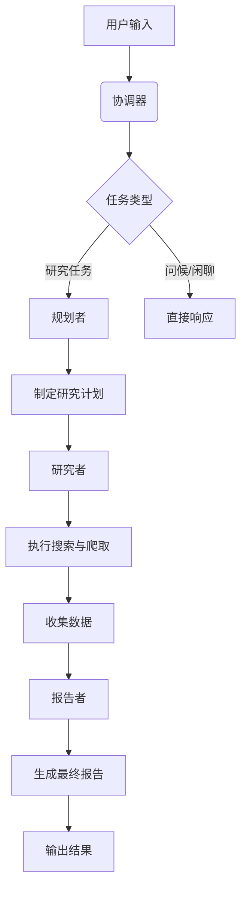
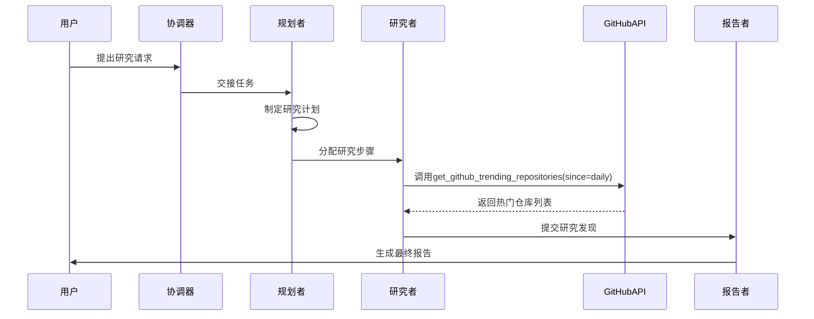

# GitHub热门项目分析

<cite>
**本文档引用的文件**   
- [github-top-trending-repo.txt](file://web/public/replay/github-top-trending-repo.txt)
- [tools.py](file://src/config/tools.py)
- [search.py](file://src/tools/search.py)
- [custom_search.py](file://src/tools/custom_search.py)
- [custom_search.py](file://src/config/custom_search.py)
- [agents.py](file://src/agents/agents.py)
- [agents.py](file://src/config/agents.py)
- [coordinator.md](file://src/prompts/coordinator.md)
- [planner.md](file://src/prompts/planner.md)
- [researcher.md](file://src/prompts/researcher.md)
- [crawl.py](file://src/tools/crawl.py)
- [crawler.py](file://src/crawler/crawler.py)
- [article.py](file://src/crawler/article.py)
- [conf.yaml](file://conf.yaml)
- [workflow.py](file://src/workflow.py)
</cite>

## 目录
1. [引言](#引言)
2. [系统架构与工作流](#系统架构与工作流)
3. [技术趋势识别机制](#技术趋势识别机制)
4. [项目技术栈与社区活跃度分析](#项目技术栈与社区活跃度分析)
5. [多维度信息整合与评估框架](#多维度信息整合与评估框架)
6. [案例分析：Suna项目](#案例分析suna项目)
7. [结论](#结论)

## 引言
DeerFlow系统是一个先进的AI代理平台，专门用于执行深度研究和信息分析任务。本报告旨在深入分析DeerFlow系统在技术趋势分析和开源项目评估方面的能力。通过解析`github-top-trending-repo.txt`回放文件，我们将详细探讨系统如何识别GitHub上的热门趋势、分析项目的技术栈、评估社区活跃度并预测项目发展潜力。该系统通过整合代码质量指标、开发者贡献模式和应用场景分析等多维度信息，展示了其强大的技术洞察力、对开源生态的深刻理解以及全面的项目评估框架。

**Section sources**
- [github-top-trending-repo.txt](file://web/public/replay/github-top-trending-repo.txt)

## 系统架构与工作流
DeerFlow系统采用了一个基于代理（Agent）的分布式架构，通过多个专业代理协同工作来完成复杂的任务。系统的核心工作流由协调器（Coordinator）、规划者（Planner）、研究者（Researcher）和报告者（Reporter）四个主要代理组成。当用户提出请求时，协调器首先接收输入并判断任务类型，然后将研究任务交接给规划者。规划者负责制定详细的研究计划，将复杂问题分解为多个可执行的步骤。研究者根据计划执行具体的搜索和数据收集任务，利用各种工具获取所需信息。最后，报告者整合所有收集到的数据，生成结构化的最终报告。

**Diagram sources**
- [agents.py](file://src/agents/agents.py)
- [coordinator.md](file://src/prompts/coordinator.md)
- [planner.md](file://src/prompts/planner.md)
- [researcher.md](file://src/prompts/researcher.md)

**Section sources**
- [agents.py](file://src/agents/agents.py)
- [coordinator.md](file://src/prompts/coordinator.md)
- [planner.md](file://src/prompts/planner.md)
- [researcher.md](file://src/prompts/researcher.md)
- [workflow.py](file://src/workflow.py)

## 技术趋势识别机制
DeerFlow系统通过集成专门的MCP（Model Control Protocol）工具来识别GitHub上的技术趋势。系统利用`get_github_trending_repositories`这一MCP工具，直接从GitHub获取实时的热门仓库数据。该工具能够根据指定的时间范围（如每日、每周、每月）返回当前最热门的开源项目列表，包括项目名称、描述、主要编程语言、星标数、派生数以及近期增长的星标数等关键指标。通过这种方式，系统能够快速准确地识别出当前最受开发者社区关注的技术趋势。

**Diagram sources**
- [workflow.py](file://src/workflow.py)
- [researcher.md](file://src/prompts/researcher.md)

**Section sources**
- [workflow.py](file://src/workflow.py)
- [researcher.md](file://src/prompts/researcher.md)

## 项目技术栈与社区活跃度分析
在识别出热门项目后，DeerFlow系统会深入分析项目的技术栈和社区活跃度。系统首先通过`web_search`工具进行网络搜索，收集关于项目背景、应用场景和行业影响的广泛信息。随后，系统尝试使用`crawl_tool`工具直接爬取项目仓库页面，以获取更详细的代码结构、文件组织和文档信息。尽管在分析Suna项目时因账户余额不足而未能成功爬取，但系统仍能通过其他途径收集到关键信息。对于社区活跃度的评估，系统会分析项目的星标增长趋势、贡献者数量、提交频率以及社区讨论的活跃程度，从而全面评估项目的健康状况和发展潜力。

**Section sources**
- [search.py](file://src/tools/search.py)
- [crawl.py](file://src/tools/crawl.py)
- [crawler.py](file://src/crawler/crawler.py)
- [article.py](file://src/crawler/article.py)

## 多维度信息整合与评估框架
DeerFlow系统采用了一个全面的多维度信息整合与评估框架，以确保对开源项目的评估既全面又深入。该框架不仅关注项目的量化指标（如星标数、派生数），还重视质性分析，包括项目的技术创新性、应用场景的广泛性以及社区生态的健康度。系统通过整合来自不同来源的信息——包括GitHub API数据、网络搜索结果、新闻报道和技术博客——构建了一个立体的项目画像。此外，系统还特别关注项目的许可证类型（如Apache 2.0），这有助于评估项目的开放性和商业应用潜力。这种多维度的分析方法使得DeerFlow能够提供超越表面数据的深刻洞察。

**Section sources**
- [researcher.md](file://src/prompts/researcher.md)
- [planner.md](file://src/prompts/planner.md)

## 案例分析：Suna项目
以`kortix-ai/suna`项目为例，DeerFlow系统展示了其强大的分析能力。Suna是一个开源的通用AI代理，旨在通过自然语言对话帮助用户完成复杂的任务，如网页浏览、文件管理、数据爬取和网站部署。系统分析显示，Suna采用模块化架构，后端基于Python/FastAPI，前端使用Next.js/React，数据库为Supabase，并通过Daytona沙箱确保安全性。项目在短时间内获得了大量星标，显示出极高的社区关注度。其采用的Apache 2.0许可证允许用户自由下载、修改和自托管，极大地促进了项目的传播和应用。这些综合信息表明，Suna不仅是一个技术上先进的项目，也是一个具有巨大发展潜力的开源生态。

**Section sources**
- [github-top-trending-repo.txt](file://web/public/replay/github-top-trending-repo.txt)

## 结论
DeerFlow系统通过其先进的代理架构和多维度分析框架，展现了在技术趋势分析和开源项目评估方面的卓越能力。系统能够高效地识别GitHub上的热门趋势，深入分析项目的技术栈和社区活跃度，并整合多源信息进行全面评估。通过对Suna项目的案例分析，我们看到DeerFlow不仅能提供详尽的数据支持，还能揭示项目背后的技术创新和生态价值。这一能力使其成为开发者、研究人员和企业评估技术趋势和选择开源项目的有力工具。