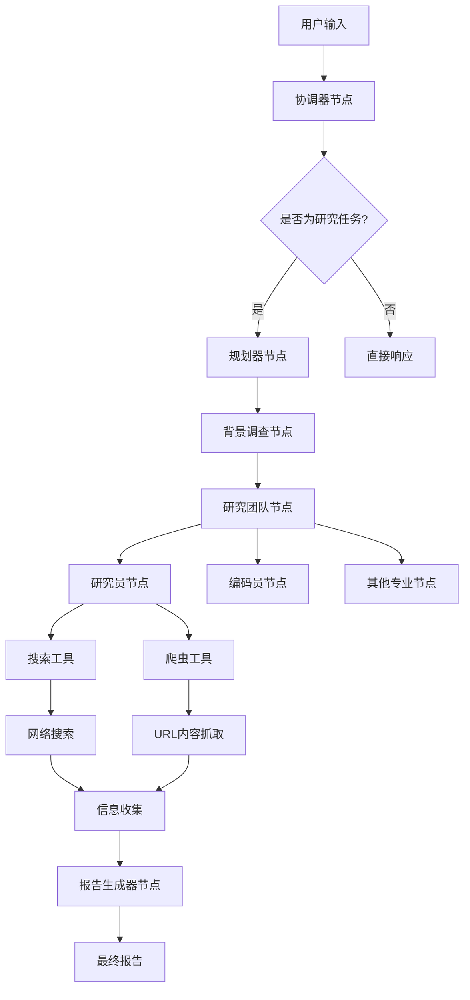
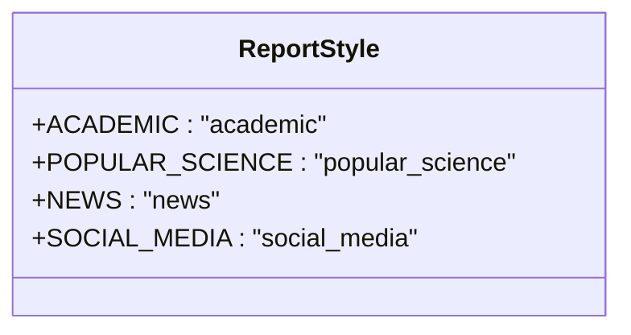
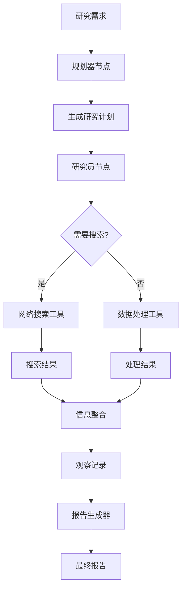

# OpenAI Sora技术报告分析

<cite>
**本文档中引用的文件**  
- [openai_sora_report.md](file://examples/openai_sora_report.md)
- [reporter.md](file://src/prompts/reporter.md)
- [configuration.py](file://src/config/configuration.py)
- [report_style.py](file://src/config/report_style.py)
- [custom_search.py](file://src/tools/custom_search.py)
- [custom_search.py](file://src/config/custom_search.py)
- [planner.md](file://src/prompts/planner.md)
- [researcher.md](file://src/prompts/researcher.md)
- [nodes.py](file://src/graph/nodes.py)
- [search.py](file://src/tools/search.py)
</cite>

## 目录
1. [引言](#引言)
2. [DeerFlow系统架构概述](#deerflow系统架构概述)
3. [多模态内容生成能力分析](#多模态内容生成能力分析)
4. [复杂技术分析能力解析](#复杂技术分析能力解析)
5. [跨学科知识整合能力](#跨学科知识整合能力)
6. [技术深度分析技巧](#技术深度分析技巧)
7. [系统工作流程分析](#系统工作流程分析)
8. [结论](#结论)

## 引言

DeerFlow系统是一个先进的多智能体研究框架，能够生成专业级的技术分析报告。通过对`openai_sora_report.md`示例的深入分析，可以揭示系统在多模态内容生成和复杂技术分析方面的强大能力。该报告详细阐述了OpenAI Sora视频生成模型的技术原理、功能特性、应用场景和伦理考量，展示了DeerFlow系统如何整合跨学科知识，进行深度技术分析。

## DeerFlow系统架构概述

DeerFlow系统采用模块化架构，由多个协同工作的组件构成。系统核心包括协调器、规划器、研究员、报告生成器等智能体，通过预构建的反应式代理（React Agent）框架进行协作。系统支持多种报告风格，包括学术型、科普型、新闻型和社交媒体型，能够根据用户需求生成不同风格的专业报告。

**图源**  
- [nodes.py](file://src/graph/nodes.py#L100-L500)
- [workflow.py](file://src/workflow.py#L50-L100)

## 多模态内容生成能力分析

DeerFlow系统在`openai_sora_report.md`示例中展现了卓越的多模态内容生成能力。系统能够生成包含文本、图像引用和结构化数据的综合报告，满足不同用户群体的需求。

### 报告风格配置

系统通过`report_style.py`文件定义了多种报告风格，包括学术型、科普型、新闻型和社交媒体型。每种风格都有特定的写作指南和格式要求，确保生成的报告符合相应领域的专业标准。

**图源**  
- [report_style.py](file://src/config/report_style.py#L1-L10)

### 内容结构化

系统遵循严格的报告结构，包括关键要点、概述、详细分析和关键引用等部分。这种结构化的输出方式确保了信息的清晰组织和易于理解。

**关键要点部分**  
- Sora是OpenAI的文本到视频模型，能够根据文本提示生成视频并扩展现有短视频。
- 访问权限目前受限，主要授予选定的开发者、视觉艺术家、设计师和电影制作人用于测试和反馈。
- Sora允许用户生成分辨率高达1080p、长度最长20秒的视频，支持各种宽高比和用户提供的资产。
- Sora能够生成各种风格的视频，应用摄像机角度、运动和灯光效果，根据文本提示模拟真实或想象的场景。
- 限制包括在模拟物理、偏见和与深度伪造和虚假信息相关的伦理问题方面可能存在不准确性。
- 地理上，Sora在150多个国家可用，但由于监管挑战和优先面向美国用户，目前在欧盟和英国不可用。

**概述部分**  
OpenAI的Sora是一种文本到视频模型，旨在根据用户提供的文本提示生成短视频片段。该模型于2024年12月发布，代表了AI驱动内容创作的重大进步，使用户能够通过视频将想象场景变为现实。然而，其发布伴随着对其能力、局限性和伦理影响的兴奋与担忧。

**详细分析部分**  
详细分析部分涵盖了Sora的功能与能力、访问与可用性、内容限制与限制、伦理考虑与政策以及潜在应用与影响等多个方面，提供了全面的技术评估。

**关键引用部分**  
报告末尾列出了所有参考文献，包括来自ElevenLabs、Wikipedia、Medium、Vive Blog、DataCamp、Maginative、SaaS Genius、SEO.AI、Tech.co、OpenAI帮助中心等多个来源的链接，确保了信息来源的多样性和可靠性。

**节源**  
- [openai_sora_report.md](file://examples/openai_sora_report.md#L1-L128)
- [reporter.md](file://src/prompts/reporter.md#L1-L200)

## 复杂技术分析能力解析

DeerFlow系统在分析Sora技术时展现了强大的复杂技术分析能力，能够深入理解计算机视觉、深度学习和生成模型等前沿技术概念。

### 功能与能力分析

系统详细分析了Sora的多种功能，包括文本到视频生成、视频编辑、提示解释和视频风格与内容生成。Sora能够应用各种摄像机角度、运动和灯光效果，通过详细的提示指导特定的摄像机运动，如平移、倾斜、推拉、变焦等。

### 访问与可用性分析

系统准确描述了Sora的访问限制和地理可用性。目前，访问权限主要授予选定的开发者、视觉艺术家、设计师和电影制作人，API尚未公开。地理上，Sora在150多个国家可用，但在欧盟和英国由于特定的AI使用法规而不可用。

### 内容限制与限制分析

系统全面分析了Sora的多个限制和限制，包括分辨率和长度（最高1080p，最长20秒）、复杂性（有时难以模拟真实物理和长时间的复杂动作）、内容限制（仅允许成年人使用，禁止描绘未成年人的视觉内容）以及偏见和不准确性（可能不完全理解提示的整个上下文，导致不准确或无关的输出和潜在的偏见）。

### 伦理考虑与政策分析

系统深入探讨了Sora引发的伦理问题，包括深度伪造的创建和虚假信息传播的潜在风险。OpenAI意识到了这些问题，并正在实施政策和保障措施来解决它们，包括内容审核、社区驱动的指南和限制初始访问以在更广泛发布前了解和解决担忧。

### 潜在应用与影响分析

系统评估了Sora在电影制作、广告、教育和游戏等领域的潜在应用。Sora可以彻底改变内容创作，实现真实和个性化的视频内容创作，改变教育材料和营销活动。然而，Sora也可能导致各行业的就业流失，引发对知识产权持有人和艺术家公平补偿的担忧。

**节源**  
- [openai_sora_report.md](file://examples/openai_sora_report.md#L19-L63)
- [planner.md](file://src/prompts/planner.md#L1-L188)

## 跨学科知识整合能力

DeerFlow系统展现了卓越的跨学科知识整合能力，能够将计算机科学、人工智能、伦理学、法律和商业等多个领域的知识融合在一起，生成全面的技术分析报告。

### 计算机科学与人工智能

系统深入分析了Sora的技术原理，包括其作为文本到视频模型的架构设计、训练方法和生成能力。这需要对深度学习、生成对抗网络（GANs）、变分自编码器（VAEs）和扩散模型等先进AI技术有深刻理解。

### 伦理学与法律

系统全面考虑了Sora的伦理和法律影响，包括深度伪造的潜在滥用、虚假信息传播的风险以及在欧盟和英国的监管挑战。这需要对AI伦理、数据隐私和知识产权法律有深入理解。

### 商业与市场

系统评估了Sora在电影制作、广告、教育和游戏等行业的商业应用潜力，以及可能对就业市场产生的影响。这需要对数字内容产业、市场营销策略和劳动力经济学有广泛的知识。

### 社会与文化

系统考虑了Sora对社会和文化的影响，包括其如何改变内容创作方式、影响艺术表达和改变媒体消费模式。这需要对数字文化、媒体研究和社会学有深刻理解。

**节源**  
- [openai_sora_report.md](file://examples/openai_sora_report.md#L38-L63)
- [researcher.md](file://src/prompts/researcher.md#L1-L87)

## 技术深度分析技巧

DeerFlow系统采用了一系列先进的技术深度分析技巧，确保生成的报告具有专业级的质量和深度。

### 分析框架

系统使用了全面的分析框架，包括历史背景、当前状态、未来指标、利益相关者数据、定量数据、定性数据、比较数据和风险数据等多个维度，确保对Sora技术的全面覆盖。

### 信息收集策略

系统采用多渠道信息收集策略，包括网络搜索、知识库检索和URL内容抓取。通过`custom_search.py`文件中的自定义搜索引擎工具，系统能够访问特定的知识库和数据源，获取高质量的信息。

**图源**  
- [nodes.py](file://src/graph/nodes.py#L100-L500)
- [search.py](file://src/tools/search.py#L1-L114)

### 质量控制

系统实施了严格的质量控制措施，包括对信息来源的验证、对数据完整性的检查和对分析结果的交叉验证。通过`planner.md`文件中的上下文评估标准，系统能够判断是否有足够的信息来回答用户的问题，并在必要时收集更多数据。

### 报告生成

系统遵循专业的报告生成标准，包括使用Markdown表格呈现数据、避免内联引用并在文末列出所有参考文献。通过`reporter.md`文件中的写作指南，系统能够生成符合不同风格要求的专业报告。

**节源**  
- [planner.md](file://src/prompts/planner.md#L1-L188)
- [reporter.md](file://src/prompts/reporter.md#L1-L200)
- [nodes.py](file://src/graph/nodes.py#L400-L500)

## 系统工作流程分析

DeerFlow系统的工作流程经过精心设计，确保了高效和高质量的研究过程。系统从用户输入开始，通过协调器节点判断是否为研究任务，然后由规划器节点生成研究计划，研究团队节点执行研究任务，最后由报告生成器节点生成最终报告。

### 协调器节点

协调器节点负责处理问候和闲聊，并将研究任务交给规划器。它能够识别简单的问候、基本的闲聊和简单的问题，并将所有研究问题、事实查询和信息请求交给规划器。

### 规划器节点

规划器节点负责生成详细的研究计划。它使用严格的上下文评估标准来判断是否有足够的信息回答用户的问题，并在必要时生成最多`max_step_num`个研究步骤。每个步骤都明确指定了需要收集的数据和是否需要网络搜索。

### 研究员节点

研究员节点负责执行研究任务。它使用搜索工具和爬虫工具从网络和知识库中收集信息，并将结果整合到观察记录中。研究员节点能够处理动态加载的工具，并根据任务需求选择最合适的工具。

### 报告生成器节点

报告生成器节点负责生成最终的报告。它根据研究计划和收集到的观察结果，按照指定的报告风格和格式要求生成结构化的报告。报告包括关键要点、概述、详细分析和关键引用等部分，确保信息的清晰组织和易于理解。

**节源**  
- [nodes.py](file://src/graph/nodes.py#L100-L500)
- [workflow.py](file://src/workflow.py#L50-L100)

## 结论

通过对`openai_sora_report.md`示例的深入分析，可以看出DeerFlow系统在多模态内容生成和复杂技术分析方面具有卓越的能力。系统能够整合跨学科知识，进行深度技术分析，并生成专业级的技术报告。其模块化的架构、灵活的报告风格和先进的分析技巧，使其成为一个强大的研究工具，