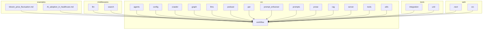

# 加密货币价格波动分析

<cite>
**本文档引用的文件**  
- [bitcoin_price_fluctuation.md](file://examples/bitcoin_price_fluctuation.md)
- [configuration.py](file://src/config/configuration.py)
- [search.py](file://src/tools/search.py)
- [custom_search.py](file://src/tools/custom_search.py)
- [custom_search.py](file://src/config/custom_search.py)
- [workflow.py](file://src/workflow.py)
- [builder.py](file://src/graph/builder.py)
- [nodes.py](file://src/graph/nodes.py)
- [planner.md](file://src/prompts/planner.md)
- [researcher.md](file://src/prompts/researcher.md)
- [tavily_search_results_with_images.py](file://src/tools/tavily_search/tavily_search_results_with_images.py)
- [tavily_search_api_wrapper.py](file://src/tools/tavily_search/tavily_search_api_wrapper.py)
- [conf.yaml](file://conf.yaml)
</cite>

## 目录
1. [引言](#引言)
2. [项目结构](#项目结构)
3. [核心组件](#核心组件)
4. [架构概述](#架构概述)
5. [详细组件分析](#详细组件分析)
6. [依赖分析](#依赖分析)
7. [性能考虑](#性能考虑)
8. [故障排除指南](#故障排除指南)
9. [结论](#结论)

## 引言
本文档深入分析 DeerFlow 系统在金融数据分析领域的应用，特别是其在比特币价格波动研究中的实现。通过分析 `bitcoin_price_fluctuation.md` 示例，我们将探讨系统如何整合宏观经济指标、市场情绪、技术分析和链上数据等多种数据源。文档将解释多智能体协作模式在处理实时金融数据、识别市场趋势和风险因素中的作用，并展示系统如何将复杂金融概念转化为易于理解的分析报告。

## 项目结构
DeerFlow 项目采用模块化设计，主要分为以下几个部分：
- **examples**: 包含各种示例报告，如比特币价格波动分析、AI在医疗保健中的应用等。
- **middlewares**: 包含中间件服务，如LLM和搜索服务。
- **src**: 核心源代码目录，包含代理、配置、爬虫、图构建、LLM、播客、PPT生成、提示增强、提示模板、散文生成、RAG、服务器、工具、工具、实用工具等模块。
- **tests**: 测试代码，包括集成测试和单元测试。
- **web**: Web前端应用代码。
- **根目录**: 包含主程序文件、配置文件和Docker相关文件。

这种结构使得系统具有良好的可扩展性和维护性，每个模块都有明确的职责。

**图表来源**
- [examples/bitcoin_price_fluctuation.md](file://examples/bitcoin_price_fluctuation.md)
- [src/workflow.py](file://src/workflow.py)

**本节来源**
- [examples/bitcoin_price_fluctuation.md](file://examples/bitcoin_price_fl