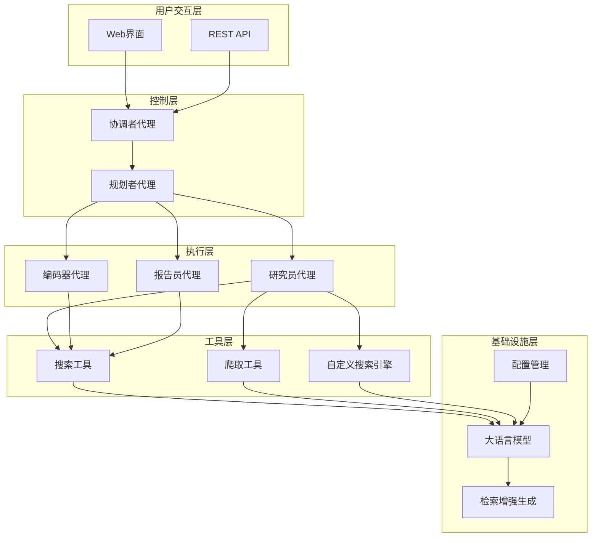
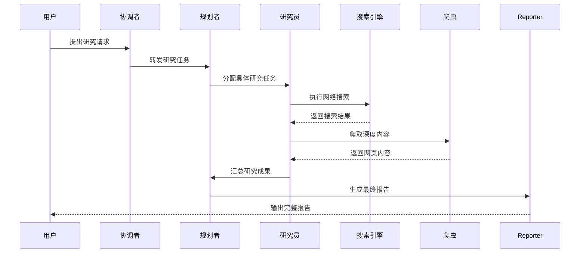
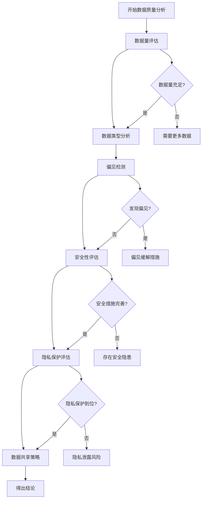
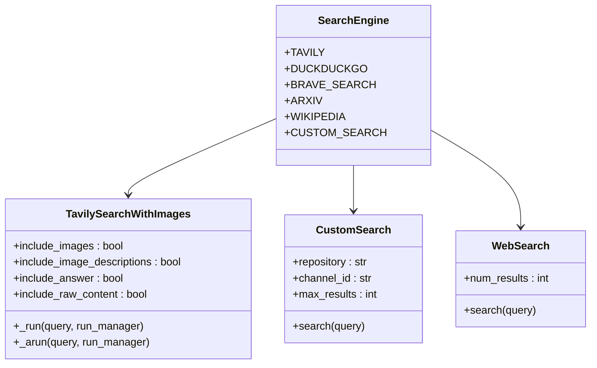
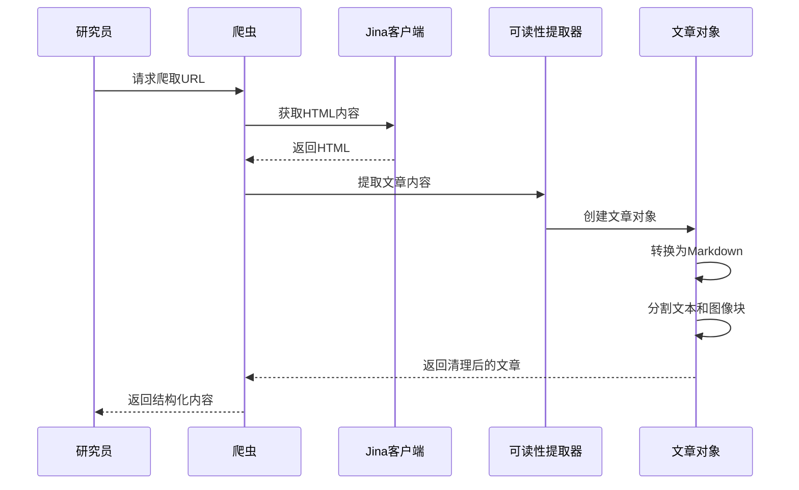
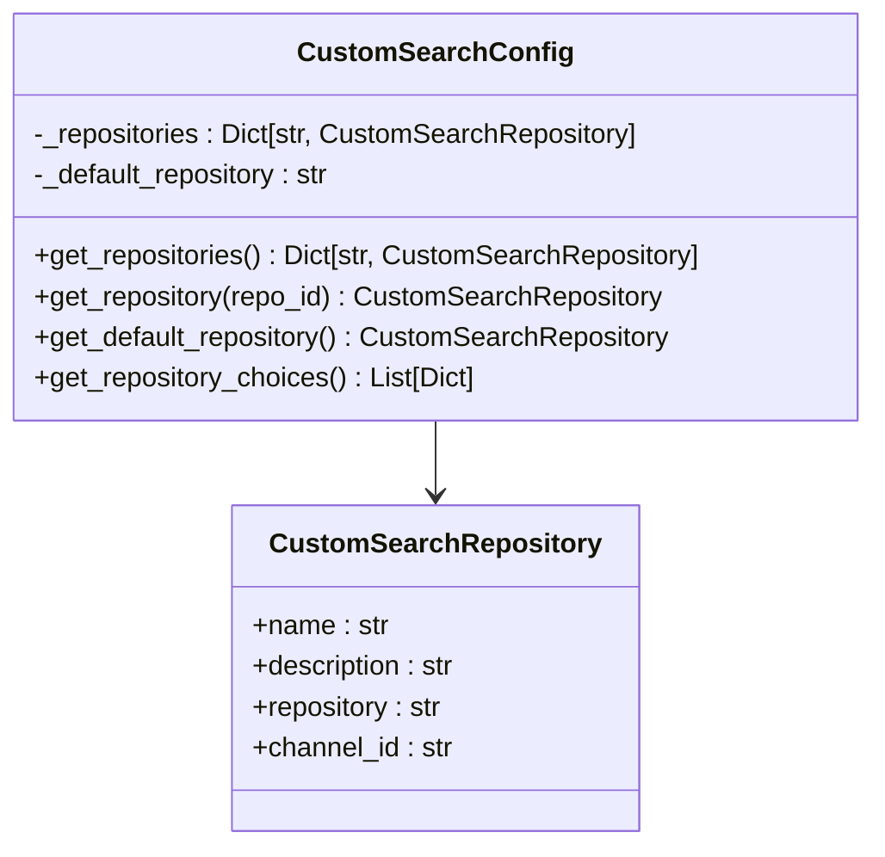
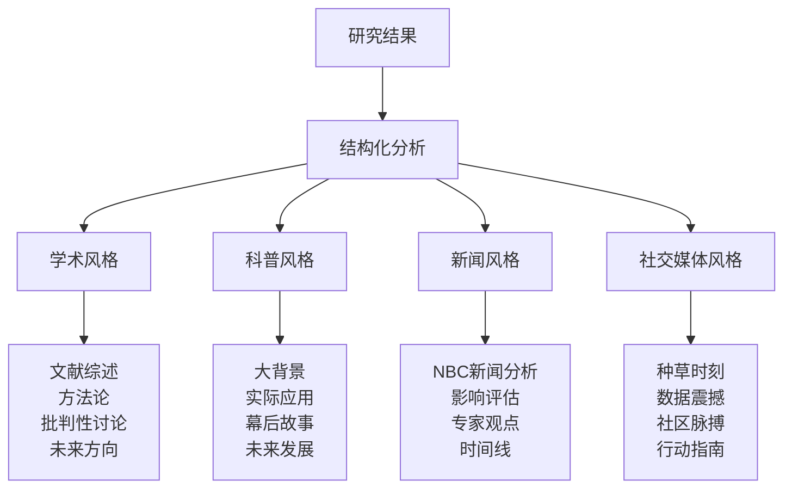

# 医疗健康领域AI应用分析

<cite>
**本文档引用的文件**
- [examples/AI_adoption_in_healthcare.md](file://examples/AI_adoption_in_healthcare.md)
- [src/config/configuration.py](file://src/config/configuration.py)
- [src/config/agents.py](file://src/config/agents.py)
- [src/prompts/researcher.md](file://src/prompts/researcher.md)
- [src/prompts/reporter.md](file://src/prompts/reporter.md)
- [src/tools/search.py](file://src/tools/search.py)
- [src/crawler/crawler.py](file://src/crawler/crawler.py)
- [src/config/custom_search.py](file://src/config/custom_search.py)
- [src/agents/agents.py](file://src/agents/agents.py)
- [src/workflow.py](file://src/workflow.py)
- [src/prompts/coordinator.md](file://src/prompts/coordinator.md)
- [src/tools/tavily_search/tavily_search_results_with_images.py](file://src/tools/tavily_search/tavily_search_results_with_images.py)
</cite>

## 目录
1. [项目概述](#项目概述)
2. [系统架构](#系统架构)
3. [多智能体协作机制](#多智能体协作机制)
4. [医疗健康领域专业处理能力](#医疗健康领域专业处理能力)
5. [信息收集与整合流程](#信息收集与整合流程)
6. [敏感信息过滤与合规性检查](#敏感信息过滤与合规性检查)
7. [案例分析：AI在医疗健康领域的应用](#案例分析ai在医疗健康领域的应用)
8. [性能优化与扩展性](#性能优化与扩展性)
9. [故障排除指南](#故障排除指南)
10. [总结](#总结)

## 项目概述

DeerFlow系统是一个先进的多智能体协作平台，专门设计用于处理复杂的跨领域研究任务。该系统通过模拟人类专家团队的工作方式，实现了高效的信息收集、分析和报告生成。在医疗健康领域，DeerFlow展现了卓越的专业知识处理能力和敏感信息管理能力。

系统的核心优势在于其模块化设计和灵活的配置机制，能够根据不同领域的特殊需求进行定制化调整。特别是在医疗健康领域，系统具备以下关键特性：

- **多维度信息收集**：涵盖技术成熟度、数据质量、伦理考量、经济评估和组织影响等多个方面
- **专业领域适配**：针对医疗健康领域的特殊要求，提供专门的搜索策略和信息验证机制
- **合规性保障**：内置敏感信息过滤和隐私保护机制，确保符合医疗行业的严格规范
- **高质量报告生成**：支持多种报告风格，满足不同受众的需求

## 系统架构

DeerFlow系统采用分层架构设计，包含多个相互协作的组件：



**图表来源**
- [src/workflow.py](file://src/workflow.py#L1-L50)
- [src/agents/agents.py](file://src/agents/agents.py#L1-L20)

**章节来源**
- [src/workflow.py](file://src/workflow.py#L1-L104)
- [src/agents/agents.py](file://src/agents/agents.py#L1-L20)

## 多智能体协作机制

DeerFlow系统通过精心设计的多智能体协作机制，实现了高效的复杂任务处理。每个智能体都有明确的角色分工和专业技能：

### 协调者代理（Coordinator）
协调者代理负责初始请求处理和任务分配。它能够识别用户的问候语和简单对话，并将真正的研究任务转交给专业的规划者代理。

### 规划者代理（Planner）
规划者代理负责制定详细的研究计划，包括：
- 分析研究目标和范围
- 设计信息收集策略
- 分配具体任务给各个专业代理
- 监控进度并调整计划

### 研究员代理（Researcher）
研究员代理是系统中最活跃的组件，负责实际的信息收集工作。它具有以下特点：



**图表来源**
- [src/prompts/researcher.md](file://src/prompts/researcher.md#L1-L87)
- [src/prompts/coordinator.md](file://src/prompts/coordinator.md#L1-L56)

**章节来源**
- [src/prompts/researcher.md](file://src/prompts/researcher.md#L1-L87)
- [src/prompts/coordinator.md](file://src/prompts/coordinator.md#L1-L56)

## 医疗健康领域专业处理能力

在医疗健康领域，DeerFlow系统展现出了卓越的专业处理能力。系统通过专门的配置和工具集，能够深入分析AI技术在医疗健康领域的应用情况。

### 技术成熟度评估
系统能够评估AI技术在医疗健康领域的成熟度，包括：
- 机器学习算法的准确性和可靠性
- 深度学习模型的验证和测试
- 自然语言处理技术的应用效果
- 大型语言模型在医疗文本处理中的表现

### 数据质量分析
医疗健康领域的数据质量管理是系统的重要功能：



**图表来源**
- [examples/AI_adoption_in_healthcare.md](file://examples/AI_adoption_in_healthcare.md#L25-L45)

### 伦理考量处理
系统特别关注医疗健康领域的伦理问题，包括：
- 患者数据隐私保护
- 算法偏见的识别和缓解
- 决策透明度要求
- 临床验证标准
- 医护人员责任界定

**章节来源**
- [examples/AI_adoption_in_healthcare.md](file://examples/AI_adoption_in_healthcare.md#L1-L110)

## 信息收集与整合流程

DeerFlow系统采用多层次的信息收集策略，确保获取全面而准确的医疗健康领域AI应用信息。

### 搜索引擎集成
系统支持多种搜索引擎，包括：



**图表来源**
- [src/tools/search.py](file://src/tools/search.py#L1-L114)
- [src/tools/tavily_search/tavily_search_results_with_images.py](file://src/tools/tavily_search/tavily_search_results_with_images.py#L1-L165)

### 爬虫系统
系统集成了专门的爬虫系统，用于深度内容提取：



**图表来源**
- [src/crawler/crawler.py](file://src/crawler/crawler.py#L1-L28)

**章节来源**
- [src/tools/search.py](file://src/tools/search.py#L1-L114)
- [src/crawler/crawler.py](file://src/crawler/crawler.py#L1-L28)

## 敏感信息过滤与合规性检查

在医疗健康领域，数据隐私和合规性至关重要。DeerFlow系统内置了多重防护机制：

### 配置管理
系统通过配置文件管理各种设置：

```python
@dataclass(kw_only=True)
class Configuration:
    resources: list[Resource] = field(default_factory=list)
    max_plan_iterations: int = 1
    max_step_num: int = 3
    max_search_results: int = 3
    search_engine: str = "custom_search"
    custom_search_repository: Optional[str] = None
    mcp_settings: dict = None
    report_style: str = ReportStyle.ACADEMIC.value
    enable_deep_thinking: bool = False
```

### 自定义搜索引擎
系统提供了专门的自定义搜索引擎配置，支持医疗健康领域的特殊需求：



**图表来源**
- [src/config/custom_search.py](file://src/config/custom_search.py#L1-L120)

**章节来源**
- [src/config/configuration.py](file://src/config/configuration.py#L1-L71)
- [src/config/custom_search.py](file://src/config/custom_search.py#L1-L120)

## 案例分析：AI在医疗健康领域的应用

以"AI在医疗健康领域的采用趋势"为例，展示了DeerFlow系统的完整工作流程：

### 输入分析
用户输入经过协调者代理的初步处理，识别出这是一个关于医疗健康领域AI应用的研究请求。

### 研究计划制定
规划者代理制定详细的研究计划，重点关注以下几个方面：
- 技术成熟度和验证
- 数据可用性和质量
- 伦理考量
- 经济成本和效益
- 组织影响
- 数字基础设施准备

### 信息收集过程
研究员代理执行以下步骤：

1. **技术成熟度验证**：搜索最新的AI算法验证研究
2. **数据质量评估**：收集关于医疗数据质量和偏见的研究
3. **伦理考量分析**：查找关于AI在医疗中伦理问题的文献
4. **经济评估**：收集AI在医疗中的成本效益分析
5. **组织影响研究**：分析AI对医疗机构的影响
6. **数字基础设施评估**：研究医疗数字化转型的现状

### 报告生成
报告员代理根据收集到的信息生成综合报告，包含：



**图表来源**
- [src/prompts/reporter.md](file://src/prompts/reporter.md#L1-L199)

**章节来源**
- [examples/AI_adoption_in_healthcare.md](file://examples/AI_adoption_in_healthcare.md#L1-L110)
- [src/prompts/reporter.md](file://src/prompts/reporter.md#L1-L199)

## 性能优化与扩展性

DeerFlow系统在设计时充分考虑了性能优化和扩展性：

### 异步处理
系统支持异步处理模式，提高响应速度和并发能力：

```python
async def run_agent_workflow_async(
    user_input: str,
    debug: bool = False,
    max_plan_iterations: int = 1,
    max_step_num: int = 3,
    enable_background_investigation: bool = True,
):
```

### 缓存机制
系统实现了LLM缓存机制，减少重复计算：

```python
def get_llm_by_type(llm_type: LLMType) -> BaseLLM:
    """Get LLM instance by type with caching."""
    if llm_type in _llm_cache:
        return _llm_cache[llm_type]
    # Create and cache new instance
    llm = _create_llm_use_conf(llm_type)
    _llm_cache[llm_type] = llm
    return llm
```

### 配置灵活性
系统支持动态配置，可以根据不同的使用场景进行调整：

- **递归限制**：防止无限循环
- **最大搜索结果数**：控制资源消耗
- **报告风格**：适应不同受众
- **工具配置**：支持多种外部服务

**章节来源**
- [src/workflow.py](file://src/workflow.py#L1-L104)

## 故障排除指南

### 常见问题及解决方案

1. **搜索结果质量问题**
   - 检查搜索配置参数
   - 验证API密钥有效性
   - 调整搜索关键词策略

2. **爬取失败**
   - 检查目标网站的robots.txt
   - 验证Jina客户端配置
   - 考虑使用备用爬取工具

3. **报告生成错误**
   - 检查提示词模板完整性
   - 验证LLM连接状态
   - 确认输出格式配置

4. **性能问题**
   - 调整并发设置
   - 优化缓存策略
   - 监控资源使用情况

### 调试模式
系统提供调试模式，便于问题诊断：

```python
def enable_debug_logging():
    """Enable debug level logging for more detailed execution information."""
    logging.getLogger("src").setLevel(logging.DEBUG)
```

**章节来源**
- [src/workflow.py](file://src/workflow.py#L20-L30)

## 总结

DeerFlow系统在医疗健康领域AI应用分析方面展现了卓越的能力。通过多智能体协作机制、专业的信息收集策略和严格的合规性保障，系统能够生成高质量、全面且符合行业标准的分析报告。

系统的主要优势包括：

1. **专业领域适配**：针对医疗健康领域的特殊需求进行了专门优化
2. **多维度分析**：涵盖了技术、伦理、经济、组织等多个层面
3. **高质量输出**：支持多种报告风格，满足不同受众需求
4. **合规性保障**：内置敏感信息过滤和隐私保护机制
5. **高性能架构**：支持异步处理和缓存优化

随着AI技术在医疗健康领域的不断发展，DeerFlow系统将继续演进，为用户提供更加精准和全面的分析服务。系统的模块化设计和灵活配置机制，使其能够快速适应新的研究需求和技术发展。