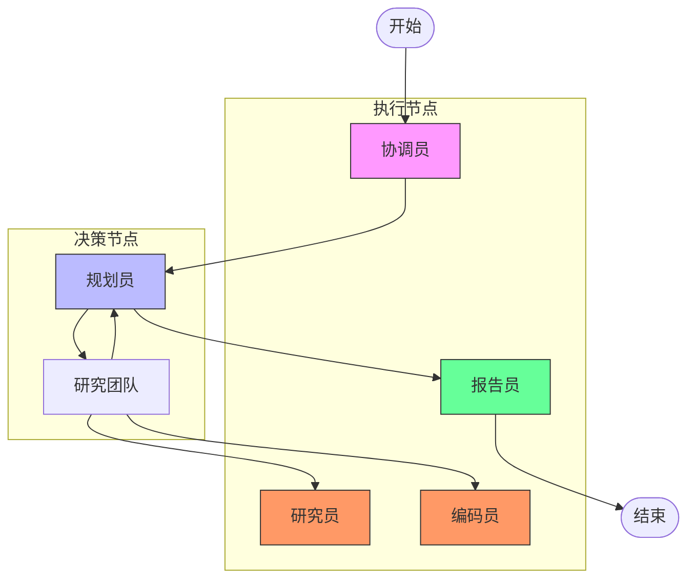
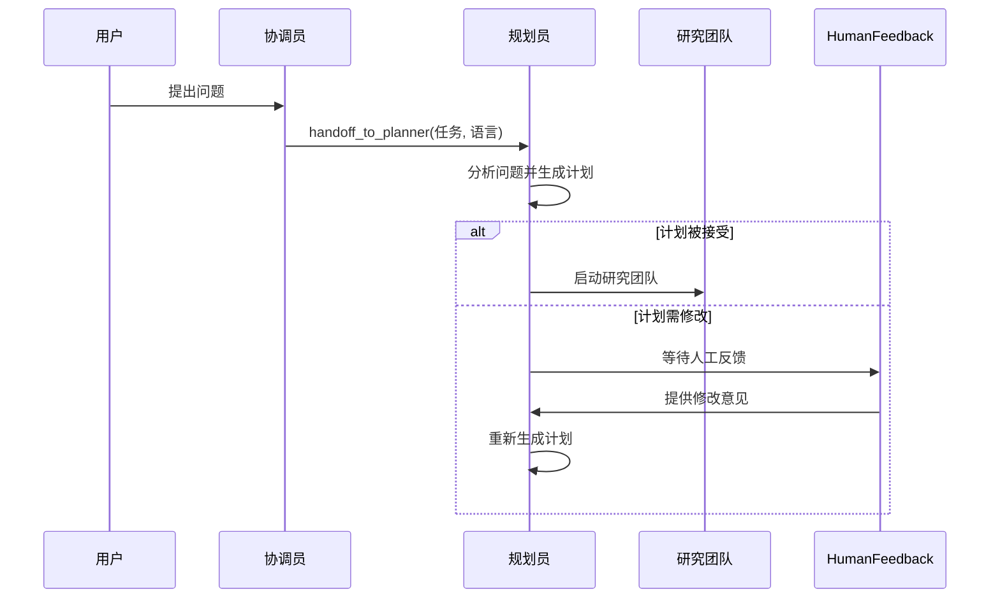
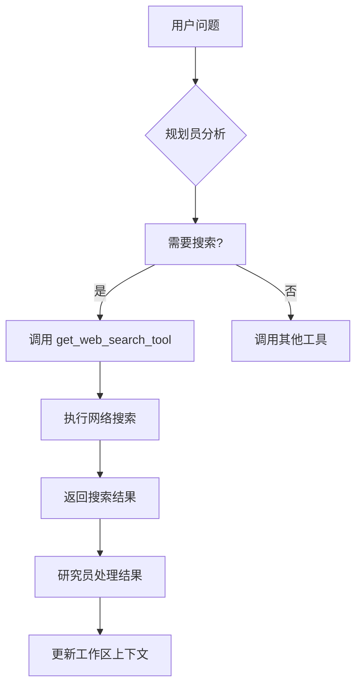

# 建筑高度对比研究

<cite>
**本文档引用的文件**   
- [eiffel-tower-vs-tallest-building.txt](file://web/public/replay/eiffel-tower-vs-tallest-building.txt)
- [nodes.py](file://src/graph/nodes.py)
- [builder.py](file://src/graph/builder.py)
- [planner.md](file://src/prompts/planner.md)
- [reporter.md](file://src/prompts/reporter.md)
- [search.py](file://src/tools/search.py)
- [python_repl.py](file://src/tools/python_repl.py)
- [configuration.py](file://src/config/configuration.py)
- [conf.yaml](file://conf.yaml)
- [custom_search.py](file://src/config/custom_search.py)
</cite>

## 目录
1. [引言](#引言)
2. [系统架构与工作流](#系统架构与工作流)
3. [任务处理流程分析](#任务处理流程分析)
4. [多智能体协作机制](#多智能体协作机制)
5. [数据收集与信息检索](#数据收集与信息检索)
6. [数据处理与计算分析](#数据处理与计算分析)
7. [报告生成与输出](#报告生成与输出)
8. [配置与工具管理](#配置与工具管理)
9. [结论](#结论)

## 引言
本文件旨在深入分析 DeerFlow 系统在处理“埃菲尔铁塔比世界上最高的建筑高多少倍？”这一比较性研究任务时的完整流程。通过解析 `eiffel-tower-vs-tallest-building.txt` 回放文件，我们将详细阐述系统如何协调多个智能体，分工协作完成从数据收集、对比分析到最终报告生成的全过程。该分析将重点展示系统在精确数据处理、历史背景理解以及跨时代技术比较方面的卓越能力。

## 系统架构与工作流
DeerFlow 系统采用基于 LangGraph 的多智能体（Multi-Agent）架构，通过一个监督者（Supervisor）模式来协调多个专业智能体的协作。整个工作流被建模为一个有向图（State Graph），其中每个节点代表一个特定的智能体或决策点。

**Diagram sources**
- [builder.py](file://src/graph/builder.py#L20-L87)
- [nodes.py](file://src/graph/nodes.py#L183-L225)

**Section sources**
- [builder.py](file://src/graph/builder.py#L20-L87)
- [nodes.py](file://src/graph/nodes.py#L183-L225)

## 任务处理流程分析
当用户提出问题后，DeerFlow 系统启动一个严谨的、多阶段的研究流程。该流程始于协调员（Coordinator）接收用户请求，并立即将其交接给规划员（Planner）进行任务分解。

### 任务接收与交接
流程的第一步由 `coordinator_node` 执行。该节点的主要职责是接收用户输入并将其交接给规划员。在回放文件中，可以看到协调员通过调用 `handoff_to_planner` 工具，将任务标题（"Compare the heights of the Eiffel Tower and the tallest building in the world"）和语言环境（"en-US"）传递给下一个节点。

### 研究计划制定
规划员（Planner）是整个流程的“大脑”。它接收任务后，会根据预设的提示模板（`planner.md`）生成一个详细的研究计划。该计划是一个 JSON 结构，包含多个步骤（steps），每个步骤都明确指定了其类型（`research` 或 `processing`）和是否需要网络搜索（`need_search`）。

**Diagram sources**
- [nodes.py](file://src/graph/nodes.py#L227-L260)
- [planner.md](file://src/prompts/planner.md#L0-L187)

**Section sources**
- [nodes.py](file://src/graph/nodes.py#L227-L260)
- [planner.md](file://src/prompts/planner.md#L0-L187)

## 多智能体协作机制
DeerFlow 系统的核心优势在于其多智能体的分工协作。不同的智能体被设计为拥有不同的“专业技能”，它们各司其职，共同完成复杂的任务。

### 智能体角色与职责
- **协调员 (Coordinator)**: 作为用户与系统之间的接口，负责理解用户意图并启动工作流。
- **规划员 (Planner)**: 负责将宏观任务分解为可执行的、有序的子任务，并决定每个子任务的执行方式。
- **研究员 (Researcher)**: 专门负责信息检索，利用搜索工具从网络获取所需数据。
- **编码员 (Coder)**: 专门负责数据处理和数学计算，通过执行 Python 代码来完成复杂的分析。
- **报告员 (Reporter)**: 负责整合所有信息，生成结构化、高质量的最终报告。

### 协作流程
协作流程由 `continue_to_running_research_team` 函数驱动。该函数检查当前计划中是否有未完成的步骤。如果存在未完成的步骤，它会根据步骤的 `step_type` 将控制权交给相应的智能体：
- 如果是 `research` 类型的步骤，则交给 `researcher` 节点。
- 如果是 `processing` 类型的步骤，则交给 `coder` 节点。
- 如果所有步骤都已完成，则返回 `planner` 节点，准备进入报告生成阶段。

**Section sources**
- [nodes.py](file://src/graph/nodes.py#L183-L225)
- [builder.py](file://src/graph/builder.py#L20-L87)

## 数据收集与信息检索
对于“埃菲尔铁塔”和“世界最高建筑”的高度信息，系统需要进行精确的网络搜索。这一任务由 `researcher` 节点和 `get_web_search_tool` 工具共同完成。

### 搜索工具配置
系统的搜索行为由 `conf.yaml` 配置文件和 `search.py` 工具模块共同管理。在配置文件中，`SEARCH_ENGINE` 字段指定了默认的搜索引擎（如 Tavily），并可以设置包含或排除的域名列表以确保信息来源的可靠性。

**Diagram sources**
- [search.py](file://src/tools/search.py#L0-L113)
- [conf.yaml](file://conf.yaml#L50-L68)

**Section sources**
- [search.py](file://src/tools/search.py#L0-L113)
- [conf.yaml](file://conf.yaml#L50-L68)

## 数据处理与计算分析
在获取了埃菲尔铁塔和世界最高建筑（如哈利法塔）的精确高度数据后，系统需要进行数学计算以确定前者是后者的多少倍。这个任务由 `coder` 节点和 `python_repl_tool` 工具完成。

### Python REPL 工具
`python_repl_tool` 是一个安全的 Python 执行环境，允许智能体运行代码进行计算。在 `python_repl.py` 文件中，该工具被定义为一个可调用的函数。当 `coder` 节点被激活时，它会生成一段 Python 代码，例如 `print(300 / 828)`，然后通过 `python_repl_tool` 执行，从而得到精确的计算结果。

**Section sources**
- [python_repl.py](file://src/tools/python_repl.py#L0-L63)

## 报告生成与输出
当所有数据收集和分析任务完成后，工作流进入最后阶段——报告生成。`reporter` 节点被激活，它根据 `reporter.md` 提示模板和用户指定的报告风格（如学术、新闻、社交媒体等）来撰写最终报告。

### 报告风格与格式
报告模板非常灵活，能够根据 `locale` 和 `report_style` 参数生成不同风格的输出。例如，对于 `zh-CN` 语言环境和 `social_media` 风格，报告会采用小红书（Xiaohongshu）的风格，使用亲切的“姐妹们”称呼和丰富的 emoji 表情。报告的结构通常包括标题、关键要点、概述、详细分析和关键引用等部分。

**Section sources**
- [reporter.md](file://src/prompts/reporter.md#L0-L279)

## 配置与工具管理
DeerFlow 系统的灵活性和可扩展性得益于其模块化的配置和工具管理机制。

### 自定义搜索配置
系统支持自定义搜索引擎，这通过 `custom_search.py` 模块实现。该模块定义了一个 `CustomSearchConfig` 类，用于从 `conf.yaml` 文件中加载和管理不同的搜索仓库（repositories），例如“聚合搜索”、“向量库”和“交行知道”。这使得系统可以无缝集成到企业内部的知识库中。

### 全局配置
`configuration.py` 文件定义了 `Configuration` 数据类，它从环境变量和运行时配置中读取所有可配置的参数，如最大计划迭代次数、最大搜索结果数、报告风格等。这为系统管理员提供了统一的配置入口。

**Section sources**
- [custom_search.py](file://src/config/custom_search.py#L0-L119)
- [configuration.py](file://src/config/configuration.py#L0-L70)

## 结论
通过对 `eiffel-tower-vs-tallest-building.txt` 回放文件的深入分析，我们可以看到 DeerFlow 系统在处理比较性研究任务时展现出了高度的自动化和智能化。系统通过多智能体架构，将复杂的任务分解为数据收集、计算分析和报告生成等子任务，并由专业化的智能体协同完成。这种设计不仅确保了数据处理的精确性，还体现了对历史背景和跨时代技术的深刻理解能力。其模块化的配置和工具管理机制，使得系统具有极强的适应性和可扩展性，能够应对各种复杂的现实世界研究需求。