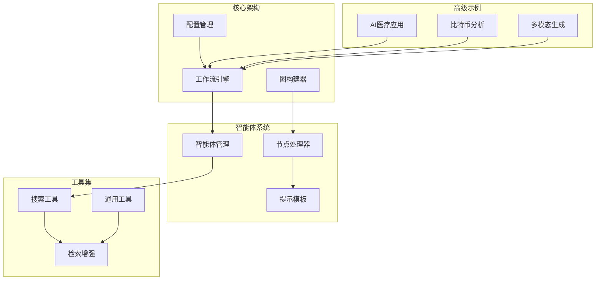
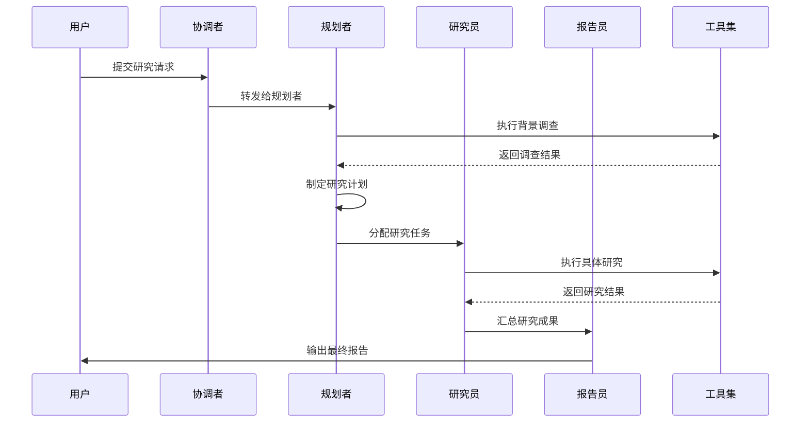
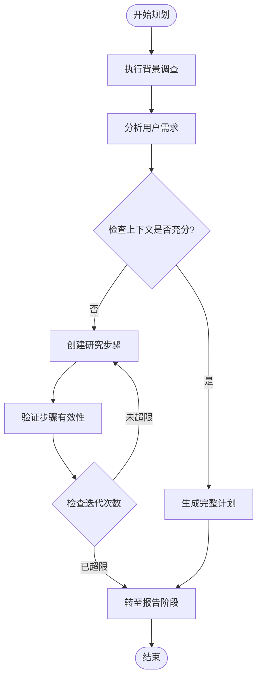
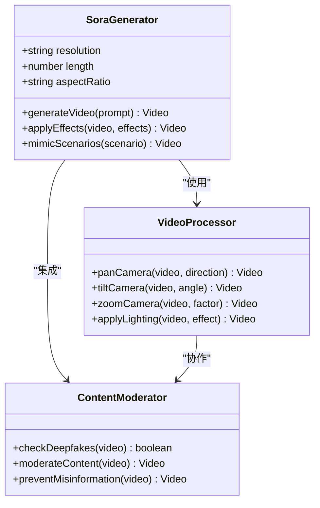
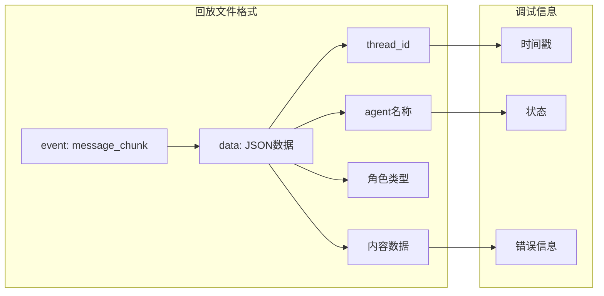
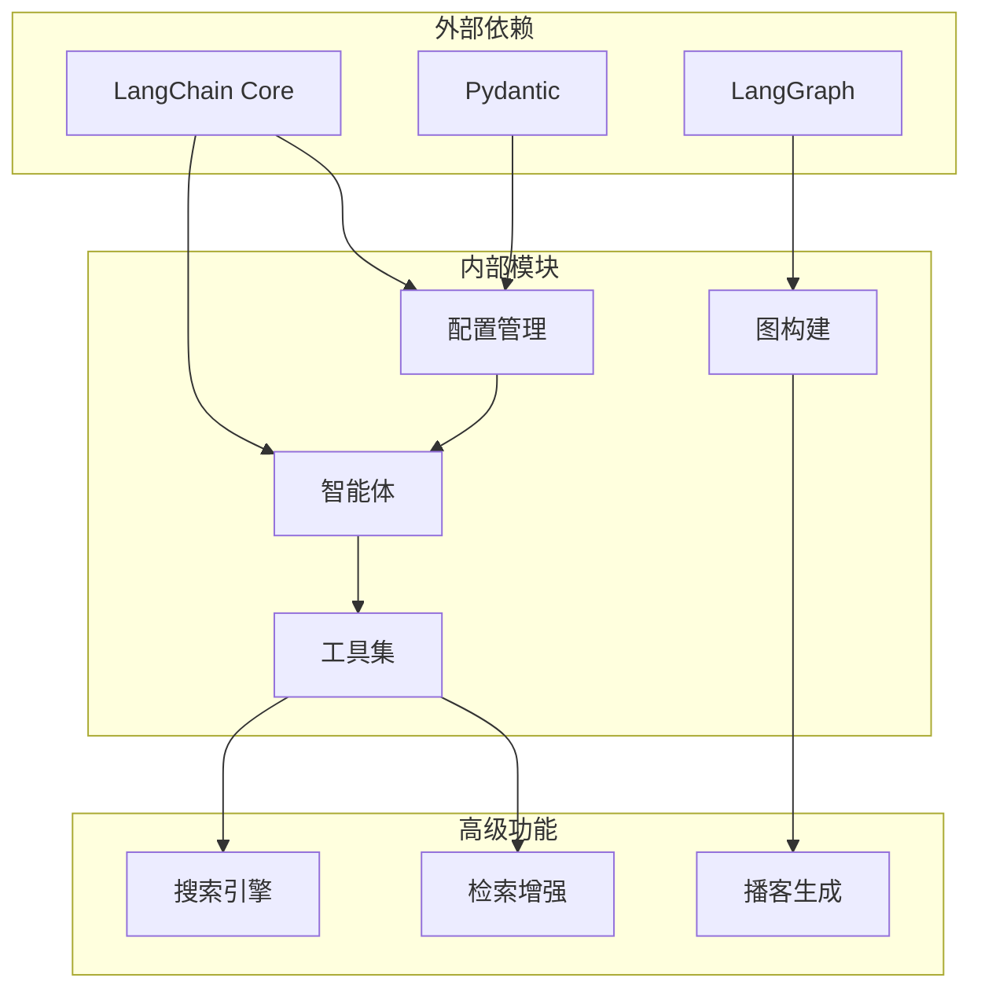

# 高级示例

<cite>
**本文档中引用的文件**
- [AI_adoption_in_healthcare.md](file://examples/AI_adoption_in_healthcare.md)
- [bitcoin_price_fluctuation.md](file://examples/bitcoin_price_fluctuation.md)
- [openai_sora_report.md](file://examples/openai_sora_report.md)
- [configuration.py](file://src/config/configuration.py)
- [agents.py](file://src/config/agents.py)
- [workflow.py](file://src/workflow.py)
- [nodes.py](file://src/graph/nodes.py)
- [planner.md](file://src/prompts/planner.md)
- [search.py](file://src/tools/search.py)
- [types.py](file://src/podcast/types.py)
- [builder.py](file://src/podcast/graph/builder.py)
- [ai-twin-insurance.txt](file://web/public/replay/ai-twin-insurance.txt)
</cite>

## 目录
1. [简介](#简介)
2. [项目结构概览](#项目结构概览)
3. [核心组件分析](#核心组件分析)
4. [架构概览](#架构概览)
5. [详细组件分析](#详细组件分析)
6. [依赖关系分析](#依赖关系分析)
7. [性能考虑](#性能考虑)
8. [故障排除指南](#故障排除指南)
9. [结论](#结论)

## 简介

DeerFlow 是一个先进的多智能体协作平台，专门设计用于处理复杂的深度研究任务。该系统通过精心设计的高级示例展示了其在复杂场景下的应用能力，包括 AI 在医疗保健领域的采用、比特币价格波动分析以及 OpenAI Sora 多模态内容生成等复杂用例。

这些高级示例不仅体现了系统的强大功能，还展示了其在多智能体协作研究方面的深度和广度。通过分析这些案例，我们可以深入了解系统如何处理复杂的多步骤推理、跨领域知识整合以及实时数据处理等挑战性任务。

## 项目结构概览

DeerFlow 采用模块化架构设计，将不同功能分离到独立的目录中：



**图表来源**
- [workflow.py](file://src/workflow.py#L1-L50)
- [nodes.py](file://src/graph/nodes.py#L1-L50)

**章节来源**
- [workflow.py](file://src/workflow.py#L1-L104)
- [configuration.py](file://src/config/configuration.py#L1-L71)

## 核心组件分析

### 工作流引擎

工作流引擎是 DeerFlow 的核心，负责协调整个系统的运行。它采用异步架构设计，支持复杂的多智能体协作流程。

```python
async def run_agent_workflow_async(
    user_input: str,
    debug: bool = False,
    max_plan_iterations: int = 1,
    max_step_num: int = 3,
    enable_background_investigation: bool = True,
):
    """异步运行代理工作流"""
    if not user_input:
        raise ValueError("输入不能为空")
    
    logger.info(f"开始异步工作流，用户输入：{user_input}")
    initial_state = {
        "messages": [{"role": "user", "content": user_input}],
        "auto_accepted_plan": True,
        "enable_background_investigation": enable_background_investigation,
    }
```

### 智能体配置

系统支持多种类型的智能体，每种都有特定的用途和能力：

```python
AGENT_LLM_MAP: dict[str, LLMType] = {
    "coordinator": "basic",
    "planner": "basic",
    "researcher": "basic",
    "coder": "basic",
    "reporter": "basic",
    "podcast_script_writer": "basic",
    "ppt_composer": "basic",
    "prose_writer": "basic",
    "prompt_enhancer": "basic",
}
```

**章节来源**
- [workflow.py](file://src/workflow.py#L25-L80)
- [agents.py](file://src/config/agents.py#L1-L21)

## 架构概览

DeerFlow 采用基于状态图的工作流架构，支持复杂的多智能体协作：



**图表来源**
- [nodes.py](file://src/graph/nodes.py#L50-L150)
- [workflow.py](file://src/workflow.py#L25-L80)

## 详细组件分析

### 多智能体协作机制

#### 规划节点分析

规划节点是整个工作流的核心，负责制定详细的研究计划：



**图表来源**
- [nodes.py](file://src/graph/nodes.py#L70-L150)
- [planner.md](file://src/prompts/planner.md#L1-L100)

#### 搜索引擎集成

系统支持多种搜索引擎，提供灵活的数据获取能力：

```python
def get_web_search_tool(max_search_results: int, engine: str = None, repository_id: str = None):
    """获取指定的搜索工具"""
    selected_engine = engine or SELECTED_SEARCH_ENGINE
    
    if selected_engine == SearchEngine.TAVILY.value:
        return LoggedTavilySearch(
            name="web_search",
            max_results=max_search_results,
            include_raw_content=True,
            include_images=True,
            include_image_descriptions=True,
            include_domains=include_domains,
            exclude_domains=exclude_domains,
        )
    elif selected_engine == SearchEngine.DUCKDUCKGO.value:
        return LoggedDuckDuckGoSearch(
            name="web_search",
            num_results=max_search_results,
        )
```

**章节来源**
- [nodes.py](file://src/graph/nodes.py#L50-L100)
- [search.py](file://src/tools/search.py#L40-L113)

### 多模态内容生成

#### OpenAI Sora 集成

系统支持 OpenAI Sora 的多模态内容生成，能够处理文本到视频的转换：



**图表来源**
- [openai_sora_report.md](file://examples/openai_sora_report.md#L1-L50)
- [builder.py](file://src/podcast/graph/builder.py#L1-L40)

#### 播客生成流程

系统能够将研究报告转换为播客形式：

```python
def build_graph():
    """构建播客工作流图"""
    builder = StateGraph(PodcastState)
    builder.add_node("script_writer", script_writer_node)
    builder.add_node("tts", tts_node)
    builder.add_node("audio_mixer", audio_mixer_node)
    builder.add_edge(START, "script_writer")
    builder.add_edge("script_writer", "tts")
    builder.add_edge("tts", "audio_mixer")
    builder.add_edge("audio_mixer", END)
    return builder.compile()
```

**章节来源**
- [builder.py](file://src/podcast/graph/builder.py#L1-L40)
- [types.py](file://src/podcast/types.py#L1-L17)

### 复杂回放文件分析

#### 回放文件结构

系统支持复杂的回放文件，用于调试和分析工作流执行过程：



**图表来源**
- [ai-twin-insurance.txt](file://web/public/replay/ai-twin-insurance.txt#L1-L50)

#### 调试方法

回放文件提供了完整的执行历史记录，支持以下调试功能：

1. **消息跟踪**：跟踪每个智能体的消息传递
2. **状态监控**：监控工作流状态变化
3. **错误诊断**：识别和定位执行错误
4. **性能分析**：分析各阶段的执行时间

**章节来源**
- [ai-twin-insurance.txt](file://web/public/replay/ai-twin-insurance.txt#L1-L200)

## 依赖关系分析

### 核心依赖关系



**图表来源**
- [configuration.py](file://src/config/configuration.py#L1-L30)
- [workflow.py](file://src/workflow.py#L1-L20)

**章节来源**
- [configuration.py](file://src/config/configuration.py#L1-L71)
- [workflow.py](file://src/workflow.py#L1-L104)

## 性能考虑

### 并发处理能力

系统采用异步架构设计，支持高并发处理：

- **异步工作流**：所有主要操作都支持异步执行
- **资源池管理**：智能体和工具的资源池化管理
- **缓存机制**：搜索结果和中间计算结果的缓存
- **负载均衡**：多智能体间的任务分配和负载均衡

### 内存优化

- **流式处理**：支持大文件和长文本的流式处理
- **增量更新**：只更新必要的状态信息
- **垃圾回收**：及时释放不再使用的资源
- **内存监控**：实时监控内存使用情况

## 故障排除指南

### 常见问题及解决方案

#### 智能体协作失败

1. **检查配置参数**
   ```python
   # 验证智能体映射配置
   assert AGENT_LLM_MAP["planner"] == "basic"
   ```

2. **验证工作流状态**
   ```python
   # 检查初始状态设置
   assert state.get("messages") is not None
   assert state.get("auto_accepted_plan") is True
   ```

#### 搜索引擎连接问题

1. **验证API密钥**
   ```python
   # 检查环境变量设置
   assert os.getenv("TAVILY_API_KEY") is not None
   ```

2. **测试网络连接**
   ```python
   # 验证网络连通性
   try:
       response = requests.get("https://api.tavily.com")
       assert response.status_code == 200
   except Exception as e:
       logger.error(f"网络连接失败: {e}")
   ```

**章节来源**
- [nodes.py](file://src/graph/nodes.py#L150-L200)
- [search.py](file://src/tools/search.py#L1-L50)

## 结论

DeerFlow 的高级示例展示了其在复杂场景下的强大应用能力。通过深入分析 AI 医疗应用、比特币价格波动分析和 OpenAI Sora 多模态生成等案例，我们可以看到系统在以下方面具有显著优势：

1. **多智能体协作**：系统能够有效协调多个专业智能体完成复杂任务
2. **跨领域知识整合**：支持不同领域的专业知识融合
3. **实时数据处理**：具备处理实时数据和动态信息的能力
4. **多模态内容生成**：支持文本、图像、音频等多种媒体形式的内容生成
5. **调试和监控**：提供完整的回放和调试功能

这些高级示例不仅证明了 DeerFlow 的技术实力，也为用户提供了宝贵的学习资源，展示了如何通过合理的系统集成和优化技巧来实现复杂的业务需求。

通过学习这些高级示例，开发者可以更好地理解如何利用 DeerFlow 的强大功能来解决实际问题，并在自己的项目中应用这些最佳实践。