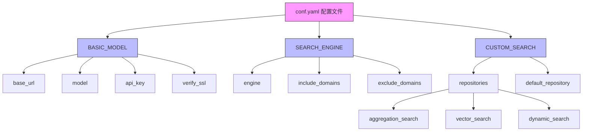
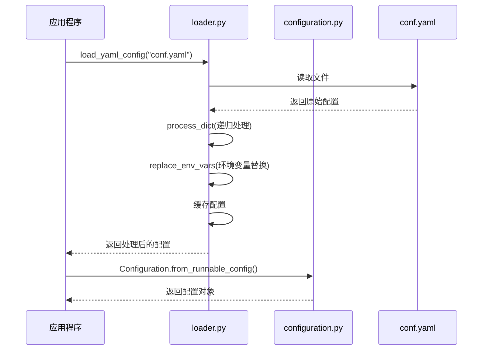
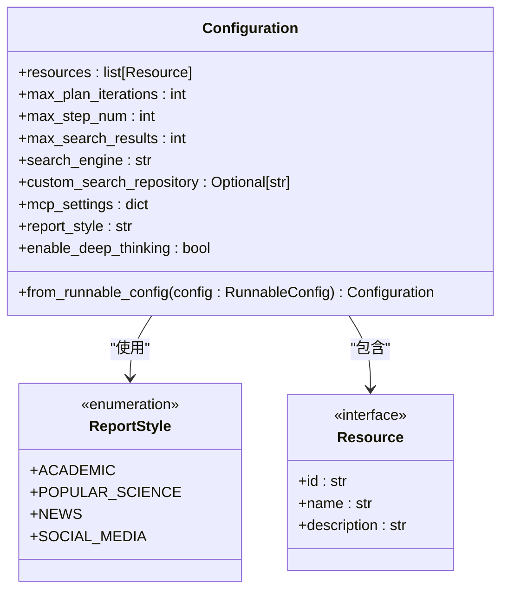
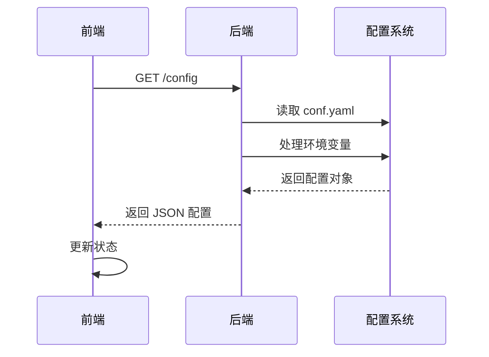

# 配置管理

<cite>
**本文档中引用的文件**   
- [conf.yaml](file://conf.yaml)
- [configuration.py](file://src/config/configuration.py)
- [loader.py](file://src/config/loader.py)
- [tools.py](file://src/config/tools.py)
- [report_style.py](file://src/config/report_style.py)
- [types.ts](file://web/src/core/config/types.ts)
- [hooks.ts](file://web/src/core/api/hooks.ts)
</cite>

## 目录
1. [简介](#简介)
2. [核心配置文件 conf.yaml](#核心配置文件-confyaml)
3. [配置加载与解析机制](#配置加载与解析机制)
4. [配置项参考表](#配置项参考表)
5. [环境变量覆盖](#环境变量覆盖)
6. [前后端配置同步](#前后端配置同步)
7. [配置验证与安全实践](#配置验证与安全实践)
8. [配置优化案例](#配置优化案例)
9. [结论](#结论)

## 简介
DeerFlow 的配置管理系统以 `conf.yaml` 为核心配置文件，结合 Python 后端和 TypeScript 前端的配置处理机制，实现了灵活、可扩展的系统配置管理。该系统支持 LLM 提供商设置、代理参数、工具配置等多种功能，并通过环境变量实现动态覆盖。本文档将详细解析其配置结构、加载机制和最佳实践。

## 核心配置文件 conf.yaml
`conf.yaml` 是 DeerFlow 的主要配置文件，定义了系统运行所需的关键参数。其结构清晰，分为 LLM 模型配置、搜索引擎配置和自定义搜索配置三大模块。

### LLM 模型配置
`BASIC_MODEL` 部分定义了基础语言模型的连接信息：
- `base_url`: LLM 服务的 API 地址
- `model`: 使用的模型名称
- `api_key`: 认证密钥
- `verify_ssl`: SSL 证书验证开关

可选的 `REASONING_MODEL` 部分用于配置推理专用模型，支持独立的规划任务。

### 搜索引擎配置
`SEARCH_ENGINE` 部分配置了默认搜索引擎：
- `engine`: 搜索引擎类型（如 tavily）
- `include_domains`: 限定搜索结果来源的域名列表
- `exclude_domains`: 排除搜索结果的域名列表

### 自定义搜索配置
`CUSTOM_SEARCH` 部分定义了多个自定义搜索仓库：
- `repositories`: 包含多个搜索仓库的配置，每个仓库有名称、描述、仓库标识和频道ID
- `default_repository`: 默认使用的搜索仓库



**Diagram sources**
- [conf.yaml](file://conf.yaml#L1-L68)

## 配置加载与解析机制
DeerFlow 的配置加载机制由 `src/config/loader.py` 和 `src/config/configuration.py` 协同完成，实现了从 YAML 文件到运行时配置对象的转换。

### 配置加载流程
1. 使用 `load_yaml_config` 函数读取 `conf.yaml` 文件
2. 通过 `process_dict` 递归处理配置，支持环境变量替换
3. 将处理后的配置缓存以提高性能
4. 创建 `Configuration` 对象供系统使用



**Diagram sources**
- [loader.py](file://src/config/loader.py#L1-L78)
- [configuration.py](file://src/config/configuration.py#L1-L70)

### 配置类结构
`Configuration` 类使用 Python 的 `dataclass` 实现，包含以下核心字段：
- `resources`: 研究使用的资源列表
- `max_plan_iterations`: 最大计划迭代次数
- `max_step_num`: 计划中最大步骤数
- `max_search_results`: 最大搜索结果数
- `search_engine`: 使用的搜索引擎
- `custom_search_repository`: 自定义搜索仓库ID
- `mcp_settings`: MCP 设置（动态加载的工具）
- `report_style`: 报告风格
- `enable_deep_thinking`: 是否启用深度思考



**Diagram sources**
- [configuration.py](file://src/config/configuration.py#L1-L70)
- [report_style.py](file://src/config/report_style.py#L1-L8)

## 配置项参考表
下表详细列出了 DeerFlow 的所有配置项，包括默认值、有效范围和使用示例。

| 配置项 | 文件位置 | 类型 | 默认值 | 有效范围 | 作用范围 | 使用示例 |
|-------|--------|-----|-------|--------|---------|---------|
| base_url | conf.yaml | string | http://192.168.0.106:8088/v1 | 有效的 HTTP/HTTPS URL | LLM 连接 | `http://localhost:8080/v1` |
| model | conf.yaml | string | qwen3-0.6 | 任意模型名称 | LLM 选择 | `gemini-1.5-pro` |
| api_key | conf.yaml | string | xxxx | 任意字符串 | LLM 认证 | `your_api_key_here` |
| verify_ssl | conf.yaml | boolean | false | true/false | SSL 验证 | `true` |
| engine | conf.yaml | string | tavily | tavily, duckduckgo, brave_search, arxiv, wikipedia, custom_search | 搜索引擎 | `duckduckgo` |
| include_domains | conf.yaml | list | [example.com, trusted-news.com, reliable-source.org, gov.cn, edu.cn] | 任意域名列表 | 搜索范围 | `["github.com", "stackoverflow.com"]` |
| exclude_domains | conf.yaml | list | [example.com] | 任意域名列表 | 搜索过滤 | `["wikipedia.org"]` |
| default_repository | conf.yaml | string | dynamic_search | aggregation_search, vector_search, dynamic_search | 自定义搜索 | `vector_search` |
| max_plan_iterations | configuration.py | int | 1 | 正整数 | 代理规划 | `3` |
| max_step_num | configuration.py | int | 3 | 正整数 | 代理执行 | `5` |
| max_search_results | configuration.py | int | 3 | 正整数 | 搜索结果 | `10` |
| search_engine | configuration.py | string | tavily | 任意搜索引擎名称 | 默认搜索 | `custom_search` |
| report_style | configuration.py | string | academic | academic, popular_science, news, social_media | 报告生成 | `news` |
| enable_deep_thinking | configuration.py | boolean | false | true/false | 思维深度 | `true` |

**Section sources**
- [conf.yaml](file://conf.yaml#L1-L68)
- [configuration.py](file://src/config/configuration.py#L1-L70)
- [tools.py](file://src/config/tools.py#L1-L31)

## 环境变量覆盖
DeerFlow 支持通过环境变量覆盖配置文件中的设置，提供了更高的灵活性和安全性。

### 环境变量处理
`loader.py` 提供了三个核心函数来处理环境变量：
- `get_str_env(name, default)`: 获取字符串环境变量
- `get_int_env(name, default)`: 获取整数环境变量
- `get_bool_env(name, default)`: 获取布尔环境变量

这些函数在读取配置时自动检查同名环境变量，如果存在则优先使用环境变量的值。

### 环境变量示例
```bash
# 覆盖 LLM API 密钥
export BASIC_MODEL_api_key=your_new_api_key

# 覆盖最大搜索结果数
export max_search_results=5

# 启用深度思考
export enable_deep_thinking=true

# 设置自定义搜索仓库
export custom_search_repository=aggregation_search
```

**Section sources**
- [loader.py](file://src/config/loader.py#L1-L78)

## 前后端配置同步
DeerFlow 通过 REST API 实现了前后端配置的同步，确保用户界面能够反映最新的系统配置。

### 前端配置获取
前端通过 `useConfig` Hook 从后端获取配置：
```typescript
export function useConfig(): {
  config: DeerFlowConfig | null;
  loading: boolean;
} {
  const [loading, setLoading] = useState(true);
  const [config, setConfig] = useState<DeerFlowConfig | null>(null);

  useEffect(() => {
    if (env.NEXT_PUBLIC_STATIC_WEBSITE_ONLY) {
      setLoading(false);
      return;
    }
    fetch(resolveServiceURL("./config"))
      .then((res) => res.json())
      .then((config) => {
        setConfig(config);
        setLoading(false);
      })
      .catch((err) => {
        console.error("Failed to fetch config", err);
        setConfig(null);
        setLoading(false);
      });
  }, []);

  return { config, loading };
}
```

### 配置同步流程


**Diagram sources**
- [hooks.ts](file://web/src/core/api/hooks.ts#L53-L72)
- [resolve-service-url.ts](file://web/src/core/api/resolve-service-url.ts#L1-L12)

## 配置验证与安全实践
DeerFlow 的配置系统包含多项验证和安全措施，确保系统的稳定性和安全性。

### 配置验证机制
- **类型验证**: 使用 `get_int_env` 和 `get_bool_env` 确保配置值的类型正确
- **缓存机制**: `load_yaml_config` 使用缓存避免重复读取文件
- **默认值保护**: 所有获取环境变量的函数都提供默认值
- **递归处理**: `process_dict` 函数递归处理嵌套配置

### 安全最佳实践
1. **敏感信息保护**: API 密钥等敏感信息应通过环境变量而非配置文件设置
2. **SSL 验证**: 生产环境中应启用 `verify_ssl` 以确保连接安全
3. **域限制**: 使用 `include_domains` 和 `exclude_domains` 限制搜索范围
4. **配置缓存**: 避免频繁读取配置文件，提高性能
5. **错误处理**: 对无效的环境变量值进行优雅降级

**Section sources**
- [loader.py](file://src/config/loader.py#L1-L78)
- [configuration.py](file://src/config/configuration.py#L1-L70)

## 配置优化案例
通过调整配置，可以显著优化 DeerFlow 的性能和行为模式。

### 案例一：提高搜索质量
```yaml
SEARCH_ENGINE:
  engine: tavily
  include_domains:
    - arxiv.org
    - nature.com
    - science.org
    - gov.cn
    - edu.cn
  exclude_domains:
    - wikipedia.org
    - blogspot.com
```
通过限定学术和政府域名，排除维基百科和博客，可以显著提高搜索结果的权威性和专业性。

### 案例二：启用深度思考
```yaml
# 启用推理模型
REASONING_MODEL:
  base_url: https://ark.cn-beijing.volces.com/api/v3
  model: "doubao-1-5-thinking-pro-m-250428"
  api_key: your_reasoning_api_key
  max_retries: 3

# 启用深度思考
enable_deep_thinking: true
max_plan_iterations: 3
```
通过配置专用的推理模型并启用深度思考，可以让系统进行更复杂的规划和分析。

### 案例三：自定义报告风格
```python
# 在代码中动态设置报告风格
config = Configuration(
    report_style=ReportStyle.NEWS.value,
    max_search_results=5,
    enable_deep_thinking=True
)
```
通过编程方式设置配置，可以根据不同场景生成不同风格的报告。

**Section sources**
- [conf.yaml](file://conf.yaml#L1-L68)
- [configuration.py](file://src/config/configuration.py#L1-L70)
- [report_style.py](file://src/config/report_style.py#L1-L8)

## 结论
DeerFlow 的配置管理系统设计精良，通过 `conf.yaml` 文件提供了灵活的配置选项，结合 `loader.py` 和 `configuration.py` 实现了高效的配置加载和解析。系统支持环境变量覆盖、前后端配置同步和多种安全实践，为用户提供了强大的配置管理能力。通过合理调整配置，可以显著优化系统性能和行为模式，满足不同场景的需求。