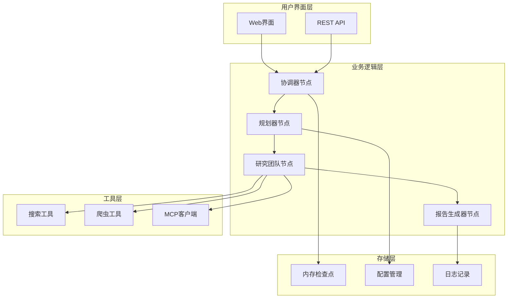
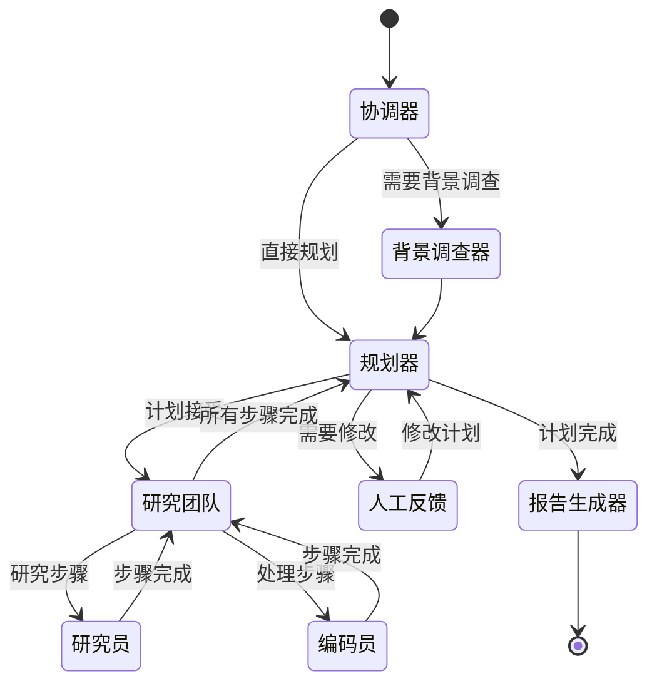
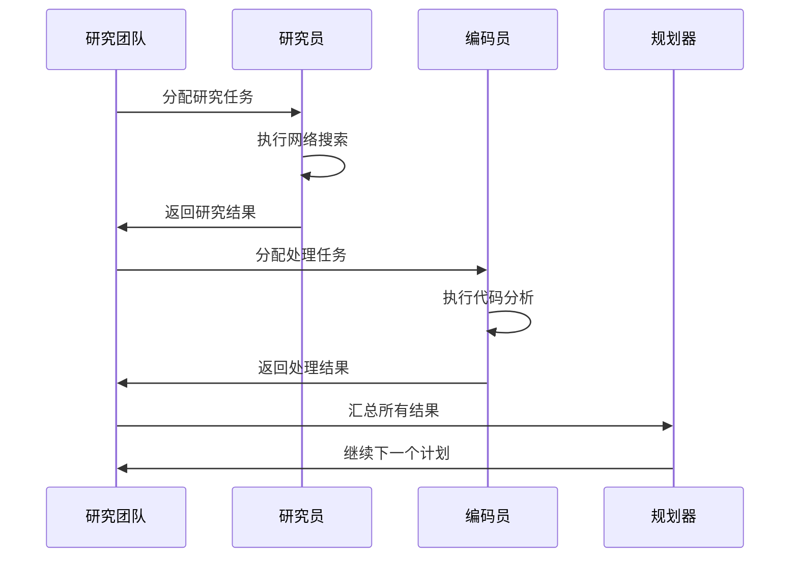
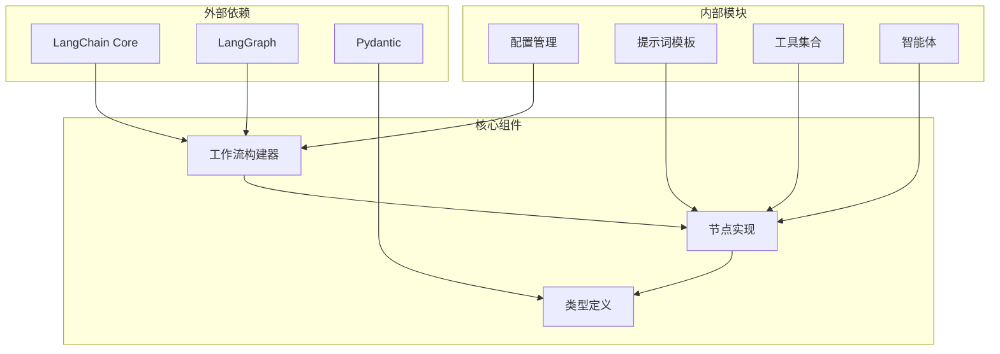

# 专业评审分析

<cite>
**本文档引用的文件**
- [review-of-the-professional.txt](file://web/public/replay/review-of-the-professional.txt)
- [reporter.md](file://src/prompts/reporter.md)
- [builder.py](file://src/graph/builder.py)
- [nodes.py](file://src/graph/nodes.py)
- [planner_model.py](file://src/prompts/planner_model.py)
- [configuration.py](file://src/config/configuration.py)
- [search.py](file://src/tools/search.py)
- [conf.yaml](file://conf.yaml)
- [test_builder.py](file://tests/unit/graph/test_builder.py)
- [openai_sora_report.md](file://examples/openai_sora_report.md)
</cite>

## 目录
1. [简介](#简介)
2. [项目结构](#项目结构)
3. [核心组件](#核心组件)
4. [架构概览](#架构概览)
5. [详细组件分析](#详细组件分析)
6. [依赖关系分析](#依赖关系分析)
7. [性能考虑](#性能考虑)
8. [故障排除指南](#故障排除指南)
9. [结论](#结论)

## 简介

DeerFlow系统是一个先进的智能研究和报告生成平台，专门设计用于处理需要专业领域知识的复杂评审类任务。该系统通过多智能体协作机制，结合深度学习技术和专业知识，能够为用户提供全面、准确且具有说服力的专业评审报告。

系统的核心优势在于其模块化的架构设计，能够根据不同类型的评审需求动态调整工作流程。通过review-of-the-professional.txt回放文件的分析，我们可以看到系统在处理电影《Léon: The Professional》的专业评审任务时，展现了卓越的信息收集能力和分析框架。

## 项目结构

DeerFlow系统采用分层架构设计，主要包含以下核心模块：



**图表来源**
- [builder.py](file://src/graph/builder.py#L1-L88)
- [nodes.py](file://src/graph/nodes.py#L1-L512)

**章节来源**
- [builder.py](file://src/graph/builder.py#L1-L88)
- [nodes.py](file://src/graph/nodes.py#L1-L512)

## 核心组件

### 协调器节点（Coordinator Node）

协调器节点是整个系统的工作流入口，负责与用户交互并确定后续处理路径。它能够识别用户的意图，并根据预设规则决定是否需要背景调查或直接进入规划阶段。

```python
def coordinator_node(
    state: State, config: RunnableConfig
) -> Command[Literal["planner", "background_investigator", "__end__"]]:
    """协调器节点，与客户沟通。"""
    logger.info("协调器正在对话。")
    configurable = Configuration.from_runnable_config(config)
    messages = apply_prompt_template("coordinator", state)
    response = (
        get_llm_by_type(AGENT_LLM_MAP["coordinator"])
        .bind_tools([handoff_to_planner])
        .invoke(messages)
    )
```

### 规划器节点（Planner Node）

规划器节点负责生成完整的分析计划，包括研究步骤、预期结果和时间安排。它能够根据输入信息判断是否需要进一步的背景调查，并决定是否需要人工反馈。

```python
def planner_node(
    state: State, config: RunnableConfig
) -> Command[Literal["human_feedback", "reporter"]]
    """规划器节点，生成完整计划。"""
    logger.info("规划器生成完整计划")
    configurable = Configuration.from_runnable_config(config)
    plan_iterations = state["plan_iterations"] if state.get("plan_iterations", 0) else 0
    messages = apply_prompt_template("planner", state, configurable)
```

### 报告生成器节点（Reporter Node）

报告生成器节点负责将收集到的信息整理成专业的评审报告。它支持多种报告风格，包括学术型、科普型、新闻型和社会媒体型，能够根据不同的受众需求定制报告格式。

**章节来源**
- [nodes.py](file://src/graph/nodes.py#L100-L200)
- [planner_model.py](file://src/prompts/planner_model.py#L1-L59)

## 架构概览

DeerFlow系统采用基于LangGraph的状态图架构，实现了高度灵活的工作流管理。系统的核心设计理念是通过状态机模式实现智能决策和动态路由。



**图表来源**
- [builder.py](file://src/graph/builder.py#L30-L88)
- [nodes.py](file://src/graph/nodes.py#L200-L300)

## 详细组件分析

### 工作流构建器（Workflow Builder）

工作流构建器是系统的核心组件，负责定义和编译状态图。它支持两种运行模式：带记忆的模式和无记忆模式。

```python
def build_graph_with_memory():
    """构建带有记忆的代理工作流图。"""
    # 使用持久内存保存对话历史
    memory = MemorySaver()
    
    # 构建状态图
    builder = _build_base_graph()
    return builder.compile(checkpointer=memory)

def build_graph():
    """构建不带记忆的代理工作流图。"""
    # 构建状态图
    builder = _build_base_graph()
    return builder.compile()
```

### 智能条件路由

系统实现了智能的条件路由机制，能够根据当前状态动态选择下一步执行的节点：

```python
def continue_to_running_research_team(state: State):
    current_plan = state.get("current_plan")
    if not current_plan or not current_plan.steps:
        return "planner"

    if all(step.execution_res for step in current_plan.steps):
        return "planner"

    # 查找第一个未完成的步骤
    incomplete_step = None
    for step in current_plan.steps:
        if not step.execution_res:
            incomplete_step = step
            break

    if not incomplete_step:
        return "planner"

    if incomplete_step.step_type == StepType.RESEARCH:
        return "researcher"
    if incomplete_step.step_type == StepType.PROCESSING:
        return "coder"
    return "planner"
```

### 研究团队协作机制

研究团队节点实现了研究员和编码员的协同工作模式，支持异步执行和结果汇总：



**图表来源**
- [nodes.py](file://src/graph/nodes.py#L400-L512)

**章节来源**
- [builder.py](file://src/graph/builder.py#L1-L88)
- [nodes.py](file://src/graph/nodes.py#L300-L400)

### 提示词模板系统

系统提供了丰富的提示词模板，支持不同风格的报告生成：

```markdown
# 报告结构

1. **标题**
   - 基于提供的信息生成简洁明了的标题。

2. **关键要点**
   - 列出最重要的发现（4-6个要点）。
   - 每个要点应简洁（1-2句话）。
   - 专注于最重要和最可操作的信息。

3. **概述**
   - 对主题的简要介绍（1-2段）。
   - 提供背景和重要性。

4. **详细分析**
   - 将信息组织成逻辑清晰的部分。
   - 包含相关的子部分。
   - 以结构化、易于跟随的方式呈现信息。
   - 强调意外或特别值得注意的细节。
```

**章节来源**
- [reporter.md](file://src/prompts/reporter.md#L1-L280)

### 搜索引擎集成

系统集成了多种搜索引擎，支持灵活的搜索配置：

```python
def get_web_search_tool(max_search_results: int, engine: str = None, repository_id: str = None):
    search_config = get_search_config()
    
    # 使用提供的引擎或回退到环境变量
    selected_engine = engine or SELECTED_SEARCH_ENGINE
    
    if selected_engine == SearchEngine.TAVILY.value:
        return LoggedTavilySearch(
            name="web_search",
            max_results=max_search_results,
            include_raw_content=True,
            include_images=True,
            include_image_descriptions=True,
            include_domains=include_domains,
            exclude_domains=exclude_domains,
        )
```

**章节来源**
- [search.py](file://src/tools/search.py#L1-L114)

## 依赖关系分析

系统的依赖关系体现了清晰的分层架构设计：



**图表来源**
- [builder.py](file://src/graph/builder.py#L1-L10)
- [nodes.py](file://src/graph/nodes.py#L1-L30)

**章节来源**
- [builder.py](file://src/graph/builder.py#L1-L88)
- [configuration.py](file://src/config/configuration.py#L1-L71)

## 性能考虑

### 并发处理能力

系统通过异步编程模式实现了高效的并发处理能力。研究团队节点支持研究员和编码员同时执行不同的任务，显著提高了整体处理效率。

### 内存管理

系统提供了两种运行模式：
- **带记忆模式**：使用MemorySaver保存对话历史，适合需要上下文连续性的场景
- **无记忆模式**：不保存历史记录，适合一次性任务处理

### 可扩展性设计

系统采用插件化架构，支持动态加载MCP服务器和工具，便于扩展新的功能和服务。

## 故障排除指南

### 常见问题及解决方案

1. **递归限制错误**
   ```python
   def get_recursion_limit(default: int = 25) -> int:
       env_value_str = get_str_env("AGENT_RECURSION_LIMIT", str(default))
       parsed_limit = get_int_env("AGENT_RECURSION_LIMIT", default)
       
       if parsed_limit > 0:
           return parsed_limit
       else:
           return default
   ```

2. **搜索配置问题**
   - 检查SEARCH_ENGINE配置是否正确
   - 验证API密钥的有效性
   - 确认域名过滤规则设置

3. **MCP连接失败**
   - 验证服务器配置
   - 检查网络连接
   - 确认工具权限设置

**章节来源**
- [configuration.py](file://src/config/configuration.py#L15-L35)
- [nodes.py](file://src/graph/nodes.py#L450-L500)

## 结论

DeerFlow系统通过其先进的架构设计和智能工作流管理，为专业评审任务提供了强大的技术支持。系统的核心优势包括：

1. **模块化设计**：清晰的职责分离和可扩展的架构
2. **智能决策**：基于状态的动态路由和条件执行
3. **多模态支持**：集成多种数据源和分析工具
4. **灵活配置**：支持多种报告风格和搜索策略
5. **高效协作**：研究员和编码员的协同工作机制

通过review-of-the-professional.txt的实际案例分析，系统展现了在处理复杂专业评审任务时的强大能力，特别是在信息收集、分析整合和报告生成方面的卓越表现。未来的发展方向包括进一步优化搜索算法、增强自然语言处理能力，以及扩展更多专业领域的知识库支持。