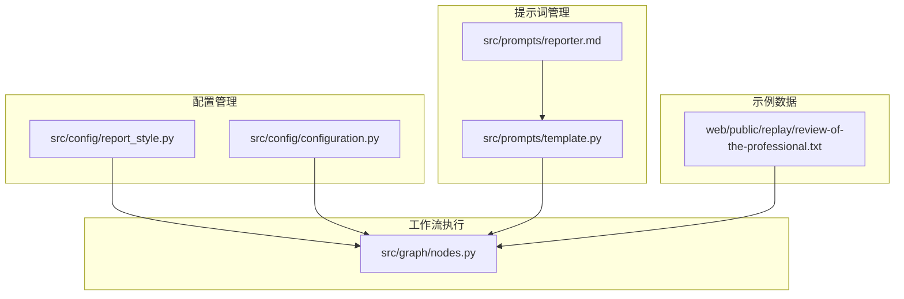
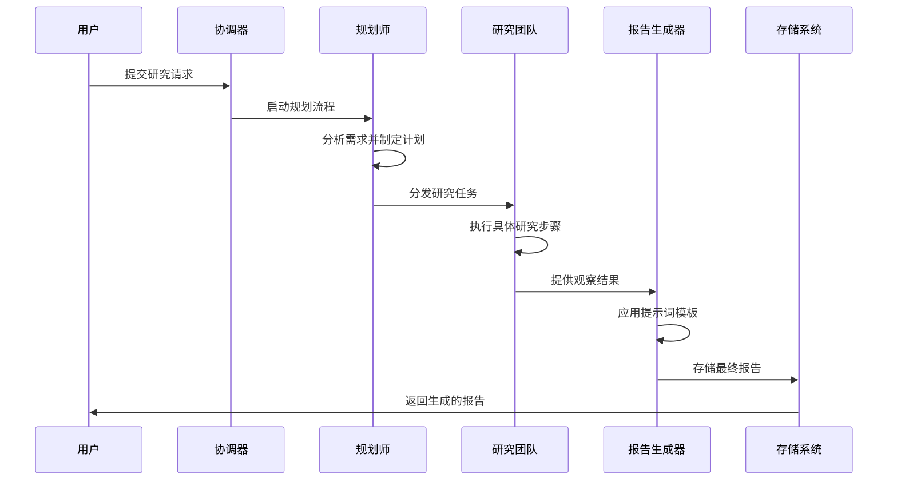
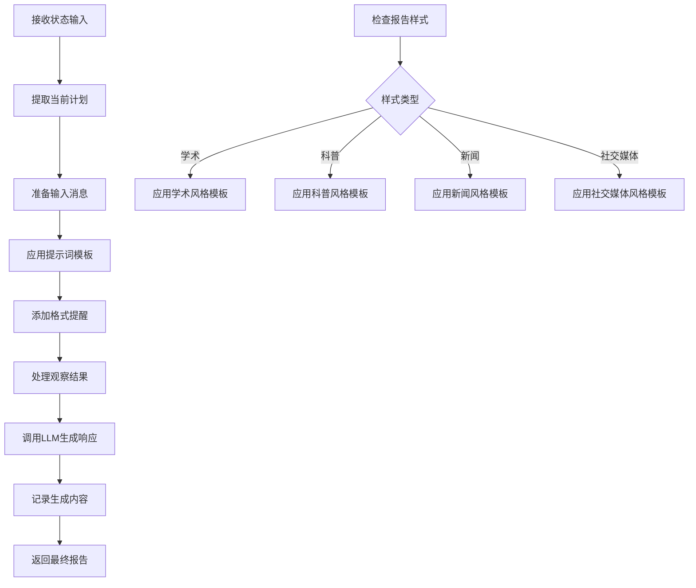
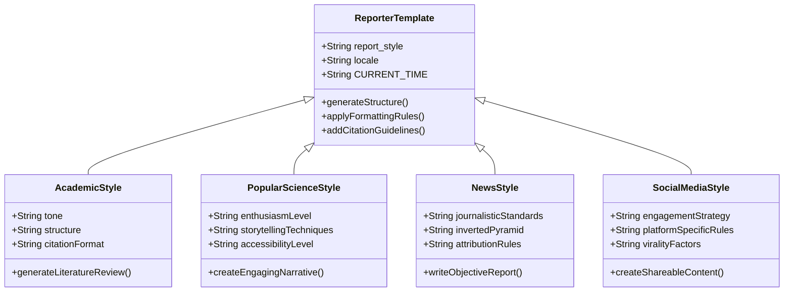
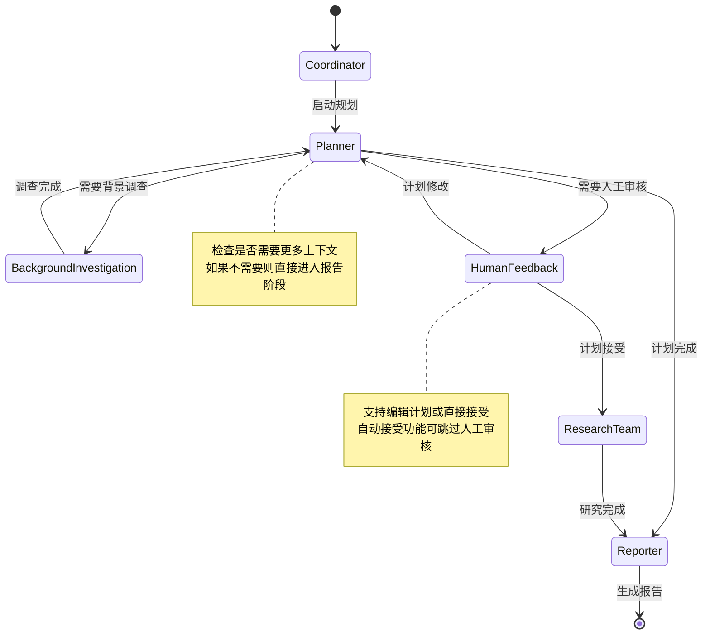
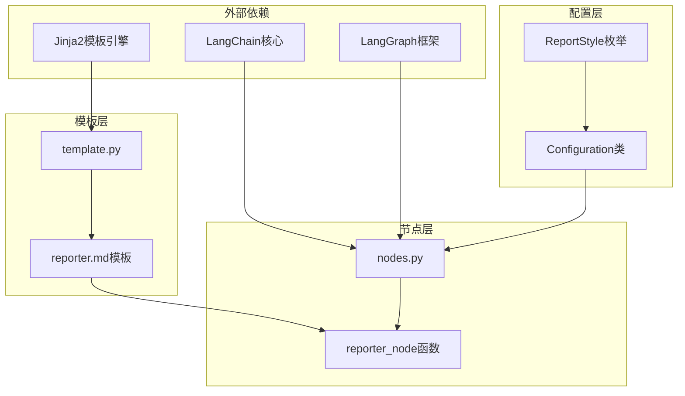

# 报告生成机制

<cite>
**本文档引用的文件**
- [src/prompts/reporter.md](file://src/prompts/reporter.md)
- [web/public/replay/review-of-the-professional.txt](file://web/public/replay/review-of-the-professional.txt)
- [src/graph/nodes.py](file://src/graph/nodes.py)
- [src/config/report_style.py](file://src/config/report_style.py)
- [src/prompts/template.py](file://src/prompts/template.py)
- [src/config/configuration.py](file://src/config/configuration.py)
</cite>

## 目录
1. [简介](#简介)
2. [项目结构概览](#项目结构概览)
3. [核心组件分析](#核心组件分析)
4. [架构概览](#架构概览)
5. [详细组件分析](#详细组件分析)
6. [依赖关系分析](#依赖关系分析)
7. [性能考虑](#性能考虑)
8. [故障排除指南](#故障排除指南)
9. [结论](#结论)

## 简介

DeerFlow系统是一个基于LangGraph的智能研究和报告生成平台，专门设计用于将收集到的专业评审证据转化为结构化的高质量报告。该系统通过精心设计的提示词模板、多阶段处理流程和灵活的配置机制，实现了从原始数据收集到最终报告输出的完整自动化流程。

系统的核心优势在于其模块化的报告生成机制，能够根据不同用户需求和场景要求，自动生成符合特定风格和格式的专业报告。无论是学术研究、新闻报道还是社交媒体内容，系统都能提供相应风格的高质量输出。

## 项目结构概览

DeerFlow系统的报告生成机制主要分布在以下几个关键目录中：

**图表来源**
- [src/prompts/reporter.md](file://src/prompts/reporter.md#L1-L280)
- [src/graph/nodes.py](file://src/graph/nodes.py#L1-L512)

**章节来源**
- [src/prompts/reporter.md](file://src/prompts/reporter.md#L1-L280)
- [src/graph/nodes.py](file://src/graph/nodes.py#L1-L512)

## 核心组件分析

### 提示词模板系统

提示词模板是报告生成机制的核心，负责定义不同风格报告的结构和内容规范。系统支持四种主要报告风格：

1. **学术风格 (academic)**：适用于学术研究论文，强调严谨性和专业性
2. **科普风格 (popular_science)**：面向大众的科学传播，注重可读性和趣味性
3. **新闻风格 (news)**：模仿主流新闻媒体的报道风格，保持客观性和权威性
4. **社交媒体风格 (social_media)**：针对社交平台的内容创作，强调互动性和传播性

### 配置管理系统

配置系统提供了灵活的参数控制机制，允许用户根据具体需求调整报告生成的各种参数：

- **报告样式选择**：支持多种预设风格的自动切换
- **语言本地化**：支持多语言环境下的内容适配
- **深度思考模式**：启用高级推理和分析功能
- **最大迭代次数**：控制计划制定和执行的循环次数

**章节来源**
- [src/config/report_style.py](file://src/config/report_style.py#L1-L9)
- [src/config/configuration.py](file://src/config/configuration.py#L1-L71)

## 架构概览

DeerFlow的报告生成机制采用分层架构设计，确保各组件之间的松耦合和高内聚：

**图表来源**
- [src/graph/nodes.py](file://src/graph/nodes.py#L263-L277)
- [src/graph/nodes.py](file://src/graph/nodes.py#L150-L180)

## 详细组件分析

### 报告生成节点 (Reporter Node)

报告生成节点是整个工作流的核心组件，负责将收集到的研究成果转化为最终的报告输出：

**图表来源**
- [src/graph/nodes.py](file://src/graph/nodes.py#L263-L277)

报告生成节点的关键特性包括：

1. **动态模板选择**：根据配置的报告样式自动选择相应的提示词模板
2. **格式化提醒**：在生成过程中持续提醒用户遵循Markdown格式规范
3. **观察结果整合**：将之前步骤收集的所有观察结果整合到报告中
4. **多语言支持**：支持不同语言环境下的内容生成

### 提示词模板设计

提示词模板采用了高度模块化的设计，每个风格都有对应的模板文件：

**图表来源**
- [src/prompts/reporter.md](file://src/prompts/reporter.md#L1-L280)
- [src/config/report_style.py](file://src/config/report_style.py#L1-L9)

### 工作流执行引擎

工作流执行引擎负责协调各个节点的执行顺序和状态传递：

**图表来源**
- [src/graph/nodes.py](file://src/graph/nodes.py#L150-L180)
- [src/graph/nodes.py](file://src/graph/nodes.py#L182-L210)

**章节来源**
- [src/graph/nodes.py](file://src/graph/nodes.py#L263-L277)
- [src/prompts/reporter.md](file://src/prompts/reporter.md#L1-L280)

## 依赖关系分析

系统的依赖关系体现了清晰的分层架构设计：

**图表来源**
- [src/prompts/template.py](file://src/prompts/template.py#L1-L68)
- [src/graph/nodes.py](file://src/graph/nodes.py#L1-L512)

**章节来源**
- [src/prompts/template.py](file://src/prompts/template.py#L1-L68)
- [src/config/configuration.py](file://src/config/configuration.py#L1-L71)

## 性能考虑

### 内存优化策略

1. **流式处理**：对于大型报告生成任务，系统支持流式输出以减少内存占用
2. **状态压缩**：定期清理不必要的中间状态以控制内存使用
3. **缓存机制**：对重复使用的模板和配置进行缓存

### 并发处理能力

1. **异步执行**：研究团队节点支持并发执行多个研究任务
2. **资源池管理**：合理分配LLM调用资源，避免超载
3. **负载均衡**：在多实例部署时自动进行任务分配

### 可扩展性设计

1. **插件化架构**：新的报告样式可以通过扩展点轻松添加
2. **配置驱动**：通过配置文件即可调整系统行为，无需代码修改
3. **模块化组件**：各功能模块独立，便于单独升级和维护

## 故障排除指南

### 常见问题及解决方案

1. **报告生成失败**
   - 检查LLM连接状态
   - 验证提示词模板语法
   - 确认配置参数有效性

2. **格式错误**
   - 重新检查Markdown语法
   - 确保表格格式正确
   - 验证引用格式

3. **性能问题**
   - 调整递归限制设置
   - 优化搜索结果数量
   - 检查网络连接稳定性

### 调试工具和技巧

1. **日志分析**：启用详细日志记录以追踪执行流程
2. **状态检查**：监控各节点的状态变化
3. **配置验证**：使用内置验证器检查配置参数

**章节来源**
- [src/graph/nodes.py](file://src/graph/nodes.py#L263-L277)
- [src/config/configuration.py](file://src/config/configuration.py#L1-L71)

## 结论

DeerFlow系统的报告生成机制展现了现代AI驱动内容生成技术的先进水平。通过精心设计的提示词模板、灵活的配置系统和高效的执行引擎，该系统能够满足各种专业场景下的报告生成需求。

系统的主要优势包括：

1. **高度可定制**：支持多种报告风格和格式要求
2. **智能化程度高**：能够自动分析需求并生成相应内容
3. **用户体验友好**：提供直观的交互界面和清晰的进度反馈
4. **技术架构先进**：采用模块化设计和微服务架构

未来的发展方向可能包括：
- 增强多模态内容生成能力
- 扩展更多的报告样式和模板
- 优化大规模文档处理性能
- 加强与其他系统的集成能力

通过持续的技术创新和功能完善，DeerFlow系统有望成为专业内容生成领域的标杆产品。