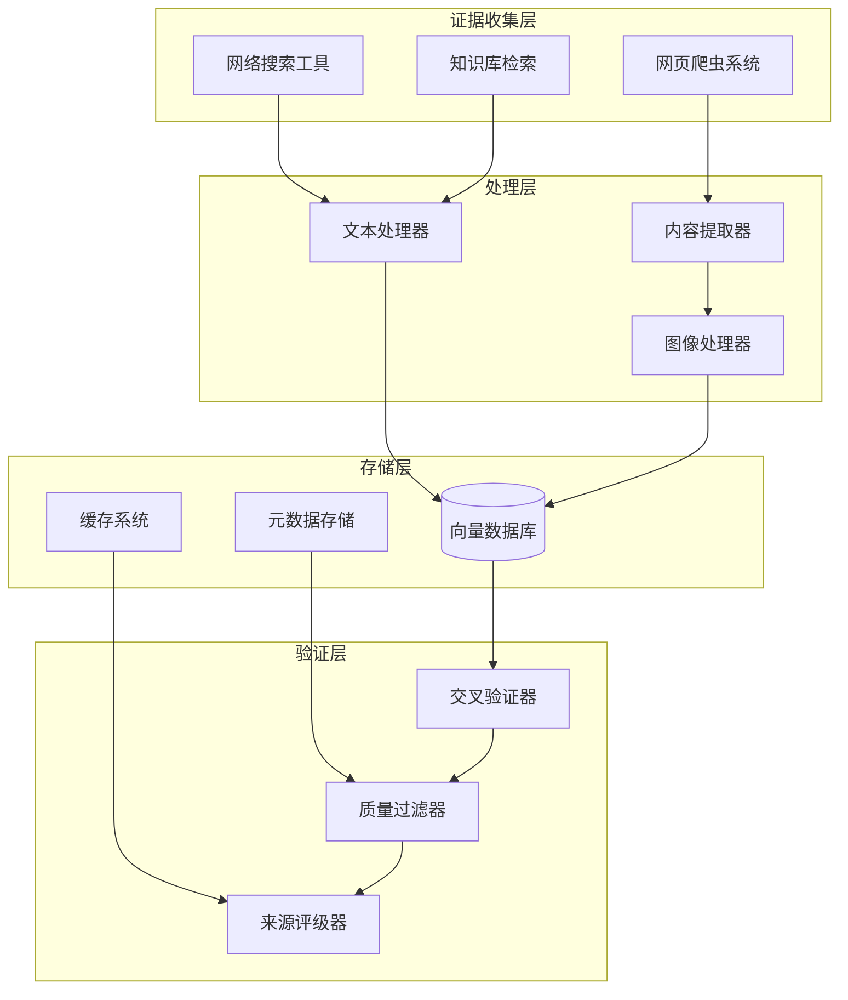
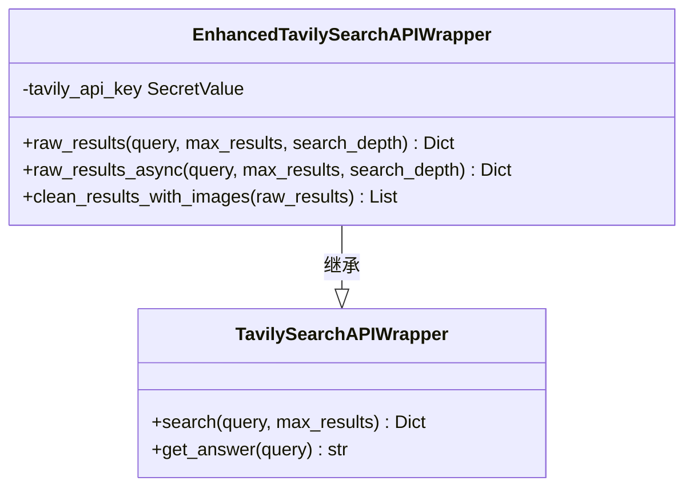
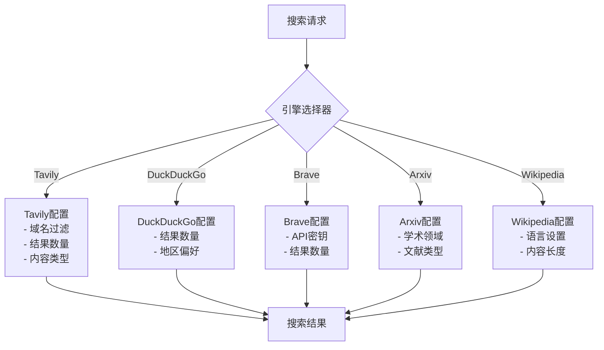
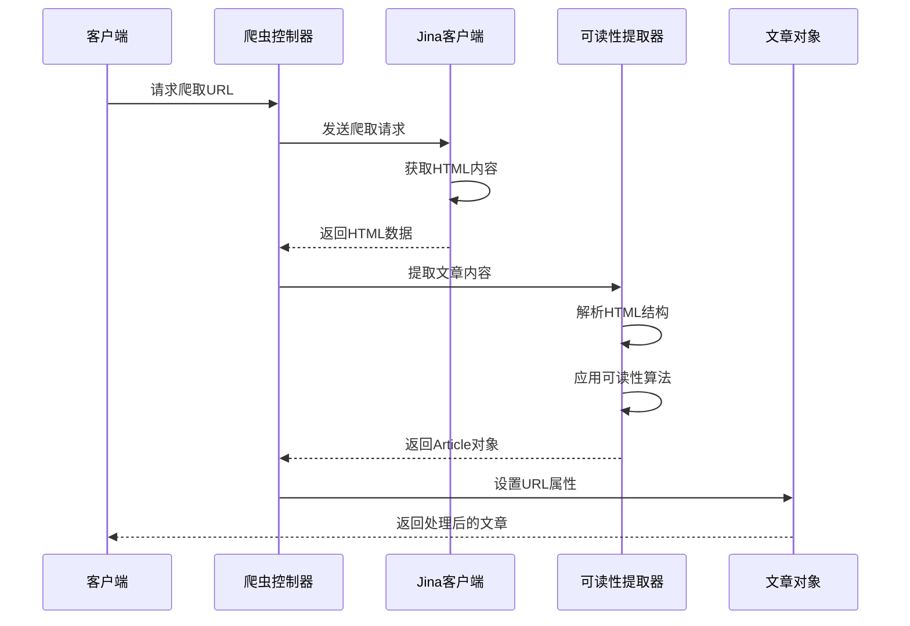
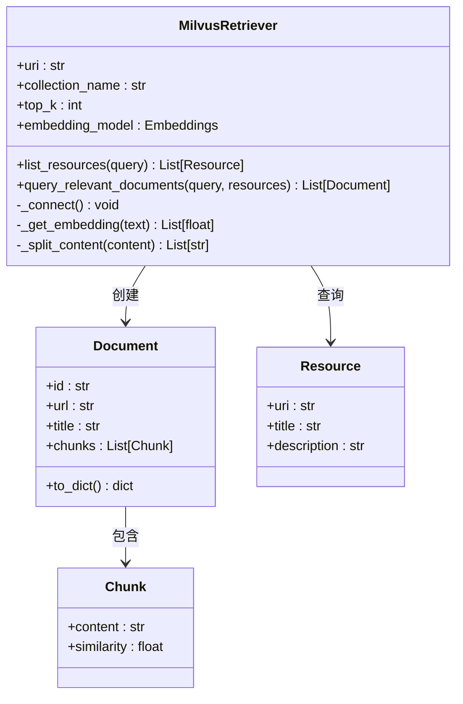
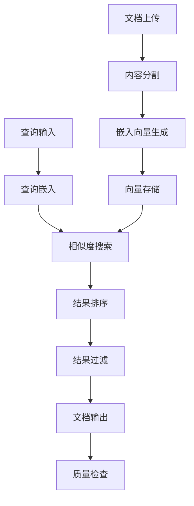
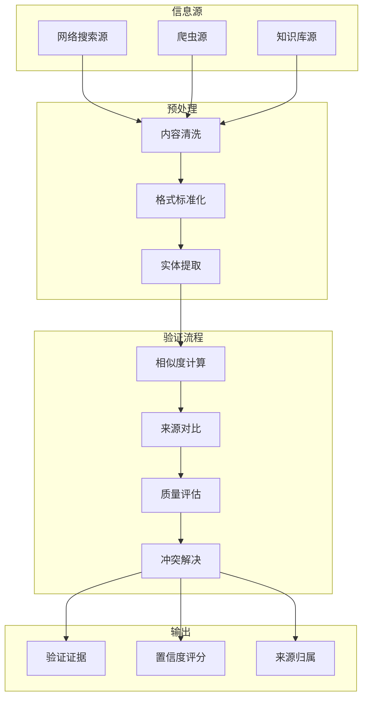

# 证据收集策略

<cite>
**本文档引用的文件**
- [tavily_search_api_wrapper.py](file://src/tools/tavily_search/tavily_search_api_wrapper.py)
- [crawler.py](file://src/crawler/crawler.py)
- [article.py](file://src/crawler/article.py)
- [jina_client.py](file://src/crawler/jina_client.py)
- [readability_extractor.py](file://src/crawler/readability_extractor.py)
- [retriever.py](file://src/rag/retriever.py)
- [milvus.py](file://src/rag/milvus.py)
- [configuration.py](file://src/config/configuration.py)
- [custom_search.py](file://src/config/custom_search.py)
- [search.py](file://src/tools/search.py)
</cite>

## 目录
1. [概述](#概述)
2. [系统架构](#系统架构)
3. [网络搜索工具](#网络搜索工具)
4. [网页爬虫系统](#网页爬虫系统)
5. [知识库检索系统](#知识库检索系统)
6. [证据交叉验证机制](#证据交叉验证机制)
7. [配置参数与优化](#配置参数与优化)
8. [性能考虑](#性能考虑)
9. [故障排除指南](#故障排除指南)
10. [结论](#结论)

## 概述

DeerFlow系统采用多源证据收集策略，通过整合网络搜索、网页爬取和知识库检索三大核心模块，为专业评审任务提供全面、准确的证据支持。该系统能够自动识别、收集和验证来自不同来源的专业评价信息，确保评审依据的可靠性和完整性。

系统的核心优势在于其智能的证据收集流程：首先通过网络搜索工具获取公开的专业评价信息，然后利用网页爬虫技术抓取专业机构网站和个人作品集中的详细内容，最后从本地知识库中检索相关专业标准和历史案例。通过这种多层次的证据收集方式，系统能够交叉验证不同来源的信息，提高评审决策的质量。

## 系统架构

DeerFlow的证据收集系统采用模块化设计，各组件职责明确且相互协作：



**图表来源**
- [tavily_search_api_wrapper.py](file://src/tools/tavily_search/tavily_search_api_wrapper.py#L1-L114)
- [crawler.py](file://src/crawler/crawler.py#L1-L28)
- [retriever.py](file://src/rag/retriever.py#L1-L82)

## 网络搜索工具

### Tavily搜索API包装器

系统的核心网络搜索功能由EnhancedTavilySearchAPIWrapper类提供，该类扩展了原始的Tavily搜索功能，增加了异步处理能力和图像内容支持。



**图表来源**
- [tavily_search_api_wrapper.py](file://src/tools/tavily_search/tavily_search_api_wrapper.py#L15-L114)

#### 核心功能特性

1. **高级搜索深度**：支持"basic"和"advanced"两种搜索模式，可根据需求调整搜索深度
2. **结果过滤**：提供include_domains和exclude_domains参数，精确控制搜索范围
3. **多格式输出**：支持原始内容、图像和图像描述的完整信息提取
4. **异步处理**：提供async版本的搜索接口，提高并发性能
5. **结果清理**：自动清理和标准化搜索结果格式

#### 配置参数详解

- **max_results**：控制返回的最大结果数量，默认为5个
- **search_depth**：设置搜索深度，"advanced"模式包含更多上下文信息
- **include_domains**：白名单域名列表，限制搜索范围到特定网站
- **exclude_domains**：黑名单域名列表，排除不相关或低质量的网站
- **include_raw_content**：是否包含原始HTML内容
- **include_images**：是否包含页面中的图片信息
- **include_image_descriptions**：是否提取图片的描述信息

**章节来源**
- [tavily_search_api_wrapper.py](file://src/tools/tavily_search/tavily_search_api_wrapper.py#L15-L114)

### 多引擎搜索支持

系统支持多种搜索引擎，包括Tavily、DuckDuckGo、Brave Search、Arxiv和Wikipedia等：



**图表来源**
- [search.py](file://src/tools/search.py#L40-L113)

**章节来源**
- [search.py](file://src/tools/search.py#L1-L114)

## 网页爬虫系统

### 爬虫架构设计

DeerFlow的爬虫系统采用分层架构，通过专门的组件处理不同的爬取任务：



**图表来源**
- [crawler.py](file://src/crawler/crawler.py#L10-L27)
- [jina_client.py](file://src/crawler/jina_client.py#L10-L26)
- [readability_extractor.py](file://src/crawler/readability_extractor.py#L10-L15)

#### Jina客户端功能

Jina客户端负责实际的网页爬取工作，具有以下特点：

1. **免费易用**：相比其他爬虫工具，Jina提供了免费的爬取服务
2. **格式转换**：支持HTML到Markdown的格式转换
3. **API密钥支持**：可选的API密钥认证，提供更高的访问限额
4. **错误处理**：完善的错误处理机制，确保爬取过程的稳定性

#### 可读性提取器

可读性提取器使用readabilipy库进行内容提取，确保获取的文章内容具有良好的可读性：

- **标题提取**：自动识别并提取页面主标题
- **内容过滤**：去除广告、导航和其他干扰元素
- **结构保持**：保留文章的语义结构和格式
- **多语言支持**：支持多种语言的内容提取

#### 文章对象处理

爬取完成后，系统会将内容转换为Article对象，支持：

1. **Markdown转换**：将HTML内容转换为Markdown格式
2. **图像处理**：分离文本和图像内容，便于后续处理
3. **URL关联**：保持原始URL信息，便于溯源
4. **消息格式**：转换为统一的消息格式，便于LLM处理

**章节来源**
- [crawler.py](file://src/crawler/crawler.py#L1-L28)
- [jina_client.py](file://src/crawler/jina_client.py#L1-L27)
- [readability_extractor.py](file://src/crawler/readability_extractor.py#L1-L16)
- [article.py](file://src/crawler/article.py#L1-L38)

## 知识库检索系统

### 向量数据库架构

DeerFlow的知识库检索系统基于Milvus向量数据库构建，支持高效的语义搜索和文档检索：



**图表来源**
- [milvus.py](file://src/rag/milvus.py#L50-L786)
- [retriever.py](file://src/rag/retriever.py#L1-L82)

#### 向量嵌入模型

系统支持多种嵌入模型提供商：

1. **OpenAI**：使用text-embedding-ada-002和text-embedding-v4模型
2. **Dashscope**：阿里云的通义千问Embedding服务
3. **自定义模型**：支持用户自定义的嵌入模型

#### 文档索引与检索



**图表来源**
- [milvus.py](file://src/rag/milvus.py#L400-L500)

#### 示例文档管理

系统提供了示例文档的自动加载和管理功能：

- **自动加载**：根据配置自动加载项目根目录下的markdown文件
- **增量更新**：支持增量更新，避免重复加载
- **文档ID生成**：基于文件名、大小和修改时间生成稳定的文档ID
- **标题提取**：从markdown内容中自动提取标题

**章节来源**
- [milvus.py](file://src/rag/milvus.py#L1-L786)
- [retriever.py](file://src/rag/retriever.py#L1-L82)

## 证据交叉验证机制

### 多源信息融合

DeerFlow系统实现了智能的证据交叉验证机制，通过比较不同来源的信息来确保证据的准确性和可靠性：



### 质量评估标准

系统建立了多维度的质量评估体系：

1. **内容质量**：
   - 信息完整性
   - 事实准确性
   - 时效性评估
   - 语言规范性

2. **来源可信度**：
   - 来源权威性
   - 更新频率
   - 用户评价
   - 引用次数

3. **一致性检查**：
   - 不同来源信息的一致性
   - 时间线合理性
   - 逻辑连贯性

### 冲突解决策略

当出现信息冲突时，系统采用以下解决策略：

1. **优先级排序**：根据来源可信度和更新时间确定优先级
2. **投票机制**：多数一致的信息优先采用
3. **专家判断**：对于复杂冲突，提供人工审核选项
4. **置信度加权**：根据置信度对不同来源的信息进行加权合并

## 配置参数与优化

### 环境变量配置

DeerFlow系统提供了丰富的配置选项，支持灵活的部署和优化：

#### Milvus向量数据库配置

```python
# 连接配置
MILVUS_URI: str = "http://localhost:19530"
MILVUS_COLLECTION: str = "documents"
MILVUS_USER: str = None
MILVUS_PASSWORD: str = None

# 搜索配置
MILVUS_TOP_K: int = 10
MILVUS_VECTOR_FIELD: str = "embedding"
MILVUS_CONTENT_FIELD: str = "content"

# 嵌入模型配置
MILVUS_EMBEDDING_PROVIDER: str = "openai"
MILVUS_EMBEDDING_MODEL: str = "text-embedding-ada-002"
MILVUS_EMBEDDING_DIM: int = 1536

# 示例文档配置
MILVUS_AUTO_LOAD_EXAMPLES: bool = True
MILVUS_EXAMPLES_DIR: str = "examples"
MILVUS_CHUNK_SIZE: int = 4000
```

#### 搜索引擎配置

```python
# 搜索引擎选择
SEARCH_ENGINE: str = "tavily"

# Tavily配置
TAVILY_API_KEY: str = None
INCLUDE_DOMAINS: List[str] = []
EXCLUDE_DOMAINS: List[str] = []

# 结果数量配置
MAX_SEARCH_RESULTS: int = 3
MAX_PLAN_ITERATIONS: int = 1
MAX_STEP_NUM: int = 3
```

### 性能优化建议

#### 并发处理优化

1. **异步搜索**：使用async版本的搜索接口提高并发性能
2. **批量处理**：对多个URL进行批量爬取和处理
3. **连接池**：复用HTTP连接减少建立连接的开销
4. **缓存策略**：对频繁访问的资源实施缓存机制

#### 资源管理优化

1. **内存管理**：及时释放不再使用的文档对象
2. **磁盘空间**：定期清理过期的缓存文件
3. **网络带宽**：合理设置并发请求数量
4. **CPU使用**：优化嵌入向量的计算过程

#### 搜索质量优化

1. **查询改写**：对原始查询进行改写以提高搜索质量
2. **结果过滤**：根据业务需求过滤不相关的结果
3. **重排序**：使用机器学习模型对结果进行重排序
4. **反馈循环**：根据用户反馈持续优化搜索算法

**章节来源**
- [milvus.py](file://src/rag/milvus.py#L50-L150)
- [configuration.py](file://src/config/configuration.py#L1-L71)
- [custom_search.py](file://src/config/custom_search.py#L1-L120)

## 性能考虑

### 系统性能指标

DeerFlow系统的性能表现直接影响证据收集的效率和质量。以下是关键的性能指标和优化策略：

#### 响应时间优化

1. **网络延迟最小化**：
   - 使用CDN加速静态资源访问
   - 选择地理位置最优的服务器节点
   - 实施智能DNS解析

2. **缓存策略**：
   - 浏览器缓存：对静态资源实施长期缓存
   - 服务器缓存：对频繁访问的数据实施缓存
   - 分布式缓存：使用Redis等分布式缓存系统

3. **压缩传输**：
   - 启用gzip压缩
   - 使用WebP格式的图片
   - 压缩JavaScript和CSS文件

#### 并发处理能力

系统支持高并发的证据收集请求，通过以下机制保证性能：

1. **异步处理**：大部分操作都支持异步执行
2. **连接池管理**：复用网络连接减少建立连接的开销
3. **负载均衡**：在多个服务器节点间分配请求
4. **限流保护**：防止过载导致的服务不可用

### 扩展性设计

#### 水平扩展

1. **微服务架构**：将不同功能模块独立部署
2. **容器化部署**：使用Docker和Kubernetes进行容器编排
3. **无状态设计**：确保服务实例可以任意替换
4. **自动扩缩容**：根据负载动态调整实例数量

#### 数据存储扩展

1. **分片策略**：对大规模数据实施水平分片
2. **读写分离**：分离读写操作提高性能
3. **冷热数据分离**：将不常访问的数据迁移到低成本存储
4. **备份恢复**：实施定期备份和快速恢复机制

## 故障排除指南

### 常见问题诊断

#### 网络搜索问题

1. **API密钥无效**
   - 检查环境变量设置
   - 验证API密钥的有效性
   - 确认配额和权限设置

2. **搜索结果为空**
   - 检查include_domains和exclude_domains配置
   - 验证搜索关键词的准确性
   - 尝试使用不同的搜索引擎

3. **响应超时**
   - 增加超时时间设置
   - 检查网络连接稳定性
   - 使用异步接口提高响应速度

#### 爬虫系统问题

1. **爬取失败**
   - 检查目标网站的robots.txt规则
   - 验证URL格式的正确性
   - 确认Jina API密钥设置

2. **内容提取失败**
   - 检查HTML结构的合法性
   - 验证readabilipy库的版本兼容性
   - 查看日志中的错误信息

3. **编码问题**
   - 确保UTF-8编码的正确处理
   - 检查特殊字符的转义处理
   - 验证字符集检测的准确性

#### 向量数据库问题

1. **连接失败**
   - 检查MILVUS_URI配置
   - 验证网络连通性
   - 确认防火墙设置

2. **查询超时**
   - 调整索引参数
   - 增加nprobe值
   - 优化查询语句

3. **内存不足**
   - 增加服务器内存
   - 减少批量处理的数量
   - 清理不必要的索引

### 日志监控

系统提供了详细的日志记录功能，帮助诊断和解决问题：

1. **搜索日志**：记录每次搜索的详细信息
2. **爬取日志**：跟踪爬取过程的状态和错误
3. **数据库日志**：监控数据库操作的性能和错误
4. **系统日志**：记录系统级别的异常和警告

### 性能监控

建议实施以下性能监控措施：

1. **响应时间监控**：跟踪各项操作的平均响应时间
2. **错误率监控**：统计各类错误的发生频率
3. **资源使用监控**：监控CPU、内存、磁盘和网络使用情况
4. **业务指标监控**：跟踪关键业务指标的变化趋势

**章节来源**
- [tavily_search_api_wrapper.py](file://src/tools/tavily_search/tavily_search_api_wrapper.py#L15-L114)
- [jina_client.py](file://src/crawler/jina_client.py#L10-L26)
- [milvus.py](file://src/rag/milvus.py#L50-L150)

## 结论

DeerFlow系统的证据收集策略通过精心设计的多层架构，实现了高效、准确和可靠的证据收集能力。系统的核心优势体现在以下几个方面：

### 技术创新点

1. **多源融合**：整合网络搜索、网页爬取和知识库检索三种不同的信息源，提供全面的证据覆盖
2. **智能验证**：通过交叉验证机制确保证据的准确性和可靠性
3. **灵活配置**：提供丰富的配置选项，适应不同的业务场景和性能要求
4. **异步处理**：支持异步操作，提高系统的并发处理能力

### 应用价值

1. **专业评审**：为专业评审任务提供系统化的证据支持
2. **决策辅助**：帮助决策者获取全面、准确的信息基础
3. **质量保证**：通过多重验证机制确保信息质量
4. **效率提升**：自动化证据收集过程，显著提高工作效率

### 未来发展方向

1. **AI增强**：集成更先进的自然语言处理和机器学习技术
2. **实时更新**：实现实时的证据更新和推送机制
3. **个性化定制**：根据不同用户的需求提供个性化的证据收集策略
4. **跨平台支持**：扩展到更多的数据源和平台

通过持续的技术创新和优化，DeerFlow系统的证据收集策略将继续为用户提供更加优质的服务，成为专业评审和决策支持的重要工具。