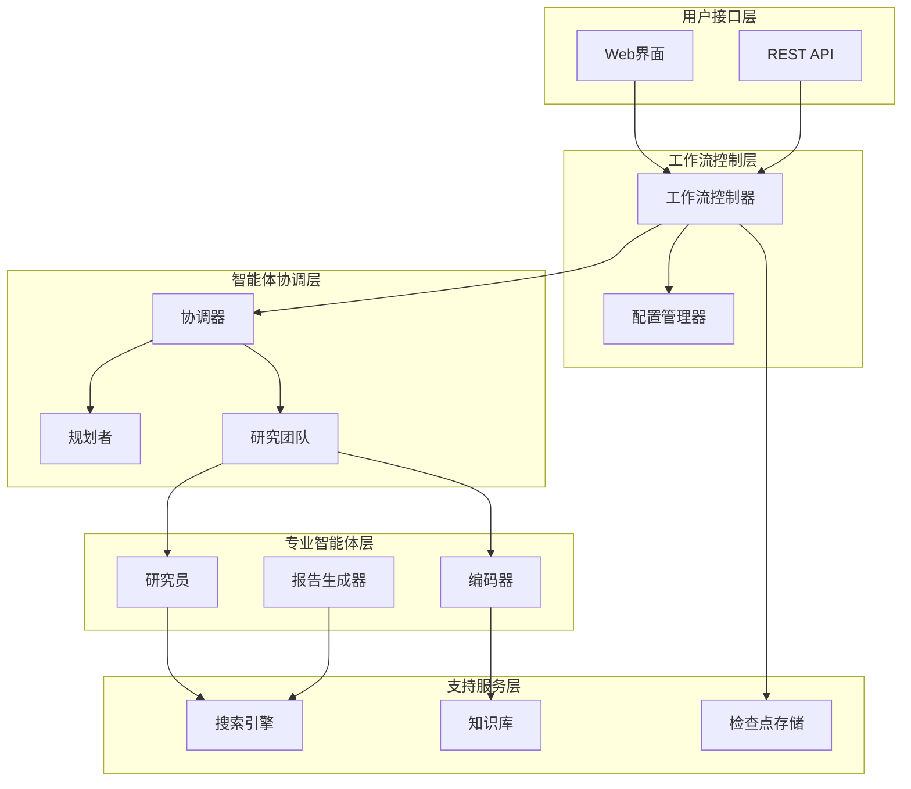
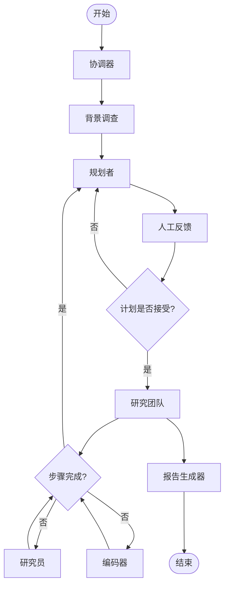
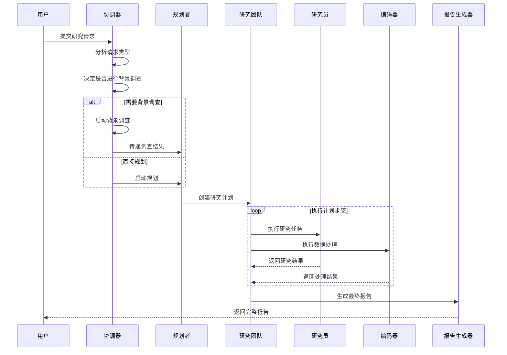
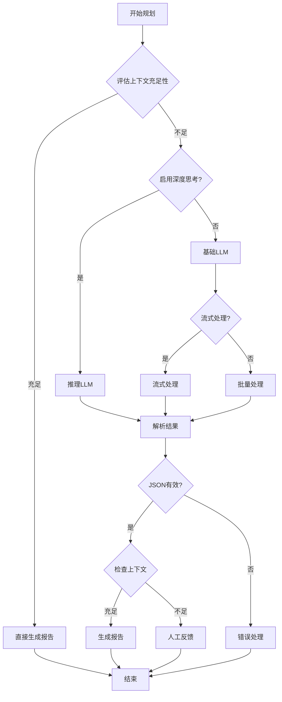
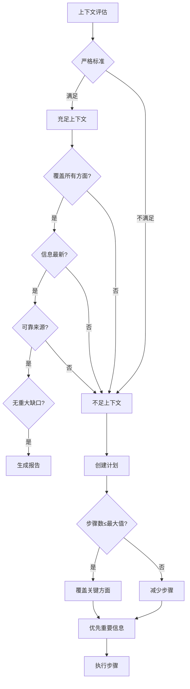
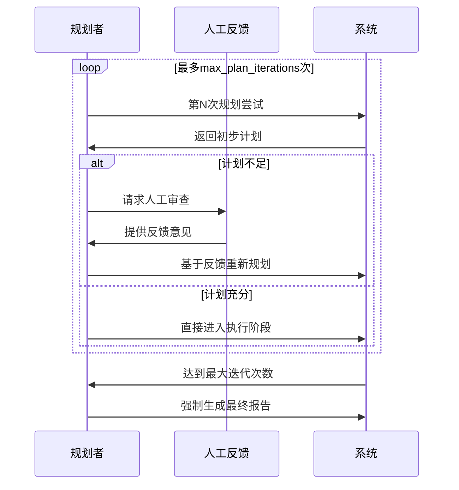

# 评审框架设计

<cite>
**本文档引用的文件**
- [src/graph/builder.py](file://src/graph/builder.py)
- [src/graph/nodes.py](file://src/graph/nodes.py)
- [src/graph/types.py](file://src/graph/types.py)
- [src/prompts/planner.md](file://src/prompts/planner.md)
- [src/prompts/planner_model.py](file://src/prompts/planner_model.py)
- [src/graph/checkpoint.py](file://src/graph/checkpoint.py)
- [src/agents/agents.py](file://src/agents/agents.py)
- [src/config/agents.py](file://src/config/agents.py)
- [src/workflow.py](file://src/workflow.py)
- [tests/integration/test_nodes.py](file://tests/integration/test_nodes.py)
</cite>

## 目录
1. [引言](#引言)
2. [项目架构概览](#项目架构概览)
3. [核心组件分析](#核心组件分析)
4. [状态图构建逻辑](#状态图构建逻辑)
5. [多智能体协作流程](#多智能体协作流程)
6. [评审任务规划框架](#评审任务规划框架)
7. [深度分析与效率平衡](#深度分析与效率平衡)
8. [性能优化配置](#性能优化配置)
9. [故障排除指南](#故障排除指南)
10. [结论](#结论)

## 引言

DeerFlow系统是一个基于LangGraph构建的专业评审框架，专门设计用于处理复杂的深度研究任务。该系统通过多智能体协作模式，实现了从任务规划到最终报告生成的完整工作流程。本文档深入分析了系统如何构建专业评审的任务规划和执行框架，重点探讨了状态图构建逻辑、多智能体协作机制以及评审策略的制定过程。

系统的核心设计理念是通过模块化的智能体架构，实现高效的信息收集、分析和整合。每个智能体都有明确的职责分工：规划者负责制定全面的研究计划，研究员专注于特定领域的深度调查，编码器处理数据处理和计算任务，而报告生成器则负责最终的综合输出。

## 项目架构概览

DeerFlow系统采用分层架构设计，主要包含以下几个核心层次：



**图表来源**
- [src/workflow.py](file://src/workflow.py#L1-L50)
- [src/graph/builder.py](file://src/graph/builder.py#L1-L88)

**章节来源**
- [src/workflow.py](file://src/workflow.py#L1-L104)
- [src/graph/builder.py](file://src/graph/builder.py#L1-L88)

## 核心组件分析

### 状态管理系统

系统使用自定义的状态管理机制来跟踪整个评审过程的进展。状态类继承自`MessagesState`，扩展了运行时变量以支持复杂的评审流程。

```python
class State(MessagesState):
    """代理系统状态，扩展MessagesState添加next字段。"""

    # 运行时变量
    locale: str = "en-US"
    research_topic: str = ""
    observations: list[str] = []
    resources: list[Resource] = []
    plan_iterations: int = 0
    current_plan: Plan | str = None
    final_report: str = ""
    auto_accepted_plan: bool = False
    enable_background_investigation: bool = True
    background_investigation_results: str = None
```

### 智能体类型定义

系统定义了标准化的智能体类型映射，确保每个智能体都能获得最适合其任务的LLM配置：

```python
AGENT_LLM_MAP: dict[str, LLMType] = {
    "coordinator": "basic",
    "planner": "basic", 
    "researcher": "basic",
    "coder": "basic",
    "reporter": "basic",
    "podcast_script_writer": "basic",
    "ppt_composer": "basic",
    "prose_writer": "basic",
    "prompt_enhancer": "basic",
}
```

**章节来源**
- [src/graph/types.py](file://src/graph/types.py#L1-L25)
- [src/config/agents.py](file://src/config/agents.py#L1-L21)

## 状态图构建逻辑

### 基础状态图构建

系统通过`_build_base_graph`函数构建基础状态图，定义了所有节点之间的连接关系：



**图表来源**
- [src/graph/builder.py](file://src/graph/builder.py#L35-L65)

### 条件边界的动态路由

系统使用`continue_to_running_research_team`函数实现智能的条件路由，根据当前计划的状态动态决定下一步执行哪个智能体：

```python
def continue_to_running_research_team(state: State):
    current_plan = state.get("current_plan")
    if not current_plan or not current_plan.steps:
        return "planner"

    if all(step.execution_res for step in current_plan.steps):
        return "planner"

    # 查找第一个未完成的步骤
    incomplete_step = None
    for step in current_plan.steps:
        if not step.execution_res:
            incomplete_step = step
            break

    if not incomplete_step:
        return "planner"

    if incomplete_step.step_type == StepType.RESEARCH:
        return "researcher"
    if incomplete_step.step_type == StepType.PROCESSING:
        return "coder"
    return "planner"
```

这种设计允许系统在执行过程中灵活调整工作流程，确保每个步骤都能得到适当的处理。

**章节来源**
- [src/graph/builder.py](file://src/graph/builder.py#L15-L35)

## 多智能体协作流程

### 协调器节点的作用

协调器作为整个工作流的入口点，负责接收用户输入并根据配置决定后续的处理路径：



**图表来源**
- [src/graph/nodes.py](file://src/graph/nodes.py#L1-L100)

### 背景调查机制

背景调查节点为后续的规划过程提供丰富的上下文信息：

```python
def background_investigation_node(state: State, config: RunnableConfig):
    logger.info("background investigation node is running.")
    configurable = Configuration.from_runnable_config(config)
    query = state.get("research_topic")
    background_investigation_results = None
    
    if SELECTED_SEARCH_ENGINE == SearchEngine.TAVILY.value:
        searched_content = LoggedTavilySearch(
            max_results=configurable.max_search_results
        ).invoke(query)
        
        if isinstance(searched_content, list):
            background_investigation_results = [
                f"## {elem['title']}\n\n{elem['content']}" for elem in searched_content
            ]
            return {
                "background_investigation_results": "\n\n".join(
                    background_investigation_results
                )
            }
```

### 规划者智能体

规划者是整个系统的核心，负责制定全面的研究计划：



**图表来源**
- [src/graph/nodes.py](file://src/graph/nodes.py#L70-L150)

**章节来源**
- [src/graph/nodes.py](file://src/graph/nodes.py#L40-L150)

## 评审任务规划框架

### 计划模型设计

系统使用严格的计划模型来确保评审任务的全面性和质量：

```python
class Plan(BaseModel):
    locale: str = Field(
        ..., description="例如 'en-US' 或 'zh-CN'，基于用户的语言"
    )
    has_enough_context: bool
    thought: str
    title: str
    steps: List[Step] = Field(
        default_factory=list,
        description="研究和处理步骤以获取更多上下文",
    )
```

### 步骤类型分类

系统将研究任务分为两种基本类型：

1. **研究步骤（Research Steps）**：
   - 需要搜索：`need_search: true`
   - 收集外部信息、市场数据、行业趋势等
   - 从URL检索文件内容或网络资源

2. **处理步骤（Processing Steps）**：
   - 不需要搜索：`need_search: false`
   - API调用和数据提取
   - 数据库查询和原始数据收集
   - 数学计算和数据分析

### 上下文评估标准

系统实施严格的上下文评估标准，确保评审质量：



**图表来源**
- [src/prompts/planner.md](file://src/prompts/planner.md#L20-L60)

**章节来源**
- [src/prompts/planner_model.py](file://src/prompts/planner_model.py#L1-L59)
- [src/prompts/planner.md](file://src/prompts/planner.md#L1-L188)

## 深度分析与效率平衡

### 深度思考机制

系统提供了可选的深度思考模式，通过专门的推理LLM提升分析质量：

```python
if configurable.enable_deep_thinking:
    llm = get_llm_by_type("reasoning")
elif AGENT_LLM_MAP["planner"] == "basic":
    llm = get_llm_by_type("basic").with_structured_output(
        Plan,
        method="json_mode",
    )
else:
    llm = get_llm_by_type(AGENT_LLM_MAP["planner"])
```

### 迭代优化策略

系统采用迭代优化策略，通过多次计划迭代逐步完善评审方案：



**图表来源**
- [src/graph/nodes.py](file://src/graph/nodes.py#L80-L120)

### 资源利用优化

系统通过智能的资源分配机制优化计算资源的使用：

- **按需启动**：只有在必要时才激活特定类型的智能体
- **并行处理**：支持多个研究步骤的并行执行
- **缓存机制**：对重复的搜索结果进行缓存
- **内存管理**：使用内存保存器优化状态存储

**章节来源**
- [src/graph/nodes.py](file://src/graph/nodes.py#L70-L150)

## 性能优化配置

### 检查点持久化

系统提供了灵活的检查点持久化机制，支持多种数据库后端：

```python
class ChatStreamManager:
    """
    管理聊天流消息，具有持久化存储和内存缓存功能。
    
    该类处理使用临时数据的内存存储和MongoDB或PostgreSQL的永久存储的消息存储。
    它跟踪消息块并在对话完成时进行合并。
    """
    
    def __init__(self, checkpoint_saver: bool = False, db_uri: Optional[str] = None):
        self.checkpoint_saver = checkpoint_saver
        self.db_uri = db_uri
        
        if self.checkpoint_saver:
            if self.db_uri.startswith("mongodb://"):
                self._init_mongodb()
            elif self.db_uri.startswith("postgresql://") or self.db_uri.startswith("postgres://"):
                self._init_postgresql()
```

### 并发处理能力

系统支持异步并发处理，提高整体吞吐量：

```python
async def run_agent_workflow_async(
    user_input: str,
    debug: bool = False,
    max_plan_iterations: int = 1,
    max_step_num: int = 3,
    enable_background_investigation: bool = True,
):
    """使用给定的用户输入异步运行代理工作流。"""
    
    initial_state = {
        "messages": [{"role": "user", "content": user_input}],
        "auto_accepted_plan": True,
        "enable_background_investigation": enable_background_investigation,
    }
    
    config = {
        "configurable": {
            "thread_id": "default",
            "max_plan_iterations": max_plan_iterations,
            "max_step_num": max_step_num,
        },
        "recursion_limit": get_recursion_limit(default=100),
    }
    
    async for s in graph.astream(
        input=initial_state, config=config, stream_mode="values"
    ):
        # 处理流式输出
        pass
```

### 配置参数优化

系统提供了丰富的配置选项来优化性能：

- **max_plan_iterations**：控制计划迭代的最大次数
- **max_step_num**：限制单个计划中的步骤数量
- **max_search_results**：设置搜索结果的最大数量
- **enable_deep_thinking**：启用深度思考模式
- **enable_background_investigation**：控制背景调查的启用状态

**章节来源**
- [src/graph/checkpoint.py](file://src/graph/checkpoint.py#L1-L100)
- [src/workflow.py](file://src/workflow.py#L25-L80)

## 故障排除指南

### 常见问题诊断

系统提供了完善的日志记录和错误处理机制：

```python
def process_stream_message(self, thread_id: str, message: str, finish_reason: str) -> bool:
    """处理并存储聊天流消息块。"""
    
    if not thread_id or not isinstance(thread_id, str):
        self.logger.warning("提供的thread_id无效")
        return False

    if not message:
        self.logger.warning("提供的消息为空")
        return False

    try:
        # 处理消息块逻辑
        pass
    except Exception as e:
        self.logger.error(f"处理线程{thread_id}的流消息时出错: {e}")
        return False
```

### 错误恢复机制

系统实现了多层次的错误恢复机制：

1. **JSON解析错误处理**：自动修复损坏的JSON格式
2. **迭代次数限制**：防止无限循环
3. **备用LLM配置**：当首选LLM不可用时的备选方案
4. **状态回滚**：在错误情况下恢复到上一个稳定状态

### 性能监控

系统内置了性能监控功能，可以实时跟踪工作流的执行状态：

```python
def enable_debug_logging():
    """启用调试级别日志记录以获取更详细的执行信息。"""
    logging.getLogger("src").setLevel(logging.DEBUG)

logger = logging.getLogger(__name__)

logger.info(f"开始异步工作流，用户输入: {user_input}")
```

**章节来源**
- [src/graph/checkpoint.py](file://src/graph/checkpoint.py#L150-L250)
- [src/workflow.py](file://src/workflow.py#L15-L30)

## 结论

DeerFlow系统的评审框架设计体现了现代AI应用的最佳实践。通过精心设计的状态图、智能的多智能体协作机制和严格的质量控制流程，系统能够高效地处理复杂的深度研究任务。

### 主要优势

1. **模块化设计**：清晰的职责分离使得系统易于维护和扩展
2. **灵活性**：支持多种配置选项和部署环境
3. **可靠性**：完善的错误处理和恢复机制
4. **可扩展性**：支持新的智能体类型和工作流程

### 应用场景

该评审框架特别适用于以下场景：
- 学术研究项目的全面评估
- 商业决策的数据支持分析
- 法律案件的证据收集和分析
- 技术项目的可行性研究

### 未来发展方向

1. **增强学习集成**：引入强化学习优化工作流程
2. **多模态支持**：扩展对图像、音频等多媒体内容的支持
3. **实时协作**：支持多人同时参与评审过程
4. **知识图谱**：构建领域特定的知识图谱以提升分析质量

通过持续的优化和改进，DeerFlow系统将继续为用户提供更加专业、高效的评审服务。