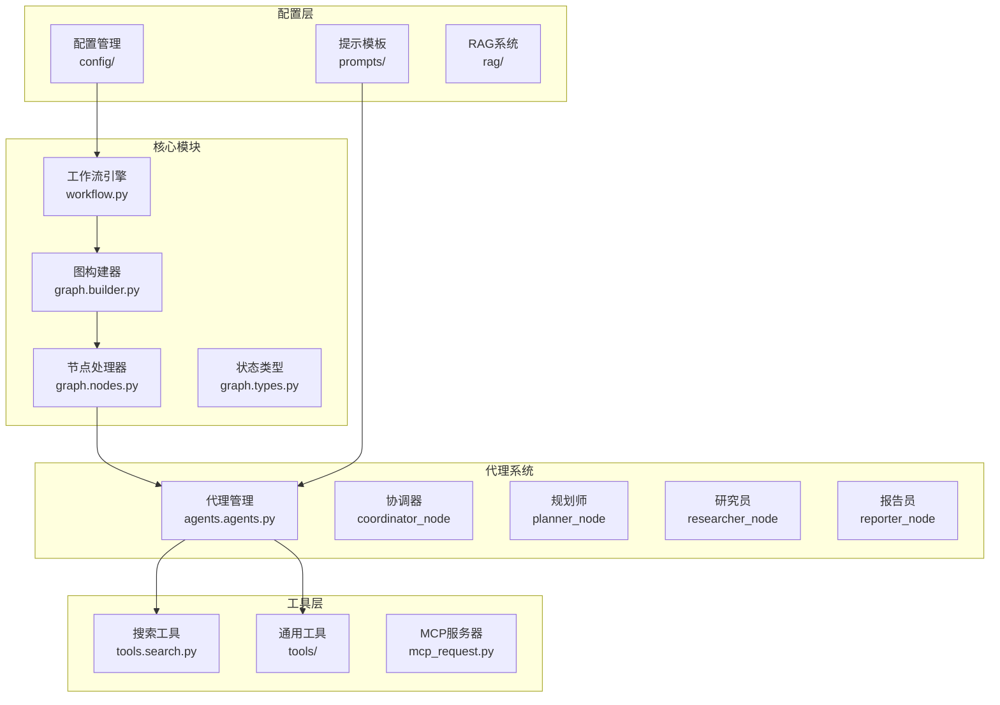
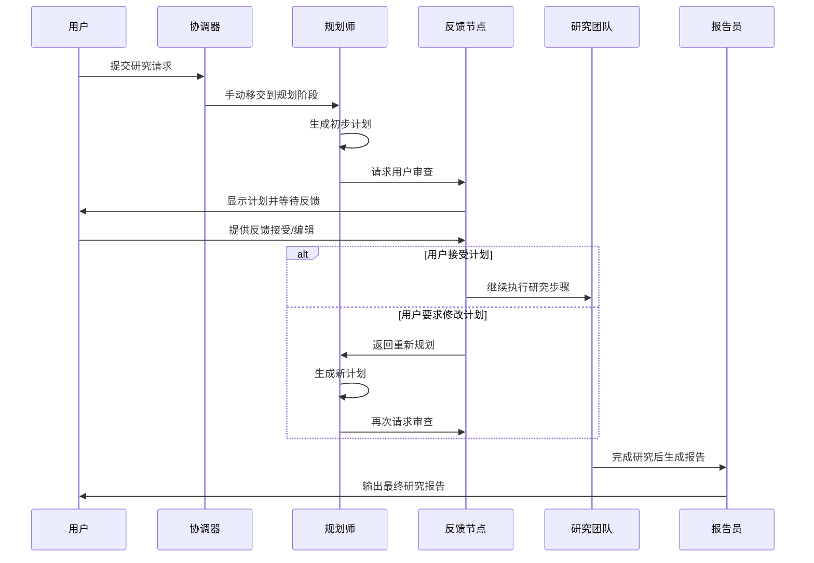
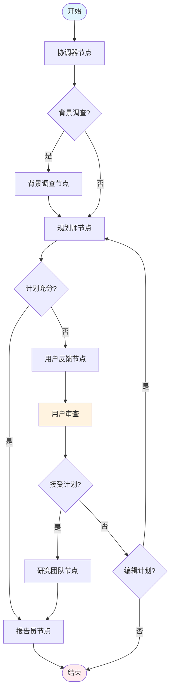
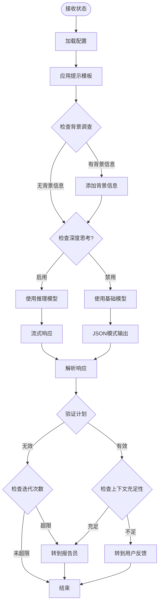
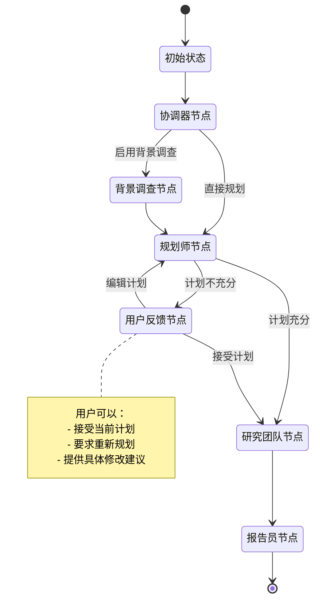
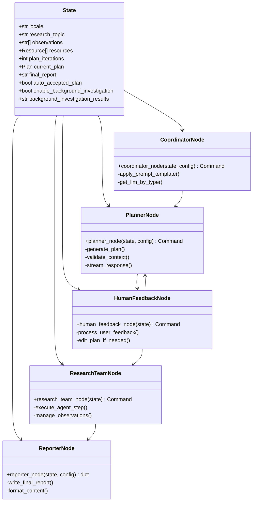
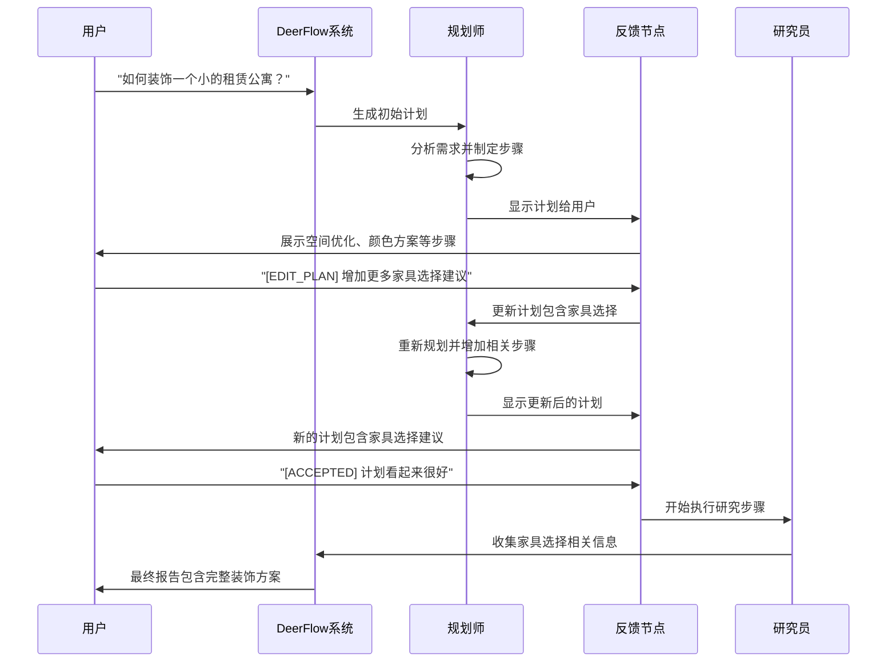
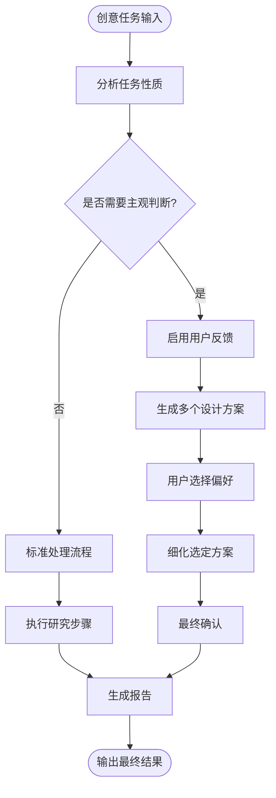

# 交互式研究工作流示例

<cite>
**本文档中引用的文件**
- [how_to_use_claude_deep_research.md](file://examples/how_to_use_claude_deep_research.md)
- [workflow.py](file://src/workflow.py)
- [nodes.py](file://src/graph/nodes.py)
- [types.py](file://src/graph/types.py)
- [rental-apartment-decoration.txt](file://web/public/replay/rental-apartment-decoration.txt)
- [planner.md](file://src/prompts/planner.md)
- [search.py](file://src/tools/search.py)
- [configuration.py](file://src/config/configuration.py)
- [test_nodes.py](file://tests/integration/test_nodes.py)
</cite>

## 目录
1. [简介](#简介)
2. [项目结构概览](#项目结构概览)
3. [核心组件分析](#核心组件分析)
4. [架构概览](#架构概览)
5. [详细组件分析](#详细组件分析)
6. [状态管理机制](#状态管理机制)
7. [节点交互模式](#节点交互模式)
8. [用户反馈处理](#用户反馈处理)
9. [最佳实践指南](#最佳实践指南)
10. [故障排除指南](#故障排除指南)
11. [结论](#结论)

## 简介

DeerFlow 是一个先进的交互式研究工作流系统，专门设计用于支持人机协作的研究过程。该系统通过智能代理团队、动态规划生成和实时用户反馈机制，为用户提供全面而深入的研究解决方案。

本示例重点展示 DeerFlow 如何处理需要主观判断的创意类任务，如室内装饰设计。通过分析 `rental-apartment-decoration.txt` 回放文件，我们将深入了解系统在处理这类复杂任务时的交互模式和决策流程。

## 项目结构概览

DeerFlow 采用模块化架构设计，主要包含以下核心组件：



**图表来源**
- [workflow.py](file://src/workflow.py#L1-L20)
- [nodes.py](file://src/graph/nodes.py#L1-L30)

## 核心组件分析

### 工作流引擎

工作流引擎是整个系统的入口点，负责协调所有组件的执行：

```python
async def run_agent_workflow_async(
    user_input: str,
    debug: bool = False,
    max_plan_iterations: int = 1,
    max_step_num: int = 3,
    enable_background_investigation: bool = True,
):
    """异步运行代理工作流"""
    if not user_input:
        raise ValueError("输入不能为空")
    
    logger.info(f"开始异步工作流，用户输入：{user_input}")
    initial_state = {
        "messages": [{"role": "user", "content": user_input}],
        "auto_accepted_plan": True,
        "enable_background_investigation": enable_background_investigation,
    }
```

### 节点处理系统

节点处理系统实现了复杂的控制流和状态转换：



**图表来源**
- [nodes.py](file://src/graph/nodes.py#L100-L200)
- [workflow.py](file://src/workflow.py#L25-L80)

**章节来源**
- [workflow.py](file://src/workflow.py#L1-L104)
- [nodes.py](file://src/graph/nodes.py#L1-L50)

## 架构概览

DeerFlow 采用基于 LangGraph 的有向无环图（DAG）架构，支持动态状态管理和多代理协作：



**图表来源**
- [nodes.py](file://src/graph/nodes.py#L50-L150)
- [types.py](file://src/graph/types.py#L1-L25)

## 详细组件分析

### 协调器节点

协调器节点负责与用户沟通并确定下一步行动：

```python
def coordinator_node(
    state: State, config: RunnableConfig
) -> Command[Literal["planner", "background_investigator", "__end__"]]:
    """协调器节点，与客户沟通"""
    configurable = Configuration.from_runnable_config(config)
    messages = apply_prompt_template("coordinator", state)
    response = (
        get_llm_by_type(AGENT_LLM_MAP["coordinator"])
        .bind_tools([handoff_to_planner])
        .invoke(messages)
    )
    
    goto = "__end__"
    if len(response.tool_calls) > 0:
        goto = "planner"
        if state.get("enable_background_investigation"):
            goto = "background_investigator"
```

### 规划师节点

规划师节点的核心职责是生成和评估研究计划：



**图表来源**
- [nodes.py](file://src/graph/nodes.py#L50-L150)

### 研究团队节点

研究团队节点负责执行具体的调研任务：

```python
async def _execute_agent_step(
    state: State, agent, agent_name: str
) -> Command[Literal["research_team"]]:
    """执行代理步骤的辅助函数"""
    current_plan = state.get("current_plan")
    plan_title = current_plan.title
    observations = state.get("observations", [])
    
    # 查找第一个未执行的步骤
    current_step = None
    completed_steps = []
    for step in current_plan.steps:
        if not step.execution_res:
            current_step = step
            break
        else:
            completed_steps.append(step)
```

**章节来源**
- [nodes.py](file://src/graph/nodes.py#L50-L400)

## 状态管理机制

### 状态类型定义

系统通过继承 `MessagesState` 的 `State` 类来管理复杂的状态：

```python
class State(MessagesState):
    """代理系统的状态，扩展了 MessagesState 和 next 字段"""
    
    # 运行时变量
    locale: str = "en-US"
    research_topic: str = ""
    observations: list[str] = []
    resources: list[Resource] = []
    plan_iterations: int = 0
    current_plan: Plan | str = None
    final_report: str = ""
    auto_accepted_plan: bool = False
    enable_background_investigation: bool = True
    background_investigation_results: str = None
```

### 状态流转图



**图表来源**
- [types.py](file://src/graph/types.py#L1-L25)
- [nodes.py](file://src/graph/nodes.py#L100-L200)

**章节来源**
- [types.py](file://src/graph/types.py#L1-L25)

## 节点交互模式

### 搜索引擎集成

系统支持多种搜索引擎，通过统一接口提供灵活的数据收集能力：

```python
def get_web_search_tool(max_search_results: int, engine: str = None, repository_id: str = None):
    """获取指定的搜索工具"""
    search_config = get_search_config()
    selected_engine = engine or SELECTED_SEARCH_ENGINE
    
    if selected_engine == SearchEngine.TAVILY.value:
        return LoggedTavilySearch(
            name="web_search",
            max_results=max_search_results,
            include_raw_content=True,
            include_images=True,
            include_image_descriptions=True,
            include_domains=include_domains,
            exclude_domains=exclude_domains,
        )
```

### 多代理协作



**图表来源**
- [nodes.py](file://src/graph/nodes.py#L1-L50)
- [types.py](file://src/graph/types.py#L1-L25)

**章节来源**
- [search.py](file://src/tools/search.py#L1-L114)
- [nodes.py](file://src/graph/nodes.py#L1-L100)

## 用户反馈处理

### 反馈机制设计

系统提供了灵活的用户反馈处理机制，支持多种交互模式：

```python
def human_feedback_node(
    state,
) -> Command[Literal["planner", "research_team", "reporter", "__end__"]]:
    """用户反馈节点"""
    current_plan = state.get("current_plan", "")
    auto_accepted_plan = state.get("auto_accepted_plan", False)
    
    if not auto_accepted_plan:
        feedback = interrupt("请审查计划。")
        
        # 如果反馈不是接受的，返回规划师节点
        if feedback and str(feedback).upper().startswith("[EDIT_PLAN]"):
            return Command(
                update={
                    "messages": [
                        HumanMessage(content=feedback, name="feedback"),
                    ],
                },
                goto="planner",
            )
        elif feedback and str(feedback).upper().startswith("[ACCEPTED]"):
            logger.info("用户接受计划。")
        else:
            raise TypeError(f"中断值 {feedback} 不受支持。")
```

### 实际案例分析

通过分析 `rental-apartment-decoration.txt` 回放文件，我们可以看到系统如何处理创意类任务的反馈：



**图表来源**
- [rental-apartment-decoration.txt](file://web/public/replay/rental-apartment-decoration.txt#L1-L200)
- [nodes.py](file://src/graph/nodes.py#L100-L150)

**章节来源**
- [nodes.py](file://src/graph/nodes.py#L100-L200)
- [rental-apartment-decoration.txt](file://web/public/replay/rental-apartment-decoration.txt#L1-L100)

## 最佳实践指南

### 1. 研究问题定义

根据 `how_to_use_claude_deep_research.md` 中的最佳实践，明确的研究问题定义是成功的关键：

- **清晰具体**：避免模糊的查询，提供具体的上下文信息
- **结构化数据**：提供相关的数据和背景信息
- **领域特定**：针对特定领域的专业术语和概念

### 2. 配置优化

```python
# 推荐的配置参数
config = {
    "max_plan_iterations": 2,  # 允许重新规划
    "max_step_num": 5,         # 增加步骤数量
    "enable_background_investigation": True,  # 启用背景调查
    "enable_deep_thinking": True,             # 启用深度思考
}
```

### 3. 用户反馈策略

- **及时响应**：对用户反馈给予快速响应
- **明确指示**：提供清晰的反馈格式指导
- **灵活调整**：根据用户需求灵活调整研究方向

### 4. 创意类任务处理

对于需要主观判断的任务（如室内设计），系统采用以下策略：



**章节来源**
- [how_to_use_claude_deep_research.md](file://examples/how_to_use_claude_deep_research.md#L1-L77)

## 故障排除指南

### 常见问题及解决方案

#### 1. 计划生成失败

**症状**：规划师节点无法生成有效的计划

**解决方案**：
```python
# 检查配置参数
if plan_iterations >= configurable.max_plan_iterations:
    return Command(goto="reporter")

# 验证JSON输出
try:
    curr_plan = json.loads(repair_json_output(full_response))
except json.JSONDecodeError:
    logger.warning("规划器响应不是有效的JSON")
    if plan_iterations > 0:
        return Command(goto="reporter")
    else:
        return Command(goto="__end__")
```

#### 2. 搜索结果质量差

**症状**：搜索工具返回的结果不相关或质量低

**解决方案**：
- 调整 `max_search_results` 参数
- 配置 `include_domains` 和 `exclude_domains`
- 选择合适的搜索引擎（Tavily、DuckDuckGo等）

#### 3. 用户反馈处理异常

**症状**：用户反馈格式不正确导致处理失败

**解决方案**：
```python
# 验证反馈格式
if feedback and str(feedback).upper().startswith("[EDIT_PLAN]"):
    return Command(update={"messages": [...]}, goto="planner")
elif feedback and str(feedback).upper().startswith("[ACCEPTED]"):
    return Command(goto="research_team")
else:
    raise TypeError(f"不支持的中断值: {feedback}")
```

### 性能优化建议

1. **递归限制**：合理设置 `AGENT_RECURSION_LIMIT`
2. **内存管理**：定期清理不必要的状态信息
3. **并发处理**：利用异步特性提高处理效率

**章节来源**
- [nodes.py](file://src/graph/nodes.py#L100-L200)
- [configuration.py](file://src/config/configuration.py#L1-L71)

## 结论

DeerFlow 系统通过其精心设计的交互式研究工作流，为用户提供了强大而灵活的研究解决方案。系统的核心优势包括：

1. **智能代理协作**：多代理系统能够分工合作，提高研究效率
2. **动态规划生成**：根据用户需求和反馈动态调整研究计划
3. **灵活的用户交互**：支持多种反馈形式和交互模式
4. **强大的工具集成**：整合多种搜索引擎和专业工具
5. **完善的错误处理**：具备健壮的异常处理和恢复机制

通过分析 `rental-apartment-decoration.txt` 等回放文件，我们看到了系统在处理需要主观判断的创意类任务时的出色表现。系统不仅能够理解用户的隐含需求，还能通过迭代反馈机制不断优化结果，最终提供满足用户期望的高质量研究成果。

对于希望充分利用 DeerFlow 系统进行研究工作的用户，建议遵循本文档提供的最佳实践指南，并根据具体任务特点调整系统配置。通过合理的使用和配置，DeerFlow 将成为您研究工作中不可或缺的智能助手。