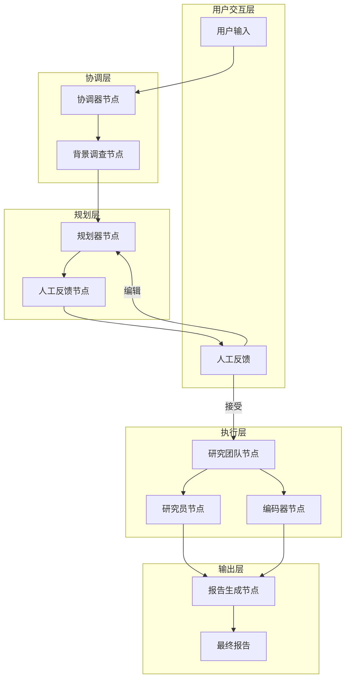
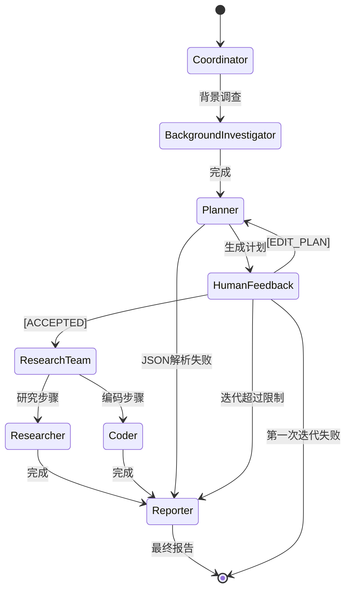
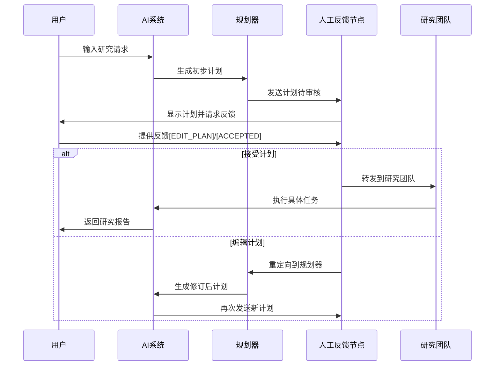

# 人工反馈机制

<cite>
**本文档引用的文件**
- [how_to_use_claude_deep_research.md](file://examples/how_to_use_claude_deep_research.md)
- [nodes.py](file://src/graph/nodes.py)
- [workflow.py](file://src/workflow.py)
- [builder.py](file://src/graph/builder.py)
- [types.py](file://src/graph/types.py)
- [planner_model.py](file://src/prompts/planner_model.py)
- [coordinator.md](file://src/prompts/coordinator.md)
- [app.py](file://src/server/app.py)
- [test_nodes.py](file://tests/integration/test_nodes.py)
- [test_builder.py](file://tests/unit/graph/test_builder.py)
- [README_zh.md](file://README_zh.md)
</cite>

## 目录
1. [简介](#简介)
2. [系统架构概览](#系统架构概览)
3. [人工反馈节点分析](#人工反馈节点分析)
4. [状态转换逻辑](#状态转换逻辑)
5. [反馈数据结构](#反馈数据结构)
6. [用户交互流程](#用户交互流程)
7. [最佳实践建议](#最佳实践建议)
8. [故障排除指南](#故障排除指南)
9. [总结](#总结)

## 简介

DeerFlow系统是一个基于LangGraph的智能研究助手，它通过精心设计的人工反馈机制，在研究过程中允许用户进行干预和调整。该机制确保了AI生成的内容能够满足用户的特定需求和期望，同时保持了自动化流程的效率。

人工反馈机制是DeerFlow系统的核心特性之一，它允许用户在关键决策点提供反馈，包括计划阶段、研究阶段和报告阶段。这种设计使得系统既能够发挥AI的强大能力，又能够尊重人类专家的判断和专业知识。

## 系统架构概览

DeerFlow系统采用基于状态图的工作流架构，其中人工反馈机制位于协调器节点和规划器节点之间，作为重要的控制节点。



**图表来源**
- [builder.py](file://src/graph/builder.py#L25-L50)
- [nodes.py](file://src/graph/nodes.py#L159-L181)

**章节来源**
- [builder.py](file://src/graph/builder.py#L1-L88)
- [workflow.py](file://src/workflow.py#L1-L104)

## 人工反馈节点分析

### human_feedback_node函数详解

`human_feedback_node`是整个反馈机制的核心组件，负责处理用户对AI生成计划的反馈。

```python
def human_feedback_node(state) -> Command[Literal["planner", "research_team", "reporter", "__end__"]]:
    current_plan = state.get("current_plan", "")
    auto_accepted_plan = state.get("auto_accepted_plan", False)
    
    if not auto_accepted_plan:
        feedback = interrupt("Please Review the Plan.")
        
        if feedback and str(feedback).upper().startswith("[EDIT_PLAN]"):
            return Command(
                update={
                    "messages": [HumanMessage(content=feedback, name="feedback")],
                },
                goto="planner",
            )
        elif feedback and str(feedback).upper().startswith("[ACCEPTED]"):
            logger.info("Plan is accepted by user.")
        else:
            raise TypeError(f"Interrupt value of {feedback} is not supported.")
    
    # 继续处理计划...
```

### 关键特性分析

1. **条件反馈机制**：只有当`auto_accepted_plan`为False时才会触发人工反馈
2. **反馈格式验证**：严格检查反馈消息是否以`[EDIT_PLAN]`或`[ACCEPTED]`开头
3. **状态更新**：根据用户反馈更新相应的状态信息
4. **错误处理**：对无效反馈抛出TypeError异常

```mermaid
flowchart TD
Start([开始处理计划]) --> CheckAutoAccept{"auto_accepted_plan?"}
CheckAutoAccept --> |是| ParsePlan[解析JSON计划]
CheckAutoAccept --> |否| GetFeedback[获取用户反馈]
GetFeedback --> ValidateFormat{"验证反馈格式"}
ValidateFormat --> |[EDIT_PLAN]| SendToPlanner[发送到规划器]
ValidateFormat --> |[ACCEPTED]| LogAccept[记录接受日志]
ValidateFormat --> |其他| ThrowError[抛出TypeError]
LogAccept --> ParsePlan
SendToPlanner --> End([结束])
ParsePlan --> ValidateJSON{"JSON有效?"}
ValidateJSON --> |是| UpdateState[更新状态]
ValidateJSON --> |否| CheckIteration{"迭代次数 > 1?"}
CheckIteration --> |是| GoToReporter[转到报告员]
CheckIteration --> |否| GoToEnd[结束流程]
UpdateState --> End
GoToReporter --> End
GoToEnd --> End
ThrowError --> End
```

**图表来源**
- [nodes.py](file://src/graph/nodes.py#L159-L181)

**章节来源**
- [nodes.py](file://src/graph/nodes.py#L159-L220)

## 状态转换逻辑

### 状态图分析

DeerFlow系统通过复杂的条件边实现状态转换，特别是在研究团队节点之后的状态管理。

```python
def continue_to_running_research_team(state: State):
    current_plan = state.get("current_plan")
    if not current_plan or not current_plan.steps:
        return "planner"

    if all(step.execution_res for step in current_plan.steps):
        return "planner"

    # 查找第一个未完成的步骤
    incomplete_step = None
    for step in current_plan.steps:
        if not step.execution_res:
            incomplete_step = step
            break

    if not incomplete_step:
        return "planner"

    if incomplete_step.step_type == StepType.RESEARCH:
        return "researcher"
    if incomplete_step.step_type == StepType.PROCESSING:
        return "coder"
    return "planner"
```

### 状态转换规则

1. **初始状态**：从协调器节点开始
2. **规划阶段**：生成研究计划后进入人工反馈节点
3. **反馈处理**：根据用户反馈决定流向规划器或直接进入研究团队
4. **执行阶段**：根据计划步骤类型分配给研究员或编码器
5. **报告阶段**：所有步骤完成后生成最终报告



**图表来源**
- [builder.py](file://src/graph/builder.py#L25-L50)
- [nodes.py](file://src/graph/nodes.py#L220-L280)

**章节来源**
- [builder.py](file://src/graph/builder.py#L15-L50)
- [nodes.py](file://src/graph/nodes.py#L220-L280)

## 反馈数据结构

### 计划数据模型

DeerFlow使用Pydantic模型来确保计划数据的一致性和有效性：

```python
class Plan(BaseModel):
    locale: str = Field(..., description="语言环境，如'en-US'或'zh-CN'")
    has_enough_context: bool
    thought: str
    title: str
    steps: List[Step] = Field(default_factory=list, description="研究和处理步骤")
```

### 步骤类型定义

```python
class StepType(str, Enum):
    RESEARCH = "research"
    PROCESSING = "processing"

class Step(BaseModel):
    need_search: bool = Field(..., description="每个步骤必须明确设置")
    title: str
    description: str = Field(..., description="指定要收集的确切数据")
    step_type: StepType = Field(..., description="指示步骤的性质")
    execution_res: Optional[str] = Field(default=None, description="步骤执行结果")
```

### 状态类型定义

```python
class State(MessagesState):
    locale: str = "en-US"
    research_topic: str = ""
    observations: list[str] = []
    resources: list[Resource] = []
    plan_iterations: int = 0
    current_plan: Plan | str = None
    final_report: str = ""
    auto_accepted_plan: bool = False
    enable_background_investigation: bool = True
    background_investigation_results: str = None
```

**章节来源**
- [planner_model.py](file://src/prompts/planner_model.py#L1-L59)
- [types.py](file://src/graph/types.py#L1-L25)

## 用户交互流程

### 交互式反馈流程

用户可以通过多种方式提供反馈：

1. **文本响应**：直接回复AI的消息
2. **API参数**：通过`feedback`参数传递
3. **界面选项**：通过Web界面的选择按钮



**图表来源**
- [nodes.py](file://src/graph/nodes.py#L159-L181)
- [app.py](file://src/server/app.py#L179-L209)

### 中断事件处理

系统通过专门的中断事件处理机制来捕获和处理用户反馈：

```python
def _create_interrupt_event(thread_id, event_data):
    """创建中断事件。"""
    try:
        interrupt_obj = event_data["__interrupt__"][0]
        
        # 尝试获取ID，适配不同版本的LangGraph API
        interrupt_id = None
        if hasattr(interrupt_obj, 'ns') and interrupt_obj.ns:
            interrupt_id = interrupt_obj.ns[0]
        elif hasattr(interrupt_obj, 'id'):
            interrupt_id = interrupt_obj.id
        
        # 获取中断内容
        content = ""
        if hasattr(interrupt_obj, 'value'):
            content = interrupt_obj.value
        elif hasattr(interrupt_obj, 'content'):
            content = interrupt_obj.content
            
        return _make_event(
            "interrupt",
            {
                "thread_id": thread_id,
                "id": interrupt_id,
                "role": "assistant",
                "content": content,
                "finish_reason": "interrupt",
                "options": [
                    {"text": "编辑计划", "value": "edit_plan"},
                    {"text": "开始研究", "value": "accepted"},
                ],
            },
        )
    except Exception as e:
        logger.error(f"创建中断事件时出错: {e}")
```

**章节来源**
- [app.py](file://src/server/app.py#L179-L209)
- [test_nodes.py](file://tests/integration/test_nodes.py#L402-L474)

## 最佳实践建议

### 用户使用指南

1. **明确反馈格式**：
   - 使用`[ACCEPTED]`表示接受当前计划
   - 使用`[EDIT_PLAN]`提供具体修改建议

2. **分阶段反馈**：
   - **计划阶段**：关注整体方向和步骤完整性
   - **研究阶段**：关注具体数据收集和分析方法
   - **报告阶段**：关注结构组织和内容质量

3. **有效沟通**：
   - 提供具体的改进建议而非模糊评论
   - 指明需要添加、删除或修改的具体内容
   - 保持反馈简洁明了

### 开发者最佳实践

1. **错误处理**：
   ```python
   try:
       current_plan = repair_json_output(current_plan)
       new_plan = json.loads(current_plan)
   except json.JSONDecodeError:
       if plan_iterations > 1:
           return Command(goto="reporter")
       else:
           return Command(goto="__end__")
   ```

2. **状态管理**：
   - 维护`plan_iterations`计数器
   - 实现适当的回退策略
   - 记录详细的日志信息

3. **用户体验**：
   - 提供清晰的反馈选项
   - 支持多语言界面
   - 实现友好的错误提示

**章节来源**
- [README_zh.md](file://README_zh.md#L540-L550)
- [nodes.py](file://src/graph/nodes.py#L181-L220)

## 故障排除指南

### 常见问题及解决方案

1. **JSON解析错误**
   - **症状**：计划无法正确解析为JSON对象
   - **原因**：AI生成的计划包含语法错误
   - **解决方案**：系统会尝试修复并重新解析，最多两次机会

2. **无效反馈格式**
   - **症状**：TypeError异常被抛出
   - **原因**：用户反馈不符合预期格式
   - **解决方案**：确保使用正确的前缀`[EDIT_PLAN]`或`[ACCEPTED]`

3. **循环依赖问题**
   - **症状**：系统在规划器和人工反馈节点间无限循环
   - **原因**：反馈处理逻辑存在缺陷
   - **解决方案**：检查`auto_accepted_plan`标志位和状态更新逻辑

### 调试技巧

1. **启用调试日志**：
   ```python
   def enable_debug_logging():
       logging.getLogger("src").setLevel(logging.DEBUG)
   ```

2. **监控状态变化**：
   - 检查`plan_iterations`计数器
   - 验证`current_plan`数据完整性
   - 监控`auto_accepted_plan`状态

3. **测试反馈路径**：
   ```python
   # 测试自动接受路径
   state = {"auto_accepted_plan": True}
   result = human_feedback_node(state)
   
   # 测试手动反馈路径
   with patch("src.graph.nodes.interrupt", return_value="[EDIT_PLAN]"):
       result = human_feedback_node(state)
   ```

**章节来源**
- [workflow.py](file://src/workflow.py#L15-L25)
- [test_nodes.py](file://tests/integration/test_nodes.py#L441-L474)

## 总结

DeerFlow系统的人工反馈机制是一个精心设计的系统，它成功地平衡了AI自动化能力和人类专家干预的需求。通过以下关键特性，该机制确保了高质量的研究结果：

1. **灵活的反馈机制**：支持多种反馈形式和格式
2. **智能的状态管理**：通过迭代计数和条件判断实现复杂的状态转换
3. **强大的错误处理**：提供多层保护和回退策略
4. **优秀的用户体验**：直观的界面和清晰的指导

这种设计不仅提高了研究工作的质量和准确性，还为用户提供了充分的控制权和参与感。随着AI技术的不断发展，这样的混合智能系统将成为未来研究工具的重要发展方向。

通过合理使用人工反馈机制，用户可以充分利用AI的强大能力，同时确保研究成果符合专业标准和实际需求。这为学术研究、商业分析和技术开发等领域提供了强有力的支持。