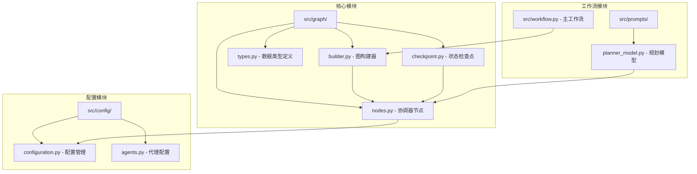
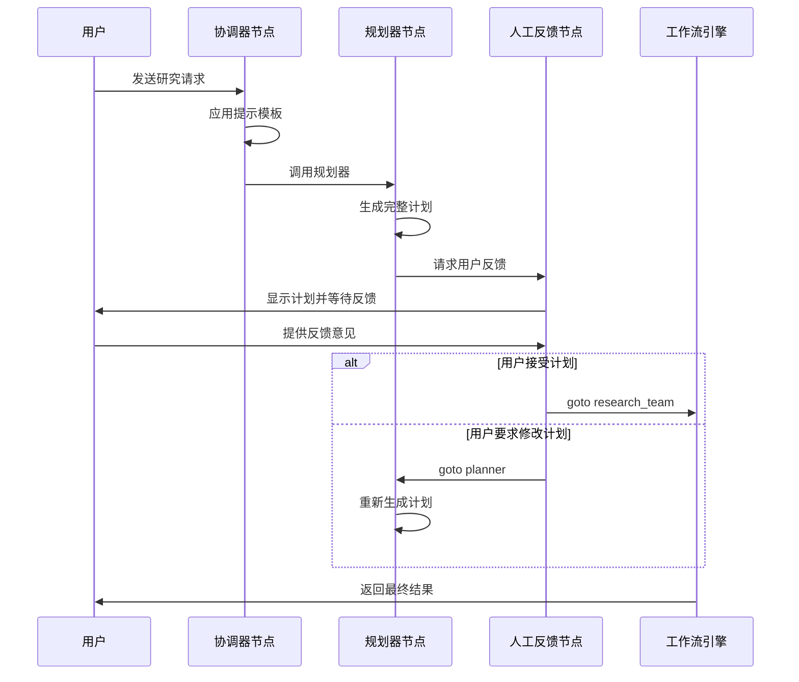
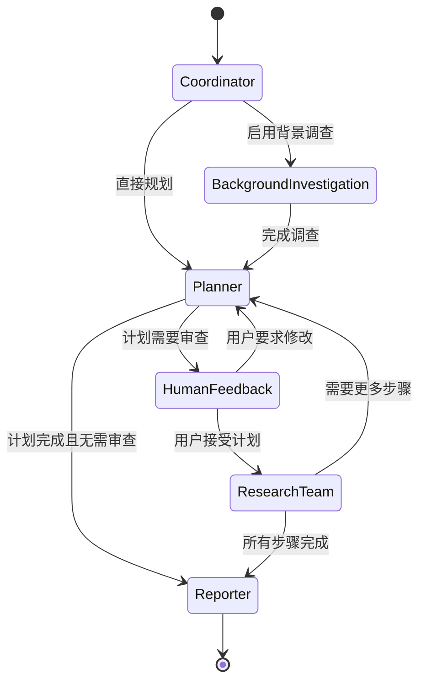
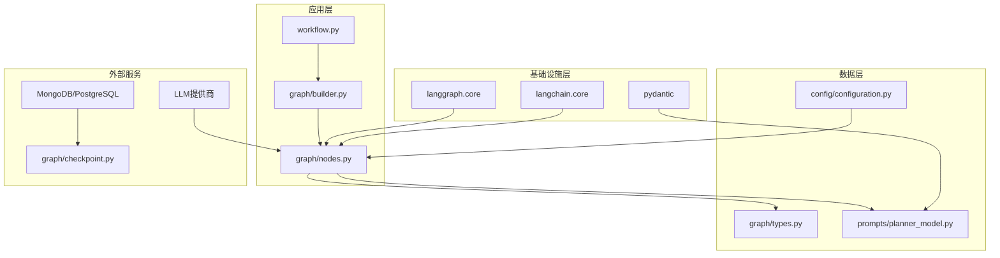

# 反馈处理流程

<cite>
**本文档引用的文件**
- [src/graph/nodes.py](file://src/graph/nodes.py)
- [src/workflow.py](file://src/workflow.py)
- [src/graph/builder.py](file://src/graph/builder.py)
- [src/graph/checkpoint.py](file://src/graph/checkpoint.py)
- [src/graph/types.py](file://src/graph/types.py)
- [src/prompts/planner_model.py](file://src/prompts/planner_model.py)
- [src/config/configuration.py](file://src/config/configuration.py)
</cite>

## 目录
1. [简介](#简介)
2. [项目结构概述](#项目结构概述)
3. [核心组件分析](#核心组件分析)
4. [架构概览](#架构概览)
5. [详细组件分析](#详细组件分析)
6. [依赖关系分析](#依赖关系分析)
7. [性能考虑](#性能考虑)
8. [故障排除指南](#故障排除指南)
9. [结论](#结论)

## 简介

DeerFlow 系统是一个基于 LangGraph 的智能工作流管理系统，专门设计用于处理复杂的多步骤研究任务。该系统的核心优势在于其创新的人工反馈处理流程，能够实时接收用户输入并动态调整工作流状态，实现从用户输入到工作流重新规划的完整处理链条。

本文档深入分析了系统如何通过协调器节点接收用户反馈，并更新工作流状态的机制。结合异步工作流逻辑，系统能够在运行时中断当前执行流程、整合用户反馈并触发重新规划，确保用户体验的流畅性和工作流的灵活性。

## 项目结构概述

DeerFlow 系统采用模块化的架构设计，主要组件分布在以下目录结构中：



**图表来源**
- [src/graph/nodes.py](file://src/graph/nodes.py#L1-L512)
- [src/graph/builder.py](file://src/graph/builder.py#L1-L88)
- [src/workflow.py](file://src/workflow.py#L1-L104)

**章节来源**
- [src/graph/nodes.py](file://src/graph/nodes.py#L1-L512)
- [src/graph/builder.py](file://src/graph/builder.py#L1-L88)
- [src/workflow.py](file://src/workflow.py#L1-L104)

## 核心组件分析

### 协调器节点（Coordinator Node）

协调器节点是整个反馈处理流程的核心入口点，负责与用户进行直接交互并决定后续的工作流走向。

```python
def coordinator_node(
    state: State, config: RunnableConfig
) -> Command[Literal["planner", "background_investigator", "__end__"]]:
    """协调器节点，与客户沟通交流。"""
    logger.info("协调器正在对话。")
    configurable = Configuration.from_runnable_config(config)
    messages = apply_prompt_template("coordinator", state)
    response = (
        get_llm_by_type(AGENT_LLM_MAP["coordinator"])
        .bind_tools([handoff_to_planner])
        .invoke(messages)
    )
    
    # 处理工具调用
    goto = "__end__"
    locale = state.get("locale", "en-US")
    research_topic = state.get("research_topic", "")
    
    if len(response.tool_calls) > 0:
        goto = "planner"
        if state.get("enable_background_investigation"):
            goto = "background_investigator"
            
    return Command(
        update={
            "messages": messages,
            "locale": locale,
            "research_topic": research_topic,
            "resources": configurable.resources,
        },
        goto=goto,
    )
```

### 人工反馈节点（Human Feedback Node）

人工反馈节点实现了用户反馈的接收和处理逻辑，是连接用户输入和工作流重新规划的关键环节。

```python
def human_feedback_node(
    state,
) -> Command[Literal["planner", "research_team", "reporter", "__end__"]]:
    current_plan = state.get("current_plan", "")
    auto_accepted_plan = state.get("auto_accepted_plan", False)
    
    if not auto_accepted_plan:
        feedback = interrupt("Please Review the Plan.")
        
        # 处理反馈响应
        if feedback and str(feedback).upper().startswith("[EDIT_PLAN]"):
            return Command(
                update={
                    "messages": [HumanMessage(content=feedback, name="feedback")],
                },
                goto="planner",
            )
        elif feedback and str(feedback).upper().startswith("[ACCEPTED]"):
            logger.info("Plan is accepted by user.")
        else:
            raise TypeError(f"Interrupt value of {feedback} is not supported.")
    
    # 如果计划被接受，继续执行
    plan_iterations = state["plan_iterations"] if state.get("plan_iterations", 0) else 0
    goto = "research_team"
    
    return Command(
        update={
            "current_plan": Plan.model_validate(new_plan),
            "plan_iterations": plan_iterations,
            "locale": new_plan["locale"],
        },
        goto=goto,
    )
```

**章节来源**
- [src/graph/nodes.py](file://src/graph/nodes.py#L159-L181)
- [src/graph/nodes.py](file://src/graph/nodes.py#L225-L280)

## 架构概览

DeerFlow 系统采用基于状态图的工作流架构，通过协调器节点作为用户交互的入口，实现从用户输入到工作流重新规划的完整处理链条。



**图表来源**
- [src/graph/nodes.py](file://src/graph/nodes.py#L225-L280)
- [src/graph/nodes.py](file://src/graph/nodes.py#L100-L158)

## 详细组件分析

### 状态转换机制

系统通过精心设计的状态转换机制来管理用户反馈处理流程：



**图表来源**
- [src/graph/builder.py](file://src/graph/builder.py#L30-L50)

### 异步工作流逻辑

系统通过异步工作流引擎实现非阻塞的用户交互：

```python
async def run_agent_workflow_async(
    user_input: str,
    debug: bool = False,
    max_plan_iterations: int = 1,
    max_step_num: int = 3,
    enable_background_investigation: bool = True,
):
    """异步运行代理工作流，带有给定的用户输入。"""
    
    if not user_input:
        raise ValueError("输入不能为空")
    
    if debug:
        enable_debug_logging()
    
    logger.info(f"开始异步工作流，用户输入：{user_input}")
    initial_state = {
        "messages": [{"role": "user", "content": user_input}],
        "auto_accepted_plan": True,
        "enable_background_investigation": enable_background_investigation,
    }
    
    config = {
        "configurable": {
            "thread_id": "default",
            "max_plan_iterations": max_plan_iterations,
            "max_step_num": max_step_num,
        },
        "recursion_limit": get_recursion_limit(default=100),
    }
    
    async for s in graph.astream(
        input=initial_state, config=config, stream_mode="values"
    ):
        # 处理流式输出
        if isinstance(s, dict) and "messages" in s:
            message = s["messages"][-1]
            message.pretty_print()
```

### 状态检查点保存与恢复机制

系统实现了完善的状态检查点机制，确保工作流可以在任何时刻中断并恢复：

```python
class ChatStreamManager:
    """管理聊天流消息，具有持久存储和内存缓存功能。"""
    
    def process_stream_message(
        self, thread_id: str, message: str, finish_reason: str
    ) -> bool:
        """处理并存储聊天流消息块。"""
        
        # 创建线程的消息命名空间
        store_namespace: Tuple[str, str] = ("messages", thread_id)
        
        # 获取或初始化消息游标
        cursor = self.store.get(store_namespace, "cursor")
        current_index = 0
        
        if cursor is None:
            self.store.put(store_namespace, "cursor", {"index": 0})
        else:
            current_index = int(cursor.value.get("index", 0)) + 1
            self.store.put(store_namespace, "cursor", {"index": current_index})
        
        # 存储当前消息块
        self.store.put(store_namespace, f"chunk_{current_index}", message)
        
        # 检查是否完成对话并应持久化
        if finish_reason in ("stop", "interrupt"):
            return self._persist_complete_conversation(
                thread_id, store_namespace, current_index
            )
        
        return True
```

**章节来源**
- [src/workflow.py](file://src/workflow.py#L25-L85)
- [src/graph/checkpoint.py](file://src/graph/checkpoint.py#L120-L180)

### 规划模型数据结构

系统使用强类型的规划模型来确保数据的一致性和完整性：

```python
class Step(BaseModel):
    need_search: bool = Field(..., description="必须为每个步骤明确设置")
    title: str
    description: str = Field(..., description="指定要收集的确切数据")
    step_type: StepType = Field(..., description="指示步骤的性质")
    execution_res: Optional[str] = Field(
        default=None, description="步骤执行结果"
    )

class Plan(BaseModel):
    locale: str = Field(..., description="例如 'en-US' 或 'zh-CN'，基于用户的语言")
    has_enough_context: bool
    thought: str
    title: str
    steps: List[Step] = Field(
        default_factory=list,
        description="获取更多上下文的研究和处理步骤",
    )
```

**章节来源**
- [src/prompts/planner_model.py](file://src/prompts/planner_model.py#L10-L58)

## 依赖关系分析

系统的依赖关系展现了清晰的分层架构：



**图表来源**
- [src/workflow.py](file://src/workflow.py#L1-L10)
- [src/graph/builder.py](file://src/graph/builder.py#L1-L15)
- [src/graph/nodes.py](file://src/graph/nodes.py#L1-L25)

**章节来源**
- [src/workflow.py](file://src/workflow.py#L1-L104)
- [src/graph/builder.py](file://src/graph/builder.py#L1-L88)
- [src/graph/nodes.py](file://src/graph/nodes.py#L1-L512)

## 性能考虑

### 异步处理优化

系统采用异步处理模式，避免阻塞用户界面，提升整体响应速度：

- **流式输出**：支持实时消息流式传输
- **并发执行**：多个代理可以并行处理不同任务
- **资源池化**：合理管理 LLM 连接和资源分配

### 内存管理

通过状态检查点机制实现高效的内存管理：

- **增量存储**：只存储必要的状态信息
- **压缩机制**：对历史消息进行压缩存储
- **垃圾回收**：定期清理过期的状态数据

### 缓存策略

系统实现了多层次的缓存策略：

- **内存缓存**：临时存储活跃会话的状态
- **数据库缓存**：持久化重要状态信息
- **工具缓存**：缓存常用的工具调用结果

## 故障排除指南

### 常见问题及解决方案

#### 1. 用户反馈未正确处理

**症状**：用户反馈无法被系统识别或处理

**解决方案**：
```python
# 检查反馈格式
if feedback and str(feedback).upper().startswith("[EDIT_PLAN]"):
    return Command(
        update={"messages": [HumanMessage(content=feedback, name="feedback")]},
        goto="planner",
    )
elif feedback and str(feedback).upper().startswith("[ACCEPTED]"):
    logger.info("Plan is accepted by user.")
else:
    raise TypeError(f"Interrupt value of {feedback} is not supported.")
```

#### 2. 工作流状态丢失

**症状**：工作流在中途中断后无法恢复

**解决方案**：
- 确保 `LANGGRAPH_CHECKPOINT_SAVER` 环境变量已正确设置
- 检查数据库连接配置
- 验证状态检查点的持久化机制

#### 3. 计划迭代超限

**症状**：系统在多次尝试后仍无法生成满意计划

**解决方案**：
```python
# 设置最大计划迭代次数
config = {
    "configurable": {
        "max_plan_iterations": max_plan_iterations,  # 默认值为1
    }
}
```

**章节来源**
- [src/graph/nodes.py](file://src/graph/nodes.py#L159-L181)
- [src/graph/checkpoint.py](file://src/graph/checkpoint.py#L120-L180)
- [src/config/configuration.py](file://src/config/configuration.py#L50-L70)

## 结论

DeerFlow 系统通过精心设计的人工反馈处理流程，实现了从用户输入到工作流重新规划的完整处理链条。系统的核心优势包括：

1. **实时反馈处理**：通过协调器节点和人工反馈节点实现即时的用户交互
2. **灵活的状态管理**：支持工作流的动态中断和重新规划
3. **可靠的持久化机制**：确保状态信息的安全存储和恢复
4. **异步处理能力**：提供流畅的用户体验和高效的资源利用

这种设计不仅提升了系统的可用性和灵活性，还为复杂研究任务的自动化处理提供了强有力的支持。通过持续的优化和改进，DeerFlow 系统将继续为用户提供更加智能和高效的服务体验。