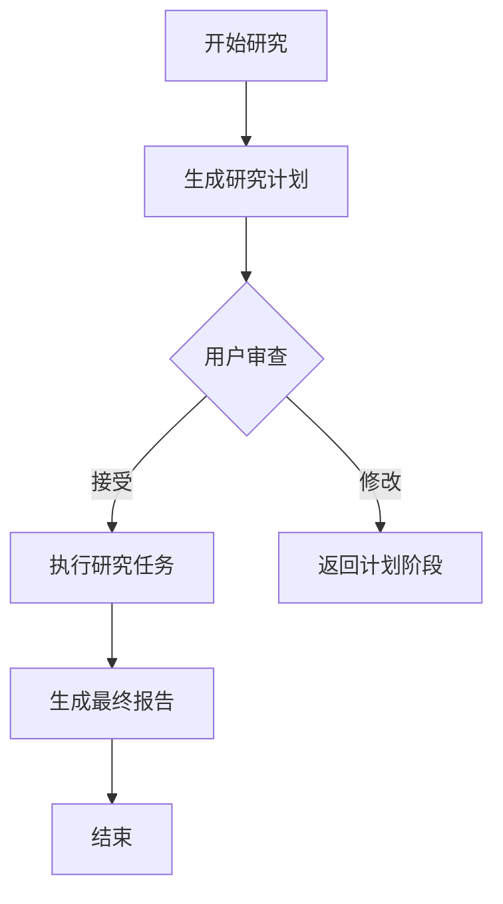
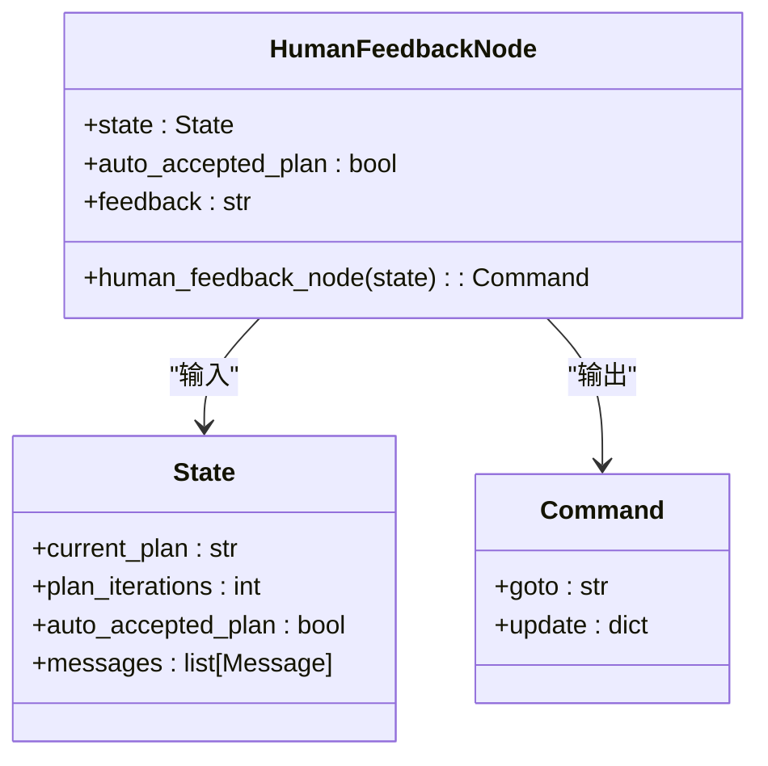
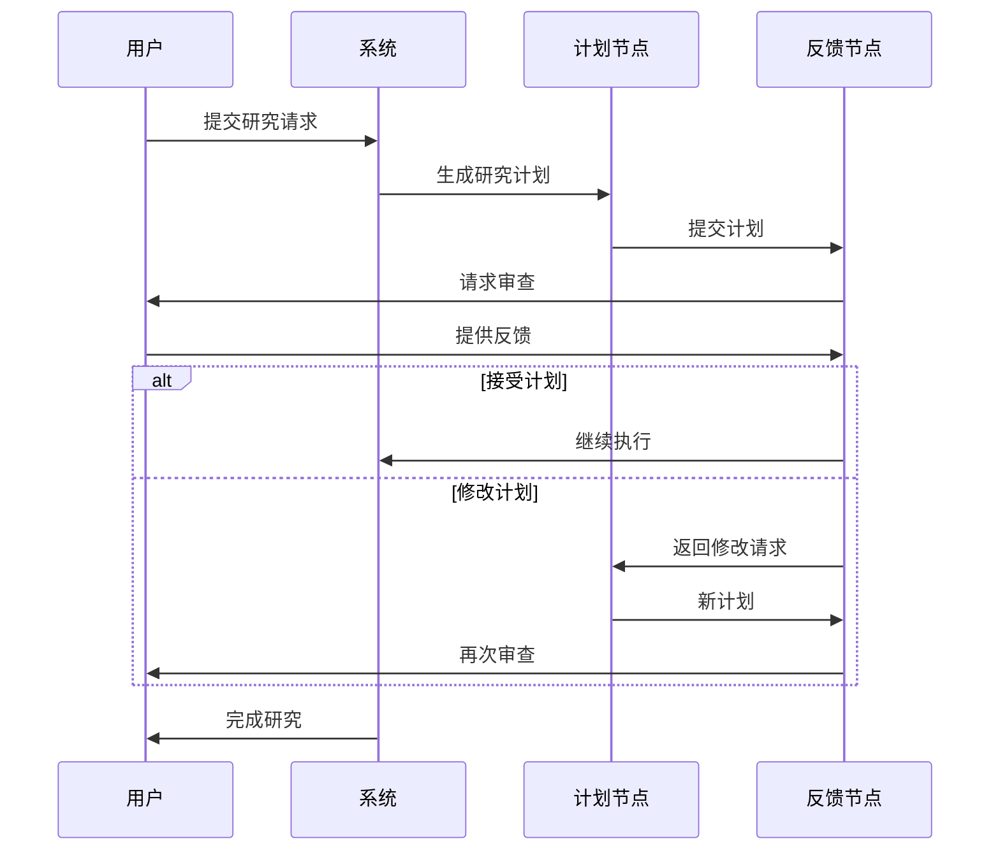

# 最佳实践

<cite>
**本文档中引用的文件**  
- [how_to_use_claude_deep_research.md](file://examples/how_to_use_claude_deep_research.md)
- [nodes.py](file://src/graph/nodes.py)
- [configuration.py](file://src/config/configuration.py)
- [message-list-view.tsx](file://web/src/app/chat/components/message-list-view.tsx)
- [planner.md](file://src/prompts/planner.md)
</cite>

## 目录
1. [引言](#引言)
2. [人工反馈机制概述](#人工反馈机制概述)
3. [反馈时机与阶段策略](#反馈时机与阶段策略)
4. [反馈构造与干预平衡](#反馈构造与干预平衡)
5. [系统响应机制分析](#系统响应机制分析)
6. [成功案例与错误模式对比](#成功案例与错误模式对比)
7. [提高反馈有效性的实用技巧](#提高反馈有效性的实用技巧)
8. [结论](#结论)

## 引言
本指南旨在为用户提供在使用DeerFlow进行深度研究时，如何有效利用人工反馈机制的最佳实践。基于`how_to_use_claude_deep_research.md`中的指导原则，并结合`src/graph/nodes.py`的实现逻辑，本文将详细说明在不同研究阶段（计划、执行、报告）提供反馈的时机和方式。通过理解系统对不同类型反馈的响应特性，用户可以更有效地指导研究流程，避免过度干预或反馈不足的问题。

## 人工反馈机制概述
DeerFlow的人工反馈机制是其深度研究流程中的关键环节，允许用户在研究计划生成后进行审查和干预。该机制主要通过`human_feedback_node`函数实现，位于`src/graph/nodes.py`中。当研究流程进入计划阶段后，系统会暂停并等待用户输入，提供两种主要的反馈选项：接受计划（[ACCEPTED]）或要求修改计划（[EDIT_PLAN]）。

前端界面通过`message-list-view.tsx`中的组件向用户展示研究计划，并提供交互式按钮供用户选择反馈选项。这种设计确保了用户可以在关键决策点上对研究方向进行把控，同时保持了自动化流程的连续性。

**Section sources**
- [nodes.py](file://src/graph/nodes.py#L159-L181)
- [message-list-view.tsx](file://web/src/app/chat/components/message-list-view.tsx#L569-L599)

## 反馈时机与阶段策略
### 计划阶段
在计划阶段，系统生成初步研究计划后会自动触发人工反馈节点。这是最关键的反馈时机，用户应在此时仔细审查计划的全面性和合理性。根据`planner.md`中的提示模板，计划必须满足严格的信息量和质量标准，包括全面覆盖、足够深度和充足数量。

### 执行阶段
在执行阶段，通常不建议频繁干预。系统会自动协调研究团队完成各项任务。只有当发现研究方向严重偏离预期或出现重大错误时，才应考虑中断流程并提供反馈。

### 报告阶段
在报告阶段，用户主要通过审查最终报告的质量来间接提供反馈。如果报告不符合预期，应在下一次研究任务中调整初始提示或配置参数，而不是在报告生成过程中进行干预。

**Diagram sources**
- [nodes.py](file://src/graph/nodes.py#L159-L181)
- [message-list-view.tsx](file://web/src/app/chat/components/message-list-view.tsx#L569-L599)

**Section sources**
- [planner.md](file://src/prompts/planner.md#L1-L188)
- [nodes.py](file://src/graph/nodes.py#L159-L181)

## 反馈构造与干预平衡
### 构造清晰的修改指令
当用户提供修改反馈时，应使用明确的指令格式。系统识别以`[EDIT_PLAN]`开头的反馈为修改请求。例如：`[EDIT_PLAN] 请增加对历史背景的分析`。这种结构化的反馈格式确保了系统能够准确解析用户的意图。

### 平衡干预程度
过度指导会削弱系统的自主性，而干预不足可能导致研究方向偏离。最佳实践是：
- **避免微观管理**：不要对每个研究步骤进行详细指导，而是关注整体研究框架和方向。
- **设定明确目标**：在初始提示中明确研究目标和期望输出，减少后续干预的需要。
- **信任系统判断**：允许系统在合理范围内自主决策，特别是在数据收集和分析阶段。

**Diagram sources**
- [nodes.py](file://src/graph/nodes.py#L159-L181)
- [configuration.py](file://src/config/configuration.py#L1-L71)

**Section sources**
- [nodes.py](file://src/graph/nodes.py#L159-L181)
- [configuration.py](file://src/config/configuration.py#L1-L71)

## 系统响应机制分析
### 反馈类型识别
系统通过`human_feedback_node`函数处理用户反馈，其响应逻辑如下：
- **[ACCEPTED]**：接受当前计划，继续执行研究任务。
- **[EDIT_PLAN]**：将反馈内容作为新消息传递回计划节点，要求重新生成计划。
- **其他输入**：系统会抛出类型错误，因为不支持其他格式的反馈。

### 自动接受模式
系统支持`auto_accepted_plan`配置项，当设置为`True`时，将跳过人工审查环节，自动接受生成的计划。这适用于对系统能力有充分信心的用户，可以提高研究效率。

### 错误处理机制
当计划解析失败时，系统会根据`plan_iterations`的值决定后续操作：
- 如果是首次迭代失败，流程终止。
- 如果是后续迭代失败，系统将转向报告节点，尝试基于现有信息生成报告。

**Diagram sources**
- [nodes.py](file://src/graph/nodes.py#L159-L181)
- [test_nodes.py](file://tests/integration/test_nodes.py#L402-L516)

**Section sources**
- [nodes.py](file://src/graph/nodes.py#L159-L181)
- [test_nodes.py](file://tests/integration/test_nodes.py#L402-L516)

## 成功案例与错误模式对比
### 成功案例
- **案例1**：用户在计划阶段要求"增加对历史背景的分析"，系统成功扩展了研究范围，生成了更全面的报告。
- **案例2**：用户使用自动接受模式进行常规研究任务，显著提高了研究效率，同时保持了报告质量。

### 常见错误模式
- **错误1**：提供模糊反馈如"不够好"，导致系统无法理解具体修改需求。
- **错误2**：在执行阶段频繁中断流程，破坏了研究的连贯性。
- **错误3**：过度干预每个研究步骤，限制了系统的自主决策能力。

**Section sources**
- [how_to_use_claude_deep_research.md](file://examples/how_to_use_claude_deep_research.md#L1-L77)
- [nodes.py](file://src/graph/nodes.py#L159-L181)

## 提高反馈有效性的实用技巧
1. **使用结构化反馈格式**：始终以`[EDIT_PLAN]`或`[ACCEPTED]`开头，确保系统能正确解析。
2. **聚焦关键问题**：在反馈中明确指出需要修改的具体方面，如"请增加对XX因素的分析"。
3. **合理设置自动接受**：对于熟悉的研究领域，可以启用`auto_accepted_plan`以提高效率。
4. **利用配置参数**：通过调整`max_plan_iterations`和`max_step_num`等参数，优化研究流程。
5. **审查而非控制**：将人工反馈视为质量审查机制，而不是全程控制手段。

**Section sources**
- [configuration.py](file://src/config/configuration.py#L1-L71)
- [nodes.py](file://src/graph/nodes.py#L159-L181)

## 结论
有效的DeerFlow人工反馈机制需要用户在正确的时间点提供清晰、结构化的指导，同时保持适当的干预程度。通过理解系统的响应逻辑和最佳实践，用户可以最大化深度研究的效率和质量。关键在于平衡自动化流程的效率与人工监督的质量控制，使DeerFlow真正成为用户的智能研究伙伴。