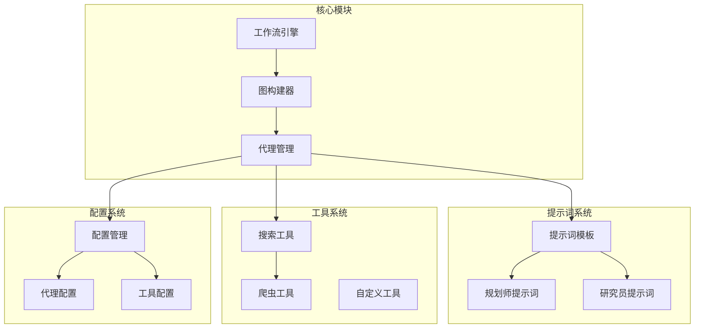
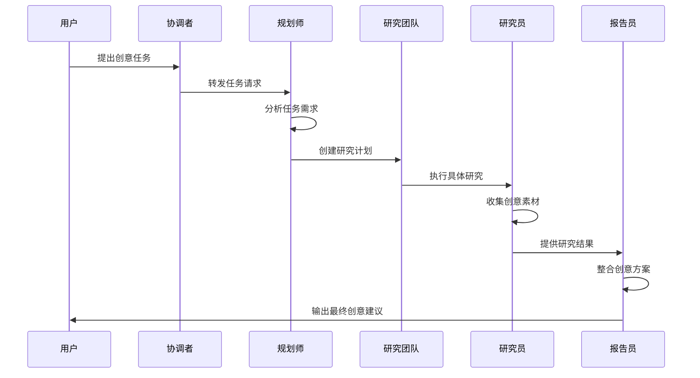
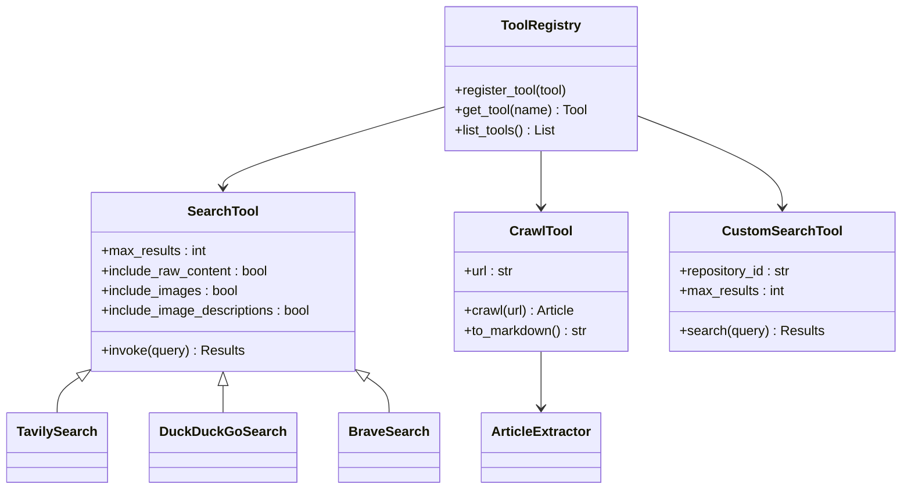
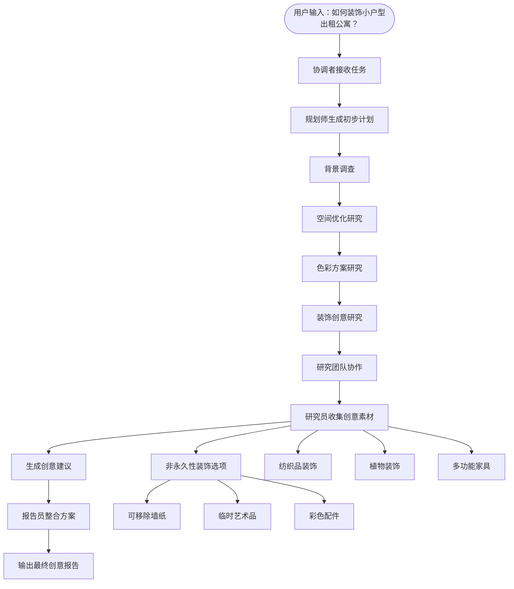

# 创意类任务处理

<cite>
**本文档引用的文件**
- [rental-apartment-decoration.txt](file://web/public/replay/rental-apartment-decoration.txt)
- [researcher.md](file://src/prompts/researcher.md)
- [agents.py](file://src/agents/agents.py)
- [agents.py](file://src/config/agents.py)
- [workflow.py](file://src/workflow.py)
- [builder.py](file://src/graph/builder.py)
- [nodes.py](file://src/graph/nodes.py)
- [search.py](file://src/tools/search.py)
- [crawl.py](file://src/tools/crawl.py)
- [planner.md](file://src/prompts/planner.md)
- [template.py](file://src/prompts/template.py)
- [conf.yaml](file://conf.yaml)
</cite>

## 目录
1. [简介](#简介)
2. [项目结构概览](#项目结构概览)
3. [核心组件分析](#核心组件分析)
4. [架构概览](#架构概览)
5. [详细组件分析](#详细组件分析)
6. [创意任务处理流程](#创意任务处理流程)
7. [提示词设计与优化](#提示词设计与优化)
8. [代理配置与适配](#代理配置与适配)
9. [性能考虑](#性能考虑)
10. [故障排除指南](#故障排除指南)
11. [结论](#结论)

## 简介

DeerFlow是一个基于LangGraph构建的智能代理系统，专门设计用于处理复杂的创意类任务。该系统通过多代理协作的方式，结合数据驱动的研究和创造性思维，为用户提供高质量的创意解决方案。本文档深入分析了系统在处理像租房装修建议这类需要主观判断和创意的任务时的特殊处理方式。

系统的核心优势在于其平衡了数据驱动的研究方法和创造性思维的能力。通过精心设计的提示词模板、灵活的代理配置和强大的工具集成，系统能够产生既具有创新性又实用性强的创意建议。

## 项目结构概览

DeerFlow系统采用模块化架构设计，主要包含以下核心模块：



**图表来源**
- [workflow.py](file://src/workflow.py#L1-L50)
- [builder.py](file://src/graph/builder.py#L1-L88)
- [agents.py](file://src/agents/agents.py#L1-L20)

**章节来源**
- [workflow.py](file://src/workflow.py#L1-L104)
- [builder.py](file://src/graph/builder.py#L1-L88)

## 核心组件分析

### 工作流引擎

工作流引擎是整个系统的核心调度器，负责协调各个代理之间的交互和任务执行。它支持异步执行模式，能够处理复杂的多步骤任务流程。

```python
async def run_agent_workflow_async(
    user_input: str,
    debug: bool = False,
    max_plan_iterations: int = 1,
    max_step_num: int = 3,
    enable_background_investigation: bool = True,
):
    """运行代理工作流异步执行"""
```

### 图构建器

图构建器负责创建状态图，定义代理之间的流转关系和条件分支。系统采用有向无环图（DAG）结构，确保任务执行的确定性和可预测性。

```python
def continue_to_running_research_team(state: State):
    """根据当前计划状态决定下一步执行哪个代理"""
    current_plan = state.get("current_plan")
    if not current_plan or not current_plan.steps:
        return "planner"

    # 查找第一个未完成的步骤
    incomplete_step = None
    for step in current_plan.steps:
        if not step.execution_res:
            incomplete_step = step
            break

    if not incomplete_step:
        return "planner"

    if incomplete_step.step_type == StepType.RESEARCH:
        return "researcher"
    if incomplete_step.step_type == StepType.PROCESSING:
        return "coder"
    return "planner"
```

**章节来源**
- [workflow.py](file://src/workflow.py#L25-L70)
- [builder.py](file://src/graph/builder.py#L25-L45)

## 架构概览

DeerFlow系统采用多层代理架构，通过明确的角色分工和协作机制来处理创意任务：



**图表来源**
- [nodes.py](file://src/graph/nodes.py#L1-L100)
- [builder.py](file://src/graph/builder.py#L30-L60)

## 详细组件分析

### 提示词系统设计

提示词系统是创意类任务处理的核心，通过精心设计的模板引导代理产生高质量的创意输出。

#### 研究员提示词设计

研究员提示词特别针对创意任务进行了优化，强调创造性思维和非永久性装饰选项：

```markdown
# 可用工具

你有两类工具可用：

1. **内置工具**：始终可用：
   - **web_search**：用于执行网络搜索
   - **crawl_tool**：用于从URL读取内容

2. **动态加载工具**：根据配置可用的额外工具

## 如何使用动态加载工具

- **工具选择**：选择最适合子任务的工具
- **工具文档**：仔细阅读工具文档
- **错误处理**：如果工具返回错误，尝试调整方法
- **组合使用**：通常最佳结果来自组合多个工具
```

#### 规划师提示词设计

规划师提示词专注于创意任务的结构化思考和全面覆盖：

```markdown
## 信息数量和质量标准

成功的研究计划必须满足这些标准：

1. **全面覆盖**：
   - 必须涵盖主题的所有方面
   - 必须代表多种观点
   - 必须包括主流和替代观点

2. **足够深度**：
   - 表面信息不足
   - 需要详细的事实、统计数据
   - 必须有多源深入分析

3. **充足数量**：
   - 收集"刚刚好"的信息不被接受
   - 目标是丰富相关信息
   - 更多高质量信息总是优于更少
```

**章节来源**
- [researcher.md](file://src/prompts/researcher.md#L1-L87)
- [planner.md](file://src/prompts/planner.md#L1-L188)

### 工具集成系统

系统集成了多种工具来支持创意任务的执行：



**图表来源**
- [search.py](file://src/tools/search.py#L1-L114)
- [crawl.py](file://src/tools/crawl.py#L1-L30)

**章节来源**
- [search.py](file://src/tools/search.py#L40-L114)
- [crawl.py](file://src/tools/crawl.py#L15-L30)

## 创意任务处理流程

### 租房装修案例分析

通过分析`rental-apartment-decoration.txt`回放文件，我们可以深入了解系统如何处理创意类任务：



**图表来源**
- [rental-apartment-decoration.txt](file://web/public/replay/rental-apartment-decoration.txt#L1-L200)

### 迭代优化机制

系统通过多轮迭代来优化创意建议的质量：

1. **第一轮：广泛探索**
   - 搜索各种装饰风格和技巧
   - 收集不同类型的创意素材
   - 建立基础的创意框架

2. **第二轮：深度挖掘**
   - 针对特定方向进行深入研究
   - 收集具体的实施细节
   - 评估创意的可行性和实用性

3. **第三轮：综合优化**
   - 整合所有收集到的创意元素
   - 优化方案的完整性和一致性
   - 提供最终的创意建议

**章节来源**
- [rental-apartment-decoration.txt](file://web/public/replay/rental-apartment-decoration.txt#L1-L300)

## 提示词设计与优化

### 创意导向的提示词原则

系统采用了以下创意导向的提示词设计原则：

1. **开放式问题引导**
   - 避免限制性的回答格式
   - 鼓励多样化的创意表达
   - 允许自由联想和跨界思考

2. **情境化描述**
   - 提供具体的场景描述
   - 包含情感和感官元素
   - 引导具体的视觉想象

3. **约束性指导**
   - 设定合理的限制条件
   - 平衡创造性和实用性
   - 确保创意的可执行性

### 动态模板系统

系统使用Jinja2模板引擎来动态生成提示词，支持变量替换和条件渲染：

```python
def apply_prompt_template(
    prompt_name: str, state: AgentState, configurable: Configuration = None
) -> list:
    """应用模板变量到提示词模板并返回格式化消息"""
    state_vars = {
        "CURRENT_TIME": datetime.now().strftime("%a %b %d %Y %H:%M:%S %z"),
        **state,
    }
    
    if configurable:
        state_vars.update(dataclasses.asdict(configurable))
    
    template = env.get_template(f"{prompt_name}.md")
    system_prompt = template.render(**state_vars)
    return [{"role": "system", "content": system_prompt}] + state["messages"]
```

**章节来源**
- [template.py](file://src/prompts/template.py#L35-L67)

## 代理配置与适配

### 代理类型映射

系统为不同类型的任务配置了相应的代理类型：

```python
AGENT_LLM_MAP: dict[str, LLMType] = {
    "coordinator": "basic",
    "planner": "basic", 
    "researcher": "basic",
    "coder": "basic",
    "reporter": "basic",
    "podcast_script_writer": "basic",
    "ppt_composer": "basic",
    "prose_writer": "basic",
    "prompt_enhancer": "basic",
}
```

### 工具配置优化

系统支持多种搜索引擎和自定义工具的配置：

```yaml
SEARCH_ENGINE:
  engine: tavily
  include_domains:
    - example.com
    - trusted-news.com
    - reliable-source.org
    - gov.cn
    - edu.cn
  exclude_domains:
    - example.com

CUSTOM_SEARCH:
  repositories:
    aggregation_search:
      name: "聚合搜索"
      description: "聚合多个数据源的搜索服务"
      repository: "aggregation-search"
      channel_id: "0"
    vector_search:
      name: "向量库"
      description: "基于向量相似度的搜索服务"
      repository: "euvd-searchByChannelId"
      channel_id: "0"
```

**章节来源**
- [agents.py](file://src/config/agents.py#L10-L20)
- [conf.yaml](file://conf.yaml#L25-L60)

## 性能考虑

### 异步执行优化

系统采用异步执行模式来提高性能：

- **并发处理**：多个代理可以同时执行不同的任务
- **流式输出**：支持实时的消息流传输
- **内存管理**：使用MemorySaver来保存对话历史

### 缓存策略

系统实现了多层次的缓存策略：

- **工具调用缓存**：避免重复的网络请求
- **模板缓存**：预编译和缓存提示词模板
- **结果缓存**：缓存常用的搜索结果

### 资源限制

系统设置了合理的资源限制来防止过度消耗：

```python
config = {
    "recursion_limit": get_recursion_limit(default=100),
    "configurable": {
        "max_plan_iterations": max_plan_iterations,
        "max_step_num": max_step_num,
    }
}
```

## 故障排除指南

### 常见问题及解决方案

1. **代理卡死或无限循环**
   - 检查递归限制设置
   - 验证条件分支逻辑
   - 启用调试日志

2. **创意输出质量不高**
   - 调整提示词模板
   - 增加搜索结果数量
   - 优化工具组合

3. **工具调用失败**
   - 检查API密钥配置
   - 验证网络连接
   - 查看错误日志

### 调试工具

系统提供了丰富的调试功能：

```python
def enable_debug_logging():
    """启用调试级别日志记录以获取更详细的执行信息"""
    logging.getLogger("src").setLevel(logging.DEBUG)
```

**章节来源**
- [workflow.py](file://src/workflow.py#L15-L25)

## 结论

DeerFlow系统通过精心设计的多代理架构、灵活的提示词系统和强大的工具集成，成功地解决了创意类任务处理的挑战。系统的核心优势体现在：

1. **平衡数据驱动与创造性思维**：通过研究员和规划师的协作，系统能够在充分调研的基础上产生创新性的创意建议。

2. **模块化架构设计**：清晰的职责分离和可扩展的组件设计使得系统能够适应各种创意任务需求。

3. **智能化的工具集成**：支持多种搜索引擎和自定义工具，为创意任务提供了丰富的信息来源。

4. **高效的迭代优化机制**：通过多轮迭代和反馈循环，系统能够不断优化创意建议的质量。

5. **完善的配置管理系统**：灵活的配置选项使得系统能够根据不同任务需求进行定制化调整。

未来的发展方向包括进一步增强创意生成能力、优化用户体验、扩展更多创意领域的支持，以及提升系统的可扩展性和稳定性。