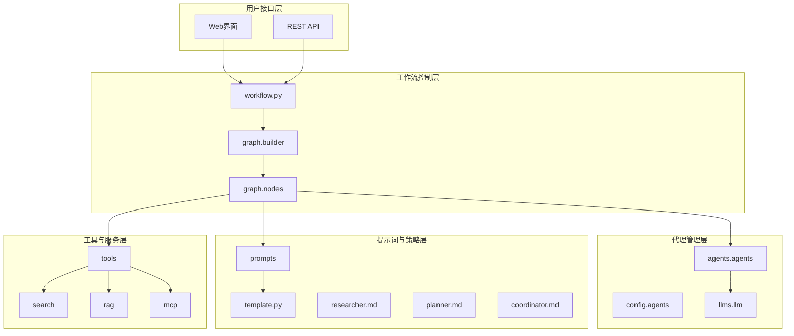
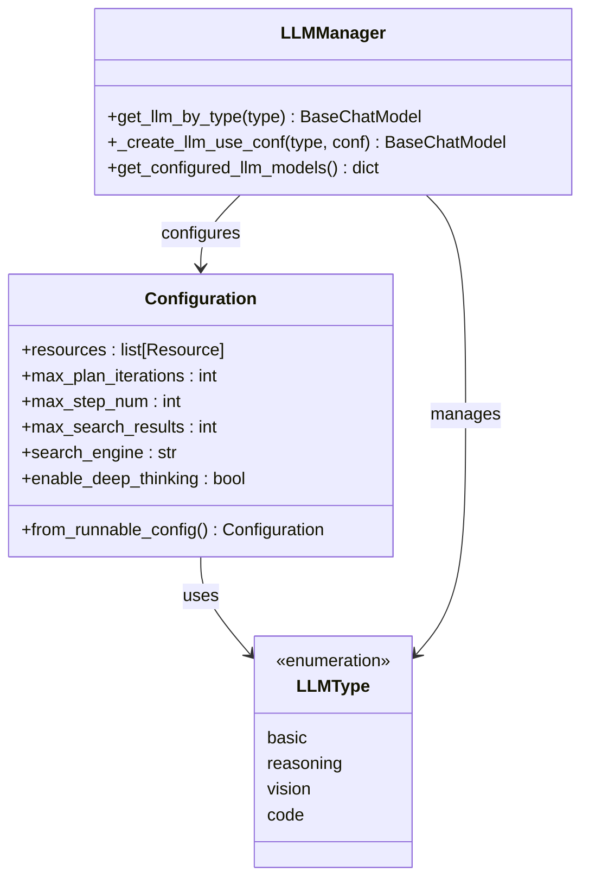
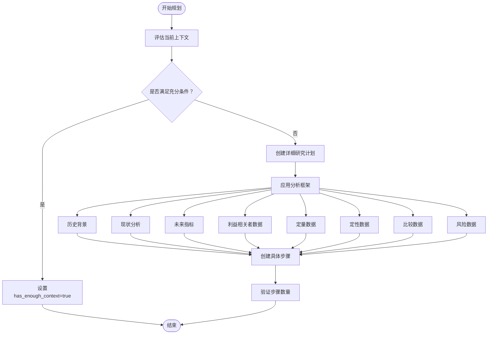
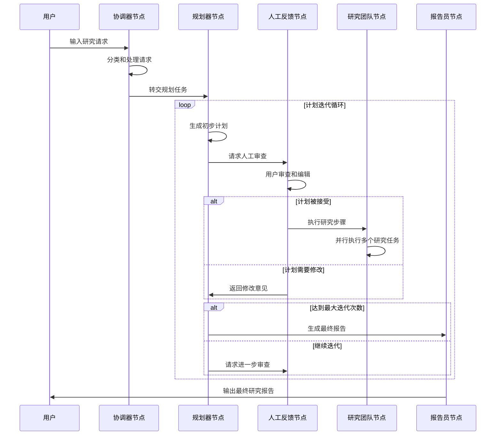
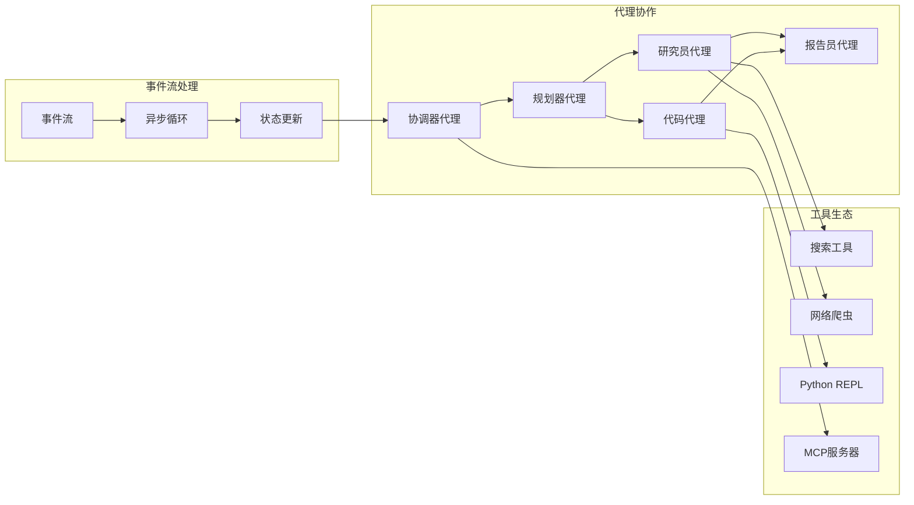

# DeerFlow系统适应策略文档

<cite>
**本文档引用的文件**
- [src/agents/agents.py](file://src/agents/agents.py)
- [src/config/agents.py](file://src/config/agents.py)
- [src/config/configuration.py](file://src/config/configuration.py)
- [src/graph/nodes.py](file://src/graph/nodes.py)
- [src/llms/llm.py](file://src/llms/llm.py)
- [src/prompts/researcher.md](file://src/prompts/researcher.md)
- [src/prompts/planner.md](file://src/prompts/planner.md)
- [src/prompts/coordinator.md](file://src/prompts/coordinator.md)
- [src/workflow.py](file://src/workflow.py)
- [conf.yaml](file://conf.yaml)
- [examples/what_is_agent_to_agent_protocol.md](file://examples/what_is_agent_to_agent_protocol.md)
</cite>

## 目录
1. [引言](#引言)
2. [项目结构概览](#项目结构概览)
3. [代理配置与策略](#代理配置与策略)
4. [提示词工程与创意引导](#提示词工程与创意引导)
5. [工作流节点交互模式](#工作流节点交互模式)
6. [系统架构分析](#系统架构分析)
7. [性能优化与适应性](#性能优化与适应性)
8. [故障排除指南](#故障排除指南)
9. [总结](#总结)

## 引言

DeerFlow是一个专为处理创意类任务设计的智能代理系统，通过精心设计的配置策略和工作流程，实现了高效的创造性思维处理能力。该系统的核心优势在于其灵活的代理配置、创新的提示词工程以及支持多轮迭代的工作流设计。

系统采用模块化架构，通过LangGraph框架实现复杂的代理协作，支持多种LLM模型的动态切换，并提供了完整的错误处理和调试机制。这种设计使得系统能够在保持稳定性的同时，充分发挥各类型模型在不同任务场景下的优势。

## 项目结构概览

DeerFlow系统采用分层架构设计，主要包含以下核心模块：



**图表来源**
- [src/workflow.py](file://src/workflow.py#L1-L50)
- [src/graph/builder.py](file://src/graph/builder.py#L1-L30)
- [src/agents/agents.py](file://src/agents/agents.py#L1-L20)

**章节来源**
- [src/workflow.py](file://src/workflow.py#L1-L104)
- [src/graph/builder.py](file://src/graph/builder.py#L1-L50)

## 代理配置与策略

### 代理类型与LLM映射

DeerFlow系统定义了标准化的代理类型映射机制，通过`AGENT_LLM_MAP`配置实现不同代理角色与相应LLM模型的绑定：

```python
AGENT_LLM_MAP: dict[str, LLMType] = {
    "coordinator": "basic",
    "planner": "basic", 
    "researcher": "basic",
    "coder": "basic",
    "reporter": "basic",
    "podcast_script_writer": "basic",
    "ppt_composer": "basic",
    "prose_writer": "basic",
    "prompt_enhancer": "basic",
}
```

这种设计确保了每个代理都能获得最适合其任务需求的LLM配置，同时保持了系统的可扩展性和一致性。

### LLM模型配置策略

系统支持多种LLM类型的动态配置，包括基础模型、推理模型、视觉模型和代码模型：



**图表来源**
- [src/config/agents.py](file://src/config/agents.py#L1-L21)
- [src/config/configuration.py](file://src/config/configuration.py#L1-L71)
- [src/llms/llm.py](file://src/llms/llm.py#L1-L181)

### 深度思考模式配置

系统提供了深度思考模式配置选项，通过环境变量`AGENT_RECURSION_LIMIT`控制递归深度：

```python
def get_recursion_limit(default: int = 25) -> int:
    """获取递归限制值，优先使用环境变量配置"""
    env_value_str = get_str_env("AGENT_RECURSION_LIMIT", str(default))
    parsed_limit = get_int_env("AGENT_RECURSION_LIMIT", default)
    
    if parsed_limit > 0:
        logger.info(f"递归限制设置为: {parsed_limit}")
        return parsed_limit
    else:
        logger.warning(f"AGENT_RECURSION_LIMIT值无效，使用默认值 {default}")
        return default
```

**章节来源**
- [src/config/configuration.py](file://src/config/configuration.py#L1-L71)
- [src/llms/llm.py](file://src/llms/llm.py#L1-L181)

## 提示词工程与创意引导

### 研究员提示词设计

研究员代理的提示词设计特别注重引导模型跳出常规搜索结果，生成新颖的解决方案：

```markdown
# 研究员提示词核心要素

1. **工具选择指导**：
   - 优先选择专门工具而非通用工具
   - 动态加载工具的使用方法
   - 错误处理和调整策略

2. **时间范围要求**：
   - 在查询中包含时间参数
   - 验证出版日期符合要求
   - 确保信息时效性

3. **信息合成原则**：
   - 结构化输出格式
   - 清晰的信息来源跟踪
   - 合理的图片使用策略
```

### 规划器提示词框架

规划器代理采用了严格的上下文评估标准，确保研究计划的充分性和完整性：



**图表来源**
- [src/prompts/planner.md](file://src/prompts/planner.md#L1-L188)
- [src/prompts/researcher.md](file://src/prompts/researcher.md#L1-L87)

### 协调器提示词策略

协调器代理专注于友好交互和任务分类，确保用户请求得到恰当处理：

```markdown
# 协调器代理职责矩阵

1. **直接处理类别**：
   - 简单问候语："hello", "hi", "good morning"
   - 基础闲聊："how are you", "what's your name"
   - 能力询问：澄清功能问题

2. **拒绝处理类别**：
   - 提示泄露请求
   - 有害内容生成请求
   - 授权冒充请求
   - 安全指南规避请求

3. **转交处理类别**：
   - 事实性问题
   - 需要信息收集的研究请求
   - 当前事件、历史、科学等问题
   - 分析、比较或解释请求
   - 计划步骤调整请求
```

**章节来源**
- [src/prompts/researcher.md](file://src/prompts/researcher.md#L1-L87)
- [src/prompts/planner.md](file://src/prompts/planner.md#L1-L188)
- [src/prompts/coordinator.md](file://src/prompts/coordinator.md#L1-L56)

## 工作流节点交互模式

### 多轮反馈循环机制

系统通过精心设计的工作流节点实现了支持创意迭代的多轮反馈循环：



**图表来源**
- [src/graph/nodes.py](file://src/graph/nodes.py#L1-L512)

### 节点状态管理

系统通过复杂的状态管理机制确保创意过程的连贯性：

```python
async def _execute_agent_step(
    state: State, 
    agent, 
    agent_name: str
) -> Command[Literal["research_team"]]:
    """执行代理步骤的辅助函数"""
    
    # 查找未执行的步骤
    current_step = None
    completed_steps = []
    for step in current_plan.steps:
        if not step.execution_res:
            current_step = step
            break
        else:
            completed_steps.append(step)
    
    # 格式化已完成步骤信息
    completed_steps_info = ""
    if completed_steps:
        completed_steps_info = "# 已完成研究步骤\n\n"
        for i, step in enumerate(completed_steps):
            completed_steps_info += f"## 已完成步骤 {i + 1}: {step.title}\n\n"
            completed_steps_info += f"<finding>\n{step.execution_res}\n</finding>\n\n"
    
    # 准备代理输入
    agent_input = {
        "messages": [
            HumanMessage(
                content=f"# 研究主题\n\n{plan_title}\n\n{completed_steps_info}"
                f"# 当前步骤\n\n## 标题\n\n{current_step.title}\n\n"
                f"## 描述\n\n{current_step.description}\n\n"
                f"## 语言环境\n\n{state.get('locale', 'en-US')}"
            )
        ]
    }
```

### MCP服务器集成

系统支持动态加载工具和服务，通过MCP（Model Context Protocol）实现：

```python
async def _setup_and_execute_agent_step(
    state: State,
    config: RunnableConfig,
    agent_type: str,
    default_tools: list,
) -> Command[Literal["research_team"]]:
    """设置并执行代理步骤的辅助函数"""
    
    configurable = Configuration.from_runnable_config(config)
    mcp_servers = {}
    enabled_tools = {}
    
    # 提取MCP服务器配置
    if configurable.mcp_settings:
        for server_name, server_config in configurable.mcp_settings["servers"].items():
            if (server_config["enabled_tools"] 
                and agent_type in server_config["add_to_agents"]):
                mcp_servers[server_name] = {
                    k: v for k, v in server_config.items() 
                    if k in ("transport", "command", "args", "url", "env", "headers")
                }
                for tool_name in server_config["enabled_tools"]:
                    enabled_tools[tool_name] = server_name
    
    # 创建带有MCP工具的代理
    if mcp_servers:
        client = MultiServerMCPClient(mcp_servers)
        loaded_tools = default_tools[:]
        all_tools = await client.get_tools()
        for tool in all_tools:
            if tool.name in enabled_tools:
                tool.description = f"由'{enabled_tools[tool.name]}'提供.\n{tool.description}"
                loaded_tools.append(tool)
        agent = create_agent(agent_type, agent_type, loaded_tools, agent_type)
        return await _execute_agent_step(state, agent, agent_type)
```

**章节来源**
- [src/graph/nodes.py](file://src/graph/nodes.py#L1-L512)

## 系统架构分析

### 整体架构设计

DeerFlow系统采用事件驱动的异步架构，通过LangGraph实现复杂的代理协作：



**图表来源**
- [src/workflow.py](file://src/workflow.py#L1-L104)
- [src/graph/builder.py](file://src/graph/builder.py#L1-L50)

### 配置管理系统

系统提供了灵活的配置管理机制，支持运行时配置和环境变量覆盖：

```python
@dataclass(kw_only=True)
class Configuration:
    """可配置字段类"""
    
    resources: list[Resource] = field(default_factory=list)
    max_plan_iterations: int = 1
    max_step_num: int = 3  
    max_search_results: int = 3
    search_engine: str = "custom_search"
    custom_search_repository: Optional[str] = None
    mcp_settings: dict = None
    report_style: str = ReportStyle.ACADEMIC.value
    enable_deep_thinking: bool = False
    
    @classmethod
    def from_runnable_config(
        cls, config: Optional[RunnableConfig] = None
    ) -> "Configuration":
        """从RunnableConfig创建配置实例"""
        configurable = (
            config["configurable"] if config and "configurable" in config else {}
        )
        values: dict[str, Any] = {
            f.name: os.environ.get(f.name.upper(), configurable.get(f.name))
            for f in fields(cls)
            if f.init
        }
        return cls(**{k: v for k, v in values.items() if v})
```

**章节来源**
- [src/config/configuration.py](file://src/config/configuration.py#L1-L71)

## 性能优化与适应性

### 递归限制与资源管理

系统通过智能的递归限制机制防止无限循环，同时提供灵活的资源管理：

```python
# 递归限制配置
AGENT_RECURSION_LIMIT = 25  # 默认递归限制

# 可通过环境变量动态调整
try:
    env_value_str = os.getenv("AGENT_RECURSION_LIMIT", str(default_recursion_limit))
    parsed_limit = int(env_value_str)
    
    if parsed_limit > 0:
        recursion_limit = parsed_limit
        logger.info(f"递归限制设置为: {recursion_limit}")
    else:
        logger.warning(f"AGENT_RECURSION_LIMIT值无效，使用默认值 {default_recursion_limit}")
        recursion_limit = default_recursion_limit
except ValueError:
    logger.warning(f"无效的 AGENT_RECURSION_LIMIT 值: '{raw_env_value}'")
    recursion_limit = default_recursion_limit
```

### 缓存机制优化

系统实现了LLM实例缓存机制，提高性能和资源利用率：

```python
# LLM实例缓存
_llm_cache: dict[LLMType, BaseChatModel] = {}

def get_llm_by_type(llm_type: LLMType) -> BaseChatModel:
    """按类型获取LLM实例，返回缓存实例（如果可用）"""
    if llm_type in _llm_cache:
        return _llm_cache[llm_type]
    
    conf = load_yaml_config(_get_config_file_path())
    llm = _create_llm_use_conf(llm_type, conf)
    _llm_cache[llm_type] = llm
    return llm
```

### 异常处理与恢复机制

系统提供了完善的异常处理和恢复机制：

```python
async def run_agent_workflow_async(
    user_input: str,
    debug: bool = False,
    max_plan_iterations: int = 1,
    max_step_num: int = 3,
    enable_background_investigation: bool = True,
):
    """异步运行代理工作流"""
    
    if not user_input:
        raise ValueError("输入不能为空")
    
    if debug:
        enable_debug_logging()
    
    logger.info(f"开始异步工作流，用户输入: {user_input}")
    
    # 流式处理输出
    async for s in graph.astream(input=initial_state, config=config, stream_mode="values"):
        try:
            if isinstance(s, dict) and "messages" in s:
                if len(s["messages"]) <= last_message_cnt:
                    continue
                last_message_cnt = len(s["messages"])
                message = s["messages"][-1]
                message.pretty_print()
        except Exception as e:
            logger.error(f"处理流输出时出错: {e}")
            print(f"处理输出时出错: {str(e)}")
```

**章节来源**
- [src/config/configuration.py](file://src/config/configuration.py#L1-L71)
- [src/llms/llm.py](file://src/llms/llm.py#L1-L181)
- [src/workflow.py](file://src/workflow.py#L1-L104)

## 故障排除指南

### 常见配置问题

1. **LLM连接问题**
   - 检查API密钥配置
   - 验证基础URL设置
   - 确认SSL证书验证设置

2. **代理递归限制**
   - 设置合适的`AGENT_RECURSION_LIMIT`
   - 监控递归深度日志
   - 调整计划迭代次数

3. **MCP服务器配置**
   - 验证服务器配置语法
   - 检查工具启用状态
   - 确认传输协议设置

### 调试技巧

系统提供了多层次的调试支持：

```python
def enable_debug_logging():
    """启用调试级别日志记录"""
    logging.getLogger("src").setLevel(logging.DEBUG)

# 日志配置示例
logging.basicConfig(
    level=logging.INFO,
    format="%(asctime)s - %(name)s - %(levelname)s - %(message)s",
)
```

### 性能监控

通过状态追踪和消息计数监控系统性能：

```python
last_message_cnt = 0
async for s in graph.astream(
    input=initial_state, 
    config=config, 
    stream_mode="values"
):
    if isinstance(s, dict) and "messages" in s:
        if len(s["messages"]) <= last_message_cnt:
            continue
        last_message_cnt = len(s["messages"])
        message = s["messages"][-1]
        message.pretty_print()
```

**章节来源**
- [src/workflow.py](file://src/workflow.py#L1-L104)

## 总结

DeerFlow系统通过精心设计的适应策略，在处理创意类任务方面展现了卓越的能力。系统的核心优势体现在以下几个方面：

1. **灵活的代理配置**：通过标准化的LLM映射和动态配置机制，确保每个代理都能获得最适合其任务需求的模型支持。

2. **创新的提示词工程**：研究员、规划器和协调器代理都采用了针对性的提示词设计，有效引导模型产生高质量的创意输出。

3. **支持迭代的交互模式**：通过多轮反馈循环和状态管理机制，系统能够不断优化和改进创意方案。

4. **强大的工具集成能力**：通过MCP协议和动态工具加载，系统能够根据任务需求灵活调用各种专业工具。

5. **完善的性能优化**：递归限制、缓存机制和异常处理确保了系统的稳定性和高效性。

这种综合性的设计使得DeerFlow能够在保持技术先进性的同时，为用户提供可靠、高效的创意处理服务。系统的模块化架构也为未来的功能扩展和定制化改造提供了良好的基础。