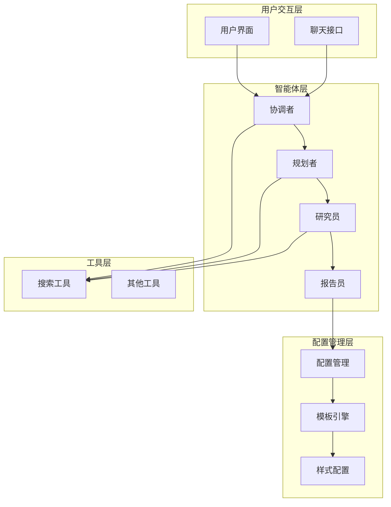
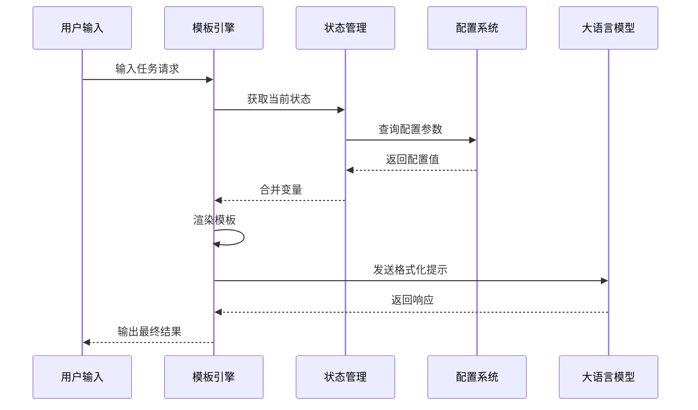
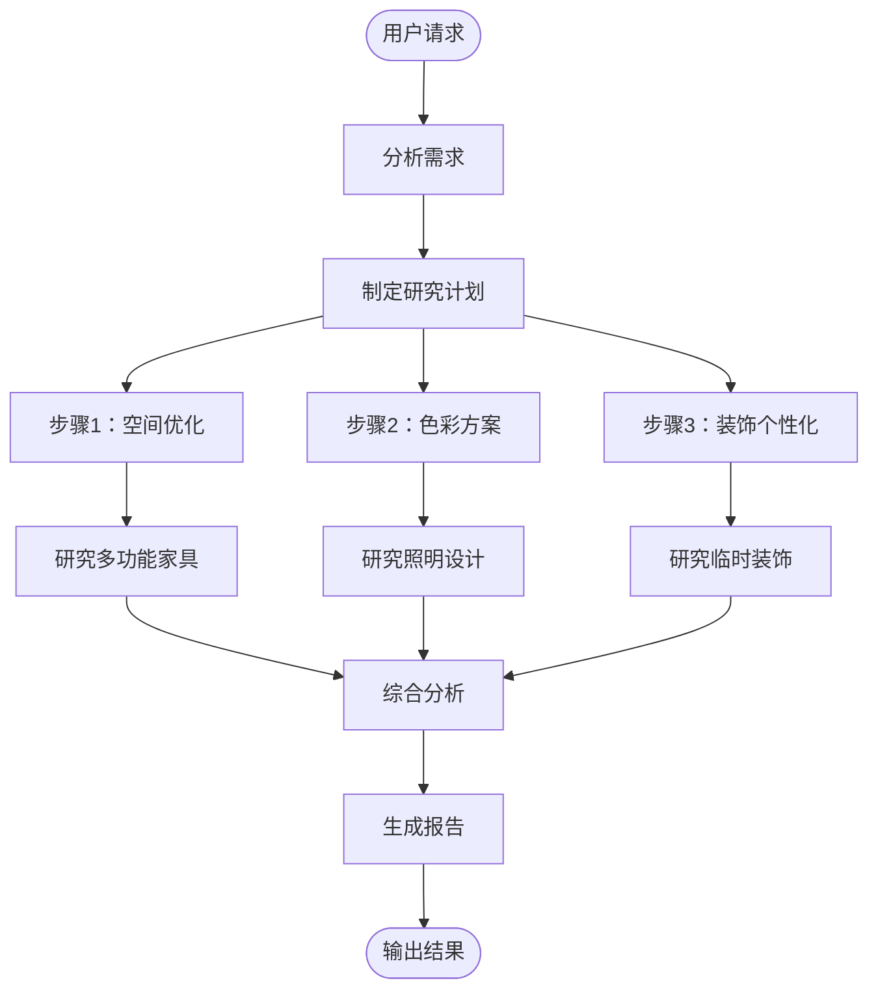
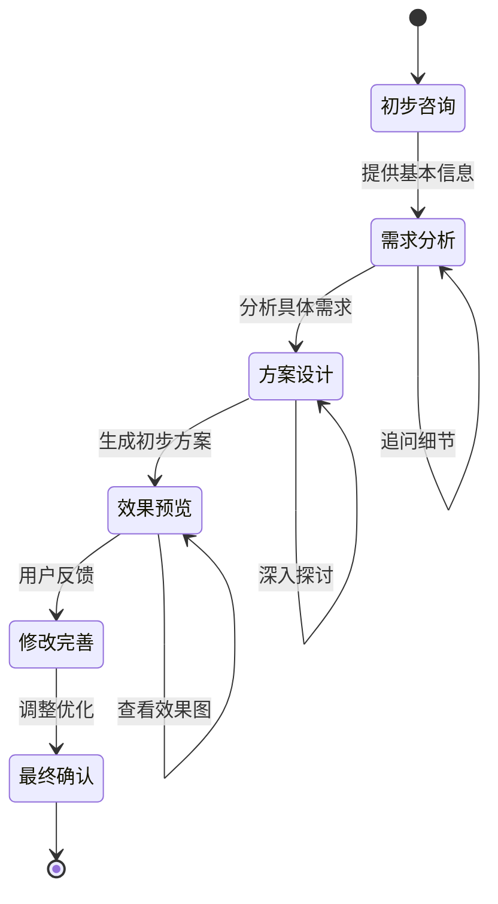
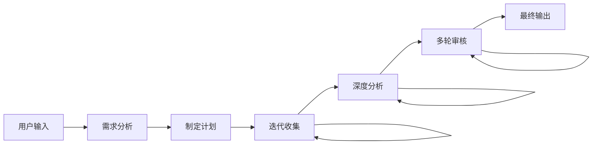

# 输出优化技巧

<cite>
**本文档中引用的文件**
- [agents.py](file://src/config/agents.py)
- [template.py](file://src/prompts/template.py)
- [configuration.py](file://src/config/configuration.py)
- [report_style.py](file://src/config/report_style.py)
- [rental-apartment-decoration.txt](file://web/public/replay/rental-apartment-decoration.txt)
- [coordinator.md](file://src/prompts/coordinator.md)
- [planner.md](file://src/prompts/planner.md)
- [reporter.md](file://src/prompts/reporter.md)
- [custom_search.py](file://src/config/custom_search.py)
- [search.py](file://src/tools/search.py)
- [test_template.py](file://tests/integration/test_template.py)
- [conf.yaml](file://conf.yaml)
</cite>

## 目录
1. [简介](#简介)
2. [项目架构概览](#项目架构概览)
3. [核心配置系统](#核心配置系统)
4. [提示模板机制](#提示模板机制)
5. [创意输出优化策略](#创意输出优化策略)
6. [用户引导方法](#用户引导方法)
7. [配置调优指南](#配置调优指南)
8. [故障排除指南](#故障排除指南)
9. [最佳实践建议](#最佳实践建议)
10. [结论](#结论)

## 简介

本文档基于deer-flow项目的实际应用案例，特别是租赁公寓装饰项目的交互过程，提供了一套完整的输出优化技巧和配置建议。通过深入分析项目的配置系统、提示模板机制和工作流程，我们将探讨如何有效提升创意类任务的输出质量。

该项目采用了先进的多智能体协作架构，通过精心设计的提示模板系统和灵活的配置机制，能够根据不同任务需求生成高质量的创意方案。本文档将重点关注如何通过修改配置参数、优化提示模板和改进用户引导来提升输出效果。

## 项目架构概览

deer-flow项目采用模块化的多智能体架构，每个组件都有明确的职责分工：



**图表来源**
- [coordinator.md](file://src/prompts/coordinator.md#L1-L56)
- [planner.md](file://src/prompts/planner.md#L1-L188)
- [reporter.md](file://src/prompts/reporter.md#L1-L280)

## 核心配置系统

### 智能体配置

项目通过`src/config/agents.py`文件定义了不同智能体与LLM类型的映射关系：

```python
# 定义可用的LLM类型
LLMType = Literal["basic", "reasoning", "vision", "code"]

# 定义智能体-LLM映射
AGENT_LLM_MAP: dict[str, LLMType] = {
    "coordinator": "basic",
    "planner": "basic",
    "researcher": "basic",
    "coder": "basic",
    "reporter": "basic",
    "podcast_script_writer": "basic",
    "ppt_composer": "basic",
    "prose_writer": "basic",
    "prompt_enhancer": "basic",
}
```

### 配置参数详解

在`src/config/configuration.py`中定义了丰富的配置选项：

```python
@dataclass(kw_only=True)
class Configuration:
    """可配置字段"""
    
    resources: list[Resource] = field(default_factory=list)
    max_plan_iterations: int = 1
    max_step_num: int = 3
    max_search_results: int = 3
    search_engine: str = "custom_search"
    custom_search_repository: Optional[str] = None
    mcp_settings: dict = None
    report_style: str = ReportStyle.ACADEMIC.value
    enable_deep_thinking: bool = False
```

**章节来源**
- [agents.py](file://src/config/agents.py#L1-L21)
- [configuration.py](file://src/config/configuration.py#L30-L71)

## 提示模板机制

### 模板系统架构

项目使用Jinja2模板引擎实现动态提示生成：



**图表来源**
- [template.py](file://src/prompts/template.py#L25-L67)

### 模板变量系统

模板系统支持多种变量类型：

1. **时间相关变量**：
   ```python
   state_vars = {
       "CURRENT_TIME": datetime.now().strftime("%a %b %d %Y %H:%M:%S %z"),
       **state,
   }
   ```

2. **配置变量**：
   ```python
   if configurable:
       state_vars.update(dataclasses.asdict(configurable))
   ```

3. **状态变量**：
   - 当前消息历史
   - 任务状态
   - 工作空间上下文

**章节来源**
- [template.py](file://src/prompts/template.py#L35-L67)

## 创意输出优化策略

### 基于租赁公寓装饰案例的分析

通过分析租赁公寓装饰项目的交互过程，我们可以总结出以下优化策略：

#### 1. 分步骤深度研究

项目采用分步骤的研究方法，确保信息收集的全面性和深度：



**图表来源**
- [rental-apartment-decoration.txt](file://web/public/replay/rental-apartment-decoration.txt#L200-L300)

#### 2. 多维度信息收集

项目在规划阶段就考虑了多个维度的信息收集：

- **历史背景**：空间设计趋势和演变
- **现状分析**：当前流行的设计元素
- **未来预测**：可持续设计和科技融合
- **利益相关者**：租户需求和房东要求
- **量化数据**：空间利用率和成本效益
- **定性数据**：用户体验和美学价值
- **比较数据**：不同设计方案的对比
- **风险评估**：潜在问题和解决方案

#### 3. 灵活的搜索策略

项目支持多种搜索引擎和配置选项：

```python
# 支持的搜索引擎
SEARCH_ENGINES = {
    "tavily": "Tavily搜索",
    "duckduckgo": "DuckDuckGo搜索",
    "brave_search": "Brave搜索",
    "arxiv": "学术论文搜索",
    "wikipedia": "维基百科搜索",
    "custom_search": "自定义搜索引擎"
}
```

**章节来源**
- [rental-apartment-decoration.txt](file://web/public/replay/rental-apartment-decoration.txt#L1-L100)
- [search.py](file://src/tools/search.py#L40-L113)

## 用户引导方法

### 有效提问技巧

基于租赁公寓装饰项目的经验，以下是推荐的用户引导方法：

#### 1. 明确具体的需求描述

**推荐提问方式**：
- "如何为一个50平米的单间公寓进行装修设计？"
- "有哪些适合小户型的多功能家具推荐？"
- "如何在有限预算下打造温馨的居住环境？"

**避免的提问方式**：
- "怎么装修好房子？"（过于宽泛）
- "有什么好主意？"（缺乏具体信息）

#### 2. 提供详细的背景信息

**推荐信息包括**：
- 房屋面积和布局
- 租赁期限和装修限制
- 预算范围和优先级
- 个人喜好和生活方式
- 特殊需求（如宠物、工作空间等）

#### 3. 分阶段的交互模式



**章节来源**
- [coordinator.md](file://src/prompts/coordinator.md#L20-L56)

## 配置调优指南

### 调整创意'大胆程度'

通过修改`src/config/agents.py`中的配置，可以调整智能体的创造性表现：

#### 1. LLM类型选择

```python
# 基础模式（保守创意）
AGENT_LLM_MAP["planner"] = "basic"

# 推荐模式（平衡创意）
AGENT_LLM_MAP["planner"] = "reasoning"

# 视觉模式（高创意）
AGENT_LLM_MAP["planner"] = "vision"
```

#### 2. 搜索配置优化

在`conf.yaml`中调整搜索参数：

```yaml
SEARCH_ENGINE:
  engine: tavily
  max_search_results: 5  # 增加搜索结果数量
  include_domains:
    - design-magazine.com
    - interior-design-blog.com
    - architecture-news.org
  exclude_domains:
    - low-quality-site.com
```

#### 3. 报告风格配置

通过`report_style`参数控制输出风格：

```python
# 学术风格（严谨专业）
config.report_style = "academic"

# 流行科学风格（通俗易懂）
config.report_style = "popular_science"

# 新闻风格（客观报道）
config.report_style = "news"

# 社交媒体风格（生动活泼）
config.report_style = "social_media"
```

**章节来源**
- [agents.py](file://src/config/agents.py#L10-L21)
- [configuration.py](file://src/config/configuration.py#L30-L71)
- [report_style.py](file://src/config/report_style.py#L1-L9)

## 故障排除指南

### 常见问题及解决方案

#### 1. 模板加载失败

**问题症状**：提示模板无法正确加载
**解决方案**：
```python
# 检查模板文件是否存在
try:
    template = get_prompt_template("desired_template")
except ValueError as e:
    print(f"模板加载错误: {e}")
    # 检查文件路径和权限
```

#### 2. 配置参数无效

**问题症状**：配置更改未生效
**解决方案**：
```python
# 重启应用以应用新配置
from src.config.loader import reload_config
reload_config()
```

#### 3. 搜索结果质量不佳

**问题症状**：搜索结果不够相关或数量不足
**解决方案**：
```python
# 调整搜索参数
config.max_search_results = 5
config.search_engine = "custom_search"
config.custom_search_repository = "vector_search"
```

**章节来源**
- [test_template.py](file://tests/integration/test_template.py#L10-L30)

## 最佳实践建议

### 1. 提示模板优化

#### a) 动态变量使用

```python
# 在模板中使用动态变量
template = """
当前时间: {{ CURRENT_TIME }}
用户偏好: {{ user_preferences }}
房屋面积: {{ house_area }} 平方米
预算范围: {{ budget_range }}
"""

# 在应用时传入相应变量
apply_prompt_template("decorator", {
    "CURRENT_TIME": datetime.now().strftime("%Y-%m-%d"),
    "user_preferences": "现代简约风格",
    "house_area": "60",
    "budget_range": "10-20万"
})
```

#### b) 多语言支持

```python
# 支持不同语言的模板渲染
messages = apply_prompt_template("reporter", {
    "messages": [],
    "task": "装饰方案",
    "workspace_context": "公寓装修",
    "report_style": "social_media",
    "locale": "zh-CN"  # 中文环境
})
```

### 2. 工作流优化

#### a) 分阶段处理



#### b) 错误处理机制

```python
def robust_template_rendering(prompt_name, state, configurable=None):
    try:
        return apply_prompt_template(prompt_name, state, configurable)
    except ValueError as e:
        logger.error(f"模板渲染失败: {e}")
        # 回退到基础模板
        return apply_prompt_template("basic", state)
    except Exception as e:
        logger.error(f"未知错误: {e}")
        return [{"role": "system", "content": "系统遇到错误，请重试。"}]
```

### 3. 性能优化建议

#### a) 缓存机制

```python
from functools import lru_cache

@lru_cache(maxsize=128)
def cached_template_load(template_name):
    return get_prompt_template(template_name)
```

#### b) 异步处理

```python
import asyncio

async def async_template_processing(tasks):
    """异步处理多个模板任务"""
    coroutines = [process_template(task) for task in tasks]
    results = await asyncio.gather(*coroutines)
    return results
```

## 结论

通过本文档的分析，我们可以看到deer-flow项目提供了一套完整而灵活的输出优化框架。关键要点包括：

1. **模块化架构**：清晰的职责分离使得系统易于维护和扩展
2. **动态模板系统**：基于Jinja2的模板引擎提供了强大的内容生成能力
3. **灵活配置**：丰富的配置选项允许针对不同场景进行精细调优
4. **智能引导**：通过多智能体协作实现高效的信息收集和处理
5. **质量保证**：多层次的质量检查和验证机制确保输出的可靠性

这些特性使得deer-flow特别适合创意类任务的输出优化，无论是室内设计、内容创作还是其他需要创造性思维的任务。通过合理配置和使用这些功能，用户可以显著提升输出质量和工作效率。

未来的改进方向包括：
- 增强AI辅助的创意生成能力
- 扩展更多专业的提示模板
- 优化多模态内容的处理能力
- 提升系统的可扩展性和性能