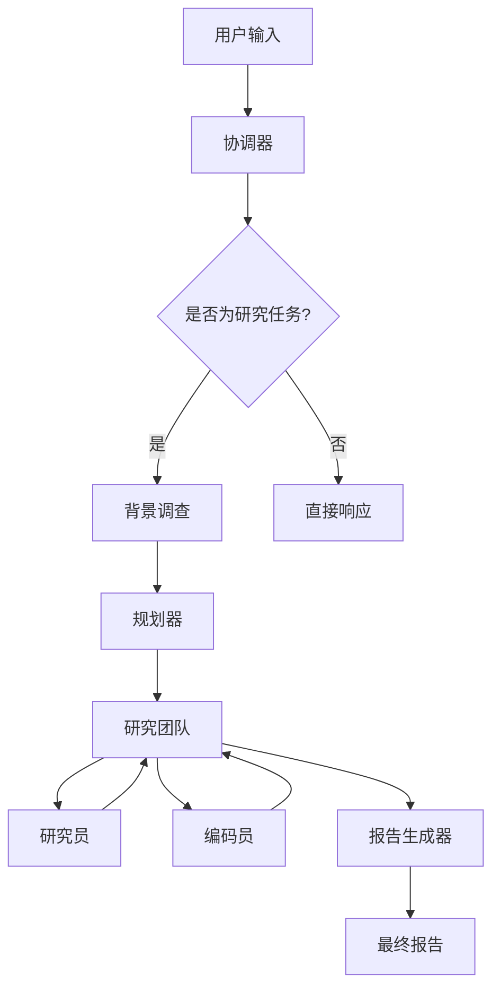

# 基本研究任务示例

<cite>
**本文档中引用的文件**   
- [nanjing_tangbao.md](file://examples/nanjing_tangbao.md)
- [what_is_llm.md](file://examples/what_is_llm.md)
- [nanjing-traditional-dishes.txt](file://web/public/replay/nanjing-traditional-dishes.txt)
- [github-top-trending-repo.txt](file://web/public/replay/github-top-trending-repo.txt)
- [workflow.py](file://src/workflow.py)
- [builder.py](file://src/graph/builder.py)
- [nodes.py](file://src/graph/nodes.py)
</cite>

## 目录
1. [引言](#引言)
2. [系统架构与工作流](#系统架构与工作流)
3. [简单研究查询处理流程](#简单研究查询处理流程)
4. [案例分析：南京传统小吃](#案例分析：南京传统小吃)
5. [案例分析：大语言模型](#案例分析：大语言模型)
6. [性能表现分析](#性能表现分析)
7. [配置建议与最佳实践](#配置建议与最佳实践)
8. [常见问题与解决方案](#常见问题与解决方案)
9. [结论](#结论)

## 引言
DeerFlow 是一个社区驱动的AI自动化框架，旨在将语言模型与专业工具（如网络搜索、爬取和Python代码执行）无缝集成，用于深度探索和高效研究。本文档将详细介绍DeerFlow系统如何处理简单直接的研究查询，重点介绍其从用户输入到最终答案生成的完整工作流。通过分析 `examples/nanjing_tangbao.md` 和 `examples/what_is_llm.md` 两个示例，以及 `web/public/replay` 中的回放文件，我们将展示系统在处理“南京传统小吃”和“GitHub热门项目”等事实性问题时的性能表现。此外，本文档还将提供配置建议和最佳实践，帮助用户优化基本研究任务的执行效率，并解决信息不完整或结果不准确等常见问题。

## 系统架构与工作流
DeerFlow系统采用多智能体架构，通过LangGraph实现复杂的智能体编排。系统的核心工作流由一个状态图（State Graph）驱动，该图定义了智能体之间的交互和控制流。工作流从用户输入开始，经过协调器（coordinator）、规划器（planner）、研究团队（research_team）等节点，最终由报告生成器（reporter）输出最终报告。

**图源**
- [workflow.py](file://src/workflow.py#L1-L104)
- [builder.py](file://src/graph/builder.py#L1-L88)

**节源**
- [workflow.py](file://src/workflow.py#L1-L104)
- [builder.py](file://src/graph/builder.py#L1-L88)

## 简单研究查询处理流程
当用户提交一个简单直接的研究查询时，DeerFlow系统会遵循一个标准化的处理流程。首先，协调器节点接收用户输入，并判断是否为研究任务。如果是，则将任务移交给规划器节点。规划器节点会生成一个详细的研究计划，包括多个研究步骤。研究团队节点负责协调各个智能体执行这些步骤。研究员节点负责执行网络搜索和网页爬取等任务，而编码员节点则负责执行代码分析。每个步骤的执行结果会被记录下来，并作为后续步骤的输入。当所有步骤完成后，报告生成器节点会综合所有信息，生成最终的报告。

**节源**
- [nodes.py](file://src/graph/nodes.py#L1-L512)

## 案例分析：南京传统小吃
以 `examples/nanjing_tangbao.md` 为例，该文件记录了DeerFlow系统处理“南京传统小吃”这一查询的完整过程。系统首先通过网络搜索识别出南京盐水鸭、金陵烤鸭、鸭血粉丝汤等代表性菜肴。然后，针对每道菜进行更深入的搜索，收集其历史起源、食材、制作方法等详细信息。例如，对于南京盐水鸭，系统收集到其制作过程包括用盐和香料腌制鸭子，然后风干或盐水浸泡。最终，系统将所有信息整合成一份详细的报告，涵盖了南京传统小吃的各个方面。

**节源**
- [nanjing_tangbao.md](file://examples/nanjing_tangbao.md#L1-L73)
- [nanjing-traditional-dishes.txt](file://web/public/replay/nanjing-traditional-dishes.txt#L1-L909)

## 案例分析：大语言模型
`examples/what_is_llm.md` 文件展示了系统处理“大语言模型”这一更复杂查询的能力。系统不仅能够定义和解释大语言模型的概念，还能详细分析其架构、训练数据、应用场景、局限性、偏见和伦理考量。例如，系统指出大语言模型通常使用Transformer架构，并在Common Crawl等大规模数据集上进行训练。它还提到了大语言模型在文本生成、机器翻译、问答等领域的应用，以及它们在计算约束、复杂语言元素处理、长期记忆缺乏和偏见延续方面的局限性。

**节源**
- [what_is_llm.md](file://examples/what_is_llm.md#L1-L107)

## 性能表现分析
通过分析 `web/public/replay` 中的回放文件，我们可以评估DeerFlow系统在处理不同类型查询时的性能表现。例如，`github-top-trending-repo.txt` 文件记录了系统处理“GitHub今日热门项目”查询的过程。系统能够快速识别出 `kortix-ai/suna` 这个热门项目，并收集其名称、所有者、描述、主要编程语言和今日新增星标数等关键信息。这表明系统在处理实时数据查询时具有较高的效率和准确性。

**节源**
- [github-top-trending-repo.txt](file://web/public/replay/github-top-trending-repo.txt#L1-L369)

## 配置建议与最佳实践
为了优化基本研究任务的执行效率，建议用户根据具体需求调整系统配置。例如，可以通过设置 `max_search_results` 参数来控制搜索结果的数量，从而平衡信息的全面性和处理速度。此外，启用背景调查功能可以在规划阶段之前收集相关信息，有助于生成更全面的研究计划。对于需要代码执行的任务，确保 `python_repl_tool` 工具正确配置，并提供必要的依赖项。

**节源**
- [nodes.py](file://src/graph/nodes.py#L1-L512)

## 常见问题与解决方案
在使用DeerFlow系统时，可能会遇到信息不完整或结果不准确的问题。这通常是由于搜索结果的质量或数量不足导致的。为了解决这些问题，可以尝试调整搜索查询的关键词，或增加搜索结果的数量。如果问题仍然存在，可以考虑使用不同的搜索引擎或自定义搜索库。此外，确保系统能够访问最新的数据源也是提高结果准确性的关键。

**节源**
- [nodes.py](file://src/graph/nodes.py#L1-L512)

## 结论
DeerFlow系统通过其多智能体架构和标准化的工作流，能够高效地处理简单直接的研究查询。通过对 `examples/nanjing_tangbao.md` 和 `examples/what_is_llm.md` 的分析，我们展示了系统在处理事实性问题时的强大能力。性能分析表明，系统在处理实时数据查询时也表现出色。通过合理的配置和最佳实践，用户可以进一步优化系统的性能，解决常见问题，从而获得更准确和全面的研究结果。