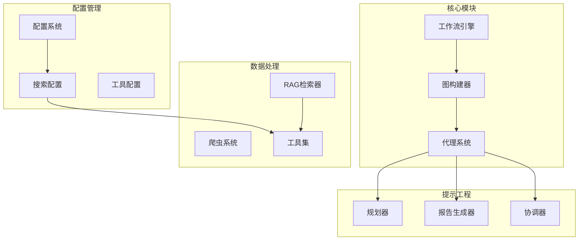
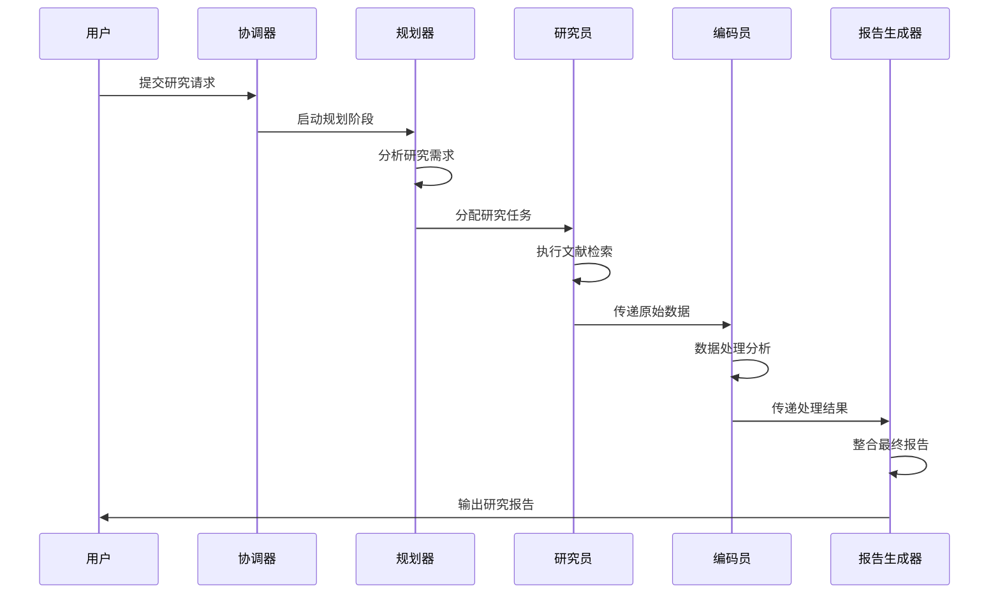
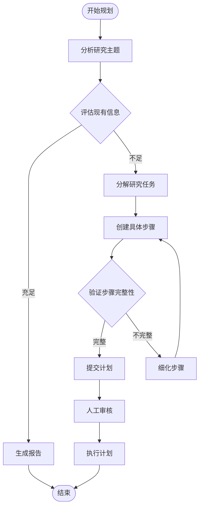
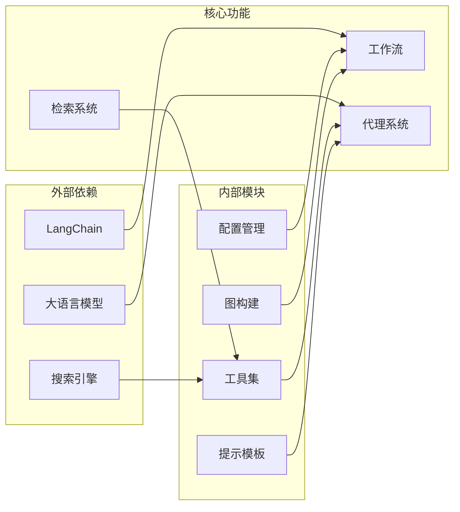

# AI医疗采用研究案例

<cite>
**本文档中引用的文件**
- [examples/AI_adoption_in_healthcare.md](file://examples/AI_adoption_in_healthcare.md)
- [src/config/configuration.py](file://src/config/configuration.py)
- [src/config/report_style.py](file://src/config/report_style.py)
- [src/workflow.py](file://src/workflow.py)
- [src/graph/builder.py](file://src/graph/builder.py)
- [src/graph/nodes.py](file://src/graph/nodes.py)
- [src/prompts/planner.md](file://src/prompts/planner.md)
- [src/prompts/reporter.md](file://src/prompts/reporter.md)
- [src/tools/search.py](file://src/tools/search.py)
- [src/rag/retriever.py](file://src/rag/retriever.py)
- [src/config/custom_search.py](file://src/config/custom_search.py)
- [tests/unit/tools/test_tavily_search_api_wrapper.py](file://tests/unit/tools/test_tavily_search_api_wrapper.py)
</cite>

## 目录
1. [简介](#简介)
2. [项目结构](#项目结构)
3. [核心组件](#核心组件)
4. [架构概览](#架构概览)
5. [详细组件分析](#详细组件分析)
6. [依赖关系分析](#依赖关系分析)
7. [性能考虑](#性能考虑)
8. [故障排除指南](#故障排除指南)
9. [结论](#结论)

## 简介

DeerFlow 是一个先进的 AI 驱动的研究平台，专门设计用于处理复杂的跨学科研究任务，特别是在医疗领域。该系统通过分解 AI 在医疗领域应用的多维度问题，包括技术可行性、伦理考量、成本效益分析和法规遵从性等方面，为医疗研究提供了全面的解决方案。

本研究案例重点展示了 DeerFlow 如何处理医疗领域的复杂研究问题，特别是 AI 在医疗采用方面的综合分析。系统采用了创新的代理协作模式，协调研究者代理、编码员代理和报告生成器代理的协作，确保高质量的研究输出。

## 项目结构

DeerFlow 采用模块化架构设计，主要包含以下核心模块：



**图表来源**
- [src/workflow.py](file://src/workflow.py#L1-L50)
- [src/graph/builder.py](file://src/graph/builder.py#L1-L40)
- [src/config/configuration.py](file://src/config/configuration.py#L1-L30)

**章节来源**
- [src/workflow.py](file://src/workflow.py#L1-L104)
- [src/graph/builder.py](file://src/graph/builder.py#L1-L88)

## 核心组件

### 配置管理系统

DeerFlow 的配置管理系统提供了灵活且可扩展的配置选项，支持多种研究场景的需求：

```python
@dataclass(kw_only=True)
class Configuration:
    """可配置字段"""
    resources: list[Resource] = field(default_factory=list)
    max_plan_iterations: int = 1
    max_step_num: int = 3
    max_search_results: int = 3
    search_engine: str = "tavily"
    custom_search_repository: Optional[str] = None
    mcp_settings: dict = None
    report_style: str = ReportStyle.ACADEMIC.value
    enable_deep_thinking: bool = False
```

### 搜索引擎集成

系统支持多种搜索引擎，包括 Tavily、DuckDuckGo、Brave Search 等，特别针对医疗研究需求进行了优化：

```python
def get_web_search_tool(max_search_results: int, engine: str = None, repository_id: str = None):
    """获取配置的搜索工具"""
    selected_engine = engine or SELECTED_SEARCH_ENGINE
    
    if selected_engine == SearchEngine.TAVILY.value:
        return LoggedTavilySearch(
            name="web_search",
            max_results=max_search_results,
            include_raw_content=True,
            include_images=True,
            include_image_descriptions=True,
            include_domains=include_domains,
            exclude_domains=exclude_domains,
        )
```

**章节来源**
- [src/config/configuration.py](file://src/config/configuration.py#L30-L71)
- [src/tools/search.py](file://src/tools/search.py#L40-L114)

## 架构概览

DeerFlow 采用基于状态图的工作流架构，通过智能代理协作完成复杂的医疗研究任务：



**图表来源**
- [src/graph/nodes.py](file://src/graph/nodes.py#L1-L100)
- [src/graph/builder.py](file://src/graph/builder.py#L20-L60)

## 详细组件分析

### 协调器节点

协调器是整个工作流的入口点，负责与用户沟通并确定研究方向：

```python
def coordinator_node(
    state: State, config: RunnableConfig
) -> Command[Literal["planner", "background_investigator", "__end__"]]:
    """协调器节点与客户沟通"""
    configurable = Configuration.from_runnable_config(config)
    messages = apply_prompt_template("coordinator", state)
    response = (
        get_llm_by_type(AGENT_LLM_MAP["coordinator"])
        .bind_tools([handoff_to_planner])
        .invoke(messages)
    )
    
    # 处理工具调用，确定下一步行动
    if len(response.tool_calls) > 0:
        goto = "planner"
        if state.get("enable_background_investigation"):
            goto = "background_investigator"
```

### 规划器节点

规划器负责制定详细的研究计划，确保覆盖所有关键方面：



**图表来源**
- [src/graph/nodes.py](file://src/graph/nodes.py#L80-L150)
- [src/prompts/planner.md](file://src/prompts/planner.md#L1-L50)

### 研究员节点

研究员节点专注于医疗领域的文献检索和数据分析：

```python
async def researcher_node(
    state: State, config: RunnableConfig
) -> Command[Literal["research_team"]]:
    """研究员节点进行研究"""
    configurable = Configuration.from_runnable_config(config)
    tools = [
        get_web_search_tool(configurable.max_search_results, configurable.search_engine, configurable.custom_search_repository), 
        crawl_tool
    ]
    retriever_tool = get_retriever_tool(state.get("resources", []))
    if retriever_tool:
        tools.insert(0, retriever_tool)
    
    return await _setup_and_execute_agent_step(
        state,
        config,
        "researcher",
        tools,
    )
```

### 报告生成器节点

报告生成器节点负责整合研究成果并生成符合学术标准的报告：

```python
def reporter_node(state: State, config: RunnableConfig):
    """报告生成器节点撰写最终报告"""
    configurable = Configuration.from_runnable_config(config)
    current_plan = state.get("current_plan")
    
    # 应用不同的报告风格模板
    if configurable.report_style == ReportStyle.ACADEMIC.value:
        template = "academic_report"
    elif configurable.report_style == ReportStyle.POPULAR_SCIENCE.value:
        template = "popular_science_report"
    
    invoke_messages = apply_prompt_template("reporter", input_, configurable)
    response = get_llm_by_type(AGENT_LLM_MAP["reporter"]).invoke(invoke_messages)
```

**章节来源**
- [src/graph/nodes.py](file://src/graph/nodes.py#L200-L300)
- [src/graph/nodes.py](file://src/graph/nodes.py#L350-L450)

## 依赖关系分析

DeerFlow 的依赖关系体现了其模块化设计的优势：



**图表来源**
- [src/config/configuration.py](file://src/config/configuration.py#L1-L20)
- [src/graph/builder.py](file://src/graph/builder.py#L1-L20)

**章节来源**
- [src/config/configuration.py](file://src/config/configuration.py#L1-L71)
- [src/graph/builder.py](file://src/graph/builder.py#L1-L88)

## 性能考虑

DeerFlow 在设计时充分考虑了性能优化：

### 并发处理能力

系统支持异步处理，能够同时运行多个代理节点：

```python
async def run_agent_workflow_async(
    user_input: str,
    debug: bool = False,
    max_plan_iterations: int = 1,
    max_step_num: int = 3,
    enable_background_investigation: bool = True,
):
    """异步运行代理工作流"""
    async for s in graph.astream(
        input=initial_state, config=config, stream_mode="values"
    ):
        # 流式处理结果
        if isinstance(s, dict) and "messages" in s:
            message = s["messages"][-1]
            message.pretty_print()
```

### 资源管理

系统实现了智能的资源分配和回收机制：

```python
def get_recursion_limit(default: int = 25) -> int:
    """从环境变量获取递归限制"""
    env_value_str = get_str_env("AGENT_RECURSION_LIMIT", str(default))
    parsed_limit = get_int_env("AGENT_RECURSION_LIMIT", default)
    
    if parsed_limit > 0:
        logger.info(f"递归限制设置为: {parsed_limit}")
        return parsed_limit
    else:
        logger.warning(f"AGENT_RECURSION_LIMIT 值无效，使用默认值 {default}")
        return default
```

## 故障排除指南

### 常见问题及解决方案

1. **搜索结果质量问题**
   - 检查搜索引擎配置
   - 验证 API 密钥有效性
   - 调整搜索参数

2. **代理协作失败**
   - 检查 LLM 配置
   - 验证工具权限
   - 查看日志错误信息

3. **内存使用过高**
   - 调整递归限制
   - 优化搜索结果数量
   - 清理临时文件

**章节来源**
- [src/graph/nodes.py](file://src/graph/nodes.py#L450-L512)
- [src/config/configuration.py](file://src/config/configuration.py#L15-L30)

## 结论

DeerFlow 系统通过其创新的代理协作架构和全面的功能设计，在 AI 医疗采用研究领域展现了强大的能力。系统不仅能够处理复杂的多维度研究问题，还通过严格的质量控制和多样化的输出格式满足不同用户的需求。

该系统的核心优势在于：
- **模块化设计**：清晰的组件分离便于维护和扩展
- **智能协作**：多代理协同工作提高研究效率
- **灵活配置**：支持多种研究场景和输出格式
- **质量保证**：多层次的质量控制确保输出可靠性

未来的发展方向包括：
- 增强医疗领域的专业知识库
- 优化隐私保护和数据安全机制
- 扩展更多专业的医疗研究工具
- 改进用户体验和界面设计

通过持续的技术创新和功能完善，DeerFlow 将继续在 AI 医疗研究领域发挥重要作用，为医疗行业的数字化转型提供强有力的支持。