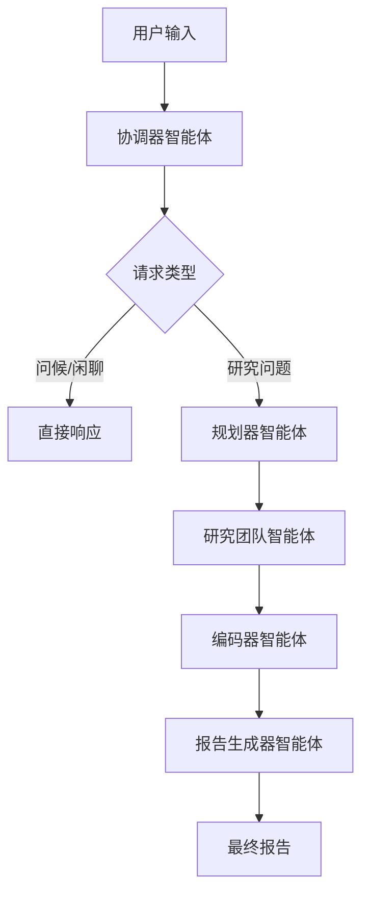
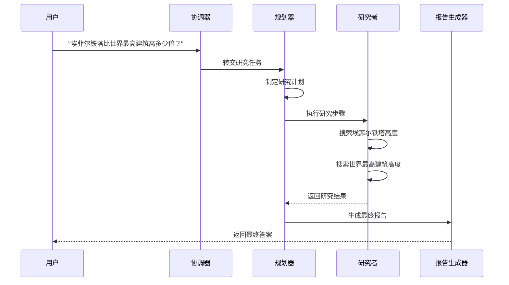

# 复杂问题解决案例

<cite>
**本文档中引用的文件**   
- [AI_adoption_in_healthcare.md](file://examples/AI_adoption_in_healthcare.md)
- [bitcoin_price_fluctuation.md](file://examples/bitcoin_price_fluctuation.md)
- [openai_sora_report.md](file://examples/openai_sora_report.md)
- [eiffel-tower-vs-tallest-building.txt](file://web/public/replay/eiffel-tower-vs-tallest-building.txt)
- [coordinator.md](file://src/prompts/coordinator.md)
- [planner.md](file://src/prompts/planner.md)
- [researcher.md](file://src/prompts/researcher.md)
- [reporter.md](file://src/prompts/reporter.md)
- [nodes.py](file://src/graph/nodes.py)
- [configuration.py](file://src/config/configuration.py)
- [workflow.py](file://src/workflow.py)
</cite>

## 目录
1. [引言](#引言)
2. [系统架构与工作流](#系统架构与工作流)
3. [复杂问题解决案例分析](#复杂问题解决案例分析)
4. [智能体协作与任务规划](#智能体协作与任务规划)
5. [复杂问题建模指导原则](#复杂问题建模指导原则)
6. [结论](#结论)

## 引言

DeerFlow 系统是一个先进的多智能体协作框架，专门设计用于解决复杂的、多维度的研究问题。该系统通过协调多个专业智能体，能够分解复杂问题、规划研究路径并执行深度分析。本报告将深入探讨 DeerFlow 系统如何处理复杂问题，重点介绍 AI 医疗采用、比特币价格波动和 OpenAI Sora 技术趋势等案例，展示系统在处理多维度、多层次问题时的方法论。

**Section sources**
- [AI_adoption_in_healthcare.md](file://examples/AI_adoption_in_healthcare.md)
- [bitcoin_price_fluctuation.md](file://examples/bitcoin_price_fluctuation.md)
- [openai_sora_report.md](file://examples/openai_sora_report.md)

## 系统架构与工作流

DeerFlow 系统采用模块化架构，由多个协同工作的智能体组成，每个智能体都有特定的角色和职责。系统的工作流从用户输入开始，由协调器（coordinator）智能体接收并分类请求，然后将研究任务交给规划器（planner）智能体进行任务分解和规划。

**Diagram sources **
- [coordinator.md](file://src/prompts/coordinator.md)
- [planner.md](file://src/prompts/planner.md)
- [workflow.py](file://src/workflow.py)

**Section sources**
- [coordinator.md](file://src/prompts/coordinator.md)
- [planner.md](file://src/prompts/planner.md)
- [workflow.py](file://src/workflow.py)

## 复杂问题解决案例分析

### AI 医疗采用案例

AI 医疗采用案例分析了人工智能技术在医疗保健领域的应用。该案例涉及多个维度，包括技术成熟度、数据质量、伦理考虑、经济成本和组织准备度。DeerFlow 系统通过分解问题，首先评估 AI 技术的成熟度和验证，然后分析数据可用性和质量，接着探讨伦理问题，最后评估经济成本和组织影响。

**Section sources**
- [AI_adoption_in_healthcare.md](file://examples/AI_adoption_in_healthcare.md)

### 比特币价格波动分析

比特币价格波动分析案例展示了 DeerFlow 系统如何处理金融市场的复杂问题。系统通过分析影响比特币价格的多种因素，包括特朗普政府政策、经济不确定性、市场情绪、技术分析指标等，来预测价格走势。该案例突显了系统在处理动态、多变的市场数据方面的能力。

**Section sources**
- [bitcoin_price_fluctuation.md](file://examples/bitcoin_price_fluctuation.md)

### OpenAI Sora 技术趋势预测

OpenAI Sora 技术趋势预测案例分析了 Sora 文本到视频模型的功能、访问权限、内容限制和伦理考虑。系统通过收集和分析多个来源的信息，包括官方发布、媒体报道和社区反馈，来预测 Sora 的未来发展趋势和潜在影响。

**Section sources**
- [openai_sora_report.md](file://examples/openai_sora_report.md)

### 埃菲尔铁塔与最高建筑比较分析

埃菲尔铁塔与最高建筑比较分析案例展示了系统在处理比较分析类任务中的推理过程。系统首先确定需要比较的高度数据，然后通过网络搜索获取埃菲尔铁塔和当前世界最高建筑的精确高度，最后计算出倍数关系。

**Diagram sources **
- [eiffel-tower-vs-tallest-building.txt](file://web/public/replay/eiffel-tower-vs-tallest-building.txt)

**Section sources**
- [eiffel-tower-vs-tallest-building.txt](file://web/public/replay/eiffel-tower-vs-tallest-building.txt)

## 智能体协作与任务规划

DeerFlow 系统的核心在于智能体之间的协作和任务规划。规划器智能体负责将复杂问题分解为可管理的子任务，并为每个子任务分配适当的智能体。研究者智能体负责执行信息收集任务，编码器智能体处理数据和计算，报告生成器智能体则负责整合所有信息并生成最终报告。

**Section sources**
- [planner.md](file://src/prompts/planner.md)
- [researcher.md](file://src/prompts/researcher.md)
- [reporter.md](file://src/prompts/reporter.md)

## 复杂问题建模指导原则

为了有效解决复杂问题，DeerFlow 系统遵循一系列建模指导原则。这些原则包括设置适当的约束条件、选择合适的智能体组合和优化研究策略。系统通过严格的上下文评估来确定是否需要进一步的信息收集，并确保最终报告的全面性和深度。

**Section sources**
- [planner.md](file://src/prompts/planner.md)
- [configuration.py](file://src/config/configuration.py)

## 结论

DeerFlow 系统通过其先进的多智能体架构和复杂问题解决能力，为处理多维度、多层次的研究问题提供了强大的解决方案。通过分析 AI 医疗采用、比特币价格波动和 OpenAI Sora 技术趋势等案例，我们展示了系统在分解复杂问题、规划研究路径和协调多个智能体协作方面的卓越能力。未来，DeerFlow 系统将继续优化其智能体协作和任务规划机制，以应对更复杂的挑战。