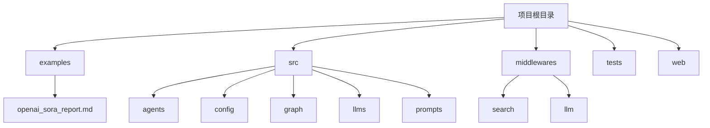
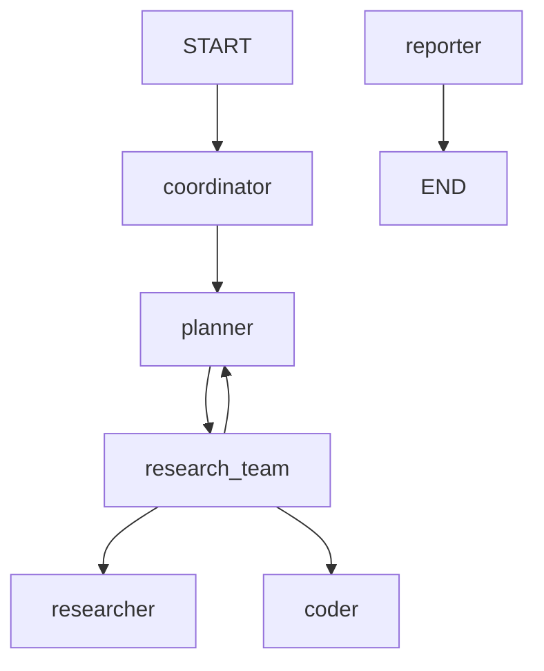
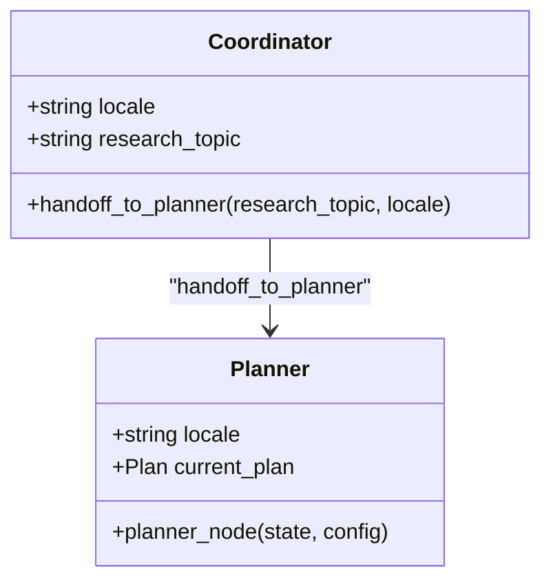
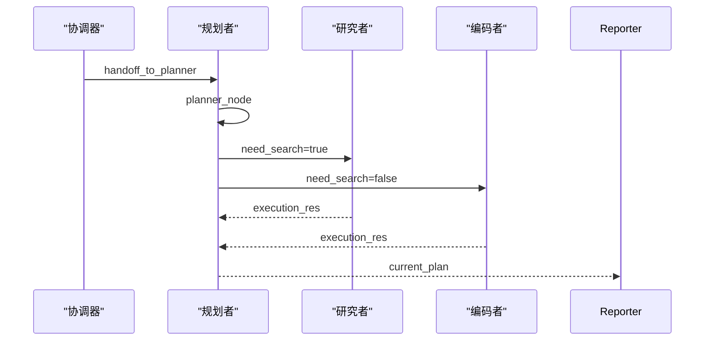
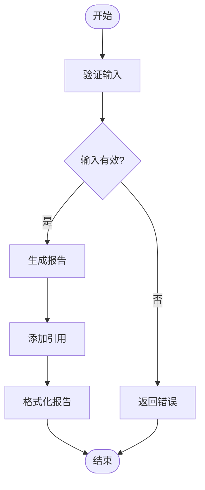
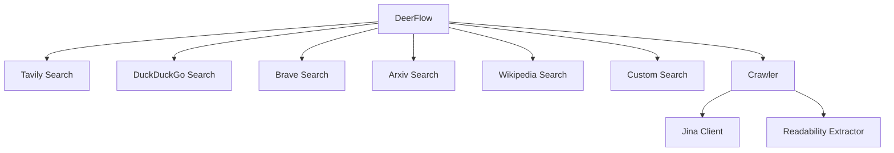

# 技术趋势预测案例

<cite>
**本文档中引用的文件**  
- [openai_sora_report.md](file://examples/openai_sora_report.md)
- [configuration.py](file://src/config/configuration.py)
- [report_style.py](file://src/config/report_style.py)
- [questions.py](file://src/config/questions.py)
- [workflow.py](file://src/workflow.py)
- [builder.py](file://src/graph/builder.py)
- [nodes.py](file://src/graph/nodes.py)
- [planner_model.py](file://src/prompts/planner_model.py)
- [planner.md](file://src/prompts/planner.md)
- [reporter.md](file://src/prompts/reporter.md)
- [search.py](file://src/tools/search.py)
- [custom_search.py](file://src/config/custom_search.py)
- [crawl.py](file://src/tools/crawl.py)
- [crawler.py](file://src/crawler/crawler.py)
</cite>

## 目录
1. [引言](#引言)
2. [项目结构](#项目结构)
3. [核心组件](#核心组件)
4. [架构概述](#架构概述)
5. [详细组件分析](#详细组件分析)
6. [依赖分析](#依赖分析)
7. [性能考虑](#性能考虑)
8. [故障排除指南](#故障排除指南)
9. [结论](#结论)

## 引言
DeerFlow 系统是一个先进的技术趋势预测平台，专门设计用于分析和预测前沿技术的发展方向。本案例以 OpenAI Sora 技术分析为例，详细展示了系统如何评估生成式 AI 视频模型的技术突破、潜在应用场景和市场影响。通过整合学术论文、专利数据和行业报告，DeerFlow 能够进行综合判断，并在处理快速演进的技术领域时实施知识更新机制和专家验证流程。本文档将深入探讨技术趋势预测的建模方法，包括如何识别关键技术指标、评估技术成熟度曲线和预测商业化时间表。

## 项目结构
DeerFlow 项目的结构清晰地分为多个主要目录，每个目录负责不同的功能模块。`examples` 目录包含各种示例报告，如 `openai_sora_report.md`，这些报告展示了系统生成的技术趋势分析。`src` 目录是核心源代码所在，包含了 `agents`、`config`、`graph`、`llms`、`prompts` 等子模块，分别负责代理、配置、图构建、语言模型和提示模板等功能。`middlewares` 目录则包含了搜索和 LLM 相关的中间件，支持系统的外部数据获取和处理能力。

**图源**  
- [openai_sora_report.md](file://examples/openai_sora_report.md)
- [configuration.py](file://src/config/configuration.py)

**本节来源**  
- [openai_sora_report.md](file://examples/openai_sora_report.md)
- [configuration.py](file://src/config/configuration.py)

## 核心组件
DeerFlow 系统的核心组件包括配置管理、工作流引擎、图构建器和节点处理器。`configuration.py` 文件定义了系统的可配置字段，如资源列表、最大计划迭代次数、最大步骤数等，确保系统可以根据不同需求进行灵活调整。`workflow.py` 文件是系统的工作流引擎，负责异步运行代理工作流，处理用户输入并生成最终状态。`builder.py` 和 `nodes.py` 文件共同构建了系统的图结构和节点逻辑，实现了从协调器到规划者、研究者、编码者和报告者的完整工作流。

**本节来源**  
- [configuration.py](file://src/config/configuration.py)
- [workflow.py](file://src/workflow.py)
- [builder.py](file://src/graph/builder.py)
- [nodes.py](file://src/graph/nodes.py)

## 架构概述
DeerFlow 系统的架构基于一个复杂的图结构，通过多个节点和边的连接实现高效的信息处理和决策制定。系统从 `START` 节点开始，经过 `coordinator` 节点与用户交互，然后进入 `planner` 节点生成详细的计划。计划生成后，系统会根据计划的类型和需求，分别调用 `researcher`、`coder` 或 `reporter` 节点进行具体任务的执行。最终，`reporter` 节点生成详细的报告并返回给用户。

**图源**  
- [builder.py](file://src/graph/builder.py)
- [nodes.py](file://src/graph/nodes.py)

## 详细组件分析
### 协调器分析
协调器节点负责与用户进行初步交互，确定用户的需求并将其传递给规划者节点。协调器通过 `handoff_to_planner` 工具将任务交给规划者，确保后续的详细计划生成和信息收集工作能够顺利进行。

#### 对象导向组件

**图源**  
- [nodes.py](file://src/graph/nodes.py)
- [planner_model.py](file://src/prompts/planner_model.py)

### 规划者分析
规划者节点负责生成详细的计划，包括研究步骤和处理步骤。规划者通过 `planner_node` 函数生成计划，并根据计划的类型和需求调用相应的工具进行信息收集和数据处理。

#### API/服务组件

**图源**  
- [nodes.py](file://src/graph/nodes.py)
- [planner_model.py](file://src/prompts/planner_model.py)

### 报告者分析
报告者节点负责生成最终的报告，整合所有收集到的信息和分析结果。报告者通过 `reporter_node` 函数生成报告，并确保报告的结构和内容符合预定的格式和标准。

#### 复杂逻辑组件

**图源**  
- [nodes.py](file://src/graph/nodes.py)
- [reporter.md](file://src/prompts/reporter.md)

**本节来源**  
- [nodes.py](file://src/graph/nodes.py)
- [planner_model.py](file://src/prompts/planner_model.py)
- [reporter.md](file://src/prompts/reporter.md)

## 依赖分析
DeerFlow 系统的依赖关系复杂，涉及多个外部工具和库。`search.py` 文件定义了多种搜索工具，如 Tavily、DuckDuckGo、Brave Search 等，支持系统从不同来源获取信息。`custom_search.py` 文件则提供了自定义搜索引擎的配置管理，允许系统根据需要选择不同的搜索服务。`crawl.py` 文件和 `crawler.py` 文件共同实现了网页爬取功能，确保系统能够从指定 URL 获取可读的内容。

**图源**  
- [search.py](file://src/tools/search.py)
- [custom_search.py](file://src/config/custom_search.py)
- [crawl.py](file://src/tools/crawl.py)
- [crawler.py](file://src/crawler/crawler.py)

**本节来源**  
- [search.py](file://src/tools/search.py)
- [custom_search.py](file://src/config/custom_search.py)
- [crawl.py](file://src/tools/crawl.py)
- [crawler.py](file://src/crawler/crawler.py)

## 性能考虑
在处理大规模数据和复杂任务时，DeerFlow 系统需要考虑性能优化。系统通过异步工作流和递归限制来管理资源使用，确保在高负载情况下仍能稳定运行。此外，系统还支持调试日志记录，帮助开发者监控和优化系统性能。

## 故障排除指南
当系统遇到问题时，可以通过查看日志文件和调试信息来诊断和解决问题。`nodes.py` 文件中的日志记录功能可以帮助开发者了解每个节点的执行情况，及时发现和修复问题。此外，系统还提供了详细的错误处理机制，确保在出现异常时能够优雅地恢复。

**本节来源**  
- [nodes.py](file://src/graph/nodes.py)
- [workflow.py](file://src/workflow.py)

## 结论
DeerFlow 系统通过其先进的架构和丰富的功能，为技术趋势预测提供了一个强大的平台。通过对 OpenAI Sora 技术的分析，我们展示了系统如何整合多种数据源，生成详细的报告，并在处理快速演进的技术领域时保持知识的更新和验证。未来，DeerFlow 有望在更多领域发挥重要作用，推动技术创新和发展。