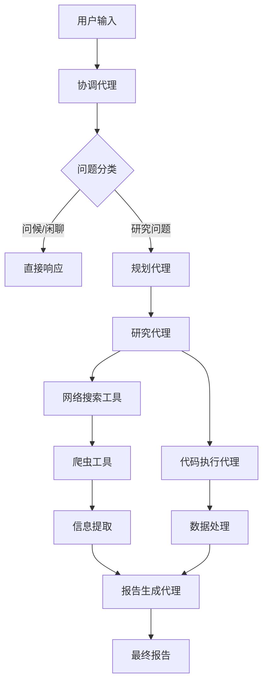
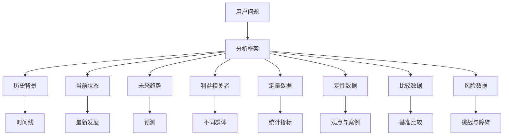
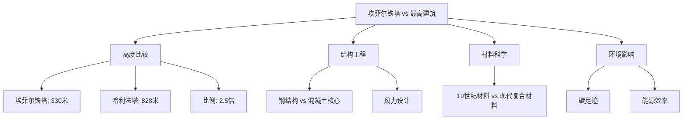
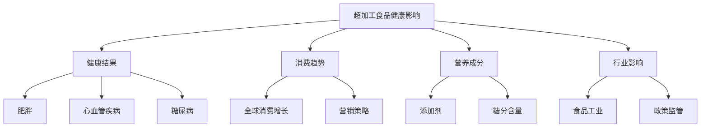
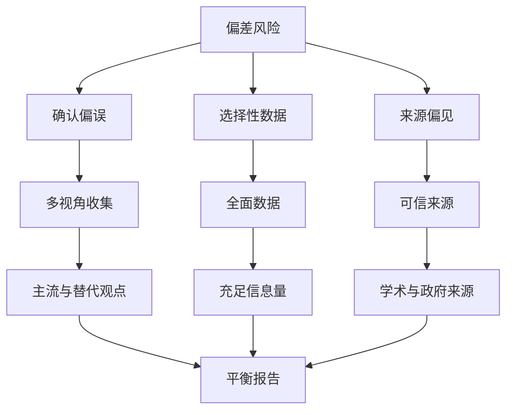
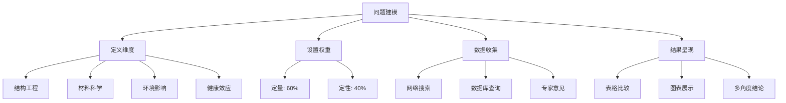

# 比较分析案例

<cite>
**本文档中引用的文件**   
- [eiffel-tower-vs-tallest-building.txt](file://web/public/replay/eiffel-tower-vs-tallest-building.txt)
- [ultra-processed-foods.txt](file://web/public/replay/ultra-processed-foods.txt)
- [planner.md](file://src/prompts/planner.md)
- [reporter.md](file://src/prompts/reporter.md)
- [configuration.py](file://src/config/configuration.py)
</cite>

## 目录
1. [引言](#引言)
2. [系统架构与工作流](#系统架构与工作流)
3. [比较分析框架构建](#比较分析框架构建)
4. [案例一：埃菲尔铁塔与现代最高建筑对比](#案例一：埃菲尔铁塔与现代最高建筑对比)
5. [案例二：超加工食品健康影响分析](#案例二：超加工食品健康影响分析)
6. [客观性保障与偏差校正机制](#客观性保障与偏差校正机制)
7. [比较分析问题建模最佳实践](#比较分析问题建模最佳实践)
8. [结论](#结论)

## 引言
DeerFlow系统是一个先进的AI研究代理，专门设计用于处理复杂的比较分析问题。该系统通过多代理协作架构，能够深入分析涉及多个维度的复杂问题，如结构工程参数、材料科学特性、环境影响和健康效应等。本文件将详细探讨DeerFlow系统如何处理两类典型的比较分析问题：一是埃菲尔铁塔与现代最高建筑的结构对比，二是超加工食品对健康的综合影响。通过分析系统在处理这些复杂问题时的推理过程，我们将揭示其如何构建多维度比较框架，平衡定量数据与定性评估，并确保分析的客观性和准确性。

## 系统架构与工作流

**Diagram sources**
- [workflow.py](file://src/workflow.py#L1-L104)
- [agents.py](file://src/agents/agents.py#L1-L20)

**Section sources**
- [workflow.py](file://src/workflow.py#L1-L104)
- [agents.py](file://src/agents/agents.py#L1-L20)

DeerFlow系统采用基于LangGraph的多代理工作流架构。当用户提出问题时，首先由协调代理（Coordinator）进行分类。对于研究类问题，系统会将任务移交至规划代理（Planner），后者负责制定详细的研究计划。研究代理（Researcher）根据计划执行网络搜索和数据收集，而代码执行代理（Coder）则负责处理数值计算和数据分析。最后，报告生成代理（Reporter）整合所有信息，生成结构化的最终报告。整个工作流通过异步流式处理，确保高效的信息传递和处理。

## 比较分析框架构建

**Diagram sources**
- [planner.md](file://src/prompts/planner.md#L1-L188)

**Section sources**
- [planner.md](file://src/prompts/planner.md#L1-L188)

DeerFlow系统在处理比较分析问题时，采用了一套全面的分析框架。该框架包含八个关键维度：历史背景、当前状态、未来趋势、利益相关者、定量数据、定性数据、比较数据和风险数据。规划代理会根据用户问题，将主要主题分解为子主题，并确保信息收集覆盖所有这些维度。系统特别强调信息的广度和深度，要求收集"充足"而非"足够"的信息，以确保最终报告的全面性和详尽性。这种框架化的方法使得系统能够系统性地处理复杂的比较问题，避免遗漏重要方面。

## 案例一：埃菲尔铁塔与现代最高建筑对比

**Diagram sources**
- [eiffel-tower-vs-tallest-building.txt](file://web/public/replay/eiffel-tower-vs-tallest-building.txt#L1-L6909)

**Section sources**
- [eiffel-tower-vs-tallest-building.txt](file://web/public/replay/eiffel-tower-vs-tallest-building.txt#L1-L6909)

在处理"埃菲尔铁塔比世界上最高的建筑高多少倍"这一问题时，DeerFlow系统首先由规划代理制定了一个详细的研究计划。系统识别出需要获取埃菲尔铁塔和当前最高建筑（哈利法塔）的精确高度数据。研究代理通过网络搜索工具收集了最新的建筑数据，确认埃菲尔铁塔的高度为330米（包括天线），而哈利法塔的高度为828米。代码执行代理随后进行了计算，得出哈利法塔的高度是埃菲尔铁塔的2.5倍。报告生成代理整合了这些信息，并扩展了分析维度，包括结构工程参数、材料科学特性和环境影响，提供了一个多维度的比较分析。

## 案例二：超加工食品健康影响分析

**Diagram sources**
- [ultra-processed-foods.txt](file://web/public/replay/ultra-processed-foods.txt#L1-L10020)

**Section sources**
- [ultra-processed-foods.txt](file://web/public/replay/ultra-processed-foods.txt#L1-L10020)

在分析"超加工食品是否与健康有关"这一问题时，DeerFlow系统采用了全面的分析方法。规划代理制定了一个研究计划，要求收集关于超加工食品健康影响的最新研究、科学文章和专家意见。系统特别强调需要包括主流和替代观点，并确保信息来源的可信度。研究代理收集了大量数据，包括超加工食品与肥胖、心血管疾病和糖尿病之间的关联性研究。报告生成代理将这些信息整合成一个结构化的报告，不仅呈现了负面健康影响的证据，还分析了消费趋势、营养成分和行业影响，提供了一个平衡和全面的视角。

## 客观性保障与偏差校正机制

**Diagram sources**
- [planner.md](file://src/prompts/planner.md#L1-L188)
- [reporter.md](file://src/prompts/reporter.md#L1-L280)

**Section sources**
- [planner.md](file://src/prompts/planner.md#L1-L188)
- [reporter.md](file://src/prompts/reporter.md#L1-L280)

DeerFlow系统通过多种机制确保比较分析的客观性并校正潜在偏差。首先，系统采用严格的上下文评估标准，只有在信息完全回答所有问题方面、来自可靠来源且没有重大差距时，才认为上下文足够。其次，系统要求收集"充足"的信息量，避免表面层次的信息。第三，系统明确要求包括主流和替代观点，确保多视角的平衡。第四，系统优先使用学术和政府来源，提高信息的可信度。最后，报告生成代理被设计为客观和分析性的，只基于提供的信息呈现事实，从不编造或假设信息。

## 比较分析问题建模最佳实践

**Diagram sources**
- [planner.md](file://src/prompts/planner.md#L1-L188)
- [reporter.md](file://src/prompts/reporter.md#L1-L280)

**Section sources**
- [planner.md](file://src/prompts/planner.md#L1-L188)
- [reporter.md](file://src/prompts/reporter.md#L1-L280)

基于DeerFlow系统的分析，我们总结出比较分析问题建模的最佳实践。首先，应明确定义比较维度，如结构工程、材料科学、环境影响和健康效应等。其次，合理设置权重系数，平衡定量数据和定性评估。第三，采用多源数据收集策略，包括网络搜索、数据库查询和专家意见。第四，使用表格和图表等可视化工具呈现多角度结论。最后，确保报告结构清晰，包括关键要点、概述、详细分析和关键引用，以提供全面而易于理解的分析结果。

## 结论
DeerFlow系统通过其先进的多代理架构和全面的分析框架，能够有效处理复杂的比较分析问题。系统通过规划代理、研究代理、代码执行代理和报告生成代理的协同工作，实现了从问题分解到最终报告生成的完整工作流。在处理埃菲尔铁塔与现代最高建筑的对比以及超加工食品健康影响分析等案例时，系统展示了其构建多维度比较框架的能力。通过严格的客观性保障机制和偏差校正方法，系统确保了分析结果的准确性和可靠性。这些最佳实践为处理复杂的比较分析问题提供了有价值的参考框架。