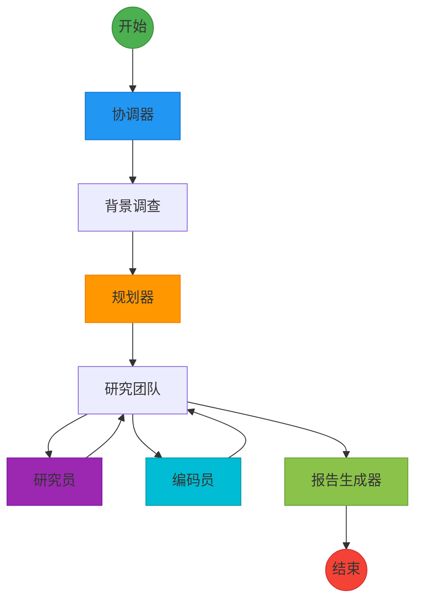
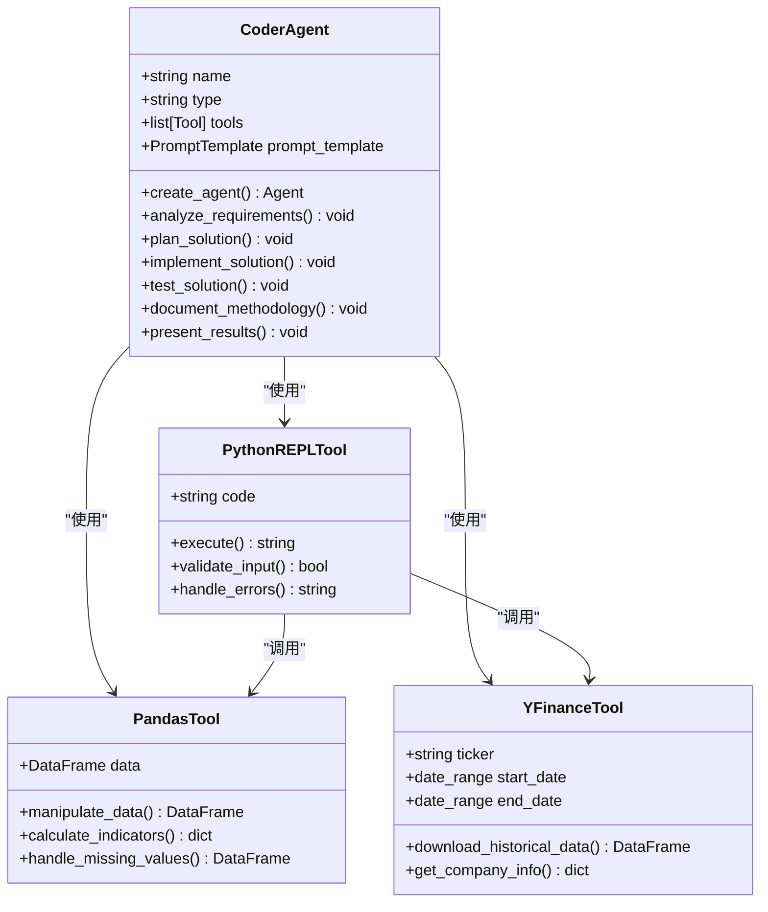
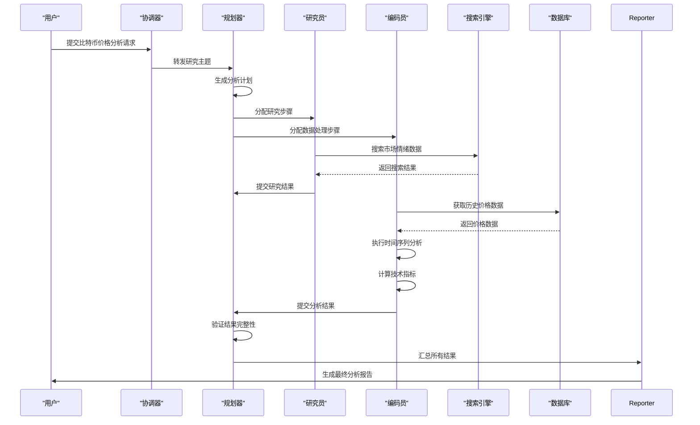
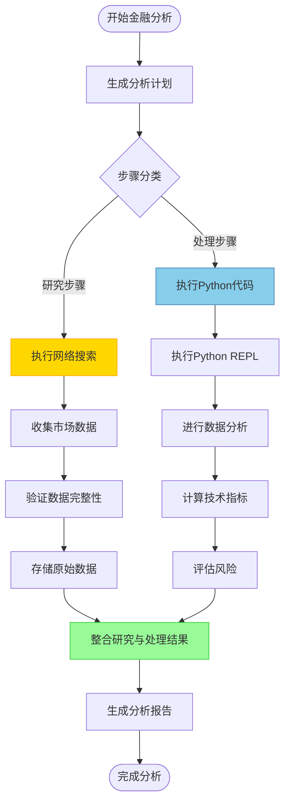
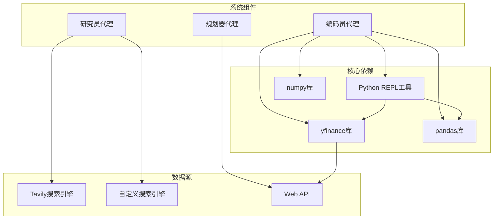

# 金融市场波动分析案例

<cite>
**本文档引用的文件**   
- [bitcoin_price_fluctuation.md](file://examples/bitcoin_price_fluctuation.md)
- [coder.md](file://src/prompts/coder.md)
- [python_repl.py](file://src/tools/python_repl.py)
- [agents.py](file://src/agents/agents.py)
- [agents.py](file://src/config/agents.py)
- [configuration.py](file://src/config/configuration.py)
- [builder.py](file://src/graph/builder.py)
- [nodes.py](file://src/graph/nodes.py)
- [tools.py](file://src/config/tools.py)
- [tavily_search_api_wrapper.py](file://src/tools/tavily_search/tavily_search_api_wrapper.py)
</cite>

## 目录
1. [引言](#引言)
2. [项目结构](#项目结构)
3. [核心组件](#核心组件)
4. [架构概述](#架构概述)
5. [详细组件分析](#详细组件分析)
6. [依赖分析](#依赖分析)
7. [性能考虑](#性能考虑)
8. [故障排除指南](#故障排除指南)
9. [结论](#结论)

## 引言

本文档深入分析DeerFlow系统在比特币价格波动分析案例中的应用，重点阐述系统如何处理金融市场的复杂动态问题。文档详细描述了系统如何分解影响比特币价格的多重因素，包括宏观经济指标、市场情绪、技术分析和监管政策等。通过分析bitcoin_price_fluctuation.md中的量化研究过程，展示系统如何利用编码员代理进行时间序列分析、风险评估和预测建模。同时，说明系统在处理金融市场数据时的实时性要求和数据验证机制，并提供金融分析问题建模的指导原则。

## 项目结构

DeerFlow项目的结构清晰地分为多个核心模块，每个模块负责特定的功能。系统采用模块化设计，将代理、配置、爬虫、图表、大语言模型、播客、PPT生成、提示增强、提示模板、散文生成、RAG（检索增强生成）、服务器、工具、实用工具和工作流等组件分离，确保了系统的可维护性和可扩展性。

```mermaid
graph TD
subgraph "核心模块"
agents["代理模块"]
config["配置模块"]
crawler["爬虫模块"]
graph["图表模块"]
llms["大语言模型模块"]
podcast["播客模块"]
ppt["PPT模块"]
prompt_enhancer["提示增强模块"]
prose["散文模块"]
rag["RAG模块"]
server["服务器模块"]
tools["工具模块"]
utils["实用工具模块"]
workflow["工作流模块"]
end
subgraph "示例与中间件"
examples["示例文件"]
middlewares["中间件"]
end
subgraph "Web界面"
web["Web应用"]
end
agents --> server
config --> server
tools --> server
llms --> server
rag --> server
graph --> server
web --> server
examples --> server
middlewares --> server
```

**Diagram sources**
- [src/agents/agents.py](file://src/agents/agents.py)
- [src/config/agents.py](file://src/config/agents.py)
- [src/tools/python_repl.py](file://src/tools/python_repl.py)

**Section sources**
- [examples/bitcoin_price_fluctuation.md](file://examples/bitcoin_price_fluctuation.md)
- [src/agents/agents.py](file://src/agents/agents.py)

## 核心组件

DeerFlow系统的核心组件包括协调器、规划器、研究员、编码员和报告生成器等代理。这些代理协同工作，形成一个完整的金融分析工作流。编码员代理在金融分析中扮演关键角色，它使用Python进行数据处理和分析，特别是利用yfinance库获取金融市场的历史数据。系统通过规划器代理将复杂的金融分析任务分解为研究步骤和数据处理步骤，确保分析过程的系统性和完整性。

**Section sources**
- [src/agents/agents.py](file://src/agents/agents.py#L1-L20)
- [src/prompts/coder.md](file://src/prompts/coder.md#L1-L35)
- [src/config/agents.py](file://src/config/agents.py#L1-L21)

## 架构概述

DeerFlow系统采用基于LangGraph的状态图架构，实现了复杂的多代理协作流程。系统从协调器开始，经过规划器生成研究计划，然后由研究员和编码员代理执行具体任务，最终由报告生成器汇总结果。这种架构支持条件分支和循环，能够处理复杂的金融分析任务。



**Diagram sources**
- [src/graph/builder.py](file://src/graph/builder.py#L1-L88)
- [src/graph/nodes.py](file://src/graph/nodes.py#L1-L200)

**Section sources**
- [src/graph/builder.py](file://src/graph/builder.py#L1-L88)
- [src/graph/nodes.py](file://src/graph/nodes.py#L1-L200)

## 详细组件分析

### 编码员代理分析

编码员代理是DeerFlow系统中负责金融数据分析的核心组件。该代理被设计为专业的软件工程师，能够使用Python进行高效的数据分析和算法实现。在比特币价格波动分析中，编码员代理利用yfinance库获取历史市场数据，并使用pandas和numpy进行数据处理和计算。

#### 编码员代理类图


**Diagram sources**
- [src/agents/agents.py](file://src/agents/agents.py#L1-L20)
- [src/prompts/coder.md](file://src/prompts/coder.md#L1-L35)
- [src/tools/python_repl.py](file://src/tools/python_repl.py#L1-L64)

### 金融数据分析流程

DeerFlow系统处理金融数据分析的流程是一个复杂的多步骤过程，涉及多个代理的协作。系统首先通过规划器代理将金融分析任务分解为研究步骤和数据处理步骤，然后由相应的代理执行这些步骤。

#### 金融数据分析序列图


**Diagram sources**
- [src/graph/nodes.py](file://src/graph/nodes.py#L1-L200)
- [src/tools/tavily_search/tavily_search_api_wrapper.py](file://src/tools/tavily_search/tavily_search_api_wrapper.py#L1-L114)
- [src/tools/python_repl.py](file://src/tools/python_repl.py#L1-L64)

### 金融数据处理逻辑

DeerFlow系统在处理金融数据时采用严谨的逻辑流程，确保分析结果的准确性和可靠性。系统将研究步骤和数据处理步骤明确分离，遵循"研究步骤仅收集数据，处理步骤负责计算"的原则。

#### 金融数据处理流程图


**Diagram sources**
- [src/prompts/planner.md](file://src/prompts/planner.md#L1-L81)
- [src/tools/python_repl.py](file://src/tools/python_repl.py#L1-L64)
- [src/graph/nodes.py](file://src/graph/nodes.py#L1-L200)

**Section sources**
- [src/prompts/planner.md](file://src/prompts/planner.md#L1-L81)
- [src/tools/python_repl.py](file://src/tools/python_repl.py#L1-L64)
- [src/graph/nodes.py](file://src/graph/nodes.py#L1-L200)

## 依赖分析

DeerFlow系统的金融分析功能依赖于多个关键组件和外部服务。系统通过清晰的依赖关系管理，确保了各组件之间的松耦合和高内聚。



**Diagram sources**
- [src/config/tools.py](file://src/config/tools.py#L1-L32)
- [src/tools/python_repl.py](file://src/tools/python_repl.py#L1-L64)
- [src/tools/tavily_search/tavily_search_api_wrapper.py](file://src/tools/tavily_search/tavily_search_api_wrapper.py#L1-L114)

**Section sources**
- [src/config/tools.py](file://src/config/tools.py#L1-L32)
- [src/tools/python_repl.py](file://src/tools/python_repl.py#L1-L64)

## 性能考虑

DeerFlow系统在处理金融市场数据时，充分考虑了实时性和数据验证的需求。系统通过异步处理和缓存机制优化性能，确保能够及时响应市场变化。Python REPL工具的执行受到环境变量的控制，可以在生产环境中禁用以提高安全性。系统还实现了递归限制和最大计划迭代次数等配置，防止无限循环和资源耗尽。

## 故障排除指南

当DeerFlow系统在金融分析过程中遇到问题时，可以通过以下步骤进行排查。首先检查Python REPL工具是否已启用，环境变量ENABLE_PYTHON_REPL应设置为true。其次，验证Tavily搜索API密钥是否正确配置。对于数据处理错误，检查yfinance库是否能够正常访问金融数据源。系统日志记录了详细的执行过程，可用于诊断问题。

**Section sources**
- [src/tools/python_repl.py](file://src/tools/python_repl.py#L1-L64)
- [src/config/configuration.py](file://src/config/configuration.py#L1-L71)

## 结论

DeerFlow系统通过多代理协作架构，为比特币价格波动分析等复杂金融问题提供了系统化的解决方案。系统将影响比特币价格的多重因素分解为可管理的研究和处理步骤，利用编码员代理进行专业的量化分析。通过yfinance等金融数据工具，系统能够获取实时市场数据并进行深入分析。DeerFlow的模块化设计和清晰的职责分离，使其成为处理金融市场复杂动态问题的强大工具，为金融分析提供了可扩展、可验证的自动化解决方案。
