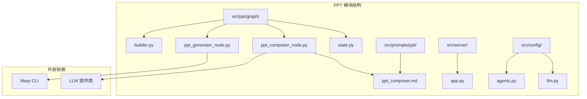
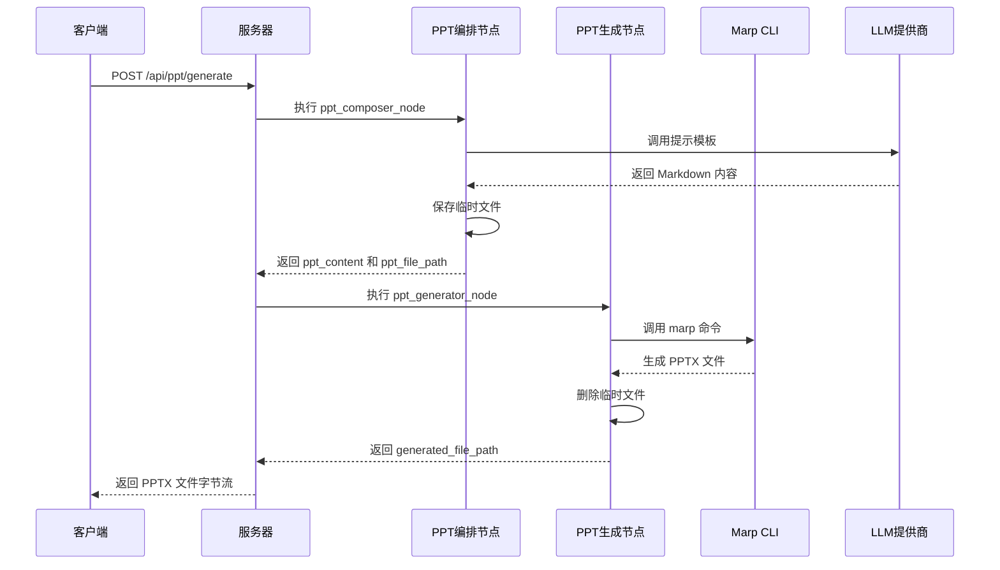
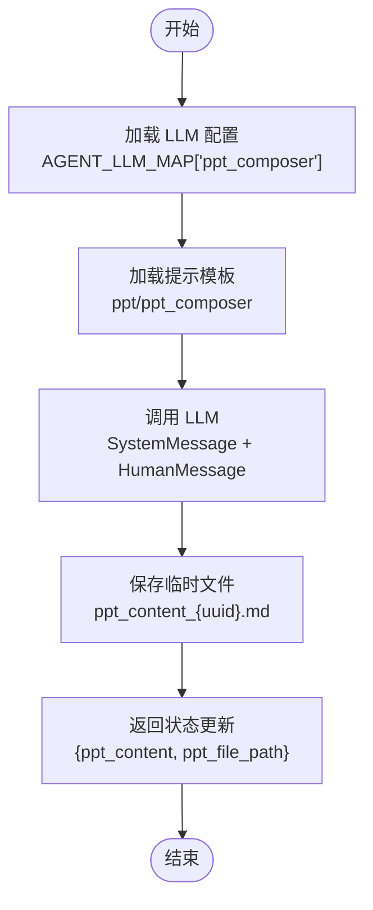
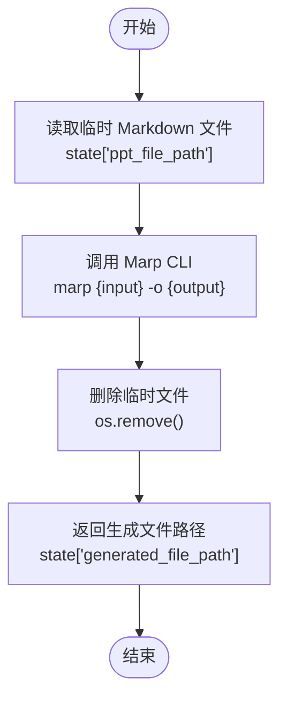

# PPT演示文稿生成系统

<cite>
**本文档引用的文件**
- [src/ppt/graph/builder.py](file://src/ppt/graph/builder.py)
- [src/ppt/graph/ppt_composer_node.py](file://src/ppt/graph/ppt_composer_node.py)
- [src/ppt/graph/ppt_generator_node.py](file://src/ppt/graph/ppt_generator_node.py)
- [src/ppt/graph/state.py](file://src/ppt/graph/state.py)
- [src/prompts/ppt/ppt_composer.md](file://src/prompts/ppt/ppt_composer.md)
- [src/server/app.py](file://src/server/app.py)
- [src/config/agents.py](file://src/config/agents.py)
- [src/llms/llm.py](file://src/llms/llm.py)
- [src/graph/builder.py](file://src/graph/builder.py)
- [src/graph/nodes.py](file://src/graph/nodes.py)
</cite>

## 目录
1. [简介](#简介)
2. [项目结构](#项目结构)
3. [核心组件](#核心组件)
4. [架构概览](#架构概览)
5. [详细组件分析](#详细组件分析)
6. [提示模板系统](#提示模板系统)
7. [性能优化](#性能优化)
8. [故障排除指南](#故障排除指南)
9. [结论](#结论)

## 简介

DeerFlow 系统是一个基于 LangGraph 的智能工作流平台，专门用于自动化生成专业的 PPT 演示文稿。该系统通过两个核心节点——PPT 编排节点（ppt_composer_node）和 PPT 生成节点（ppt_generator_node）——实现从文本内容到 PowerPoint 文件的完整转换流程。

系统采用模块化设计，支持多种 LLM 提供商，并集成了 Marp CLI 工具链来生成高质量的 PPTX 文件。整个工作流遵循状态图模式，确保数据在各个处理阶段之间的正确传递和管理。

## 项目结构

PPT 功能的核心文件组织如下：



**图表来源**
- [src/ppt/graph/builder.py](file://src/ppt/graph/builder.py#L1-L32)
- [src/prompts/ppt/ppt_composer.md](file://src/prompts/ppt/ppt_composer.md#L1-L107)

**章节来源**
- [src/ppt/graph/builder.py](file://src/ppt/graph/builder.py#L1-L32)
- [src/ppt/graph/state.py](file://src/ppt/graph/state.py#L1-L20)

## 核心组件

### PPTState 状态管理器

PPTState 类继承自 MessagesState，负责管理整个 PPT 生成过程中的状态信息：

```python
class PPTState(MessagesState):
    """PPT 生成的状态管理器。"""
    
    # 输入
    input: str = ""
    
    # 输出
    generated_file_path: str = ""
    
    # 资产
    ppt_content: str = ""
    ppt_file_path: str = ""
```

该状态类维护以下关键字段：
- **input**: 原始报告内容输入
- **generated_file_path**: 最终生成的 PPTX 文件路径
- **ppt_content**: 中间生成的 Markdown 内容
- **ppt_file_path**: 临时存储的 Markdown 文件路径

### 工作流构建器

工作流构建器定义了完整的 PPT 生成管道：

```python
def build_graph():
    """构建并返回 PPT 工作流图。"""
    builder = StateGraph(PPTState)
    builder.add_node("ppt_composer", ppt_composer_node)
    builder.add_node("ppt_generator", ppt_generator_node)
    builder.add_edge(START, "ppt_composer")
    builder.add_edge("ppt_composer", "ppt_generator")
    builder.add_edge("ppt_generator", END)
    return builder.compile()
```

**章节来源**
- [src/ppt/graph/state.py](file://src/ppt/graph/state.py#L7-L19)
- [src/ppt/graph/builder.py](file://src/ppt/graph/builder.py#L11-L22)

## 架构概览

DeerFlow PPT 生成系统采用分层架构设计，通过状态图模式实现工作流管理：



**图表来源**
- [src/ppt/graph/builder.py](file://src/ppt/graph/builder.py#L11-L22)
- [src/ppt/graph/ppt_composer_node.py](file://src/ppt/graph/ppt_composer_node.py#L17-L33)
- [src/ppt/graph/ppt_generator_node.py](file://src/ppt/graph/ppt_generator_node.py#L15-L25)

## 详细组件分析

### PPT 编排节点（PPT Composer Node）

PPT 编排节点是整个工作流的第一个阶段，负责将原始文本内容转换为结构化的 Markdown 格式：



**图表来源**
- [src/ppt/graph/ppt_composer_node.py](file://src/ppt/graph/ppt_composer_node.py#L17-L33)

#### 关键特性

1. **LLM 配置管理**: 使用 AGENT_LLM_MAP 中定义的 "ppt_composer" 配置
2. **提示模板应用**: 通过 get_prompt_template 加载专业的 PPT 编写模板
3. **临时文件管理**: 自动生成唯一的 UUID 文件名，避免文件冲突
4. **状态更新**: 返回包含生成内容和文件路径的状态对象

### PPT 生成节点（PPT Generator Node）

PPT 生成节点负责将 Markdown 内容转换为最终的 PPTX 文件：



**图表来源**
- [src/ppt/graph/ppt_generator_node.py](file://src/ppt/graph/ppt_generator_node.py#L15-L25)

#### 技术实现细节

1. **Marp CLI 集成**: 利用 Marp 的强大功能进行格式转换
2. **文件生命周期管理**: 自动清理临时文件，防止磁盘空间浪费
3. **唯一文件命名**: 使用 UUID 确保文件名唯一性
4. **错误处理**: 通过 subprocess.run 处理外部命令执行

**章节来源**
- [src/ppt/graph/ppt_composer_node.py](file://src/ppt/graph/ppt_composer_node.py#L17-L33)
- [src/ppt/graph/ppt_generator_node.py](file://src/ppt/graph/ppt_generator_node.py#L15-L25)

### 服务器集成

系统通过 REST API 提供 PPT 生成服务：

```python
@app.post("/api/ppt/generate")
async def generate_ppt(request: GeneratePPTRequest):
    try:
        report_content = request.content
        workflow = build_ppt_graph()
        final_state = workflow.invoke({"input": report_content})
        generated_file_path = final_state["generated_file_path"]
        with open(generated_file_path, "rb") as f:
            ppt_bytes = f.read()
        return Response(
            content=ppt_bytes,
            media_type="application/vnd.openxmlformats-officedocument.presentationml.presentation",
        )
    except Exception as e:
        logger.exception(f"Error occurred during ppt generation: {str(e)}")
        raise HTTPException(status_code=500, detail=INTERNAL_SERVER_ERROR_DETAIL)
```

**章节来源**
- [src/server/app.py](file://src/server/app.py#L520-L540)

## 提示模板系统

### PPT 编排提示模板

ppt_composer.md 是系统的核心提示模板，定义了专业的 PPT 内容生成规则：

#### 主要功能模块

1. **Markdown PPT 格式化指南**
   - 使用 `#` 表示标题幻灯片
   - 使用 `##` 表示幻灯片标题
   - 使用 `###` 表示副标题
   - 使用水平线 `---` 分隔幻灯片

2. **内容格式化规则**
   - 使用无序列表 (`*` 或 `-`) 表示要点
   - 使用有序列表 (`1.`, `2.`) 表示步骤
   - 使用代码块（三重反引号）
   - 图像 URL 必须来自源内容

3. **处理工作流程**
   - 理解用户需求
   - 提取核心内容
   - 组织内容结构
   - 创建 Markdown 演示文稿
   - 审查和优化

#### 重要约束条件

- 不要猜测或添加未提供的信息
- 如有需要请澄清问题
- 简化详细或冗长的信息
- 强调 Markdown 优势（易于编辑、版本控制）
- 只使用源内容中明确提供的图像
- 永远不要创建虚构的图像 URL 或占位符

**章节来源**
- [src/prompts/ppt/ppt_composer.md](file://src/prompts/ppt/ppt_composer.md#L1-L107)

## 性能优化

### 并发处理策略

1. **异步工作流执行**: 使用 LangGraph 的异步能力
2. **缓存机制**: LLM 实例缓存减少重复初始化
3. **临时文件管理**: 自动清理避免资源泄漏

### 内存优化

1. **流式处理**: 对大型文档使用流式处理
2. **状态最小化**: 只存储必要的状态信息
3. **及时清理**: 生成完成后立即删除临时文件

### LLM 优化

```python
# LLM 缓存配置
_llm_cache: dict[LLMType, BaseChatModel] = {}

def get_llm_by_type(llm_type: LLMType) -> BaseChatModel:
    """按类型获取 LLM 实例。如果可用则返回缓存实例。"""
    if llm_type in _llm_cache:
        return _llm_cache[llm_type]
    
    conf = load_yaml_config(_get_config_file_path())
    llm = _create_llm_use_conf(llm_type, conf)
    _llm_cache[llm_type] = llm
    return llm
```

**章节来源**
- [src/llms/llm.py](file://src/llms/llm.py#L170-L181)

## 故障排除指南

### 常见问题及解决方案

1. **Marp CLI 未安装**
   - 错误：`subprocess.CalledProcessError`
   - 解决：安装 Marp CLI 或配置替代工具

2. **LLM 配置错误**
   - 错误：`ValueError: Unknown LLM type`
   - 解决：检查 AGENT_LLM_MAP 配置

3. **文件权限问题**
   - 错误：`PermissionError`
   - 解决：确保应用程序有文件读写权限

4. **内存不足**
   - 症状：生成大型文档时崩溃
   - 解决：启用流式处理或增加系统内存

### 调试技巧

1. **日志记录**: 启用详细日志查看处理进度
2. **状态检查**: 监控 PPTState 中的中间状态
3. **文件验证**: 检查临时文件是否正确生成
4. **LLM 响应**: 验证 LLM 输出是否符合预期格式

**章节来源**
- [src/ppt/graph/ppt_composer_node.py](file://src/ppt/graph/ppt_composer_node.py#L17-L33)
- [src/ppt/graph/ppt_generator_node.py](file://src/ppt/graph/ppt_generator_node.py#L15-L25)

## 结论

DeerFlow 系统的 PPT 演示文稿生成功能展现了现代 AI 应用的最佳实践。通过模块化设计、清晰的工作流分离和强大的提示工程，系统能够高效地将文本内容转换为专业的演示文稿。

### 主要优势

1. **自动化程度高**: 从内容分析到文件生成完全自动化
2. **质量保证**: 通过专业的提示模板确保输出质量
3. **可扩展性**: 支持多种 LLM 提供商和格式转换工具
4. **易用性**: 简单的 REST API 接口便于集成

### 未来发展方向

1. **模板定制**: 支持更多品牌规范和设计风格
2. **交互式编辑**: 允许用户在生成过程中进行实时修改
3. **多语言支持**: 扩展到更多语言的 PPT 生成
4. **高级功能**: 添加动画效果、图表生成等高级功能

该系统为内容创作者提供了强大的工具，显著提高了演示文稿制作的效率和专业性，是 AI 辅助内容创作领域的优秀实践案例。