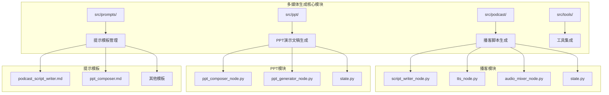
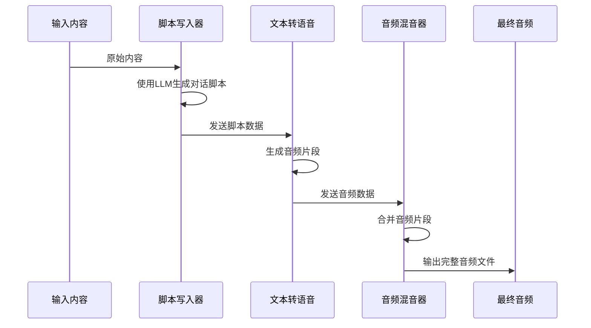
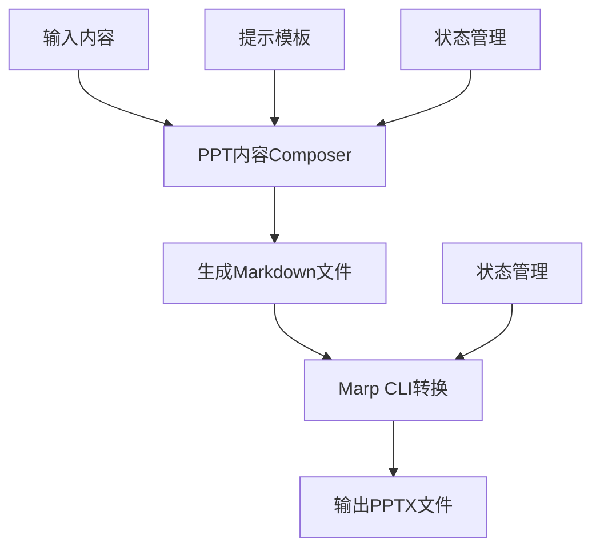
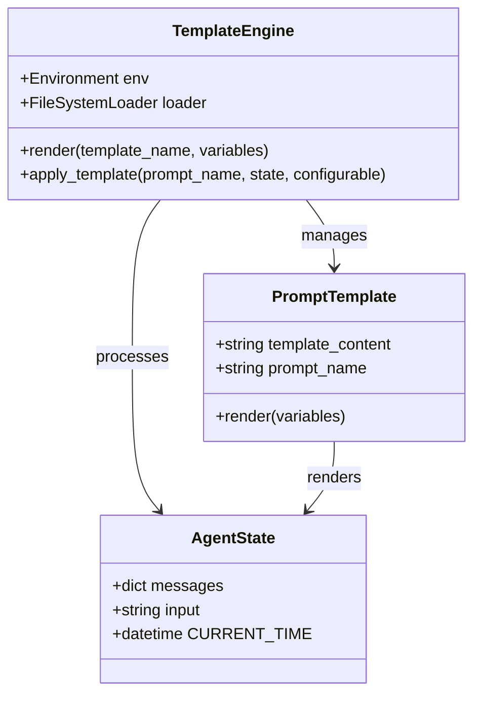
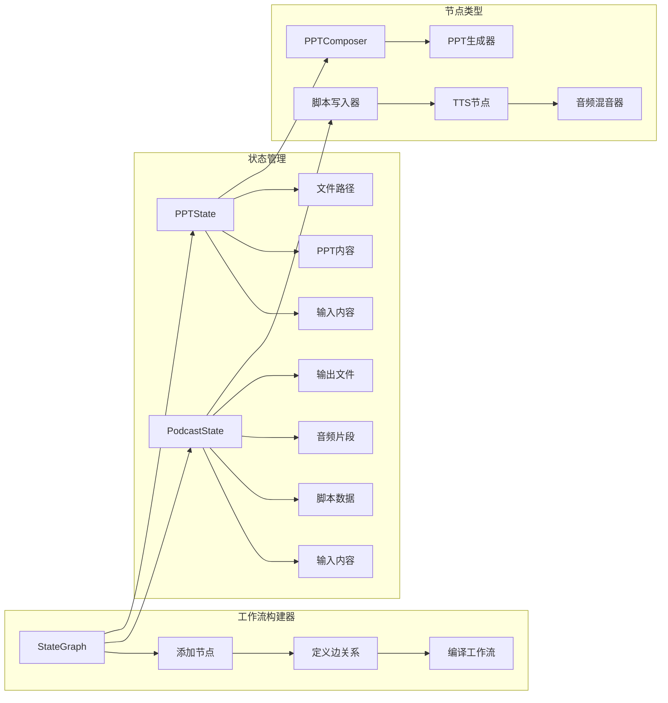

现在我已经收集了足够的信息来创建详细的文档。让我开始生成文档内容：

<docs>
# 多媒体内容生成示例

<cite>
**本文档中引用的文件**
- [src/podcast/graph/builder.py](file://src/podcast/graph/builder.py)
- [src/podcast/graph/script_writer_node.py](file://src/podcast/graph/script_writer_node.py)
- [src/podcast/graph/tts_node.py](file://src/podcast/graph/tts_node.py)
- [src/podcast/graph/audio_mixer_node.py](file://src/podcast/graph/audio_mixer_node.py)
- [src/podcast/types.py](file://src/podcast/types.py)
- [src/prompts/podcast/podcast_script_writer.md](file://src/prompts/podcast/podcast_script_writer.md)
- [src/ppt/graph/builder.py](file://src/ppt/graph/builder.py)
- [src/ppt/graph/ppt_composer_node.py](file://src/ppt/graph/ppt_composer_node.py)
- [src/ppt/graph/ppt_generator_node.py](file://src/ppt/graph/ppt_generator_node.py)
- [src/prompts/ppt/ppt_composer.md](file://src/prompts/ppt/ppt_composer.md)
- [src/prompts/template.py](file://src/prompts/template.py)
- [src/tools/tts.py](file://src/tools/tts.py)
- [src/config/agents.py](file://src/config/agents.py)
- [web/public/replay/ai-twin-insurance.txt](file://web/public/replay/ai-twin-insurance.txt)
</cite>

## 目录
1. [简介](#简介)
2. [项目结构概览](#项目结构概览)
3. [播客脚本生成系统](#播客脚本生成系统)
4. [PPT演示文稿生成系统](#ppt演示文稿生成系统)
5. [提示模板系统](#提示模板系统)
6. [工作流架构分析](#工作流架构分析)
7. [性能优化策略](#性能优化策略)
8. [定制化模板指南](#定制化模板指南)
9. [故障排除指南](#故障排除指南)
10. [总结](#总结)

## 简介

DeerFlow是一个先进的多媒体内容生成系统，专门设计用于自动化生成高质量的播客脚本和PPT演示文稿。该系统采用模块化的LangGraph架构，结合大语言模型（LLM）和专业的文本处理技术，为用户提供了一套完整的多模态内容创作解决方案。

系统的核心优势在于其灵活的工作流设计和强大的提示工程能力。通过精心设计的节点化处理流程，系统能够高效地完成从原始内容到最终成品的完整转换过程，同时保持高度的可定制性和扩展性。

## 项目结构概览

DeerFlow的多媒体内容生成功能主要分布在以下关键目录中：



**图表来源**
- [src/podcast/graph/builder.py](file://src/podcast/graph/builder.py#L1-L40)
- [src/ppt/graph/builder.py](file://src/ppt/graph/builder.py#L1-L32)

## 播客脚本生成系统

### 架构设计

播客脚本生成系统采用三节点流水线架构，确保高质量的内容生成和音频合成：



**图表来源**
- [src/podcast/graph/builder.py](file://src/podcast/graph/builder.py#L12-L18)
- [src/podcast/graph/script_writer_node.py](file://src/podcast/graph/script_writer_node.py#L15-L25)

### 核心组件分析

#### 1. 脚本写入器节点

脚本写入器是整个播客生成流程的核心，负责将原始内容转换为专业的对话脚本：

```python
def script_writer_node(state: PodcastState):
    logger.info("Generating script for podcast...")
    model = get_llm_by_type(
        AGENT_LLM_MAP["podcast_script_writer"]
    ).with_structured_output(Script, method="json_mode")
    script = model.invoke(
        [
            SystemMessage(content=get_prompt_template("podcast/podcast_script_writer")),
            HumanMessage(content=state["input"]),
        ],
    )
    return {"script": script, "audio_chunks": []}
```

该节点的关键特性：
- **结构化输出**：使用JSON模式确保输出格式的一致性
- **专业化提示**：基于精心设计的提示模板
- **多语言支持**：支持英语和中文两种语言环境

#### 2. 文本转语音节点

TTS节点负责将脚本中的每一行文本转换为高质量的语音音频：

```python
def tts_node(state: PodcastState):
    logger.info("Generating audio chunks for podcast...")
    tts_client = _create_tts_client()
    for line in state["script"].lines:
        tts_client.voice_type = (
            "BV002_streaming" if line.speaker == "male" else "BV001_streaming"
        )
        result = tts_client.text_to_speech(line.paragraph, speed_ratio=1.05)
        if result["success"]:
            audio_data = result["audio_data"]
            audio_chunk = base64.b64decode(audio_data)
            state["audio_chunks"].append(audio_chunk)
```

语音合成的关键优化：
- **性别区分**：为男性和女性角色使用不同的语音类型
- **语速调节**：通过speed_ratio参数优化语音节奏
- **错误处理**：完善的异常捕获和日志记录机制

#### 3. 音频混音器节点

音频混音器将所有音频片段合并成一个完整的播客文件：

```python
def audio_mixer_node(state: PodcastState):
    logger.info("Mixing audio chunks for podcast...")
    audio_chunks = state["audio_chunks"]
    combined_audio = b"".join(audio_chunks)
    logger.info("The podcast audio is now ready.")
    return {"output": combined_audio}
```

### 提示模板设计

播客脚本生成使用了专门设计的提示模板，确保生成的内容符合专业播客的标准：

**关键设计原则**：
- **自然对话**：模拟真实的双人对话场景
- **角色分配**：明确指定男性和女性主持人角色
- **时长控制**：目标生成约10分钟的播客内容
- **语言规范**：避免复杂的技术术语和数学公式

**Section sources**
- [src/podcast/graph/script_writer_node.py](file://src/podcast/graph/script_writer_node.py#L1-L31)
- [src/podcast/graph/tts_node.py](file://src/podcast/graph/tts_node.py#L1-L48)
- [src/podcast/graph/audio_mixer_node.py](file://src/podcast/graph/audio_mixer_node.py#L1-L17)
- [src/prompts/podcast/podcast_script_writer.md](file://src/prompts/podcast/podcast_script_writer.md#L1-L39)

## PPT演示文稿生成系统

### 架构设计

PPT生成系统采用两阶段处理流程，首先生成Markdown格式的演示文稿内容，然后通过Marp CLI工具转换为PPTX文件：



**图表来源**
- [src/ppt/graph/builder.py](file://src/ppt/graph/builder.py#L12-L17)
- [src/ppt/graph/ppt_composer_node.py](file://src/ppt/graph/ppt_composer_node.py#L18-L30)

### 核心组件分析

#### 1. PPT内容Composer节点

该节点负责将输入内容转换为结构化的Markdown格式演示文稿：

```python
def ppt_composer_node(state: PPTState):
    logger.info("Generating ppt content...")
    model = get_llm_by_type(AGENT_LLM_MAP["ppt_composer"])
    ppt_content = model.invoke(
        [
            SystemMessage(content=get_prompt_template("ppt/ppt_composer")),
            HumanMessage(content=state["input"]),
        ],
    )
    # 保存临时文件
    temp_ppt_file_path = os.path.join(os.getcwd(), f"ppt_content_{uuid.uuid4()}.md")
    with open(temp_ppt_file_path, "w") as f:
        f.write(ppt_content.content)
    return {"ppt_content": ppt_content, "ppt_file_path": temp_ppt_file_path}
```

**关键特性**：
- **智能分段**：自动识别和组织演示文稿的各个部分
- **格式标准化**：确保生成的Markdown符合Marp标准
- **临时文件管理**：安全地处理中间文件

#### 2. PPT生成器节点

PPT生成器使用Marp CLI工具将Markdown文件转换为专业的PPTX格式：

```python
def ppt_generator_node(state: PPTState):
    logger.info("Generating ppt file...")
    generated_file_path = os.path.join(
        os.getcwd(), f"generated_ppt_{uuid.uuid4()}.pptx"
    )
    subprocess.run(["marp", state["ppt_file_path"], "-o", generated_file_path])
    # 清理临时文件
    os.remove(state["ppt_file_path"])
    return {"generated_file_path": generated_file_path}
```

**优化策略**：
- **命令行集成**：直接调用Marp CLI进行高效转换
- **文件清理**：自动删除临时Markdown文件
- **路径管理**：使用UUID确保文件名唯一性

### 提示模板设计

PPT生成使用了专门设计的提示模板，强调专业性和实用性：

**核心设计原则**：
- **结构化内容**：清晰的标题层次和逻辑顺序
- **视觉友好**：适合屏幕展示的设计考虑
- **简洁表达**：每张幻灯片聚焦一个核心要点
- **图像集成**：仅使用源内容中实际存在的图片URL

**Section sources**
- [src/ppt/graph/ppt_composer_node.py](file://src/ppt/graph/ppt_composer_node.py#L1-L34)
- [src/ppt/graph/ppt_generator_node.py](file://src/ppt/graph/ppt_generator_node.py#L1-L26)
- [src/prompts/ppt/ppt_composer.md](file://src/prompts/ppt/ppt_composer.md#L1-L107)

## 提示模板系统

### 模板架构

DeerFlow采用Jinja2模板引擎来管理系统中的各种提示模板，提供了强大的变量替换和条件渲染功能：



**图表来源**
- [src/prompts/template.py](file://src/prompts/template.py#L1-L68)

### 模板应用流程

模板系统的核心功能是将预定义的提示模板与当前状态相结合，生成最终的LLM输入：

```python
def apply_prompt_template(
    prompt_name: str, state: AgentState, configurable: Configuration = None
) -> list:
    """
    应用模板变量到提示模板，并返回格式化的消息列表。
    """
    # 将状态转换为字典以供模板渲染
    state_vars = {
        "CURRENT_TIME": datetime.now().strftime("%a %b %d %Y %H:%M:%S %z"),
        **state,
    }

    # 添加可配置变量
    if configurable:
        state_vars.update(dataclasses.asdict(configurable))

    try:
        template = env.get_template(f"{prompt_name}.md")
        system_prompt = template.render(**state_vars)
        return [{"role": "system", "content": system_prompt}] + state["messages"]
    except Exception as e:
        raise ValueError(f"Error applying template {prompt_name}: {e}")
```

### 模板变量系统

模板系统支持多种类型的变量替换：

1. **时间变量**：`CURRENT_TIME` - 当前系统时间
2. **状态变量**：从AgentState传递的各种状态信息
3. **配置变量**：来自Configuration对象的可配置参数
4. **动态变量**：运行时计算的值

**Section sources**
- [src/prompts/template.py](file://src/prompts/template.py#L1-L68)

## 工作流架构分析

### LangGraph集成

DeerFlow深度集成了LangGraph框架，实现了高度模块化和可扩展的工作流架构：



**图表来源**
- [src/podcast/graph/builder.py](file://src/podcast/graph/builder.py#L12-L18)
- [src/ppt/graph/builder.py](file://src/ppt/graph/builder.py#L12-L17)

### 状态流转机制

每个多媒体生成任务都遵循严格的状态管理机制：

1. **初始化状态**：接收原始输入内容
2. **中间状态**：在各处理节点间传递处理结果
3. **最终状态**：生成完整的输出文件

### 错误处理策略

系统实现了多层次的错误处理机制：

- **节点级错误**：每个节点都有独立的异常处理
- **工作流级错误**：捕获整个工作流执行中的异常
- **资源级错误**：处理外部API调用和文件操作错误

**Section sources**
- [src/podcast/graph/builder.py](file://src/podcast/graph/builder.py#L1-L40)
- [src/ppt/graph/builder.py](file://src/ppt/graph/builder.py#L1-L32)

## 性能优化策略

### 生成延迟优化

为了提高内容生成的效率，系统采用了多种优化策略：

#### 1. 异步处理

```python
# 在实际实现中，可以考虑使用异步处理来提高并发性能
async def async_podcast_generation(content: str):
    workflow = build_graph()
    final_state = await workflow.ainvoke({"input": content})
    return final_state["output"]
```

#### 2. 缓存机制

- **模板缓存**：Jinja2环境自动缓存已加载的模板
- **LLM响应缓存**：对重复的LLM请求实施缓存策略
- **音频片段缓存**：避免重复的TTS请求

#### 3. 批量处理

对于多个相似的生成任务，系统支持批量处理以提高整体效率。

### 内容质量提升

#### 1. 结构化输出验证

```python
# 在脚本写入器中使用结构化输出验证
model = get_llm_by_type(
    AGENT_LLM_MAP["podcast_script_writer"]
).with_structured_output(Script, method="json_mode")
```

#### 2. 多轮验证

系统支持多轮内容验证和改进，确保输出质量：

- **初稿生成**：快速生成初步内容
- **质量检查**：自动检测格式和内容问题
- **迭代优化**：根据反馈进行多次改进

#### 3. 专家级提示设计

每个提示模板都经过精心设计，确保生成的内容达到专业水平：

- **播客脚本**：模拟真实对话的自然语言
- **PPT内容**：结构化且视觉友好的格式
- **多语言支持**：适应不同语言环境的需求

## 定制化模板指南

### 创建自定义播客模板

要创建自定义的播客脚本模板，需要遵循以下步骤：

#### 1. 模板结构设计

```markdown
# 自定义播客脚本模板

## 角色设定
- 主持人A：性格开朗，善于引导话题
- 主持人B：知识渊博，擅长深入讲解

## 对话规则
- 每个话题至少讨论3分钟
- 包含至少2个互动问答环节
- 结尾提供行动建议或思考题

## 输出格式
严格按照以下JSON格式：
{
  "locale": "zh",
  "lines": [
    {
      "speaker": "male",
      "paragraph": "主持人A的开场白"
    }
  ]
}
```

#### 2. 关键要素配置

- **角色分配**：明确主持人的性格特点和对话风格
- **时长控制**：设置每个话题的预期时长
- **互动设计**：规划问答和互动环节
- **格式规范**：确保输出格式的一致性

### 创建自定义PPT模板

#### 1. 结构化内容设计

```markdown
# 自定义PPT模板

## 内容结构
1. 封面页
2. 目录页
3. 主体内容（3-5个主要章节）
4. 总结页
5. 问答页

## 设计原则
- 每页不超过6行文字
- 使用项目符号列出要点
- 图表和图片比例协调
- 统一的字体和颜色方案

## 格式要求
- 使用Markdown语法
- 正确的标题层级（#一级，##二级）
- 合理的空白区域
- 适当的图片URL格式
```

#### 2. 高级定制选项

- **主题定制**：设置统一的颜色方案和字体
- **布局设计**：定义特殊的页面布局需求
- **动画效果**：集成Marp的动画和过渡效果
- **交互元素**：添加可点击的链接和按钮

### 模板测试和验证

#### 1. 测试流程

```python
def test_custom_template(template_content: str, test_input: str):
    """测试自定义模板的功能性"""
    # 1. 加载模板
    template = env.from_string(template_content)
    
    # 2. 渲染模板
    rendered = template.render(test_input=test_input)
    
    # 3. 验证输出格式
    if not validate_output_format(rendered):
        raise ValueError("输出格式不符合要求")
    
    # 4. 测试转换
    if not test_conversion(rendered):
        raise ValueError("转换过程失败")
    
    return rendered
```

#### 2. 质量评估指标

- **完整性**：是否包含所有必要的内容元素
- **一致性**：格式和风格是否统一
- **可读性**：内容是否易于理解和阅读
- **美观度**：视觉效果是否吸引人

## 故障排除指南

### 常见问题及解决方案

#### 1. TTS服务连接问题

**症状**：音频生成失败或超时

**解决方案**：
```python
def diagnose_tts_issue():
    """诊断TTS服务问题"""
    try:
        # 检查环境变量
        app_id = os.getenv("VOLCENGINE_TTS_APPID")
        access_token = os.getenv("VOLCENGINE_TTS_ACCESS_TOKEN")
        
        if not app_id or not access_token:
            raise ValueError("缺少必要的认证信息")
        
        # 测试API连接
        tts_client = VolcengineTTS(app_id, access_token)
        test_result = tts_client.text_to_speech("测试", speed_ratio=1.0)
        
        if not test_result["success"]:
            raise ValueError(f"TTS API错误: {test_result['error']}")
            
    except Exception as e:
        logger.error(f"TTS诊断失败: {e}")
        return False
    
    return True
```

#### 2. Marp转换失败

**症状**：PPT生成过程中断或输出格式错误

**解决方案**：
```bash
# 检查Marp CLI安装
npm list -g marp-cli

# 更新到最新版本
npm update -g marp-cli

# 测试基本转换
marp --version
marp --html test.md -o test.html
```

#### 3. 模板加载错误

**症状**：提示模板无法正确加载

**解决方案**：
```python
def validate_template(template_path: str):
    """验证模板文件的有效性"""
    try:
        with open(template_path, 'r') as f:
            content = f.read()
        
        # 检查基本语法
        if not content.strip():
            raise ValueError("模板内容为空")
        
        # 检查Jinja2语法
        env.from_string(content)
        
        return True
        
    except Exception as e:
        logger.error(f"模板验证失败: {e}")
        return False
```

### 性能监控

#### 1. 关键指标监控

```python
class PerformanceMonitor:
    def __init__(self):
        self.metrics = {}
    
    def record_latency(self, operation: str, latency: float):
        """记录操作延迟"""
        if operation not in self.metrics:
            self.metrics[operation] = []
        self.metrics[operation].append(latency)
    
    def get_average_latency(self, operation: str) -> float:
        """获取平均延迟"""
        if operation in self.metrics and self.metrics[operation]:
            return sum(self.metrics[operation]) / len(self.metrics[operation])
        return 0.0
```

#### 2. 日志分析

系统提供了详细的日志记录功能，便于问题诊断：

- **节点执行日志**：记录每个处理节点的执行情况
- **错误堆栈跟踪**：提供完整的错误信息
- **性能指标**：记录关键操作的执行时间

**Section sources**
- [src/tools/tts.py](file://src/tools/tts.py#L1-L134)
- [src/prompts/template.py](file://src/prompts/template.py#L1-L68)

## 总结

DeerFlow的多媒体内容生成系统展现了现代AI驱动内容创作的最佳实践。通过精心设计的模块化架构、专业的提示工程和高效的处理流程，系统能够为用户提供高质量