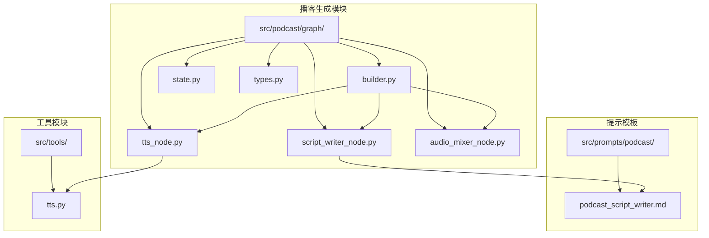
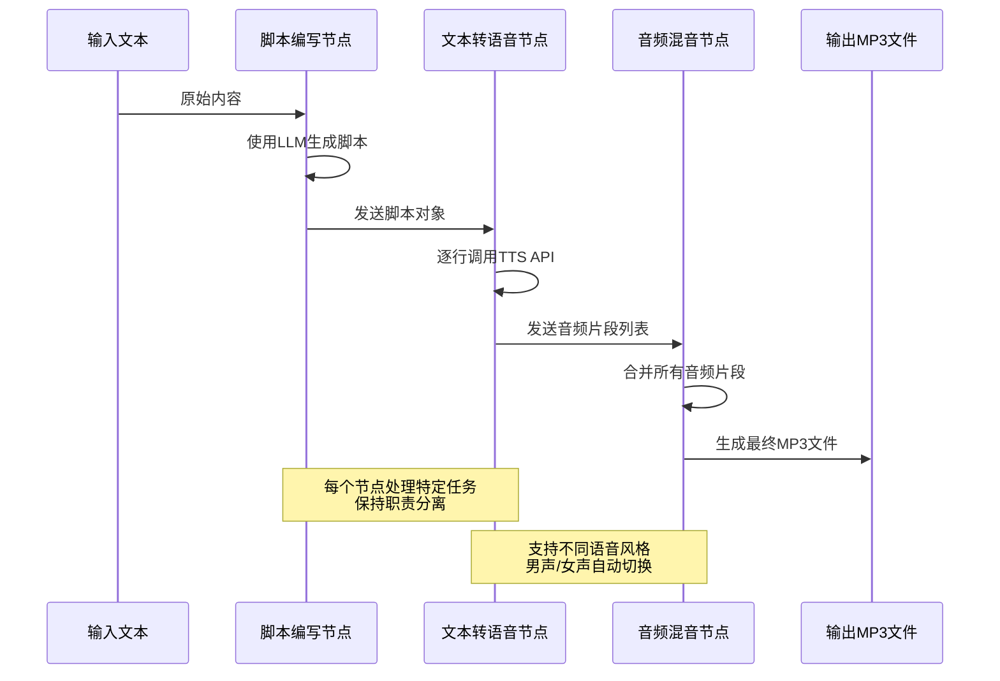
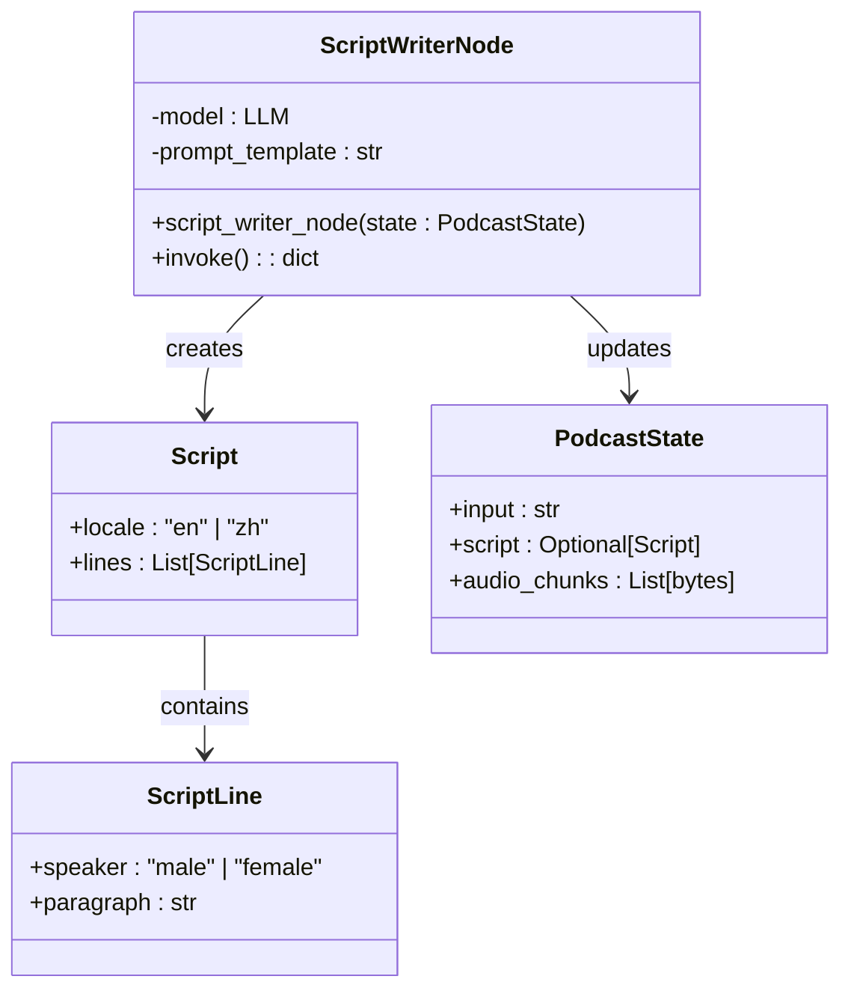
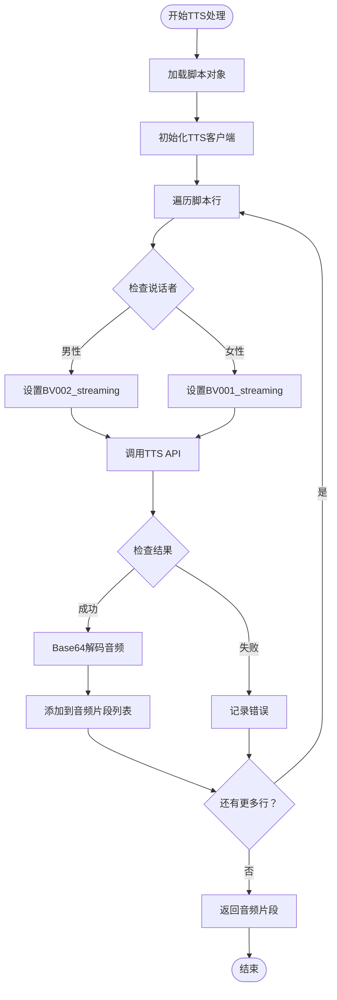
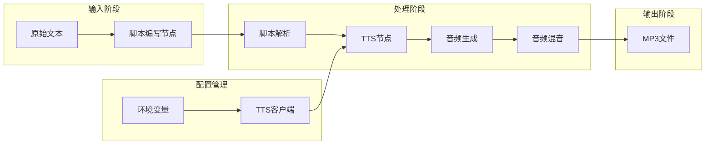

# 播客内容生成

<cite>
**本文档中引用的文件**
- [script_writer_node.py](file://src/podcast/graph/script_writer_node.py)
- [tts_node.py](file://src/podcast/graph/tts_node.py)
- [audio_mixer_node.py](file://src/podcast/graph/audio_mixer_node.py)
- [builder.py](file://src/podcast/graph/builder.py)
- [state.py](file://src/podcast/graph/state.py)
- [types.py](file://src/podcast/types.py)
- [podcast_script_writer.md](file://src/prompts/podcast/podcast_script_writer.md)
- [tts.py](file://src/tools/tts.py)
</cite>

## 目录
1. [简介](#简介)
2. [项目结构](#项目结构)
3. [核心组件](#核心组件)
4. [架构概览](#架构概览)
5. [详细组件分析](#详细组件分析)
6. [提示模板设计](#提示模板设计)
7. [TTS工具集成](#tts工具集成)
8. [音频处理流程](#音频处理流程)
9. [性能考虑](#性能考虑)
10. [故障排除指南](#故障排除指南)
11. [结论](#结论)

## 简介

DeerFlow系统是一个基于多节点协作的工作流平台，专门用于生成高质量的播客内容。该系统通过智能脚本编写和语音合成技术，将原始文本内容转换为专业的播客节目。系统采用模块化设计，包含脚本编写节点、文本转语音节点和音频混音节点，形成了完整的播客内容生成流水线。

## 项目结构

播客内容生成功能的核心文件组织如下：



**图表来源**
- [builder.py](file://src/podcast/graph/builder.py#L1-L40)
- [script_writer_node.py](file://src/podcast/graph/script_writer_node.py#L1-L31)
- [tts_node.py](file://src/podcast/graph/tts_node.py#L1-L48)

**章节来源**
- [builder.py](file://src/podcast/graph/builder.py#L1-L40)
- [state.py](file://src/podcast/graph/state.py#L1-L23)

## 核心组件

DeerFlow播客生成系统由以下核心组件构成：

### 1. 脚本编写节点 (Script Writer Node)
负责将输入文本转换为符合播客格式的对话脚本，确保内容适合语音播报。

### 2. 文本转语音节点 (TTS Node)
使用火山引擎TTS服务将脚本中的每一行文本转换为语音音频片段。

### 3. 音频混音节点 (Audio Mixer Node)
将所有音频片段按顺序合并成完整的播客音频文件。

### 4. 工作流构建器 (Workflow Builder)
定义整个播客生成流程的状态图和节点连接关系。

**章节来源**
- [script_writer_node.py](file://src/podcast/graph/script_writer_node.py#L1-L31)
- [tts_node.py](file://src/podcast/graph/tts_node.py#L1-L48)
- [audio_mixer_node.py](file://src/podcast/graph/audio_mixer_node.py#L1-L17)

## 架构概览

播客生成系统采用状态机架构，通过LangGraph库实现节点间的协作：



**图表来源**
- [builder.py](file://src/podcast/graph/builder.py#L15-L22)
- [script_writer_node.py](file://src/podcast/graph/script_writer_node.py#L17-L29)
- [tts_node.py](file://src/podcast/graph/tts_node.py#L15-L32)

## 详细组件分析

### 脚本编写节点实现

脚本编写节点是播客生成流程的起点，负责将非结构化的输入文本转换为专业播客脚本：

```python
def script_writer_node(state: PodcastState):
    logger.info("Generating script for podcast...")
    model = get_llm_by_type(
        AGENT_LLM_MAP["podcast_script_writer"]
    ).with_structured_output(Script, method="json_mode")
    script = model.invoke(
        [
            SystemMessage(content=get_prompt_template("podcast/podcast_script_writer")),
            HumanMessage(content=state["input"]),
        ],
    )
    return {"script": script, "audio_chunks": []}
```

该节点的关键特性：
- **结构化输出**：使用JSON模式确保输出格式的一致性
- **提示工程**：集成专门的播客脚本提示模板
- **LLM配置**：从配置映射中获取指定的AI模型



**图表来源**
- [script_writer_node.py](file://src/podcast/graph/script_writer_node.py#L17-L29)
- [types.py](file://src/podcast/types.py#L8-L16)
- [state.py](file://src/podcast/graph/state.py#L9-L22)

**章节来源**
- [script_writer_node.py](file://src/podcast/graph/script_writer_node.py#L17-L29)
- [types.py](file://src/podcast/types.py#L1-L17)

### 文本转语音节点实现

TTS节点负责将脚本中的每一行文本转换为语音音频：

```python
def tts_node(state: PodcastState):
    logger.info("Generating audio chunks for podcast...")
    tts_client = _create_tts_client()
    for line in state["script"].lines:
        tts_client.voice_type = (
            "BV002_streaming" if line.speaker == "male" else "BV001_streaming"
        )
        result = tts_client.text_to_speech(line.paragraph, speed_ratio=1.05)
        if result["success"]:
            audio_data = result["audio_data"]
            audio_chunk = base64.b64decode(audio_data)
            state["audio_chunks"].append(audio_chunk)
        else:
            logger.error(result["error"])
    return {
        "audio_chunks": state["audio_chunks"],
    }
```

关键功能包括：
- **语音类型适配**：根据说话者性别自动选择男声或女声
- **语速控制**：设置默认语速比率为1.05（略快于正常语速）
- **错误处理**：记录失败的TTS请求并继续处理后续内容



**图表来源**
- [tts_node.py](file://src/podcast/graph/tts_node.py#L15-L32)

**章节来源**
- [tts_node.py](file://src/podcast/graph/tts_node.py#L15-L48)

### 音频混音节点实现

音频混音节点将所有音频片段按顺序合并：

```python
def audio_mixer_node(state: PodcastState):
    logger.info("Mixing audio chunks for podcast...")
    audio_chunks = state["audio_chunks"]
    combined_audio = b"".join(audio_chunks)
    logger.info("The podcast audio is now ready.")
    return {"output": combined_audio}
```

该节点的特点：
- **简单高效**：使用Python的字符串拼接操作合并二进制数据
- **内存友好**：直接在内存中处理音频数据，无需临时文件
- **日志记录**：提供清晰的处理进度跟踪

**章节来源**
- [audio_mixer_node.py](file://src/podcast/graph/audio_mixer_node.py#L10-L16)

## 提示模板设计

播客脚本编写器使用专门设计的提示模板来指导LLM生成适合语音播报的内容：

### 提示模板核心要素

1. **角色设定**：明确两个主持人角色（男性和女性）
2. **语言风格**：要求自然、对话式的表达方式
3. **结构规范**：JSON格式输出，包含说话者标识
4. **长度控制**：目标时长10分钟的简洁脚本
5. **内容过滤**：避免数学公式和技术术语

### 输出格式规范

```typescript
interface ScriptLine {
  speaker: 'male' | 'female';
  paragraph: string;
}

interface Script {
  locale: "en" | "zh";
  lines: ScriptLine[];
}
```

模板设计遵循以下原则：
- **对话导向**：强调主持人之间的互动
- **口语化表达**：避免正式书面语
- **本地化支持**：支持英文和中文两种语言
- **可读性优先**：确保内容适合口头播报

**章节来源**
- [podcast_script_writer.md](file://src/prompts/podcast/podcast_script_writer.md#L1-L39)
- [types.py](file://src/podcast/types.py#L8-L16)

## TTS工具集成

### VolcengineTTS类设计

系统集成了火山引擎的TTS服务，提供了完整的语音合成能力：

```python
class VolcengineTTS:
    def __init__(self, appid: str, access_token: str, cluster: str = "volcano_tts", 
                 voice_type: str = "BV700_V2_streaming", host: str = "openspeech.bytedance.com"):
        self.appid = appid
        self.access_token = access_token
        self.cluster = cluster
        self.voice_type = voice_type
        self.host = host
        self.api_url = f"https://{host}/api/v1/tts"
        self.header = {"Authorization": f"Bearer;{access_token}"}
```

### 关键配置参数

| 参数名 | 默认值 | 说明 |
|--------|--------|------|
| appid | 必需 | 平台应用ID |
| access_token | 必需 | 访问令牌 |
| cluster | volcano_tts | TTS集群名称 |
| voice_type | BV700_V2_streaming | 语音类型 |
| host | openspeech.bytedance.com | API主机地址 |

### 文本转语音方法

```python
def text_to_speech(self, text: str, encoding: str = "mp3", speed_ratio: float = 1.0, 
                   volume_ratio: float = 1.0, pitch_ratio: float = 1.0, 
                   text_type: str = "plain", with_frontend: int = 1, 
                   frontend_type: str = "unitTson", uid: Optional[str] = None):
```

支持的参数包括：
- **编码格式**：MP3、WAV等音频格式
- **语速调节**：1.05倍速提升自然度
- **音量控制**：标准化音量水平
- **音调调节**：保持语音自然流畅
- **前端处理**：启用文本预处理优化

**章节来源**
- [tts.py](file://src/tools/tts.py#L18-L134)

## 音频处理流程

完整的音频处理流程展示了各组件间的协作关系：



**图表来源**
- [builder.py](file://src/podcast/graph/builder.py#L15-L22)
- [tts_node.py](file://src/podcast/graph/tts_node.py#L34-L47)

### 状态管理

PodcastState类继承自MessagesState，提供了完整的状态管理：

```python
class PodcastState(MessagesState):
    """State for the podcast generation."""
    
    # Input
    input: str = ""
    
    # Output
    output: Optional[bytes] = None
    
    # Assets
    script: Optional[Script] = None
    audio_chunks: list[bytes] = []
```

状态流转过程：
1. **初始状态**：仅包含输入文本
2. **脚本生成**：添加结构化脚本对象
3. **音频生成**：逐步填充音频片段列表
4. **最终输出**：合并所有音频片段为完整MP3文件

**章节来源**
- [state.py](file://src/podcast/graph/state.py#L9-L22)

## 性能考虑

### 内存优化策略

1. **流式处理**：音频片段按顺序处理，避免大量内存占用
2. **及时释放**：处理完成后立即清理中间状态
3. **批量处理**：单次处理整个脚本，减少节点间通信开销

### 并发处理能力

- **异步TTS调用**：每个脚本行独立处理，支持并发执行
- **错误隔离**：单个TTS失败不影响其他行的处理
- **资源池化**：复用TTS客户端实例，减少初始化开销

### 缓存策略

虽然当前实现未包含缓存，但可以扩展支持：
- **脚本缓存**：对于相同输入重复生成相同脚本
- **音频缓存**：缓存常用文本的音频片段
- **模板缓存**：预编译提示模板提高响应速度

## 故障排除指南

### 常见问题及解决方案

#### 1. TTS API认证失败

**症状**：出现"VOLCENGINE_TTS_APPID is not set"或访问令牌无效错误

**解决方案**：
```bash
export VOLCENGINE_TTS_APPID=your_app_id
export VOLCENGINE_TTS_ACCESS_TOKEN=your_access_token
export VOLCENGINE_TTS_CLUSTER=volcano_tts
```

#### 2. 音频生成中断

**症状**：部分音频片段缺失或为空

**诊断步骤**：
1. 检查TTS API响应状态码
2. 验证文本内容是否包含特殊字符
3. 确认网络连接稳定性

**解决方案**：
```python
# 添加更详细的错误日志
if not result["success"]:
    logger.error(f"TTS failed for text: {line.paragraph[:50]}...")
    logger.error(f"Error details: {result['error']}")
```

#### 3. 语速不自然

**症状**：语音播放过快或过慢

**调整方案**：
```python
# 修改语速参数
result = tts_client.text_to_speech(
    line.paragraph, 
    speed_ratio=1.0,  # 标准语速
    volume_ratio=1.0,
    pitch_ratio=1.0
)
```

#### 4. 音频质量不佳

**症状**：音频有杂音或断续

**优化措施**：
1. 检查音频编码格式设置
2. 调整采样率和比特率参数
3. 使用更高品质的语音类型

### 调试技巧

1. **启用详细日志**：设置日志级别为DEBUG
2. **分步验证**：单独测试每个节点的功能
3. **样本验证**：使用已知正确的内容进行测试
4. **性能监控**：跟踪各节点的处理时间和内存使用

**章节来源**
- [tts_node.py](file://src/podcast/graph/tts_node.py#L34-L47)
- [tts.py](file://src/tools/tts.py#L95-L134)

## 结论

DeerFlow的播客内容生成系统展现了现代AI驱动内容创作的最佳实践。通过模块化设计、清晰的职责分离和完善的错误处理机制，系统能够稳定地将文本内容转换为高质量的播客节目。

### 主要优势

1. **架构清晰**：基于LangGraph的状态机设计，易于理解和维护
2. **功能完整**：涵盖从脚本生成到音频合成的全流程
3. **扩展性强**：模块化设计便于添加新功能和优化现有组件
4. **错误容错**：完善的错误处理机制确保系统稳定性

### 未来改进方向

1. **多语言支持**：扩展支持更多语言和方言
2. **语音风格**：提供更多语音类型和情感表达选项
3. **实时处理**：支持流式音频生成和实时播放
4. **质量评估**：集成自动音频质量检测和优化功能

该系统为内容创作者提供了强大的工具，使他们能够快速生成专业级别的播客内容，大大提高了内容生产效率和质量。