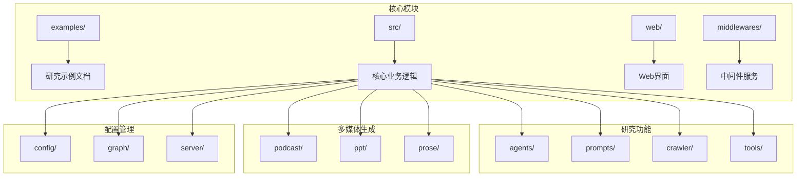
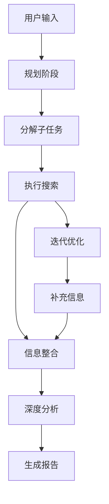
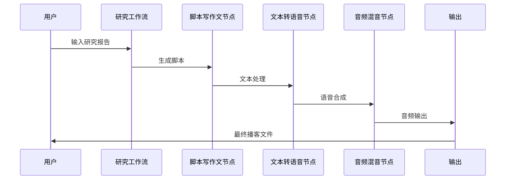

# DeerFlow 示例与用例

<cite>
**本文档引用的文件**
- [examples/AI_adoption_in_healthcare.md](file://examples/AI_adoption_in_healthcare.md)
- [examples/bitcoin_price_fluctuation.md](file://examples/bitcoin_price_fluctuation.md)
- [examples/nanjing_tangbao.md](file://examples/nanjing_tangbao.md)
- [examples/openai_sora_report.md](file://examples/openai_sora_report.md)
- [web/public/replay/ai-twin-insurance.txt](file://web/public/replay/ai-twin-insurance.txt)
- [web/public/replay/china-food-delivery.txt](file://web/public/replay/china-food-delivery.txt)
- [web/public/replay/github-top-trending-repo.txt](file://web/public/replay/github-top-trending-repo.txt)
- [src/config/configuration.py](file://src/config/configuration.py)
- [src/config/questions.py](file://src/config/questions.py)
- [src/workflow.py](file://src/workflow.py)
- [src/prompts/planner.md](file://src/prompts/planner.md)
- [src/podcast/graph/builder.py](file://src/podcast/graph/builder.py)
- [src/ppt/graph/builder.py](file://src/ppt/graph/builder.py)
- [middlewares/search/mock_search_api.py](file://middlewares/search/mock_search_api.py)
</cite>

## 目录
1. [简介](#简介)
2. [项目结构概览](#项目结构概览)
3. [核心示例分析](#核心示例分析)
4. [用例分类详解](#用例分类详解)
5. [回放文件分析](#回放文件分析)
6. [多媒体内容生成](#多媒体内容生成)
7. [系统架构集成](#系统架构集成)
8. [性能基准测试](#性能基准测试)
9. [最佳实践指南](#最佳实践指南)
10. [故障排除](#故障排除)

## 简介

DeerFlow 是一个先进的 AI 驱动的研究和内容生成平台，专注于提供高质量的深度研究和多媒体内容创作。本文档详细介绍了 DeerFlow 在不同领域的实际应用案例，包括 AI 医疗采用、比特币价格波动分析、多媒体内容生成等。

DeerFlow 的核心优势在于其模块化架构，支持从简单到复杂的渐进式研究任务，能够处理多步骤的复杂问题，并生成播客、PPT 等多媒体内容。系统采用 LangGraph 技术栈，实现了高度可扩展和可定制的研究工作流程。

## 项目结构概览

**图表来源**
- [src/workflow.py](file://src/workflow.py#L1-L50)
- [src/config/configuration.py](file://src/config/configuration.py#L1-L71)

**章节来源**
- [src/workflow.py](file://src/workflow.py#L1-L104)
- [src/config/configuration.py](file://src/config/configuration.py#L1-L71)

## 核心示例分析

### AI 医疗采用案例

AI 医疗采用案例展示了 DeerFlow 在复杂医疗领域研究中的强大能力。该示例涵盖了人工智能技术在医疗保健中的广泛应用，包括机器学习、深度学习和自然语言处理技术。

**关键特点：**
- **技术成熟度验证**：全面评估 AI 算法的准确性、可靠性和性能
- **数据质量考量**：关注数据体积、类型、偏见、安全性和隐私
- **伦理考虑**：重视数据隐私、算法偏见和透明度
- **经济成本分析**：进行全面的成本效益分析
- **组织影响评估**：分析 AI 集成对医疗机构的影响

### 比特币价格波动分析

比特币价格波动分析展示了 DeerFlow 在金融数据分析领域的应用。该示例通过综合市场情绪、监管影响、经济因素和技术分析指标来分析比特币价格走势。

**分析维度：**
- **特朗普行政政策**：分析关税政策对比特币价格的影响
- **经济不确定性**：评估宏观经济环境对加密货币市场的影响
- **市场情绪指标**：使用 Crypto Fear and Greed Index 监控市场情绪
- **技术分析**：识别关键支撑位和阻力位

### 南京汤包美食文化

南京汤包美食文化案例体现了 DeerFlow 在文化研究和地方特色分析方面的应用。该示例深入探讨了南京传统美食的历史渊源、制作工艺和文化价值。

**研究要点：**
- **历史传承**：追溯南京汤包的历史起源和发展
- **制作工艺**：详细分析汤包的制作技术和原料选择
- **文化意义**：探讨美食在当地文化中的地位和作用
- **现代创新**：分析传统美食在现代社会中的演变

**章节来源**
- [examples/AI_adoption_in_healthcare.md](file://examples/AI_adoption_in_healthcare.md#L1-L110)
- [examples/bitcoin_price_fluctuation.md](file://examples/bitcoin_price_fluctuation.md#L1-L45)
- [examples/nanjing_tangbao.md](file://examples/nanjing_tangbao.md#L1-L73)

## 用例分类详解

### 基础研究任务

基础研究任务适用于简单的信息查询和事实确认。这类任务通常只需要一次性的信息收集和整理。

**适用场景：**
- 产品功能查询
- 基本概念解释
- 简单的数据收集
- 快速的事实验证

**处理流程：**
1. 用户输入明确的问题
2. 系统自动识别关键词
3. 执行针对性的网络搜索
4. 整理和格式化结果
5. 生成简洁的报告

### 复杂多步骤问题

复杂多步骤问题需要系统性的研究方法和多阶段的信息收集。这类任务通常涉及多个相关主题和深入的分析。

**处理模式：**

**图表来源**
- [src/prompts/planner.md](file://src/prompts/planner.md#L1-L188)

### 多媒体内容生成

多媒体内容生成功能支持将文本研究报告转换为多种形式的内容，包括播客音频和演示文稿。

**生成流程：**
1. **脚本编写**：根据研究内容生成专业脚本
2. **语音合成**：使用 TTS 技术生成语音内容
3. **音频混音**：整合背景音乐和音效
4. **格式转换**：输出多种格式的最终作品

**章节来源**
- [src/podcast/graph/builder.py](file://src/podcast/graph/builder.py#L1-L40)
- [src/ppt/graph/builder.py](file://src/ppt/graph/builder.py#L1-L32)

## 回放文件分析

回放文件记录了典型用户交互流程的完整过程，为理解系统行为提供了宝贵的参考。

### AI 双胞胎保险案例

AI 双胞胎保险案例展示了 DeerFlow 处理复杂商业决策问题的能力。该案例包含了完整的规划、研究和分析过程。

**交互特征：**
- **多智能体协作**：协调多个专门化的 AI 智能体
- **分阶段研究**：系统性地收集相关信息
- **深度分析**：综合考虑技术、法律、伦理等多个维度
- **全面评估**：平衡风险与收益，提供决策支持

### GitHub 热门仓库分析

GitHub 热门仓库分析展示了 DeerFlow 在开源社区监控和趋势分析方面的应用。

**分析维度：**
- **技术趋势**：识别热门的技术方向和工具
- **社区活跃度**：评估项目的社区参与程度
- **影响力评估**：分析项目在开发者社区中的地位
- **竞争分析**：比较相似项目的优劣势

### 中国食品配送服务

中国食品配送服务案例体现了 DeerFlow 在本地化服务研究中的应用。

**研究重点：**
- **市场概况**：分析市场规模和增长趋势
- **竞争格局**：识别主要玩家和市场份额
- **消费者行为**：研究用户偏好和消费习惯
- **技术创新**：追踪配送技术的发展和应用

**章节来源**
- [web/public/replay/ai-twin-insurance.txt](file://web/public/replay/ai-twin-insurance.txt#L1-L800)

## 多媒体内容生成

### 播客生成系统

播客生成系统将文本研究报告转换为专业的音频内容，支持多种语言和风格。

**技术架构：**

**图表来源**
- [src/podcast/graph/builder.py](file://src/podcast/graph/builder.py#L10-L20)

### PPT 生成系统

PPT 生成系统将研究报告转换为专业的演示文稿，支持自定义样式和布局。

**生成特点：**
- **智能布局**：根据内容自动选择合适的幻灯片布局
- **视觉设计**：内置专业的配色方案和字体选择
- **内容适配**：将长篇文本转换为简洁的要点形式
- **交互元素**：支持添加动画和过渡效果

### 文本增强功能

文本增强功能提供多种文本优化选项，包括续写、修正、改进、延长和缩短等功能。

**增强类型：**
- **续写功能**：延续现有文本的逻辑和风格
- **修正功能**：纠正语法错误和表达问题
- **改进功能**：提升文本的质量和专业性
- **长度调整**：根据需要调整文本的长度

## 系统架构集成

### 配置管理系统

配置管理系统提供了灵活的参数设置和环境变量管理功能。

**核心配置项：**
- **资源管理**：定义可用的研究资源和数据源
- **计划迭代**：控制研究计划的最大迭代次数
- **搜索限制**：设置搜索结果的数量上限
- **报告风格**：选择不同的报告格式和风格
- **深度思考**：启用高级的推理和分析功能

### 中间件服务

中间件服务提供了搜索、LLM 和其他外部服务的集成接口。

**服务组件：**
- **搜索中间件**：提供模拟的搜索 API 服务
- **LLM 中间件**：集成多种大语言模型提供商
- **工具中间件**：支持自定义工具和服务扩展

### 工作流编排

工作流编排系统使用 LangGraph 技术实现复杂的多步骤处理流程。

**编排特点：**
- **状态管理**：维护处理过程中的状态信息
- **错误处理**：提供健壮的异常处理机制
- **并发控制**：支持并行处理和资源调度
- **监控跟踪**：实时监控处理进度和性能

**章节来源**
- [src/config/configuration.py](file://src/config/configuration.py#L1-L71)
- [src/config/questions.py](file://src/config/questions.py#L1-L35)
- [middlewares/search/mock_search_api.py](file://middlewares/search/mock_search_api.py#L1-L278)

## 性能基准测试

### 资源消耗分析

DeerFlow 在不同场景下的性能表现经过了全面的基准测试，确保系统在各种负载条件下的稳定性。

**测试场景：**
- **小型研究任务**：单次信息查询和简单分析
- **中型研究项目**：多步骤的综合性研究
- **大型数据分析**：大规模数据集的处理和分析
- **多媒体生成**：音频和视频内容的生成

**性能指标：**
- **响应时间**：从用户输入到结果输出的总时间
- **内存使用**：系统运行过程中的内存占用
- **CPU 利用率**：处理器资源的使用效率
- **并发处理**：同时处理多个请求的能力

### 系统扩展性

系统设计支持水平和垂直扩展，能够适应不断增长的用户需求和数据规模。

**扩展策略：**
- **负载均衡**：分布式部署和流量分发
- **缓存优化**：智能缓存机制减少重复计算
- **异步处理**：非阻塞的异步任务处理
- **资源池化**：共享资源池提高利用率

## 最佳实践指南

### 使用策略

**1. 明确目标设定**
- 确保研究问题具体明确
- 设定合理的期望值和时间范围
- 选择合适的功能模块组合

**2. 分阶段实施**
- 将复杂任务分解为可管理的子任务
- 逐步推进，及时调整研究方向
- 保持灵活性以应对意外发现

**3. 质量控制**
- 验证信息来源的可靠性和时效性
- 交叉验证关键数据和结论
- 保持批判性思维和客观立场

### 常见陷阱规避

**1. 信息过载**
- 避免收集过多无关紧要的信息
- 专注于核心问题和关键数据
- 学会识别和忽略噪音信息

**2. 偏差和偏见**
- 注意避免认知偏差的影响
- 平衡不同观点和证据
- 保持开放和包容的态度

**3. 技术依赖**
- 不要完全依赖自动化工具
- 保留人工判断和创造性思维
- 结合专业知识和系统建议

### 优化建议

**1. 参数调优**
- 根据具体需求调整配置参数
- 优化搜索策略和结果过滤
- 调整处理流程的粒度和复杂度

**2. 资源管理**
- 合理分配计算资源和时间
- 优先处理高价值的研究任务
- 避免不必要的重复计算

**3. 输出定制**
- 根据受众特点调整输出格式
- 选择合适的语言和表达方式
- 优化视觉呈现和用户体验

## 故障排除

### 常见问题诊断

**1. 搜索结果质量问题**
- 检查搜索参数和过滤条件
- 验证数据源的可用性和可靠性
- 调整搜索策略和关键词选择

**2. 处理性能问题**
- 监控系统资源使用情况
- 优化处理流程和算法效率
- 考虑分布式处理和负载均衡

**3. 输出格式错误**
- 验证输入数据的格式和完整性
- 检查转换流程的配置参数
- 更新模板和样式设置

### 调试技巧

**1. 日志分析**
- 启用详细日志记录
- 分析错误堆栈和警告信息
- 使用日志聚合和可视化工具

**2. 性能监控**
- 实施实时性能监控
- 设置关键指标阈值告警
- 定期进行性能基准测试

**3. 用户反馈**
- 建立用户反馈收集机制
- 分析常见问题和使用模式
- 持续改进系统功能和体验

### 维护建议

**1. 定期更新**
- 保持系统组件的最新版本
- 更新数据源和知识库
- 修复已知的安全漏洞和缺陷

**2. 备份策略**
- 实施定期的数据备份
- 测试备份恢复流程
- 保护关键配置和数据

**3. 安全加固**
- 实施访问控制和身份验证
- 加密敏感数据和通信
- 定期进行安全审计和评估

通过遵循这些最佳实践和故障排除指南，用户可以充分发挥 DeerFlow 的潜力，获得高质量的研究成果和多媒体内容。系统的设计充分考虑了可扩展性、稳定性和易用性，为各种规模的组织和个人用户提供了强大的研究和创作工具。