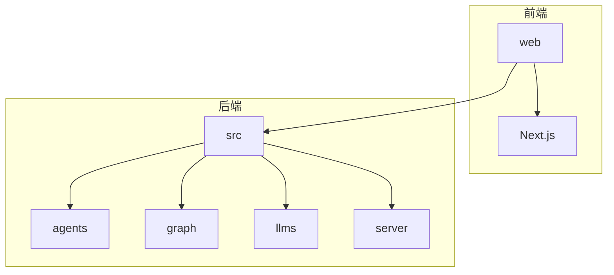
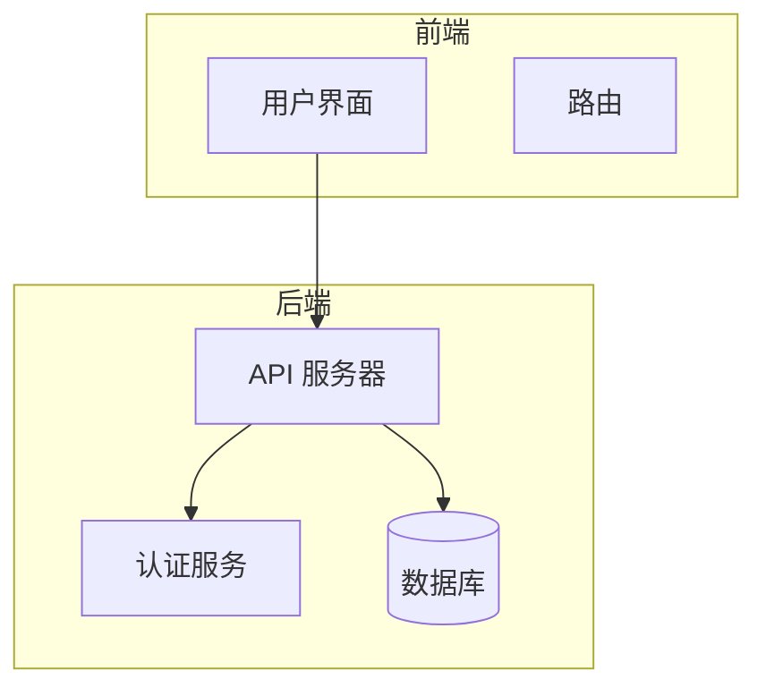
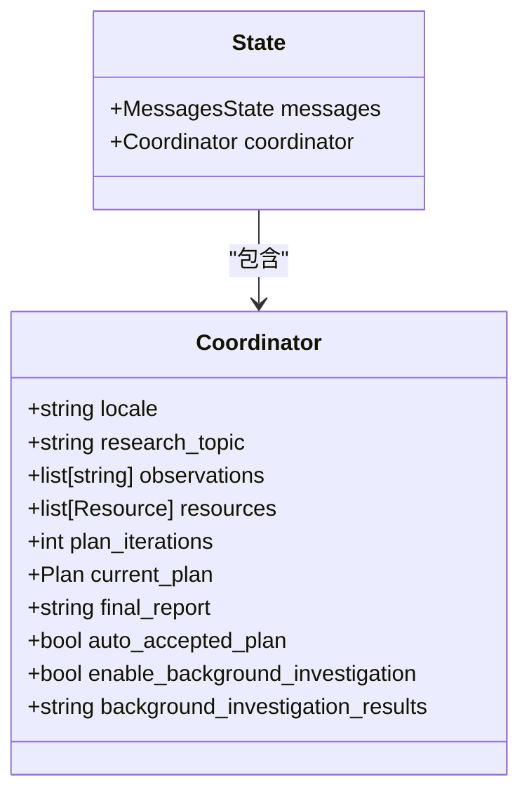
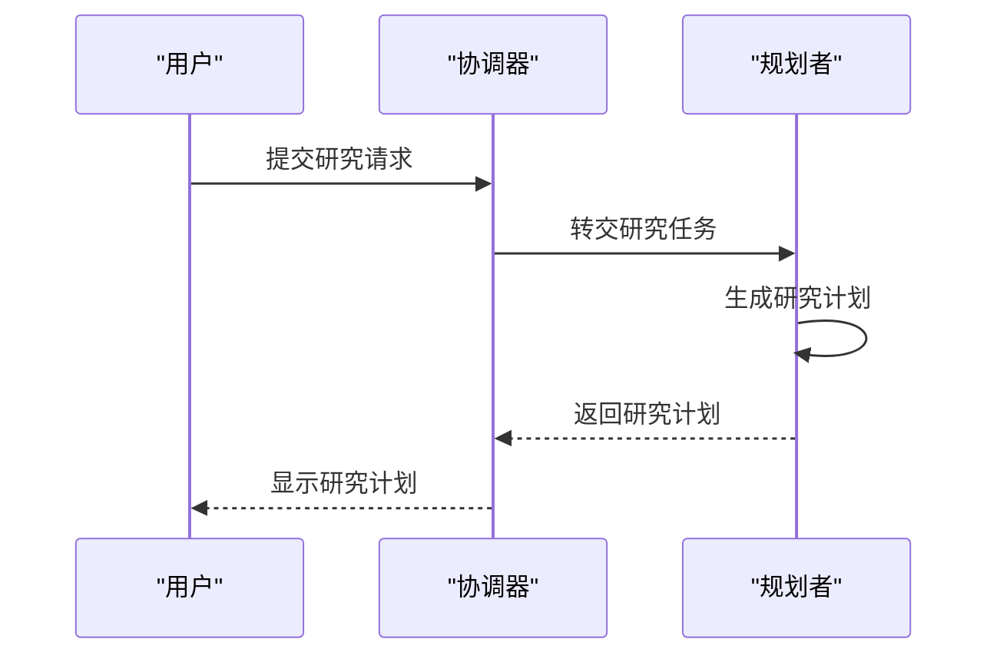
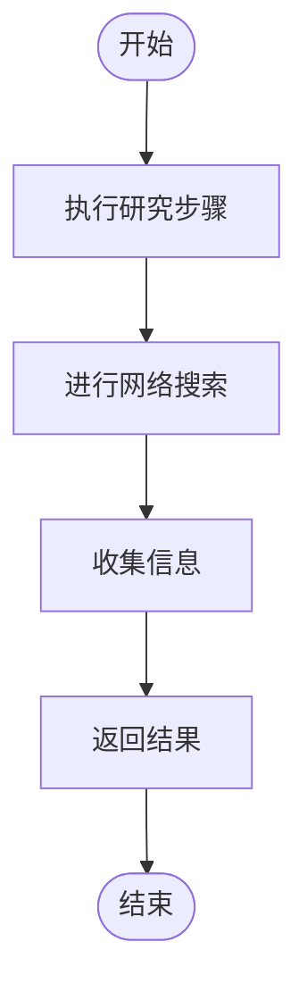
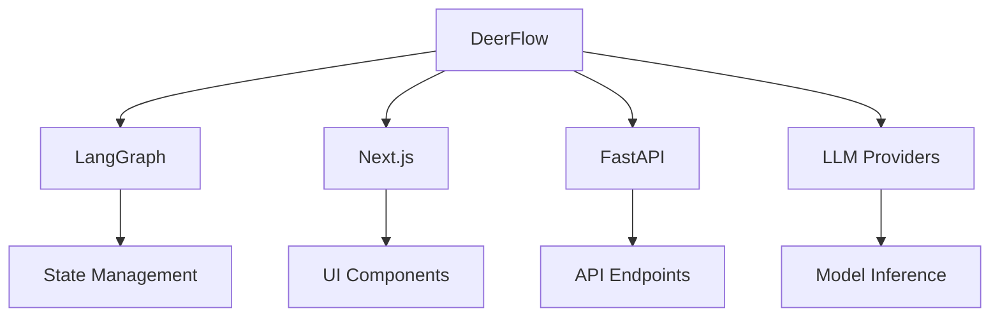

# 系统概述

<cite>
**本文档中引用的文件**  
- [main.py](file://main.py)
- [workflow.py](file://src/workflow.py)
- [builder.py](file://src/graph/builder.py)
- [nodes.py](file://src/graph/nodes.py)
- [types.py](file://src/graph/types.py)
- [planner_model.py](file://src/prompts/planner_model.py)
- [agents.py](file://src/agents/agents.py)
- [configuration.py](file://src/config/configuration.py)
- [coordinator.md](file://src/prompts/coordinator.md)
- [planner.md](file://src/prompts/planner.md)
- [app.py](file://src/server/app.py)
- [page.tsx](file://web/src/app/page.tsx)
- [main.tsx](file://web/src/app/chat/main.tsx)
</cite>

## 目录
1. [简介](#简介)
2. [项目结构](#项目结构)
3. [核心组件](#核心组件)
4. [架构概述](#架构概述)
5. [详细组件分析](#详细组件分析)
6. [依赖分析](#依赖分析)
7. [性能考虑](#性能考虑)
8. [故障排除指南](#故障排除指南)
9. [结论](#结论)

## 简介
DeerFlow 是一个基于 LangGraph 的多智能体协作研究工作流系统，旨在通过协调器、规划者、研究者、编码员和报告生成器等智能体的协同工作来解决复杂问题。该系统结合了自动化任务规划、检索增强生成（RAG）、人工干预机制和多媒体内容生成能力，为用户提供全面的研究解决方案。前端采用 Next.js 构建，后端使用 Python 和 LangGraph 实现，实现了高效的前后端交互。

## 项目结构
DeerFlow 项目的结构清晰，分为多个模块，每个模块负责特定的功能。主要目录包括 `src`、`web`、`examples` 和 `middlewares`。`src` 目录包含核心功能实现，如智能体、图构建、LLM 配置等；`web` 目录包含前端代码，使用 Next.js 构建用户界面；`examples` 目录包含示例研究结果；`middlewares` 目录包含中间件配置。

**图源**  
- [page.tsx](file://web/src/app/page.tsx)
- [main.tsx](file://web/src/app/chat/main.tsx)

**节源**  
- [page.tsx](file://web/src/app/page.tsx)
- [main.tsx](file://web/src/app/chat/main.tsx)

## 核心组件
DeerFlow 的核心组件包括协调器、规划者、研究者、编码员和报告生成器。这些智能体通过状态机工作流协同工作，确保研究任务的高效执行。系统还支持检查点持久化和消息流机制，保证了任务的可靠性和可追溯性。

**节源**  
- [main.py](file://main.py)
- [workflow.py](file://src/workflow.py)

## 架构概述
DeerFlow 的架构分为前端和后端两部分。前端使用 Next.js 构建用户界面，提供友好的交互体验。后端使用 Python 和 LangGraph 实现多智能体协作工作流，通过 REST API 与前端进行通信。系统支持多种功能，如自动化任务规划、RAG、人工干预和多媒体内容生成。

**图源**  
- [app.py](file://src/server/app.py)
- [page.tsx](file://web/src/app/page.tsx)

## 详细组件分析
### 协调器分析
协调器是 DeerFlow 系统的入口点，负责处理用户的初始请求并将其分发给相应的智能体。协调器通过 `handoff_to_planner` 工具将研究任务交给规划者。

**图源**  
- [coordinator.md](file://src/prompts/coordinator.md)
- [types.py](file://src/graph/types.py)

### 规划者分析
规划者负责生成详细的研究计划，将用户的问题分解为多个研究步骤。规划者根据用户的需求和上下文生成计划，并通过 `planner_node` 执行。

**图源**  
- [planner.md](file://src/prompts/planner.md)
- [nodes.py](file://src/graph/nodes.py)

### 研究者分析
研究者负责执行规划者生成的研究步骤，收集所需的信息。研究者通过 `researcher_node` 执行具体的搜索任务，并将结果返回给系统。

**图源**  
- [nodes.py](file://src/graph/nodes.py)
- [types.py](file://src/graph/types.py)

## 依赖分析
DeerFlow 系统的依赖关系复杂，涉及多个模块和外部服务。核心依赖包括 LangGraph、Next.js、FastAPI 和各种 LLM 提供商。系统通过配置文件和环境变量管理这些依赖，确保灵活性和可扩展性。

**图源**  
- [pyproject.toml](file://pyproject.toml)
- [package.json](file://web/package.json)

**节源**  
- [pyproject.toml](file://pyproject.toml)
- [package.json](file://web/package.json)

## 性能考虑
DeerFlow 系统在设计时充分考虑了性能因素。通过使用异步编程和流式传输，系统能够高效处理大量数据和并发请求。此外，系统支持检查点持久化，可以在长时间运行的任务中保存进度，避免重复计算。

## 故障排除指南
在使用 DeerFlow 系统时，可能会遇到一些常见问题。以下是一些故障排除建议：
- **无法连接到 LLM 服务**：检查环境变量配置是否正确，确保 LLM 服务正在运行。
- **研究计划生成失败**：检查输入问题是否清晰明确，确保有足够的上下文信息。
- **多媒体内容生成失败**：检查相关服务（如 TTS）的配置和可用性。

**节源**  
- [debug_llm_connection.py](file://debug_llm_connection.py)
- [test_custom_search.py](file://test_custom_search.py)

## 结论
DeerFlow 是一个功能强大的多智能体协作研究工作流系统，通过协调器、规划者、研究者、编码员和报告生成器等智能体的协同工作，解决了复杂问题的研究需求。系统结合了自动化任务规划、RAG、人工干预和多媒体内容生成能力，为用户提供了一站式的解决方案。无论是初学者还是经验丰富的开发者，都可以通过 DeerFlow 实现高效的研究工作流。